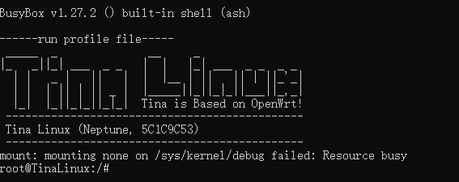
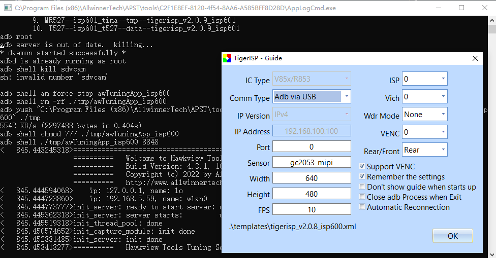
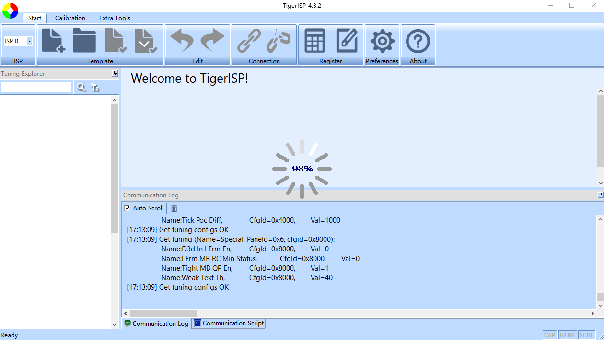
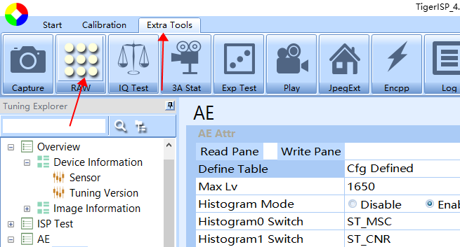
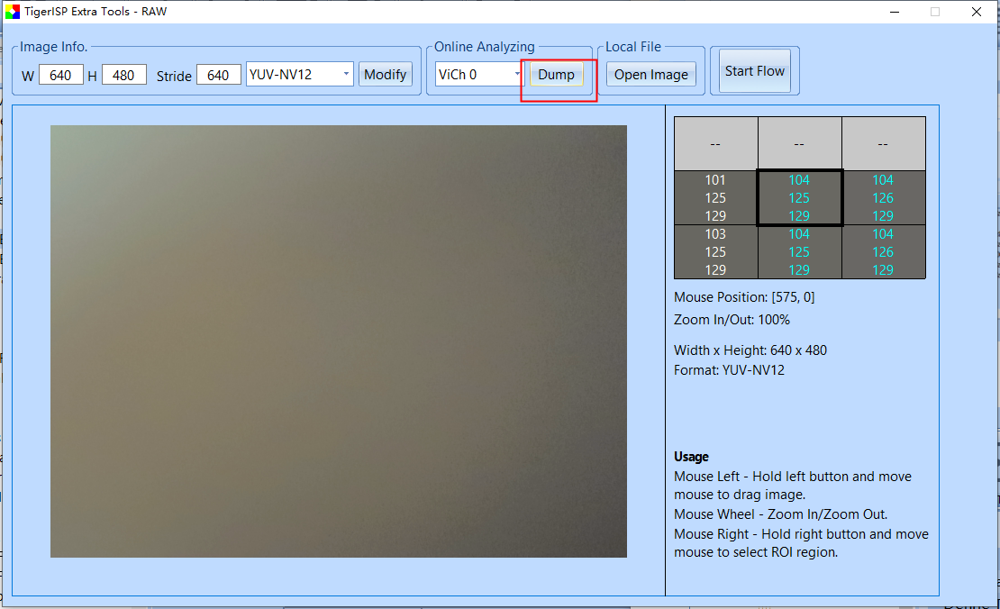

TinyVision 的 ISP 调试，通过 ISP 调试可以调整摄像头的各项参数，画质。

ISP 模块主要用于处理 image sensor 输出的 RAW 数据，其主要功能包括：黑电平校正、坏点校正、镜头阴影校正、2D/3D 降噪、色彩增强、数字宽动态、3A 等。

ISP 算法包含硬件算法和软件算法库两部分：硬件算法集成在 SoC 中，称为 Tiger ISP，软件算法服务于 ISP 硬件算法，故称为 ISP Server。

资源下载：https://github.com/YuzukiHD/YuzukiHD.github.io/releases/tag/20240114

## 准备阶段

使用 PhoenixCard 在TF卡烧录以下固件：

如果没有安装 PhoenixCard 请使用 `dd` ，`win32diskmgr` 烧录下面这个固件

板子接入摄像头，USB 接入电脑。上电启动，使用 `adb shell` 查看是否启动完成

## TigerISP 初设置

开启 TigerISP，选择 V85x IC

配置 `Adb via USB` ，其他如图配置即可

与 SoC 通讯，初始化 ISP 调试环境

初始化完成后，可以开始调试 ISP

先测试一下摄像头是否正常，点击 Extra Tools，进入 RAW

点击 Online Analyzing 的 dump 选项

即可开启摄像头，通过窗口查看拍摄到的内容

