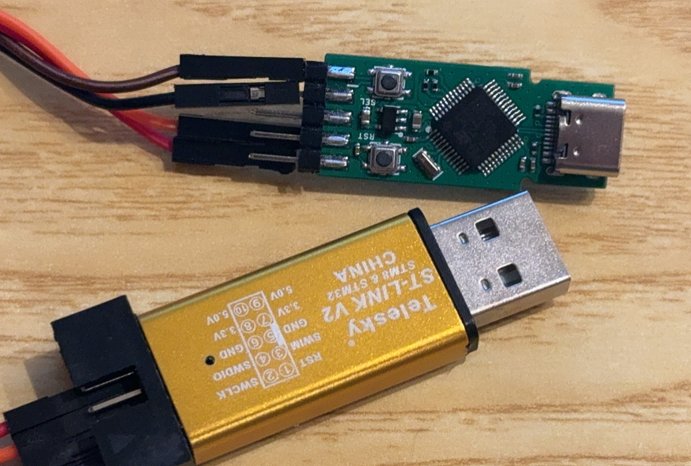

TinyPower 是 AXP 系列的电源模组，AXP系列的 PMU 支持通过 IIC 配置电压，也可以通过刷写 eFUSE 来设置每次启动的默认电压。

## 刷写器 AXP Prog 固件下载

准备：

- STM32 ST-LINK Utility v4.1.0 setup.exe

- ST-Link
- AXP Prog

先通过杜邦线连接上 AXP Prog

打开 STM32 ST-LINK Utility ，连接烧录器

打开固件

开始下载

下载完毕，插入 USB 可以看到新设备

