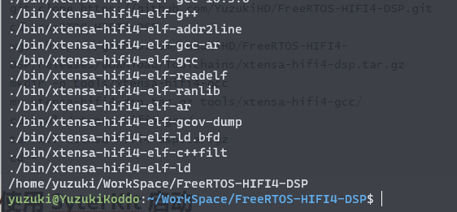
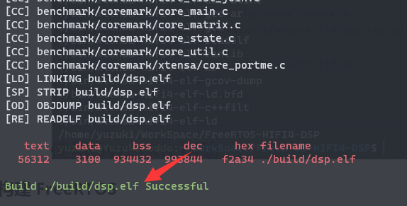
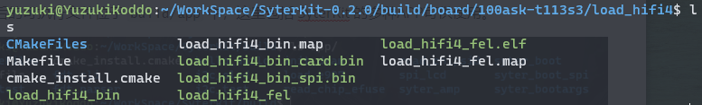

HIFI 4 简介如下

Cadence® Tensilica® HiFi 4 DSP是一款32位固定点和浮点处理器，专为智能音箱、家庭娱乐和汽车信息娱乐等要求高的DSP应用而设计。它为复杂的多麦克风远场处理、使用神经网络技术的唤醒词检测提供了改进的性能，并支持最新的基于对象的编解码器，适用于机顶盒，音响和电视产品。

主要优势：
1. 复杂的面向对象编解码器：有效执行复杂的音频编解码器，适用于电视、机顶盒和音响。
2. 高性能的DSP：在FFT和FIR等计算密集型函数方面，HiFi 4 DSP的性能比HiFi 3z DSP提高了一倍，支持ANC、降噪和声音分析等占用性能的算法。
3. 基于神经网络的语音助手：结合高性能的DSP和增强的NN性能，可靠地用于电视、机顶盒、音箱和智能音箱的远场语音助手功能。
4. ISO 26262：具有硬件和软件安全机制，符合ASIL标准。

主要特点：
- 在特定条件下支持每个周期8个32x16位MAC。
- 四个VLIW槽体结构，每个周期可发出两个64位加载。
- 可选向量浮点单元，提供每个周期最多四个单精度IEEE浮点MAC。
- 软件兼容完整的HiFi DSP产品线，提供超过300种HiFi优化的音频和语音编解码器和音频增强软件包。
- HiFi NN库提供了经过优化的常用NN处理函数集，可轻松集成到流行的机器学习框架中。


在 D1-H T113 A523 系列芯片中可以发现 HIFI4 的踪影


# HIFI 4 启动流程

先看时钟初始化流程

```c
void sunxi_hifi4_clock_init(uint32_t addr) {
    uint32_t reg_val = 0;

    // 设置SRAM映射
    sram_remap_set(1);

    // 配置DSP时钟源为PERI2X，时钟倍频因子为2，并打开DSP时钟门控
    reg_val |= CCU_DSP_CLK_SRC_PERI2X;
    reg_val |= CCU_DSP_CLK_FACTOR_M(2);
    reg_val |= (1 << CCU_BIT_DSP_SCLK_GATING);
    writel(reg_val, CCU_BASE + CCU_DSP_CLK_REG);

    // 进行时钟门控设置，使得DSP0配置部分的时钟门控位为1
    reg_val = readl(CCU_BASE + CCU_DSP_BGR_REG);
    reg_val |= (1 << CCU_BIT_DSP0_CFG_GATING);
    writel(reg_val, CCU_BASE + CCU_DSP_BGR_REG);

    // 进行复位操作，首先对DSP0进行配置复位，然后对DSP0进行调试复位
    reg_val = readl(CCU_BASE + CCU_DSP_BGR_REG);
    reg_val |= (1 << CCU_BIT_DSP0_CFG_RST);
    reg_val |= (1 << CCU_BIT_DSP0_DBG_RST);
    writel(reg_val, CCU_BASE + CCU_DSP_BGR_REG);

    // 如果需要设置外部复位向量，则将外部复位向量写入指定寄存器，并设置启动向量选择，设置code地址
    if (addr != DSP_DEFAULT_RST_VEC) {
        writel(addr, DSP0_CFG_BASE + DSP_ALT_RESET_VEC_REG);

        reg_val = readl(DSP0_CFG_BASE + DSP_CTRL_REG0);
        reg_val |= (1 << BIT_START_VEC_SEL);
        writel(reg_val, DSP0_CFG_BASE + DSP_CTRL_REG0);
    }

    // 设置运行暂停标志
    sunxi_hifi4_set_run_stall(1);

    // 打开DSP时钟使能
    reg_val = readl(DSP0_CFG_BASE + DSP_CTRL_REG0);
    reg_val |= (1 << BIT_DSP_CLKEN);
    writel(reg_val, DSP0_CFG_BASE + DSP_CTRL_REG0);

    // 取消对DSP0的复位
    reg_val = readl(CCU_BASE + CCU_DSP_BGR_REG);
    reg_val |= (1 << CCU_BIT_DSP0_RST);
    writel(reg_val, CCU_BASE + CCU_DSP_BGR_REG);
}
```

- 通过`sram_remap_set(1)`函数设置SRAM映射，确保存储器映射正确。

- 配置DSP的时钟源为PERI2X，并将时钟倍频因子设置为2，同时打开DSP的时钟门控功能，以确保时钟信号正常传输到DSP。

- 进行时钟门控设置，将DSP0的配置部分时钟门控位置为1，以确保配置部分的时钟信号可用。

- 进行复位操作，首先对DSP0进行配置复位，然后对DSP0进行调试复位，以确保DSP在初始化过程中处于良好的初始状态。

- 如果需要设置外部复位向量，将指定的地址写入相应的寄存器，同时设置启动向量选择。我们在这里设置 HIFI4 的程序启动地址。

- 设置运行暂停标志，以确保DSP在初始化完成后进入正常的工作状态。

- 打开DSP时钟使能，以确保DSP的时钟信号正常启动。

- 取消对DSP0的复位，使得DSP可以开始正常的运行。

通过以上初始化流程的操作，可以确保DSP在初始化后可以正常工作，并准备好接收和处理相应的任务和指令。

## 编译 HIFI 4 固件

由于 HIFI 4 使用的是 Xtensa Xplorer 套件，这个套件需要购买。但是没钱，所以需要手搓一个，手搓方法参考之前写的 HIFI5 即可。

既然有了编译器，那就适配一个 FreeRTOS，链接：https://github.com/YuzukiHD/FreeRTOS-HIFI4-DSP

### 搭建环境

用下面的命令克隆代码并搭建环境

```
git clone https://github.com/YuzukiHD/FreeRTOS-HIFI4-DSP.git
cd FreeRTOS-HIFI4-DSP
wget https://github.com/YuzukiHD/FreeRTOS-HIFI4-DSP/releases/download/Toolchains/xtensa-hifi4-dsp.tar.gz
mkdir -p tools/xtensa-hifi4-gcc
mv xtensa-hifi4-dsp.tar.gz tools/xtensa-hifi4-gcc/
cd tools/xtensa-hifi4-gcc/
tar xvf xtensa-hifi4-dsp.tar.gz
cd -
```



### 构建 FreeRTOS

构建固件非常简单，执行 `make` 即可，生成的固件在 `./build/dsp.elf` 下



## 使用 SyterKit 启动

SyterKit 是一个纯裸机框架，用于 TinyVision 或者其他 v851se/v851s/v851s3/v853 等芯片的开发板，SyterKit 使用 CMake 作为构建系统构建，支持多种应用与多种外设驱动。同时 SyterKit 也具有启动引导的功能，可以替代 U-Boot 实现快速启动

### 获取 SyterKit 源码

SyterKit 源码位于GitHub，可以前往下载。

```shell
git clone https://github.com/YuzukiHD/SyterKit.git
```

### 从零构建 SyterKit 

构建 SyterKit 非常简单，只需要在 Linux 操作系统中安装配置环境即可编译。SyterKit 需要的软件包有：

- `gcc-arm-none-eabi`
- `CMake`

对于常用的 Ubuntu 系统，可以通过如下命令安装

```shell
sudo apt-get update
sudo apt-get install gcc-arm-none-eabi cmake build-essential -y
```

然后新建一个文件夹存放编译的输出文件，并且进入这个文件夹

```shell
mkdir build
cd build
```

然后运行命令编译 SyterKit

```shell
cmake ..
make
```


编译后的可执行文件位于 `build/app` 中，这里包括 SyterKit 的多种APP可供使用。


进入 `load_hifi4`


按照需求选择，这里我们使用卡启动，所以使用 `load_hifi4_bin_card.bin`



### 使用 genimage 打包固件

编写 genimage.cfg 作为打包的配置

```cfg
image boot.vfat {
	vfat {
		files = {
			"dsp.elf"
		}
	}
	size = 8M
}

image sdcard.img {
	hdimage {}

	partition boot0 {
		in-partition-table = "no"
		image = "syter_boot_bin_card.bin"
		offset = 8K
	}

	partition boot0-gpt {
		in-partition-table = "no"
		image = "syter_boot_bin_card.bin"
		offset = 128K
	}

	partition kernel {
		partition-type = 0xC
		bootable = "true"
		image = "boot.vfat"
	}
}
```

由于genimage的脚本比较复杂，所以编写一个 `genimage.sh` 作为简易使用的工具

```sh
#!/usr/bin/env bash

die() {
  cat <<EOF >&2
Error: $@

Usage: ${0} -c GENIMAGE_CONFIG_FILE
EOF
  exit 1
}

# Parse arguments and put into argument list of the script
opts="$(getopt -n "${0##*/}" -o c: -- "$@")" || exit $?
eval set -- "$opts"

GENIMAGE_TMP="${BUILD_DIR}/genimage.tmp"

while true ; do
	case "$1" in
	-c)
	  GENIMAGE_CFG="${2}";
	  shift 2 ;;
	--) # Discard all non-option parameters
	  shift 1;
	  break ;;
	*)
	  die "unknown option '${1}'" ;;
	esac
done

[ -n "${GENIMAGE_CFG}" ] || die "Missing argument"

# Pass an empty rootpath. genimage makes a full copy of the given rootpath to
# ${GENIMAGE_TMP}/root so passing TARGET_DIR would be a waste of time and disk
# space. We don't rely on genimage to build the rootfs image, just to insert a
# pre-built one in the disk image.

trap 'rm -rf "${ROOTPATH_TMP}"' EXIT
ROOTPATH_TMP="$(mktemp -d)"
GENIMAGE_TMP="$(mktemp -d)"
rm -rf "${GENIMAGE_TMP}"

genimage \
	--rootpath "${ROOTPATH_TMP}"     \
	--tmppath "${GENIMAGE_TMP}"    \
	--inputpath "${BINARIES_DIR}"  \
	--outputpath "${BINARIES_DIR}" \
	--config "${GENIMAGE_CFG}"
```

准备完成，运行打包即可

```
./genimage.sh -c genimage.cfg
```


