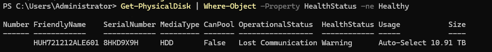
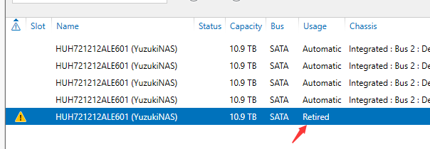
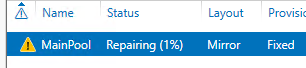

最近 NAS 掉盘了，无法正常使用，需要更换一块磁盘。

先看一下坏的盘

```powershell
Get-PhysicalDisk | Where-Object –Property HealthStatus –ne Healthy
```



新盘插入之后加入存储池中，之后需要运行命令将坏的盘退休

```powershell
$FailedDisk = Get-PhysicalDisk | Where-Object –Property HealthStatus –ne Healthy
$FailedDisk | Set-PhysicalDisk –Usage Retired
```



然后需要重建磁盘库，点击修复磁盘库



等待修复完成，删除损坏的盘
