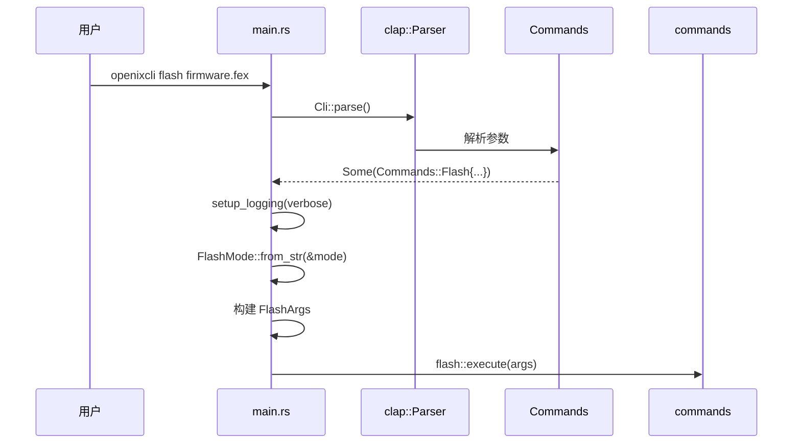
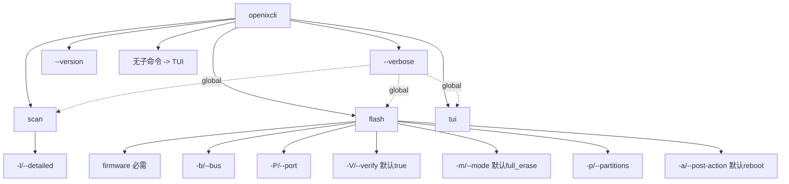

## 概述

命令行接口（CLI）是嵌入式工具与用户交互的第一道关卡。OpenixCLI 使用 Rust 最流行的 CLI 解析库 `clap`（Command Line Argument Parser），通过 derive 宏模式实现声明式的命令定义，让开发者专注于业务逻辑而非参数解析细节。

### 模块结构

```
src/
├── cli.rs           # CLI 定义（derive 宏）
├── main.rs          # 入口点和命令路由
└── commands/
    └── types.rs     # FlashArgs 和 FlashMode 类型
```

### 核心导出

```rust
use cli::{Cli, Commands};
use commands::FlashArgs;
```

---

## 架构与依赖

### clap Derive 模式

clap 提供三种 API 风格：

| 风格    | 特点                   | 适用场景           |
| ------- | ---------------------- | ------------------ |
| Derive  | 声明式，通过属性宏定义 | 类型安全，推荐使用 |
| Builder | 构造器模式，链式调用   | 动态配置，更灵活   |
| YAML    | 配置文件定义           | 多语言支持，较旧   |

OpenixCLI 使用 **Derive 模式**，优势在于：

1. **类型安全** - 参数直接映射到结构体字段
2. **自动生成帮助文档** - 从 doc comments 生成 help 信息
3. **编译时检查** - 错误在编译期暴露

### 命令树结构

```
openixcli (根命令)
├── --verbose, -v    [全局参数]
├── --version        [版本信息]
├── scan             [子命令]
│   └── --detailed, -l
├── flash            [子命令]
│   ├── firmware     [必需参数]
│   ├── --bus, -b    [可选参数]
│   ├── --port, -P   [可选参数]
│   ├── --verify, -V [默认 true]
│   ├── --mode, -m   [默认 full_erase]
│   ├── --partitions, -p [可选]
│   └── --post-action, -a [默认 reboot]
└── tui              [子命令，无参数]
```

---

## 核心数据结构

### Cli 主结构

```rust
/// CLI 主结构 - 使用 clap Parser derive 宏
#[derive(Parser)]
#[command(name = "openixcli")]
#[command(about = "Firmware flashing CLI tool for Allwinner chips", long_about = None)]
#[command(version)]
pub struct Cli {
    /// 要执行的子命令（默认为 TUI）
    #[command(subcommand)]
    pub command: Option<Commands>,

    /// 启用详细输出
    #[arg(short, long, global = true, help = "Enable verbose output")]
    pub verbose: bool,
}
```

**关键属性解析：**

| 属性                        | 作用                       |
| --------------------------- | -------------------------- |
| `#[derive(Parser)]`         | 实现 `clap::Parser` trait  |
| `#[command(name = "...")]`  | 设置命令名称               |
| `#[command(about = "...")]` | 设置简短描述               |
| `#[command(version)]`       | 自动从 Cargo.toml 读取版本 |
| `#[command(subcommand)]`    | 声明子命令字段             |
| `#[arg(global = true)]`     | 参数对所有子命令生效       |

### Commands 子命令枚举

```rust
/// 可用的 CLI 命令
#[derive(Subcommand)]
pub enum Commands {
    /// 扫描连接的设备
    Scan {
        /// 获取详细设备信息（需要初始化设备）
        #[arg(short = 'l', long, help = "Get detailed device information")]
        detailed: bool,
    },

    /// 刷写固件到设备
    Flash {
        /// 固件文件路径
        #[arg(help = "Path to firmware file")]
        firmware: String,

        /// USB 总线号
        #[arg(short, long, help = "USB bus number")]
        bus: Option<u8>,

        /// USB 端口号
        #[arg(short = 'P', long, help = "USB port number")]
        port: Option<u8>,

        /// 启用写入后验证
        #[arg(short = 'V', long, default_value = "true",
              help = "Enable verification after write")]
        verify: bool,

        /// 刷写模式
        /// - partition: 仅刷写指定分区
        /// - keep_data: 保留现有数据
        /// - partition_erase: 刷写前擦除分区
        /// - full_erase: 刷写前完全擦除
        #[arg(short, long, default_value = "full_erase",
              help = "Flash mode: partition, keep_data, partition_erase, full_erase")]
        mode: String,

        /// 要刷写的分区（逗号分隔）
        #[arg(short = 'p', long,
              help = "Partitions to flash (comma-separated)")]
        partitions: Option<String>,

        /// 刷写后操作
        /// - reboot: 重启设备
        /// - poweroff: 关闭设备电源
        /// - shutdown: 关闭设备
        #[arg(short = 'a', long, default_value = "reboot",
              help = "Post-flash action: reboot, poweroff, shutdown")]
        post_action: String,
    },

    /// 启动交互式 TUI 模式
    Tui,
}
```

**参数属性详解：**

| 属性            | 示例                     | 作用                          |
| --------------- | ------------------------ | ----------------------------- |
| `short`         | `short = 'l'`            | 短选项 `-l`                   |
| `long`          | `long`                   | 长选项 `--detailed`           |
| `help`          | `help = "..."`           | 帮助文档文本                  |
| `default_value` | `default_value = "true"` | 默认值                        |
| `short = 'P'`   | 自定义短选项字符         | 避免与 `-p` (partitions) 冲突 |

### FlashArgs 参数结构

从 CLI 参数转换到内部使用的参数结构：

```rust
/// Flash 命令参数
///
/// 将 CLI 解析结果转换为内部模块可用的结构化数据
pub struct FlashArgs {
    pub firmware_path: PathBuf,      // 固件路径
    pub bus: Option<u8>,             // USB 总线号
    pub port: Option<u8>,            // USB 端口号
    pub verify: bool,                // 验证开关
    pub mode: FlashMode,             // 刷写模式（枚举）
    pub partitions: Option<Vec<String>>, // 分区列表
    pub post_action: String,         // 后续操作
    pub verbose: bool,               // 详细模式
}
```

### FlashMode 枚举

```rust
/// 刷写模式选项
#[derive(Debug, Clone, Copy, PartialEq, Eq)]
pub enum FlashMode {
    Partition,       // 仅刷写指定分区
    KeepData,        // 保留现有数据
    PartitionErase,  // 刷写前擦除分区
    FullErase,       // 刷写前完全擦除
}

/// 实现 FromStr trait - 支持字符串解析
impl FromStr for FlashMode {
    type Err = String;

    fn from_str(s: &str) -> Result<Self, Self::Err> {
        match s {
            "partition" => Ok(Self::Partition),
            "keep_data" => Ok(Self::KeepData),
            "partition_erase" => Ok(Self::PartitionErase),
            "full_erase" => Ok(Self::FullErase),
            _ => Err(format!("Invalid flash mode: {}", s)),
        }
    }
}

/// 实现 Display trait - 支持字符串输出
impl std::fmt::Display for FlashMode {
    fn fmt(&self, f: &mut std::fmt::Formatter<'_>) -> std::fmt::Result {
        match self {
            FlashMode::Partition => write!(f, "partition"),
            FlashMode::KeepData => write!(f, "keep_data"),
            FlashMode::PartitionErase => write!(f, "partition_erase"),
            FlashMode::FullErase => write!(f, "full_erase"),
        }
    }
}
```

---

## 调用流程分析

### 程序入口与命令路由



### main.rs 完整实现

```rust
use clap::Parser;
use std::str::FromStr;

mod cli;
mod commands;

use cli::{Cli, Commands};
use commands::FlashArgs;
use utils::TermLogger;

/// 初始化日志系统
fn setup_logging(verbose: bool) {
    if let Err(e) = TermLogger::init(verbose) {
        eprintln!("Failed to initialize logger: {}", e);
    }
}

#[tokio::main]
async fn main() -> anyhow::Result<()> {
    // 1. 解析命令行参数
    let cli = Cli::parse();

    // 2. 命令路由
    match cli.command {
        // 无子命令或 TUI -> 启动交互界面
        None | Some(Commands::Tui) => {
            tui::run().await?;
        }

        // Scan 命令 -> 扫描 USB 设备
        Some(Commands::Scan { detailed }) => {
            setup_logging(cli.verbose);
            commands::scan::execute(detailed).await?;
        }

        // Flash 命令 -> 执行固件刷写
        Some(Commands::Flash {
            firmware,
            bus,
            port,
            verify,
            mode,
            partitions,
            post_action,
        }) => {
            setup_logging(cli.verbose);

            // 3. 解析刷写模式
            let flash_mode = FlashMode::from_str(&mode)
                .map_err(|e| anyhow::anyhow!("{}", e))?;

            // 4. 解析分区列表（逗号分隔）
            let partition_list = partitions
                .map(|s| s.split(',')
                       .map(|p| p.trim().to_string())
                       .collect());

            // 5. 构建 FlashArgs
            let args = FlashArgs {
                firmware_path: firmware.into(),
                bus,
                port,
                verify,
                mode: flash_mode,
                partitions: partition_list,
                post_action,
                verbose: cli.verbose,
            };

            // 6. 执行刷写
            commands::flash::execute(args).await?;
        }
    }

    Ok(())
}
```

### 参数解析流程详解

**Flash 命令参数转换：**

```rust
// CLI 字符串参数 -> 内部类型

// 1. 固件路径：String -> PathBuf
let firmware_path: PathBuf = firmware.into();

// 2. 刷写模式：String -> FlashMode (通过 FromStr)
let mode: FlashMode = FlashMode::from_str("full_erase")?;
// 结果: FlashMode::FullErase

// 3. 分区列表：Option<String> -> Option<Vec<String>>
let partitions: Option<Vec<String>> = Some("boot,rootfs,userdata")
    .map(|s| s.split(',')
           .map(|p| p.trim().to_string())
           .collect());
// 结果: Some(["boot", "rootfs", "userdata"])
```

---

## 代码亮点

### 1. 全局参数穿透

```rust
#[arg(short, long, global = true, help = "Enable verbose output")]
pub verbose: bool,
```

`global = true` 属性使 `--verbose` 对所有子命令生效：

```bash
# 以下都有效：
openixcli --verbose scan
openixcli scan --verbose
openixcli --verbose flash firmware.fex
openixcli flash firmware.fex --verbose
```

### 2. 默认子命令（无参数启动 TUI）

```rust
#[command(subcommand)]
pub command: Option<Commands>,
```

`Option<Commands>` 允许无子命令时的默认行为：

```rust
match cli.command {
    None | Some(Commands::Tui) => {
        tui::run().await?;  // 无子命令默认启动 TUI
    }
    // ...
}
```

### 3. 短选项字符冲突解决

```rust
#[arg(short, long)]          // bus -> -b, --bus
#[arg(short = 'P', long)]    // port -> -P, --port (避免与 partitions 的 -p 冲突)
#[arg(short = 'p', long)]    // partitions -> -p, --partitions
```

### 4. 默认值设置

```rust
#[arg(default_value = "true")]    // verify 默认为 true
#[arg(default_value = "reboot")]  // post_action 默认为 reboot
#[arg(default_value = "full_erase")]  // mode 默认为 full_erase
```

用户可以省略这些参数：

```bash
# 等效于 openixcli flash firmware.fex --verify --mode full_erase --post-action reboot
openixcli flash firmware.fex
```

### 5. FromStr trait 实现

```rust
impl FromStr for FlashMode {
    type Err = String;

    fn from_str(s: &str) -> Result<Self, Self::Err> {
        match s.trim() {
            "partition" => Ok(Self::Partition),
            "keep_data" => Ok(Self::KeepData),
            "partition_erase" => Ok(Self::PartitionErase),
            "full_erase" => Ok(Self::FullErase),
            _ => Err(format!("Invalid flash mode: {}. Valid modes: partition, keep_data, partition_erase, full_erase", s)),
        }
    }
}
```

**优势：**

- 类型安全的字符串解析
- 与 `str::parse()` 方法配合
- 错误信息清晰完整

### 6. Doc Comments 作为帮助文档

```rust
/// 扫描连接的设备
Scan {
    /// 获取详细设备信息（需要初始化设备）
    #[arg(short = 'l', long)]
    detailed: bool,
},
```

生成的帮助信息：

```
Commands:
  scan     扫描连接的设备
    -l, --detailed    获取详细设备信息（需要初始化设备）
```

---

## 实践示例

### 常见命令用法

```bash
# 交互式 TUI（默认）
openixcli
openixcli tui

# 扫描设备
openixcli scan
openixcli scan --detailed

# 刷写固件
openixcli flash firmware.fex

# 指定 USB 设备
openixcli flash firmware.fex --bus 1 --port 2

# 仅刷写特定分区
openixcli flash firmware.fex --mode partition --partitions boot,rootfs

# 详细输出
openixcli --verbose flash firmware.fex

# 不验证写入
openixcli flash firmware.fex --verify false

# 刷写后关闭设备
openixcli flash firmware.fex --post-action poweroff
```

### 完整刷写命令示例

```bash
openixcli flash \
    firmware.fex \
    --bus 1 \
    --port 2 \
    --verify \
    --mode partition_erase \
    --partitions boot,rootfs,userdata \
    --post-action reboot \
    --verbose
```

**等价内部结构：**

```rust
FlashArgs {
    firmware_path: PathBuf::from("firmware.fex"),
    bus: Some(1),
    port: Some(2),
    verify: true,
    mode: FlashMode::PartitionErase,
    partitions: Some(["boot", "rootfs", "userdata"]),
    post_action: "reboot",
    verbose: true,
}
```

### 错误处理示例

```rust
// 无效刷写模式
let result = FlashMode::from_str("invalid_mode");
// Err("Invalid flash mode: invalid_mode")

// 使用 ? 操作符传播错误
let mode = FlashMode::from_str(&mode_str)
    .map_err(|e| anyhow::anyhow!("{}", e))?;
```

---

## 自动生成的帮助信息

### 根命令帮助

```
$ openixcli --help
Firmware flashing CLI tool for Allwinner chips

Usage: openixcli [COMMAND]

Commands:
  scan   Scan for connected devices
  flash  Flash firmware to device
  tui    Launch interactive TUI mode
  help   Print this message or the help of the given subcommand(s)

Options:
  -v, --verbose  Enable verbose output
  -h, --help     Print help
  -V, --version  Print version
```

### Flash 子命令帮助

```
$ openixcli flash --help
Flash firmware to device

Usage: openixcli flash [OPTIONS] <FIRMWARE>

Arguments:
  <FIRMWARE>  Path to firmware file

Options:
  -b, --bus <BUS>                USB bus number
  -P, --port <PORT>              USB port number
  -V, --verify <VERIFY>          Enable verification after write [default: true]
  -m, --mode <MODE>              Flash mode: partition, keep_data, partition_erase, full_erase [default: full_erase]
  -p, --partitions <PARTITIONS>  Partitions to flash (comma-separated)
  -a, --post-action <POST_ACTION>  Post-flash action: reboot, poweroff, shutdown [default: reboot]
  -v, --verbose                  Enable verbose output
  -h, --help                     Print help
```

---

## CLI 命令树图


