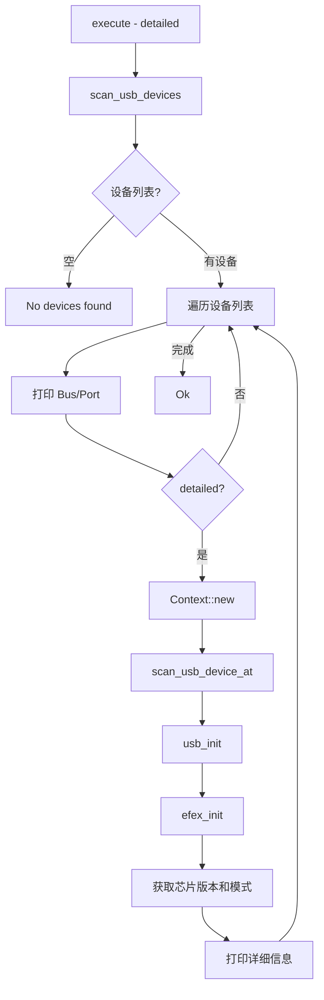
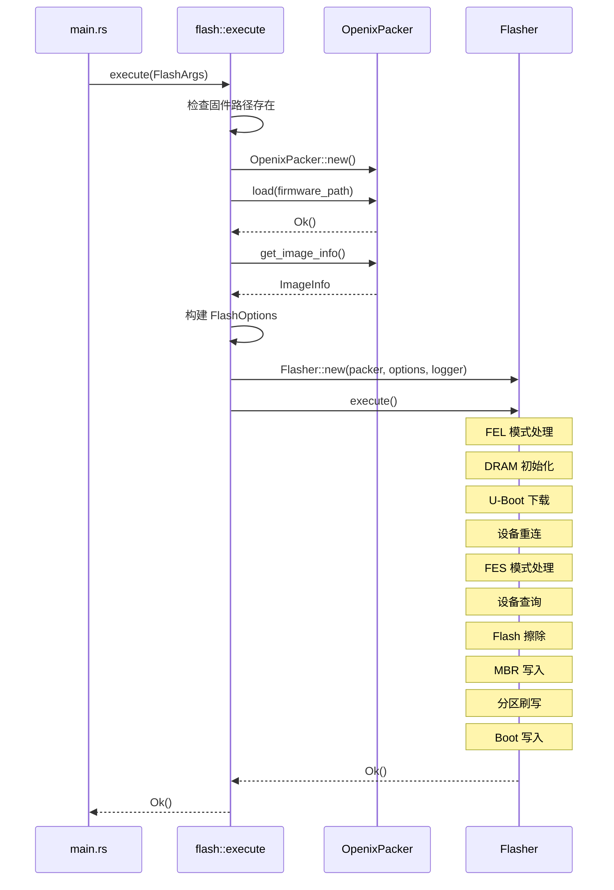
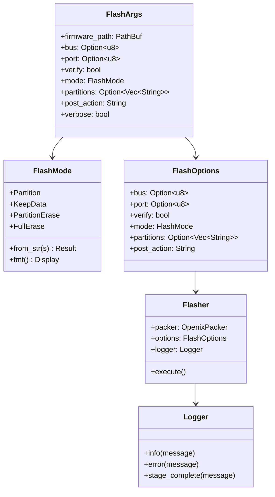

## 概述

Commands 模块是 CLI 与核心刷写逻辑之间的桥梁。它实现了 `scan` 和 `flash` 两个主要命令，负责设备检测、固件加载、参数转换等准备工作，然后将任务交给 Flash 模块执行实际的刷写流程。

### 模块结构

```
src/commands/
├── mod.rs       # 模块导出
├── scan.rs      # 设备扫描命令
├── flash.rs     # 固件刷写命令
└── types.rs     # FlashArgs 和 FlashMode 类型定义
```

### 核心导出

```rust
pub use types::{FlashArgs, FlashMode};
```

---

## 核心数据结构

### FlashArgs 参数结构

```rust
/// Flash 命令参数
///
/// 从 CLI 解析结果转换而来，供 Flasher 使用
pub struct FlashArgs {
    /// 固件文件路径
    pub firmware_path: PathBuf,

    /// USB 总线号（可选）
    pub bus: Option<u8>,

    /// USB 端口号（可选）
    pub port: Option<u8>,

    /// 是否验证写入
    pub verify: bool,

    /// 刷写模式
    pub mode: FlashMode,

    /// 要刷写的分区列表（可选）
    pub partitions: Option<Vec<String>>,

    /// 刷写后的操作
    pub post_action: String,

    /// 详细模式
    pub verbose: bool,
}
```

### FlashMode 枚举

```rust
/// 刷写模式
#[derive(Debug, Clone, Copy, PartialEq, Eq)]
pub enum FlashMode {
    /// 仅刷写指定分区
    Partition,

    /// 保留现有数据
    KeepData,

    /// 刷写前擦除分区
    PartitionErase,

    /// 刷写前完全擦除
    FullErase,
}

impl FromStr for FlashMode {
    type Err = String;

    fn from_str(s: &str) -> Result<Self, Self::Err> {
        match s {
            "partition" => Ok(Self::Partition),
            "keep_data" => Ok(Self::KeepData),
            "partition_erase" => Ok(Self::PartitionErase),
            "full_erase" => Ok(Self::FullErase),
            _ => Err(format!("Invalid flash mode: {}", s)),
        }
    }
}
```

---

## Scan 命令实现

### 基本扫描流程

```rust
/// 执行设备扫描命令
pub async fn execute(detailed: bool) -> anyhow::Result<()> {
    println!("{}", "Scanning USB devices...".cyan().bold());
    println!();

    // 1. 使用 libefex 扫描 USB 设备
    let devices = Context::scan_usb_devices()?;

    if devices.is_empty() {
        println!("{}", "No devices found.".yellow());
        return Ok(());
    }

    println!("Found {} device(s):\n", devices.len());

    // 2. 显示设备列表
    for (idx, dev) in devices.iter().enumerate() {
        println!(
            "[{}] Bus {:03}, Port {:03}",
            (idx + 1).to_string().cyan(),
            dev.bus,
            dev.port
        );

        // 3. 详细模式下初始化设备获取更多信息
        if detailed {
            let mut ctx = Context::new();
            if ctx.scan_usb_device_at(dev.bus, dev.port).is_err() {
                println!("    {}", "Failed to initialize device".red());
                continue;
            }

            if ctx.usb_init().is_err() {
                println!("    {}", "Failed to initialize USB".red());
                continue;
            }

            if ctx.efex_init().is_err() {
                println!("    {}", "Failed to initialize EFEX".red());
                continue;
            }

            // 4. 获取芯片版本和设备模式
            let mode_str = ctx.get_device_mode_str().to_string();
            let chip_version = unsafe { (*ctx.as_ptr()).resp.id };

            println!(
                "    Chip: {} (0x{:08x})",
                mode_str.white().bold(),
                chip_version
            );
            println!(
                "    Mode: {}",
                match ctx.get_device_mode() {
                    DeviceMode::Fel => "FEL (USB Boot)",
                    DeviceMode::Srv => "FES (U-Boot)",
                    _ => "Unknown",
                }
            );
        }
        println!();
    }

    Ok(())
}
```

### 扫描流程图



### DeviceMode 设备模式

```rust
/// 设备模式（来自 libefex）
pub enum DeviceMode {
    Fel,  // FEL 模式（USB 启动，需要 DRAM 初始化）
    Srv,  // FES/Srv 模式（U-Boot 运行中）
    // ...
}
```

**FEL vs FES 模式：**

| 模式    | 状态                     | 操作                           |
| ------- | ------------------------ | ------------------------------ |
| FEL     | 蚕复位后的 USB Boot 模式 | 需要 DRAM 初始化 + U-Boot 下载 |
| FES/Srv | U-Boot 已运行            | 直接执行分区刷写               |

---

## Flash 命令实现

### 基本刷写流程

```rust
/// 执行刷写命令
pub async fn execute(args: FlashArgs) -> anyhow::Result<()> {
    let logger = Logger::with_verbose(args.verbose);

    // 1. 打印固件路径
    logger.info(&format!(
        "Loading firmware: {}",
        args.firmware_path.display()
    ));

    // 2. 检查固件文件是否存在
    if !args.firmware_path.exists() {
        logger.error(&format!(
            "Firmware file not found: {}",
            args.firmware_path.display()
        ));
        return Err(anyhow::anyhow!("Firmware file not found"));
    }

    // 3. 加载固件
    let mut packer = crate::firmware::OpenixPacker::new();
    packer.load(&args.firmware_path)?;

    // 4. 获取固件信息
    let image_info = packer.get_image_info();
    logger.info(&format!(
        "Firmware size: {} MB, {} files",
        image_info.image_size / (1024 * 1024),
        image_info.num_files
    ));

    // 5. 打印设备选择信息
    if let (Some(bus), Some(port)) = (args.bus, args.port) {
        logger.info(&format!("Selected device: Bus {}, Port {}", bus, port));
    } else {
        logger.info("No device specified, will use first available device");
    }

    // 6. 构建 FlashOptions
    let options = FlashOptions {
        bus: args.bus,
        port: args.port,
        verify: args.verify,
        mode: match args.mode {
            crate::commands::FlashMode::Partition => FlashMode::Partition,
            crate::commands::FlashMode::KeepData => FlashMode::KeepData,
            crate::commands::FlashMode::PartitionErase => FlashMode::PartitionErase,
            crate::commands::FlashMode::FullErase => FlashMode::FullErase,
        },
        partitions: args.partitions,
        post_action: args.post_action,
    };

    // 7. 创建 Flasher 并执行刷写
    let mut flasher = Flasher::new(packer, options, logger.clone());
    if let Err(e) = flasher.execute().await {
        logger.error(&format!("Flash failed: {}", e));
        return Err(anyhow::anyhow!("{}", e));
    }

    // 8. 打印成功消息
    println!();
    logger.stage_complete("All partitions flashed successfully");

    Ok(())
}
```

### FlashOptions 结构

```rust
/// Flash 选项（供 Flasher 使用）
pub struct FlashOptions {
    pub bus: Option<u8>,
    pub port: Option<u8>,
    pub verify: bool,
    pub mode: FlashMode,
    pub partitions: Option<Vec<String>>,
    pub post_action: String,
}
```

### FlashArgs 到 FlashOptions 的转换

```rust
// 模式枚举转换
mode: match args.mode {
    crate::commands::FlashMode::Partition => FlashMode::Partition,
    crate::commands::FlashMode::KeepData => FlashMode::KeepData,
    crate::commands::FlashMode::PartitionErase => FlashMode::PartitionErase,
    crate::commands::FlashMode::FullErase => FlashMode::FullErase,
}
```

---

## 调用流程分析

### Flash 命令完整流程



### CLI 参数解析到 FlashArgs

```rust
// main.rs 中的转换
Some(Commands::Flash {
    firmware,
    bus,
    port,
    verify,
    mode,
    partitions,
    post_action,
}) => {
    // 解析刷写模式
    let flash_mode = FlashMode::from_str(&mode)?;

    // 解析分区列表
    let partition_list = partitions
        .map(|s| s.split(',')
               .map(|p| p.trim().to_string())
               .collect());

    // 构建 FlashArgs
    let args = FlashArgs {
        firmware_path: firmware.into(),
        bus,
        port,
        verify,
        mode: flash_mode,
        partitions: partition_list,
        post_action,
        verbose: cli.verbose,
    };

    commands::flash::execute(args).await?;
}
```

---

## 代码亮点

### 1. 设备模式检测

```rust
// 获取设备模式字符串
let mode_str = ctx.get_device_mode_str().to_string();

// 获取芯片版本（需要 unsafe）
let chip_version = unsafe { (*ctx.as_ptr()).resp.id };
```

### 2. colored 库彩色输出

```rust
println!("{}", "Scanning USB devices...".cyan().bold());
println!("{}", "No devices found.".yellow());
println!("    {}", "Failed to initialize device".red());
```

### 3. 多阶段错误处理

```rust
if detailed {
    let mut ctx = Context::new();
    if ctx.scan_usb_device_at(dev.bus, dev.port).is_err() {
        println!("    {}", "Failed to initialize device".red());
        continue;  // 继续处理下一个设备
    }
    if ctx.usb_init().is_err() {
        println!("    {}", "Failed to initialize USB".red());
        continue;
    }
    if ctx.efex_init().is_err() {
        println!("    {}", "Failed to initialize EFEX".red());
        continue;
    }
    // ... 成功后获取详细信息
}
```

### 4. 模式枚举映射

```rust
// commands::FlashMode -> flash::FlashMode
mode: match args.mode {
    crate::commands::FlashMode::Partition => FlashMode::Partition,
    crate::commands::FlashMode::KeepData => FlashMode::KeepData,
    crate::commands::FlashMode::PartitionErase => FlashMode::PartitionErase,
    crate::commands::FlashMode::FullErase => FlashMode::FullErase,
}
```

### 5. 分区列表解析

```rust
// "boot,rootfs,userdata" -> ["boot", "rootfs", "userdata"]
let partition_list = partitions
    .map(|s| s.split(',')
           .map(|p| p.trim().to_string())
           .collect());
```

---

## 实践示例

### Scan 命令输出（基本模式）

```bash
$ openixcli scan

Scanning USB devices...

Found 1 device(s):

[1] Bus 001, Port 002
```

### Scan 命令输出（详细模式）

```bash
$ openixcli scan --detailed

Scanning USB devices...

Found 1 device(s):

[1] Bus 001, Port 002
    Chip: sun50iw10 (0x00182300)
    Mode: FEL (USB Boot)

[2] Bus 002, Port 001
    Chip: sun8iw15 (0x00181500)
    Mode: FES (U-Boot)
```

### Flash 命令执行

```bash
$ openixcli flash firmware.fex

[INFO] Loading firmware: firmware.fex
[INFO] Firmware size: 128 MB, 12 files
[INFO] No device specified, will use first available device

⠋ [00:00:15] [████████████████████████████████████] 100% [boot] 3.2 MB/s

[OKAY] All partitions flashed successfully
```

### 指定设备和分区

```bash
$ openixcli flash firmware.fex \
    --bus 1 \
    --port 2 \
    --mode partition \
    --partitions boot,rootfs \
    --post-action reboot \
    --verbose

[INFO] Loading firmware: firmware.fex
[INFO] Firmware size: 128 MB, 12 files
[INFO] Selected device: Bus 1, Port 2
[DEBG] Found device in FEL mode
[DEBG] Initializing DRAM...
[INFO] DRAM initialized
[DEBG] Downloading U-Boot...
[INFO] U-Boot downloaded
[INFO] Reconnecting device...
[INFO] Device connected in FES mode
[INFO] Querying device...
[INFO] Flashing partition: boot
[INFO] Flashing partition: rootfs
[INFO] Rebooting device...

[OKAY] All partitions flashed successfully
```

---

## 错误处理流程

### 固件不存在

```rust
if !args.firmware_path.exists() {
    logger.error(&format!(
        "Firmware file not found: {}",
        args.firmware_path.display()
    ));
    return Err(anyhow::anyhow!("Firmware file not found"));
}
```

### 刷写失败

```rust
if let Err(e) = flasher.execute().await {
    logger.error(&format!("Flash failed: {}", e));
    return Err(anyhow::anyhow!("{}", e));
}
```

### 设备初始化失败

```rust
if ctx.scan_usb_device_at(dev.bus, dev.port).is_err() {
    println!("    {}", "Failed to initialize device".red());
    println!();  // 添加空行分隔
    continue;    // 继续处理下一个设备
}
```

---

## 数据结构关系图


