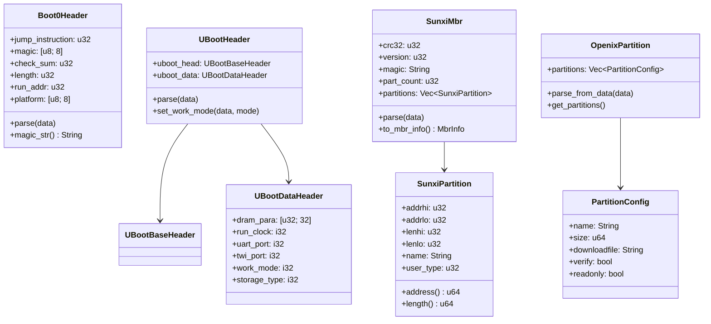

## 概述

嵌入式固件刷写涉及多种配置格式的解析：Boot 头（boot0/U-Boot）、分区表（MBR/GPT）、系统配置（sys_config）等。OpenixCLI 的 Config 模块负责解析这些与硬件初始化密切相关的数据结构，为刷写流程提供存储类型、分区信息、DRAM 参数等关键数据。

### 模块结构

```
src/config/
├── mod.rs          # 模块导出
├── boot_header.rs  # Boot0/U-Boot 头结构
├── mbr_parser.rs   # MBR 分区表解析
├── partition.rs    # 分区配置解析（INI 格式）
└── sys_config.rs   # 系统配置解析（DRAM 参数）
```

---

## Boot 头结构解析

### Boot0 头结构

Boot0 是全志芯片的第一阶段 bootloader，负责最基本的硬件初始化（如 DRAM）。

```rust
/// Boot0 魂数
pub const BOOT0_MAGIC: &str = "eGON.BT0";

/// Boot0 头结构
///
/// 第一阶段 bootloader 头，包含 DRAM 初始化参数和运行地址
#[repr(C, packed)]
#[derive(Debug, Clone, Copy)]
pub struct Boot0Header {
    /// 跳转指令（ARM 指令）
    pub jump_instruction: u32,

    /// 魂数标识：必须为 "eGON.BT0"
    pub magic: [u8; 8],

    /// 校验和
    pub check_sum: u32,

    /// Boot0 镜像长度
    pub length: u32,

    /// 公共头大小
    pub pub_head_size: u32,

    /// 公共头版本
    pub pub_head_vsn: [u8; 4],

    /// 返回地址
    pub ret_addr: u32,

    /// 运行地址（加载到内存后的执行地址）
    pub run_addr: u32,

    /// 启动 CPU 核
    pub boot_cpu: u32,

    /// 平台标识（如 "sun50iw10"）
    pub platform: [u8; 8],
}
```

**内存布局（十六进制）：**

```
偏移    字段              大小    说明
0x00    jump_instruction  4      ARM 跳转指令
0x04    magic             8      "eGON.BT0"
0x0C    check_sum         4      校验和
0x10    length            4      镜像长度
0x14    pub_head_size     4      头大小
0x18    pub_head_vsn      4      版本字符串
0x1C    ret_addr          4      返回地址
0x20    run_addr          4      运行地址
0x24    boot_cpu          4      CPU 核编号
0x28    platform          8      平台标识
...
```

### U-Boot 头结构

U-Boot 是第二阶段 bootloader，包含更丰富的硬件配置。

```rust
/// U-Boot 魂数
pub const UBOOT_MAGIC: &str = "uboot";

/// U-Boot 基础头结构
#[repr(C, packed)]
#[derive(Debug, Clone, Copy)]
pub struct UBootBaseHeader {
    pub jump_instruction: u32,
    pub magic: [u8; 8],           // "uboot"
    pub check_sum: u32,
    pub align_size: u32,          // 对齐大小
    pub length: u32,              // U-Boot 长度
    pub uboot_length: u32,        // 包含头后的总长度
    pub version: [u8; 8],         // 版本字符串
    pub platform: [u8; 8],        // 平台标识
    pub run_addr: u32,            // 运行地址
}
```

### U-Boot 数据头结构

包含 DRAM 参数、GPIO 配置、工作模式等：

```rust
/// U-Boot 数据头结构
///
/// 包含 DRAM 参数和硬件初始化数据
#[repr(C, packed)]
#[derive(Debug, Clone, Copy)]
pub struct UBootDataHeader {
    /// DRAM 参数数组（32 个 u32）
    pub dram_para: [u32; 32],

    /// 运行时钟频率
    pub run_clock: i32,

    /// 核心电压
    pub run_core_vol: i32,

    /// UART 端口编号
    pub uart_port: i32,

    /// UART GPIO 配置（2 个）
    pub uart_gpio: [UBootNormalGpioCfg; 2],

    /// TWI (I2C) 端口编号
    pub twi_port: i32,

    /// TWI GPIO 配置（2 个）
    pub twi_gpio: [UBootNormalGpioCfg; 2],

    /// 工作模式
    pub work_mode: i32,

    /// 存储类型
    pub storage_type: i32,
}
```

### GPIO 配置结构

```rust
/// GPIO 配置结构
#[repr(C, packed)]
#[derive(Debug, Clone, Copy)]
pub struct UBootNormalGpioCfg {
    /// GPIO 端口组（如 PA, PB, PC...）
    pub port: u8,

    /// GPIO 端口内编号
    pub port_num: u8,

    /// 功能选择（复用配置）
    pub mul_sel: u8,

    /// 上下拉配置
    pub pull: u8,

    /// 驱动能力等级
    pub drv_level: u8,

    /// 数据值
    pub data: u8,

    /// 保留字段
    pub reserved: [u8; 2],
}
```

### 工作模式常量

```rust
/// USB 产品模式工作模式
pub const WORK_MODE_USB_PRODUCT: u32 = 0x10;

/// Boot 文件模式常量
pub const BOOT_FILE_MODE_NORMAL: u32 = 0;    // 正常启动
pub const BOOT_FILE_MODE_TOC: u32 = 1;       // TOC 启动
pub const BOOT_FILE_MODE_RESERVED0: u32 = 2; // 保留
pub const BOOT_FILE_MODE_RESERVED1: u32 = 3; // 保留
pub const BOOT_FILE_MODE_PKG: u32 = 4;       // 包模式

/// 获取 Boot 文件模式字符串
pub fn get_sunxi_boot_file_mode_string(mode: u32) -> &'static str {
    match mode {
        BOOT_FILE_MODE_NORMAL => "Normal Boot File",
        BOOT_FILE_MODE_TOC => "TOC Boot File",
        BOOT_FILE_MODE_RESERVED0 => "Reserved Boot File 0",
        BOOT_FILE_MODE_RESERVED1 => "Reserved Boot File 1",
        BOOT_FILE_MODE_PKG => "Boot Package File",
        _ => "Unknown Boot File Type",
    }
}
```

---

## MBR 分区表解析

### MBR 格式常量

```rust
/// MBR 魂数（全志特有）
pub const MBR_MAGIC: &str = "softw411";

/// MBR 版本号
pub const MBR_VERSION: u32 = 0x00000200;

/// MBR 大小：16KB（远大于标准 MBR 的 512B）
pub const MBR_SIZE: usize = 16 * 1024;

/// 最大分区数量
pub const MBR_MAX_PART_CNT: usize = 120;

/// 分区名称最大长度
pub const PART_NAME_MAX_LEN: usize = 16;

/// CRC32 有效标志
pub const EFEX_CRC32_VALID_FLAG: u32 = 0x6a617603;
```

**全志 MBR 与标准 MBR 的区别：**

| 特性           | 标准 MBR    | 全志 MBR            |
| -------------- | ----------- | ------------------- |
| 大小           | 512 bytes   | 16 KB               |
| 最大分区数     | 4（主分区） | 120                 |
| 魂数           | 无特定魔数  | "softw411"          |
| 分区名称       | 无          | 16 字符             |
| 支持 64 位地址 | 否（CHS）   | 是（addrhi/addrlo） |

### SunxiPartitionRaw 结构

```rust
/// 原始分区条目结构
#[repr(C, packed)]
#[derive(Debug, Clone, Copy)]
pub struct SunxiPartitionRaw {
    /// 分区起始地址（高 32 位）
    pub addrhi: u32,

    /// 分区起始地址（低 32 位）
    pub addrlo: u32,

    /// 分区长度（高 32 位）
    pub lenhi: u32,

    /// 分区长度（低 32 位）
    pub lenlo: u32,

    /// 分区类别名
    pub classname: [u8; PART_NAME_MAX_LEN],

    /// 分区名称
    pub name: [u8; PART_NAME_MAX_LEN],

    /// 用户类型
    pub user_type: u32,

    /// 是否包含关键数据
    pub keydata: u32,

    /// 是否只读
    pub ro: u32,

    /// 保留字段
    pub reserved: [u8; PART_SIZE_RES_LEN],  // 68 bytes
}
```

**关键方法：**

```rust
impl SunxiPartitionRaw {
    /// 获取分区起始地址（64 位）
    pub fn address(&self) -> u64 {
        ((self.addrhi as u64) << 32) | (self.addrlo as u64)
    }

    /// 获取分区长度（64 位）
    pub fn length(&self) -> u64 {
        ((self.lenhi as u64) << 32) | (self.lenlo as u64)
    }

    /// 检查是否只读
    pub fn readonly(&self) -> bool {
        self.ro != 0
    }

    /// 获取分区名称
    pub fn name_str(&self) -> String {
        String::from_utf8_lossy(&self.name)
            .trim_end_matches('\0')
            .to_string()
    }
}
```

### SunxiMbrRaw 结构

```rust
/// 原始 MBR 结构
#[repr(C, packed)]
#[derive(Debug, Clone, Copy)]
pub struct SunxiMbrRaw {
    /// CRC32 校验
    pub crc32: u32,

    /// MBR 版本
    pub version: u32,

    /// 魂数标识：必须为 "softw411"
    pub magic: [u8; 8],

    /// MBR 备份数量
    pub copy: u32,

    /// MBR 索引号
    pub index: u32,

    /// 分区数量
    pub part_count: u32,

    /// 时间戳
    pub stamp: u32,

    /// 分区条目数组（最多 120 个）
    pub partitions: [SunxiPartitionRaw; MBR_MAX_PART_CNT],
}
```

### MBR 内存布局

```
┌─────────────────────────────────────────────────────────────┐
│                    Sunxi MBR 结构 (16KB)                    │
├─────────────────────────────────────────────────────────────┤
│ 偏移 0x00                                                   │
│ ┌─────────────────────────────────────────────────────────┐ │
│ │ CRC32 (4 bytes)                                         │ │
│ │ Version (4 bytes)                                       │ │
│ │ Magic: "softw411" (8 bytes)                             │ │
│ │ Copy (4 bytes)                                          │ │
│ │ Index (4 bytes)                                         │ │
│ │ Part Count (4 bytes)                                    │ │
│ │ Stamp (4 bytes)                                         │ │
│ └─────────────────────────────────────────────────────────┘ │
│ 偏移 0x24                                                   │
│ ┌─────────────────────────────────────────────────────────┐ │
│ │ Partition 0 (128 bytes)                                 │ │
│ │   - addrhi, addrlo (8 bytes)                            │ │
│ │   - lenhi, lenlo (8 bytes)                              │ │
│ │   - classname (16 bytes)                                │ │
│ │   - name (16 bytes)                                     │ │
│ │   - user_type, keydata, ro (12 bytes)                   │ │
│ │   - reserved (68 bytes)                                 │ │
│ └─────────────────────────────────────────────────────────┘ │
│ 偏移 0xA4                                                   │
│ ┌─────────────────────────────────────────────────────────┐ │
│ │ Partition 1 (128 bytes)                                 │ │
│ └─────────────────────────────────────────────────────────┘ │
│ ...                                                         │
│ 偏移 0xA4 + (119 * 128) = 0x3E44                            │
│ ┌─────────────────────────────────────────────────────────┐ │
│ │ Partition 119 (128 bytes)                               │ │
│ └─────────────────────────────────────────────────────────┘ │
│ 偏移 0x3FC4 - 0x4000                                        │
│ ┌─────────────────────────────────────────────────────────┐ │
│ │ Padding/Unused                                          │ │
│ └─────────────────────────────────────────────────────────┘ │
└─────────────────────────────────────────────────────────────┘
```

### SunxiMbr 解析结构

```rust
/// 解析后的 MBR 结构（高层抽象）
#[derive(Debug, Clone)]
pub struct SunxiMbr {
    pub crc32: u32,
    pub version: u32,
    pub magic: String,
    pub copy: u32,
    pub index: u32,
    pub part_count: u32,
    pub stamp: u32,
    pub partitions: Vec<SunxiPartition>,
}

impl SunxiMbr {
    /// 从原始数据解析 MBR
    pub fn parse(data: &[u8]) -> Result<Self, &'static str> {
        // 1. 解析原始结构
        let raw = SunxiMbrRaw::parse(data)?;

        // 2. 提取有效分区
        let mut partitions = Vec::with_capacity(raw.part_count as usize);
        for i in 0..raw.part_count as usize {
            let partition = SunxiPartition::from_raw(&raw.partitions[i]);
            partitions.push(partition);
        }

        // 3. 构建高层结构
        Ok(Self {
            crc32: raw.crc32,
            version: raw.version,
            magic: raw.magic_str(),
            copy: raw.copy,
            index: raw.index,
            part_count: raw.part_count,
            stamp: raw.stamp,
            partitions,
        })
    }

    /// 转换为 MbrInfo（用于刷写流程）
    pub fn to_mbr_info(&self) -> MbrInfo {
        MbrInfo {
            part_count: self.part_count,
            partitions: self.partitions.clone(),
        }
    }
}

/// MBR 信息容器
#[derive(Debug, Clone)]
pub struct MbrInfo {
    pub part_count: u32,
    pub partitions: Vec<SunxiPartition>,
}
```

---

## 分区配置解析（INI 格式）

### PartitionConfig 结构

```rust
/// 分区配置条目
#[derive(Debug, Clone, Default)]
pub struct PartitionConfig {
    /// 分区名称
    pub name: String,

    /// 分区大小（字节）
    pub size: u64,

    /// 下载文件路径
    pub downloadfile: String,

    /// 用户类型标识
    pub user_type: u32,

    /// 是否包含关键数据
    pub keydata: bool,

    /// 是否需要加密
    pub encrypt: bool,

    /// 是否需要验证
    pub verify: bool,

    /// 是否只读
    pub readonly: bool,
}
```

### OpenixPartition 解析器

```rust
/// 分区配置容器
pub struct OpenixPartition {
    partitions: Vec<PartitionConfig>,
}

impl OpenixPartition {
    /// 从二进制数据解析
    pub fn parse_from_data(&mut self, data: &[u8]) -> bool {
        let content = String::from_utf8_lossy(data);
        self.parse_from_content(&content)
    }

    /// 从字符串内容解析
    fn parse_from_content(&mut self, content: &str) -> bool {
        self.partitions.clear();

        let mut in_partition_section = false;
        let mut current_partition = PartitionConfig::default();

        for line in content.lines() {
            let line = line.trim();

            // 跳过空行和注释
            if line.is_empty() || line.starts_with(';') || line.starts_with("//") {
                continue;
            }

            // 进入分区配置段
            if line == "[partition_start]" {
                in_partition_section = true;
                continue;
            }

            // 新分区定义
            if line == "[partition]" {
                // 保存上一个分区
                if !current_partition.name.is_empty() {
                    self.partitions.push(current_partition.clone());
                }
                current_partition = PartitionConfig::default();
                in_partition_section = true;
                continue;
            }

            // 其他段标记，退出分区配置段
            if line.starts_with('[') && line.ends_with(']') {
                if line != "[partition]" && line != "[partition_start]" && line != "[mbr]" {
                    in_partition_section = false;
                }
                continue;
            }

            // 解析分区配置行
            if in_partition_section {
                self.parse_partition_line(line, &mut current_partition);
            }
        }

        // 保存最后一个分区
        if in_partition_section && !current_partition.name.is_empty() {
            self.partitions.push(current_partition);
        }

        true
    }
}
```

### 配置行解析

```rust
/// 解析单行配置
fn parse_partition_line(&self, line: &str, partition: &mut PartitionConfig) {
    let parts: Vec<&str> = line.splitn(2, '=').collect();
    if parts.len() != 2 {
        return;
    }

    let key = parts[0].trim();
    let value = parts[1].trim();
    let value = value.trim_matches('"');  // 移除引号

    match key {
        "name" => partition.name = value.to_string(),
        "size" => {
            // 支持十六进制和十进制
            partition.size = if value.starts_with("0x") || value.starts_with("0X") {
                u64::from_str_radix(&value[2..], 16).unwrap_or(0)
            } else {
                value.parse().unwrap_or(0)
            }
        }
        "downloadfile" => partition.downloadfile = value.to_string(),
        "user_type" => {
            partition.user_type = if value.starts_with("0x") || value.starts_with("0X") {
                u32::from_str_radix(&value[2..], 16).unwrap_or(0)
            } else {
                value.parse().unwrap_or(0)
            }
        }
        "keydata" => partition.keydata = value != "0",
        "encrypt" => partition.encrypt = value != "0",
        "verify" => partition.verify = value != "0",
        "ro" => partition.readonly = value != "0",
        _ => {}
    }
}
```

### INI 配置示例

```ini
; 分区配置示例

[partition_start]
[partition]
    name = boot
    size = 0x100000
    downloadfile = "boot.fex"
    user_type = 0x8000
    verify = 1

[partition]
    name = rootfs
    size = 0x8000000
    downloadfile = "rootfs.fex"
    user_type = 0x8000
    verify = 1

[partition]
    name = userdata
    size = 0x10000000
    downloadfile = "userdata.fex"
    user_type = 0x8000
    keydata = 0
    encrypt = 0
    verify = 1
```

---

## 系统配置解析

### DramParamInfo 结构

```rust
/// DRAM 参数信息
///
/// 包含 DRAM 初始化所需的 32 个参数
#[repr(C, packed)]
#[derive(Debug, Clone, Copy)]
pub struct DramParamInfo {
    /// DRAM 初始化标志
    pub dram_init_flag: u32,

    /// DRAM 更新标志
    pub dram_update_flag: u32,

    /// DRAM 参数数组
    pub dram_para: [u32; 32],
}

impl DramParamInfo {
    /// 创建空参数
    pub fn create_empty() -> Self {
        Self {
            dram_init_flag: 0,
            dram_update_flag: 0,
            dram_para: [0u32; 32],
        }
    }

    /// 序列化为字节
    pub fn serialize(&self) -> Vec<u8> {
        let size = std::mem::size_of::<DramParamInfo>();
        let mut data = vec![0u8; size];
        unsafe {
            std::ptr::copy_nonoverlapping(
                self as *const DramParamInfo as *const u8,
                data.as_mut_ptr(),
                size,
            );
        }
        data
    }
}
```

### SysConfigParser

```rust
/// 系统配置解析器
pub struct SysConfigParser;

impl SysConfigParser {
    /// 从原始数据解析
    pub fn parse(data: &[u8]) -> SysConfig {
        SysConfig {
            storage_type: Self::get_storage_type(data),
        }
    }

    /// 获取存储类型
    fn get_storage_type(data: &[u8]) -> u32 {
        if data.len() < 4 {
            return 0;
        }
        let ptr = data.as_ptr() as *const u32;
        unsafe { u32::from_le(*ptr) }
    }

    /// 从数值获取 StorageType
    pub fn get_storage_type_from_num(num: u32) -> StorageType {
        StorageType::from(num)
    }
}

/// 系统配置数据
#[derive(Debug, Clone)]
pub struct SysConfig {
    /// 存储类型（NAND, eMMC, SD 等）
    pub storage_type: u32,
}
```

---

## 调用流程分析

### MBR 解析流程

```rust
// 在刷写流程中解析 MBR
fn parse_mbr_for_flash(packer: &mut OpenixPacker) -> Result<MbrInfo, FlashError> {
    // 1. 从固件提取 MBR 数据
    let mbr_data = packer.get_mbr()?;

    // 2. 解析 MBR 结构
    let mbr = SunxiMbr::parse(&mbr_data)
        .map_err(|e| FlashError::MbrNotFound)?;

    // 3. 转换为刷写信息
    let mbr_info = mbr.to_mbr_info();

    // 4. 验证分区数量
    if mbr_info.part_count == 0 {
        return Err(FlashError::MbrNotFound);
    }

    // 5. 打印分区信息
    for part in &mbr_info.partitions {
        println!(
            "分区: {} @ 0x{:08x} ({} bytes)",
            part.name,
            part.address(),
            part.length()
        );
    }

    Ok(mbr_info)
}
```

### Boot 头解析流程

```rust
// 解析 U-Boot 头并修改工作模式
fn prepare_uboot_for_fel(uboot_data: &mut [u8]) -> Result<(), FlashError> {
    // 1. 解析 U-Boot 头
    let header = UBootHeader::parse(uboot_data)
        .map_err(|_| FlashError::UbootNotFound)?;

    // 2. 验证魔数
    if header.uboot_head.magic_str() != UBOOT_MAGIC {
        return Err(FlashError::UbootNotFound);
    }

    // 3. 设置工作模式为 USB 产品模式
    UBootHeader::set_work_mode(uboot_data, WORK_MODE_USB_PRODUCT);

    // 4. 获取存储类型
    let storage_type = StorageType::from(header.uboot_data.storage_type as u32);
    println!("存储类型: {}", storage_type);

    Ok(())
}
```

### 分区配置解析流程

```rust
// 解析分区配置文件
fn parse_partition_config(data: &[u8]) -> Vec<PartitionConfig> {
    let mut parser = OpenixPartition::new();
    parser.parse_from_data(data);
    parser.get_partitions().to_vec()
}

// 示例输出
fn print_partitions(partitions: &[PartitionConfig]) {
    for part in partitions {
        println!(
            "名称: {}, 大小: {} MB, 文件: {}",
            part.name,
            part.size / (1024 * 1024),
            part.downloadfile
        );
    }
}
```

---

## 代码亮点

### 1. 64 位地址的高低位拼接

```rust
/// 获取分区起始地址（64 位）
pub fn address(&self) -> u64 {
    ((self.addrhi as u64) << 32) | (self.addrlo as u64)
}
```

**原理：** 全志 MBR 使用 addrhi/addrlo 分离存储 64 位地址，需要手动拼接。

### 2. 段式 INI 解析

```rust
// 状态机式解析
let mut in_partition_section = false;

for line in content.lines() {
    if line == "[partition_start]" {
        in_partition_section = true;  // 进入分区段
        continue;
    }

    if line.starts_with('[') && line != "[partition]" {
        in_partition_section = false;  // 退出分区段
        continue;
    }

    if in_partition_section {
        // 只在分区段内解析配置行
        self.parse_partition_line(line, &mut current_partition);
    }
}
```

### 3. 动态工作模式设置

```rust
/// 在 U-Boot 数据中设置工作模式
pub fn set_work_mode(data: &mut [u8], mode: u32) {
    let data_offset = std::mem::size_of::<UBootBaseHeader>();
    UBootDataHeader::set_work_mode(&mut data[data_offset..], mode);
}
```

**用途：** FEL 模式下需要设置 `work_mode = 0x10` 使 U-Boot 进入 USB 产品模式。

### 4. 序列化实现

```rust
/// 序列化结构体到字节
pub fn serialize(&self) -> Vec<u8> {
    let size = std::mem::size_of::<DramParamInfo>();
    let mut data = vec![0u8; size];
    unsafe {
        std::ptr::copy_nonoverlapping(
            self as *const DramParamInfo as *const u8,
            data.as_mut_ptr(),
            size,
        );
    }
    data
}
```

### 5. 十六进制数值解析

```rust
// 自动识别十六进制和十进制格式
partition.size = if value.starts_with("0x") || value.starts_with("0X") {
    u64::from_str_radix(&value[2..], 16).unwrap_or(0)
} else {
    value.parse().unwrap_or(0)
};
```

---

## 实践示例

### 解析固件中的 MBR

```rust
use openixcli::firmware::OpenixPacker;
use openixcli::config::mbr_parser::{SunxiMbr, MBR_SIZE};

fn main() -> Result<(), Box<dyn std::error::Error>> {
    let mut packer = OpenixPacker::new();
    packer.load("firmware.fex")?;

    // 获取 MBR 数据
    let mbr_data = packer.get_mbr()?;
    println!("MBR 数据大小: {} bytes (预期 {} bytes)", mbr_data.len(), MBR_SIZE);

    // 解析 MBR
    let mbr = SunxiMbr::parse(&mbr_data)?;

    println!("MBR 魂数: {}", mbr.magic);
    println!("MBR 版本: 0x{:08x}", mbr.version);
    println!("分区数量: {}", mbr.part_count);

    // 打印所有分区
    println!("\n分区列表:");
    println!("{:-<60}", "");
    println!("{:16} {:12} {:12}", "名称", "起始地址", "大小");
    println!("{:-<60}", "");

    for part in &mbr.partitions {
        println!(
            "{:16} 0x{:010x}  {} MB",
            part.name,
            part.address(),
            part.length() / (1024 * 1024)
        );
    }

    Ok(())
}
```

**输出示例：**

```
MBR 数据大小: 16384 bytes (预期 16384 bytes)
MBR 魂数: softw411
MBR 版本: 0x00000200
分区数量: 8

分区列表:
------------------------------------------------------------
名称             起始地址     大小
------------------------------------------------------------
boot             0x00000000   1 MB
env              0x00100000   128 KB
rootfs           0x00120000   128 MB
userdata         0x08120000   256 MB
misc             0x10120000   1 MB
recovery         0x10220000   32 MB
...
```

### 解析 Boot0 头

```rust
use openixcli::config::boot_header::{Boot0Header, BOOT0_MAGIC};

fn analyze_boot0(boot0_data: &[u8]) {
    let header = Boot0Header::parse(boot0_data).unwrap();

    println!("Boot0 分析:");
    println!("  魂数: {} ({})", header.magic_str(),
        if header.magic_str() == BOOT0_MAGIC { "有效" } else { "无效" });
    println!("  平台: {}", header.platform_str());
    println!("  镜像长度: {} bytes", header.length);
    println!("  运行地址: 0x{:08x}", header.run_addr);
    println!("  校验和: 0x{:08x}", header.check_sum);
}
```

### 解析分区配置

```rust
use openixcli::config::partition::OpenixPartition;

fn parse_config(config_data: &[u8]) {
    let mut parser = OpenixPartition::new();
    parser.parse_from_data(config_data);

    println!("分区配置:");
    for part in parser.get_partitions() {
        println!("\n  分区: {}", part.name);
        println!("    大小: {} bytes ({} KB)", part.size, part.size / 1024);
        println!("    文件: {}", part.downloadfile);
        println!("    验证: {}", part.verify);
        println!("    只读: {}", part.readonly);
        if part.keydata {
            println!("    包含关键数据");
        }
    }
}
```

---

## 数据结构关系图



---

---
