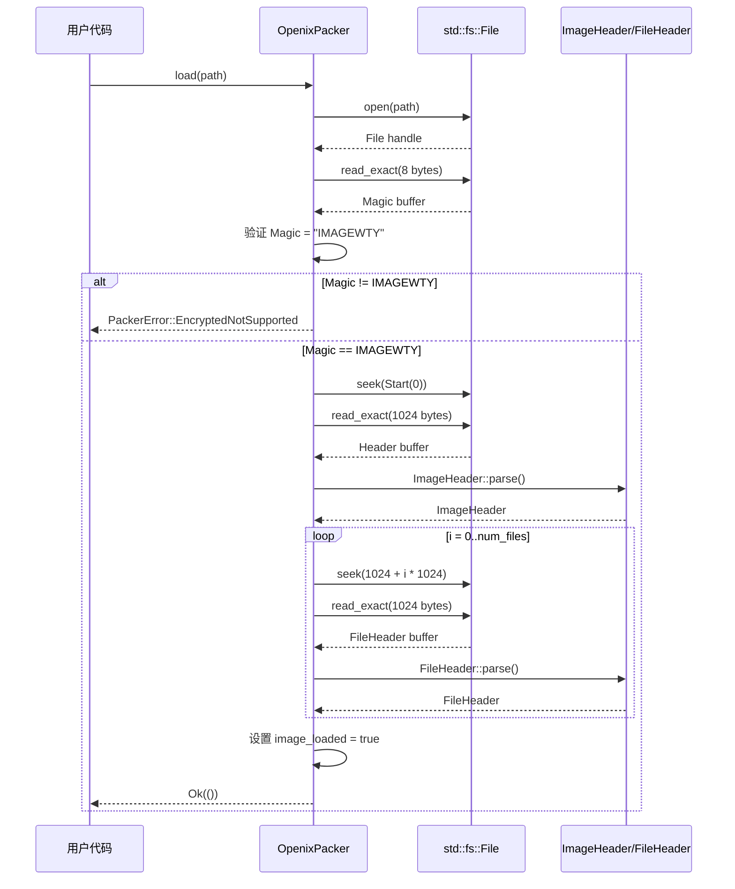
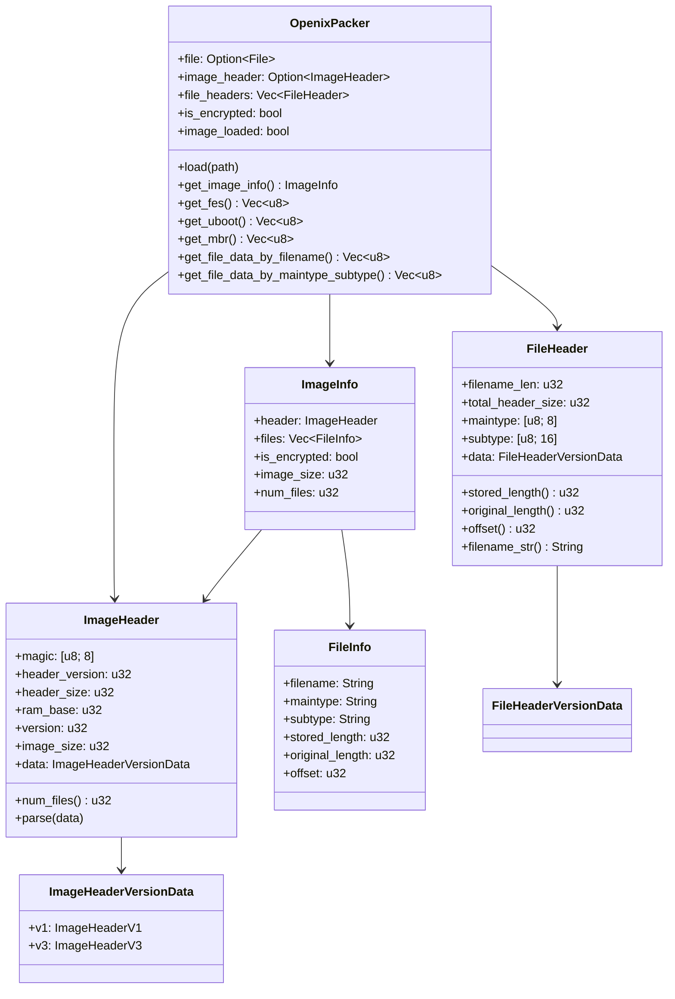

## 概述

固件解析是嵌入式刷写工具的核心功能。全志（Allwinner）芯片使用一种名为 IMAGEWTY 的专有固件格式，将多个组件（FES、U-Boot、MBR、DTB、分区数据等）打包成单一文件。OpenixCLI 的 Firmware 模块负责解析这种二进制格式，提取各组件数据供刷写流程使用。

### 模块结构

```
src/firmware/
├── mod.rs          # 模块导出
├── types.rs        # 二进制结构定义（#[repr(C, packed)]）
├── packer.rs       # OpenixPacker 固件解析器
├── image_data.rs   # 预定义组件查找表
└── sparse.rs       # Android sparse 格式解析
```

### 核心导出

```rust
pub use packer::OpenixPacker;
pub use packer::PackerError;
pub use types::*;
```

---

## IMAGEWTY 文件格式

### 文件结构概览

IMAGEWTY 固件文件采用分段式结构：

```
┌─────────────────────────────────────────────────────────────┐
│                    IMAGEWTY 固件文件                         │
├─────────────────────────────────────────────────────────────┤
│ 偏移 0x0000                                                  │
│ ┌─────────────────────────────────────────────────────────┐ │
│ │              Image Header (1024 bytes)                   │ │
│ │  ┌───────────────────────────────────────────────────┐  │ │
│ │  │ Magic: "IMAGEWTY" (8 bytes)                       │  │ │
│ │  │ Header Version: 0x0100 or 0x0300                  │  │ │
│ │  │ Header Size, RAM Base, Version                    │  │ │
│ │  │ Image Size, Image Header Size                     │  │ │
│ │  │ Version-specific data (V1 or V3)                  │  │ │
│ │  │ - PID, VID, Hardware ID, Firmware ID             │  │ │
│ │  │ - Num Files (文件数量)                             │  │ │
│ │  └───────────────────────────────────────────────────┘  │ │
│ └─────────────────────────────────────────────────────────┘ │
├─────────────────────────────────────────────────────────────┤
│ 偏移 0x0400 (1024)                                           │
│ ┌─────────────────────────────────────────────────────────┐ │
│ │              File Header 0 (1024 bytes)                  │ │
│ │  ┌───────────────────────────────────────────────────┐  │ │
│ │  │ Filename Length, Total Header Size                │  │ │
│ │  │ Main Type: "FES" / "12345678" / "COMMON"          │  │ │
│ │  │ Sub Type: "FES_1-0000000000" / ...                │  │ │
│ │  │ Version-specific data (V1 or V3)                  │  │ │
│ │  │ - Stored Length, Original Length                  │  │ │
│ │  │ - Offset (数据偏移)                               │  │ │
│ │  │ - Filename                                       │  │ │
│ │  └───────────────────────────────────────────────────┘  │ │
│ └─────────────────────────────────────────────────────────┘ │
├─────────────────────────────────────────────────────────────┤
│ 偏移 0x0800 (2048)                                           │
│ ┌─────────────────────────────────────────────────────────┐ │
│ │              File Header 1 (1024 bytes)                  │ │
│ └─────────────────────────────────────────────────────────┘ │
│ ...                                                          │
│ ┌─────────────────────────────────────────────────────────┐ │
│ │              File Header N (1024 bytes)                  │ │
│ └─────────────────────────────────────────────────────────┘ │
├─────────────────────────────────────────────────────────────┤
│ 偏移 = File Header N 的 Offset 字段                          │
│ ┌─────────────────────────────────────────────────────────┐ │
│ │              File Data (实际内容)                        │ │
│ └─────────────────────────────────────────────────────────┘ │
│ ...                                                          │
└─────────────────────────────────────────────────────────────┘
```

### 固件组件一览

| 组件名称       | Main Type | Sub Type            | 功能说明                         |
| -------------- | --------- | ------------------- | -------------------------------- |
| FES            | FES       | FES_1-0000000000    | Flash Eraser Script，初始化 DRAM |
| U-Boot         | 12345678  | UBOOT_0000000000    | U-Boot bootloader                |
| MBR            | 12345678  | 1234567890\_\_\_MBR | Master Boot Record 分区表        |
| GPT            | 12345678  | 1234567890\_\_\_GPT | GUID Partition Table             |
| DTB            | COMMON    | DTB_CONFIG000000    | Device Tree Blob                 |
| sys_config     | COMMON    | SYS_CONFIG100000    | 系统配置文本                     |
| sys_config_bin | COMMON    | SYS_CONFIG_BIN00    | 系统配置二进制                   |
| sys_partition  | COMMON    | SYS_CONFIG000000    | 分区配置                         |
| board_config   | COMMON    | BOARD_CONFIG_BIN    | 板级配置                         |
| boot0_card     | 12345678  | 1234567890BOOT_0    | SD 卡 Boot0                      |
| bootpkg        | BOOTPKG   | BOOTPKG-00000000    | 启动包                           |

---

## 核心数据结构

### 常量定义

```rust
/// IMAGEWTY 格式魔数
pub const IMAGEWTY_MAGIC: &str = "IMAGEWTY";
pub const IMAGEWTY_MAGIC_LEN: usize = 8;

/// 文件头长度（固定 1024 字节）
pub const IMAGEWTY_FILEHDR_LEN: usize = 1024;

/// Main Type 字段长度
pub const IMAGEWTY_FHDR_MAINTYPE_LEN: usize = 8;

/// Sub Type 字段长度
pub const IMAGEWTY_FHDR_SUBTYPE_LEN: usize = 16;

/// Filename 字段长度
pub const IMAGEWTY_FHDR_FILENAME_LEN: usize = 256;
```

### ImageHeader 结构

主头结构包含固件的元信息：

```rust
/// IMAGEWTY 主头结构
///
/// 使用 #[repr(C, packed)] 确保与二进制格式完全匹配
#[repr(C, packed)]
pub struct ImageHeader {
    /// 数标识：必须为 "IMAGEWTY"
    pub magic: [u8; IMAGEWTY_MAGIC_LEN],

    /// 头版本：0x0100 (V1) 或 0x0300 (V3)
    pub header_version: u32,

    /// 头大小
    pub header_size: u32,

    /// RAM 基地址
    pub ram_base: u32,

    /// 固件版本号
    pub version: u32,

    /// 整个镜像大小
    pub image_size: u32,

    /// 镜像头大小
    pub image_header_size: u32,

    /// 版本特定数据（联合体）
    pub data: ImageHeaderVersionData,
}
```

**关键特性：**

- `#[repr(C, packed)]` - 禁止内存对齐，直接映射到二进制布局
- 联合体 `ImageHeaderVersionData` - 支持不同版本的头部结构

### ImageHeaderVersionData 联合体

```rust
/// 头版本数据联合体
///
/// 根据 header_version 选择 V1 或 V3 结构
#[repr(C, packed)]
pub union ImageHeaderVersionData {
    pub v1: ImageHeaderV1,
    pub v3: ImageHeaderV3,
}

/// V1 版本头结构
#[repr(C, packed)]
#[derive(Debug, Clone, Copy)]
pub struct ImageHeaderV1 {
    pub pid: u32,              // Product ID
    pub vid: u32,              // Vendor ID
    pub hardware_id: u32,      // 硬件 ID
    pub firmware_id: u32,      // 固件 ID
    pub val1: u32,
    pub val1024: u32,
    pub num_files: u32,        // 文件数量
    pub val1024_2: u32,
    pub val0: u32,
    pub val0_2: u32,
    pub val0_3: u32,
    pub val0_4: u32,
}

/// V3 版本头结构
#[repr(C, packed)]
#[derive(Debug, Clone, Copy)]
pub struct ImageHeaderV3 {
    pub unknown: u32,          // V3 新增字段
    pub pid: u32,
    pub vid: u32,
    pub hardware_id: u32,
    pub firmware_id: u32,
    pub val1: u32,
    pub val1024: u32,
    pub num_files: u32,
    pub val1024_2: u32,
    pub val0: u32,
    pub val0_2: u32,
    pub val0_3: u32,
    pub val0_4: u32,
}
```

### FileHeader 结构

每个文件的头结构：

```rust
/// 文件头结构
#[repr(C, packed)]
pub struct FileHeader {
    /// 文件名长度
    pub filename_len: u32,

    /// 总头大小
    pub total_header_size: u32,

    /// 主类型标识（如 "FES", "12345678"）
    pub maintype: [u8; IMAGEWTY_FHDR_MAINTYPE_LEN],

    /// 子类型标识
    pub subtype: [u8; IMAGEWTY_FHDR_SUBTYPE_LEN],

    /// 版本特定数据
    pub data: FileHeaderVersionData,
}

/// 文件头版本数据联合体
#[repr(C, packed)]
pub union FileHeaderVersionData {
    pub v1: FileHeaderV1,
    pub v3: FileHeaderV3,
}

/// V1 版本文件头
#[repr(C, packed)]
#[derive(Debug, Clone, Copy)]
pub struct FileHeaderV1 {
    pub unknown_3: u32,
    pub stored_length: u32,    // 存储长度（压缩后）
    pub original_length: u32,  // 原始长度
    pub offset: u32,           // 数据偏移
    pub unknown: u32,
    pub filename: [u8; IMAGEWTY_FHDR_FILENAME_LEN],
}

/// V3 版本文件头
#[repr(C, packed)]
#[derive(Debug, Clone, Copy)]
pub struct FileHeaderV3 {
    pub unknown_0: u32,
    pub filename: [u8; IMAGEWTY_FHDR_FILENAME_LEN],  // V3 中 filename 位置不同
    pub stored_length: u32,
    pub pad1: u32,
    pub original_length: u32,
    pub pad2: u32,
    pub offset: u32,
}
```

**注意：** V1 和 V3 结构中 `filename` 字段的位置不同，这是解析时需要根据版本号处理的关键点。

### ImageInfo 和 FileInfo

解析后的高层抽象结构：

```rust
/// 镜像信息容器
#[derive(Debug, Clone)]
pub struct ImageInfo {
    pub header: ImageHeader,
    pub files: Vec<FileInfo>,
    pub is_encrypted: bool,
    pub image_size: u32,
    pub num_files: u32,
}

/// 文件信息结构
#[derive(Debug, Clone)]
pub struct FileInfo {
    pub filename: String,
    pub maintype: String,
    pub subtype: String,
    pub stored_length: u32,
    pub original_length: u32,
    pub offset: u32,
}
```

### StorageType 枚举

```rust
/// 存储类型枚举
#[derive(Debug, Clone, Copy, PartialEq, Eq)]
pub enum StorageType {
    Nand = 0,      // NAND Flash
    Sdcard = 1,    // SD 卡
    Emmc = 2,      // eMMC
    Spinor = 3,    // SPI NOR Flash
    Emmc3 = 4,     // eMMC v3
    Spinand = 5,   // SPI NAND Flash
    Sd1 = 6,       // SD 卡槽 1
    Emmc0 = 7,     // eMMC 槽 0
    Ufs = 8,       // UFS
    Auto = -1,     // 自动检测
}
```

---

## OpenixPacker 解析器

### 结构定义

```rust
/// IMAGEWTY 固件解析器
///
/// 提供固件加载和文件提取功能
pub struct OpenixPacker {
    file: Option<File>,             // 文件句柄
    image_header: Option<ImageHeader>,  // 镜像头
    file_headers: Vec<FileHeader>,  // 所有文件头
    is_encrypted: bool,             // 是否加密
    image_loaded: bool,             // 是否已加载
}
```

### 加载流程



### load 方法实现

```rust
/// 加载固件文件
pub fn load<P: AsRef<Path>>(&mut self, path: P) -> Result<(), PackerError> {
    let mut file = File::open(path)?;

    // 1. 读取并验证魔数
    let mut magic_buf = [0u8; IMAGEWTY_MAGIC_LEN];
    file.read_exact(&mut magic_buf)?;
    let magic = String::from_utf8_lossy(&magic_buf).to_string();

    if magic != IMAGEWTY_MAGIC {
        self.is_encrypted = true;
        return Err(PackerError::EncryptedNotSupported);
    }

    // 2. 回到文件开头，读取完整 ImageHeader
    file.seek(SeekFrom::Start(0))?;

    let mut header_buf = [0u8; IMAGEWTY_FILEHDR_LEN];
    file.read_exact(&mut header_buf)?;

    let image_header = ImageHeader::parse(&header_buf)
        .map_err(PackerError::ParseError)?;

    // 3. 获取文件数量
    let num_files = image_header.num_files();

    // 4. 逐个读取 FileHeader
    let mut file_headers = Vec::with_capacity(num_files as usize);
    for i in 0..num_files {
        let offset = IMAGEWTY_FILEHDR_LEN + (i as usize) * IMAGEWTY_FILEHDR_LEN;
        file.seek(SeekFrom::Start(offset as u64))?;

        let mut file_header_buf = [0u8; IMAGEWTY_FILEHDR_LEN];
        file.read_exact(&mut file_header_buf)?;

        let file_header = FileHeader::parse(&file_header_buf)
            .map_err(PackerError::ParseError)?;
        file_headers.push(*file_header);
    }

    // 5. 更新内部状态
    self.file = Some(file);
    self.image_header = Some(*image_header);
    self.file_headers = file_headers;
    self.image_loaded = true;

    Ok(())
}
```

### 文件提取方法

```rust
/// 按文件名提取数据
pub fn get_file_data_by_filename(&mut self, filename: &str) -> Result<Vec<u8>, PackerError> {
    if !self.image_loaded {
        return Err(PackerError::ImageNotLoaded);
    }

    let header_version = self.get_header_version();
    let file_header = self.get_file_header_by_filename(filename)
        .ok_or_else(|| PackerError::FileNotFound(filename.to_string()))?;

    self.read_data_at_offset(
        file_header.offset(header_version),
        file_header.original_length(header_version),
    )
}

/// 按 maintype/subtype 提取数据
pub fn get_file_data_by_maintype_subtype(
    &mut self,
    maintype: &str,
    subtype: &str,
) -> Result<Vec<u8>, PackerError> {
    if !self.image_loaded {
        return Err(PackerError::ImageNotLoaded);
    }

    let header_version = self.get_header_version();
    let file_header = self.get_file_header_by_maintype_subtype(maintype, subtype)
        .ok_or_else(|| PackerError::FileNotFound(format!("{}/{}", maintype, subtype)))?;

    self.read_data_at_offset(
        file_header.offset(header_version),
        file_header.original_length(header_version),
    )
}

/// 在指定偏移读取数据
fn read_data_at_offset(&mut self, offset: u32, length: u32) -> Result<Vec<u8>, PackerError> {
    let file = self.file.as_mut().ok_or(PackerError::ImageNotLoaded)?;

    file.seek(SeekFrom::Start(offset as u64))?;

    let mut buffer = vec![0u8; length as usize];
    file.read_exact(&mut buffer)?;

    Ok(buffer)
}
```

### 预定义组件快捷方法

```rust
/// 通过预定义名称获取组件数据
pub fn get_image_data_by_name(&mut self, name: &str) -> Result<Vec<u8>, PackerError> {
    if let Some(entry) = crate::firmware::image_data::get_image_data_entry(name) {
        self.get_file_data_by_maintype_subtype(entry.maintype, entry.subtype)
    } else {
        Err(PackerError::FileNotFound(name.to_string()))
    }
}

/// 获取 FES 数据
pub fn get_fes(&mut self) -> Result<Vec<u8>, PackerError> {
    self.get_image_data_by_name("fes")
}

/// 获取 U-Boot 数据
pub fn get_uboot(&mut self) -> Result<Vec<u8>, PackerError> {
    self.get_image_data_by_name("uboot")
}

/// 获取 MBR 数据
pub fn get_mbr(&mut self) -> Result<Vec<u8>, PackerError> {
    self.get_image_data_by_name("mbr")
}

/// 获取 DTB 数据
pub fn get_dtb(&mut self) -> Result<Vec<u8>, PackerError> {
    self.get_image_data_by_name("dtb")
}

/// 获取 sys_config 二进制数据
pub fn get_sys_config_bin(&mut self) -> Result<Vec<u8>, PackerError> {
    self.get_image_data_by_name("sys_config_bin")
}
```

---

## 预定义组件查找表

### ImageDataEntry 结构

```rust
/// 预定义镜像数据条目
pub struct ImageDataEntry {
    pub name: &'static str,       // 简短名称（如 "fes", "uboot"）
    pub maintype: &'static str,   // Main Type 标识
    pub subtype: &'static str,    // Sub Type 标识
}
```

### IMAGE_DATA_TABLE 常量

```rust
pub const IMAGE_DATA_TABLE: &[ImageDataEntry] = &[
    ImageDataEntry {
        name: "fes",
        maintype: "FES",
        subtype: "FES_1-0000000000",
    },
    ImageDataEntry {
        name: "uboot",
        maintype: "12345678",
        subtype: "UBOOT_0000000000",
    },
    ImageDataEntry {
        name: "mbr",
        maintype: "12345678",
        subtype: "1234567890___MBR",
    },
    ImageDataEntry {
        name: "dtb",
        maintype: "COMMON",
        subtype: "DTB_CONFIG000000",
    },
    // ... 更多条目
];
```

### HashMap 快速查找

```rust
use once_cell::sync::Lazy;
use std::collections::HashMap;

/// 延迟初始化的查找表
static IMAGE_ENTRY_MAP: Lazy<HashMap<&'static str, &'static ImageDataEntry>> =
    Lazy::new(|| {
        IMAGE_DATA_TABLE
            .iter()
            .map(|entry| (entry.name, entry))
            .collect()
    });

/// 按名称查找条目
pub fn get_image_data_entry(name: &str) -> Option<&'static ImageDataEntry> {
    IMAGE_ENTRY_MAP.get(name).copied()
}
```

---

## Android Sparse 格式支持

### Sparse Header 结构

```rust
/// Sparse 镜像魔数
pub const SPARSE_HEADER_MAGIC: u32 = 0xed26ff3a;

/// Sparse 头结构
#[repr(C, packed)]
#[derive(Debug, Clone, Copy)]
pub struct SparseHeader {
    pub magic: u32,           // 0xed26ff3a
    pub major_version: u16,   // 主版本（必须为 1）
    pub minor_version: u16,   // 次版本
    pub file_hdr_sz: u16,     // 文件头大小（28）
    pub chunk_hdr_sz: u16,    // 块头大小（12）
    pub blk_sz: u32,          // 块大小
    pub total_blks: u32,      // 总块数
    pub total_chunks: u32,    // 总块数
    pub image_checksum: u32,  // 校验和
}

impl SparseHeader {
    /// 验证头有效性
    pub fn is_valid(&self) -> bool {
        self.magic == SPARSE_HEADER_MAGIC
            && self.major_version == SPARSE_HEADER_MAJOR_VER
            && self.file_hdr_sz as usize == SPARSE_HEADER_SIZE
            && self.chunk_hdr_sz as usize == CHUNK_HEADER_SIZE
    }
}
```

### Chunk Header 结构

```rust
/// 块类型常量
pub const CHUNK_TYPE_RAW: u16 = 0xcac1;      // 原始数据块
pub const CHUNK_TYPE_FILL: u16 = 0xcac2;     // 填充块
pub const CHUNK_TYPE_DONT_CARE: u16 = 0xcac3; // 空块
pub const CHUNK_TYPE_CRC32: u16 = 0xcac4;    // CRC32 块

/// 块头结构
#[repr(C, packed)]
#[derive(Debug, Clone, Copy)]
pub struct ChunkHeader {
    pub chunk_type: u16,   // 块类型
    pub reserved: u16,     // 保留
    pub chunk_sz: u32,     // 块大小（扇区数）
    pub total_sz: u32,     // 总大小（包含头）
}

impl ChunkHeader {
    /// 计算数据大小
    pub fn data_size(&self) -> u32 {
        self.total_sz.saturating_sub(CHUNK_HEADER_SIZE as u32)
    }
}
```

### Sparse 格式检测

```rust
/// 检测是否为 Sparse 格式
pub fn is_sparse_format(data: &[u8]) -> bool {
    if let Some(header) = SparseHeader::parse(data) {
        header.is_valid()
    } else {
        false
    }
}

/// 解析并验证 Sparse 格式
pub fn sparse_format_probe(data: &[u8]) -> crate::utils::FlashResult<SparseHeader> {
    use crate::utils::FlashError;

    let header = SparseHeader::parse(data).ok_or_else(|| {
        FlashError::InvalidFirmwareFormat(
            "Failed to parse sparse header: insufficient data".to_string(),
        )
    })?;

    if header.magic != SPARSE_HEADER_MAGIC {
        return Err(FlashError::InvalidFirmwareFormat(format!(
            "Invalid sparse magic: expected 0x{:08x}, got 0x{:08x}",
            SPARSE_HEADER_MAGIC, header.magic
        )));
    }

    // ... 其他验证

    Ok(*header)
}
```

---

## 代码亮点

### 1. `#[repr(C, packed)]` 二进制映射

```rust
#[repr(C, packed)]
pub struct ImageHeader {
    pub magic: [u8; 8],
    pub header_version: u32,
    // ...
}
```

**作用：**

- `#[repr(C)]` - 使用 C 语言布局规则
- `#[repr(packed)]` - 禁止对齐，字段紧密排列

**嵌入式开发中的应用：** 直接将结构体映射到二进制数据，避免手动偏移计算。

### 2. Union 处理版本差异

```rust
pub union ImageHeaderVersionData {
    pub v1: ImageHeaderV1,
    pub v3: ImageHeaderV3,
}
```

**安全访问：**

```rust
// 使用 unsafe 块访问联合体字段
pub fn num_files(&self) -> u32 {
    unsafe {
        if self.header_version == 0x0300 {
            self.data.v3.num_files
        } else {
            self.data.v1.num_files
        }
    }
}
```

### 3. 原始指针解析

```rust
pub fn parse(data: &[u8]) -> Result<&Self, &'static str> {
    if data.len() < std::mem::size_of::<ImageHeader>() {
        return Err("Data too short for ImageHeader");
    }

    let ptr = data.as_ptr() as *const ImageHeader;
    Ok(unsafe { &*ptr })
}
```

**原理：** 将字节数组的指针转换为结构体指针，直接引用内存。

### 4. once_cell::Lazy 延迟初始化

```rust
static IMAGE_ENTRY_MAP: Lazy<HashMap<&'static str, &'static ImageDataEntry>> =
    Lazy::new(|| {
        IMAGE_DATA_TABLE.iter().map(|entry| (entry.name, entry)).collect()
    });
```

**优势：**

- 首次访问时初始化，避免启动开销
- 线程安全
- 替代 `lazy_static!` 宏

### 5. 分区名称到 SubType 的转换

```rust
pub fn build_subtype_by_filename(&self, partition_name: &str) -> String {
    let suffix = format!(
        "{}{}",
        partition_name.to_uppercase().replace('.', "_"),
        PARTITION_DOWNLOADFILE_SUFFIX  // "0000000000"
    );
    if suffix.len() >= 16 {
        suffix[..16].to_string()
    } else {
        format!("{:0<16}", suffix)  // 左填充到 16 字符
    }
}

// 示例：
// "boot" -> "BOOT0000000000"
// "rootfs.data" -> "ROOTFS_DATA00"
```

---

## 调用流程分析

### 固件加载流程

```rust
// 在 flash 命令中的使用
use crate::firmware::OpenixPacker;

fn load_and_parse_firmware(path: &Path) -> Result<ImageInfo, FlashError> {
    // 1. 创建 Packer
    let mut packer = OpenixPacker::new();

    // 2. 加载固件文件
    packer.load(path)?;

    // 3. 获取镜像信息
    let info = packer.get_image_info();

    // 4. 检查加密状态
    if info.is_encrypted {
        return Err(FlashError::EncryptedNotSupported);
    }

    Ok(info)
}
```

### 组件提取流程

```rust
// 提取各组件数据
fn extract_components(packer: &mut OpenixPacker) -> Result<Components, FlashError> {
    // FES - DRAM 初始化脚本
    let fes = packer.get_fes()?;

    // U-Boot - 主 bootloader
    let uboot = packer.get_uboot()?;

    // DTB - 设备树
    let dtb = packer.get_dtb()?;

    // sys_config_bin - 系统配置
    let sys_config = packer.get_sys_config_bin()?;

    // MBR - 分区表
    let mbr = packer.get_mbr()?;

    Ok(Components {
        fes,
        uboot,
        dtb,
        sys_config,
        mbr,
    })
}
```

### 分区数据提取流程

```rust
// 提取分区数据
fn extract_partition(packer: &mut OpenixPacker, partition_name: &str) -> Result<Vec<u8>, FlashError> {
    // 1. 构建 SubType
    let subtype = packer.build_subtype_by_filename(partition_name);

    // 2. 查找文件头
    let file_header = packer.get_file_header_by_maintype_subtype("12345678", &subtype)
        .ok_or_else(|| FlashError::PartitionDownloadFailed(partition_name.to_string()))?;

    // 3. 读取数据
    let header_version = packer.get_header_version();
    packer.read_data_at_offset(
        file_header.offset(header_version),
        file_header.original_length(header_version),
    ).map_err(|e| FlashError::PartitionDownloadFailed(e.to_string()))
}
```

---

## 实践示例

### 解析固件文件

```rust
use openixcli::firmware::{OpenixPacker, ImageInfo};

fn main() -> Result<(), Box<dyn std::error::Error>> {
    let mut packer = OpenixPacker::new();

    // 加载固件
    packer.load("firmware.fex")?;

    // 获取基本信息
    let info = packer.get_image_info();
    println!("固件大小: {} bytes", info.image_size);
    println!("文件数量: {}", info.num_files);
    println!("加密状态: {}", info.is_encrypted);

    // 列出所有文件
    for file in &info.files {
        println!(
            "  {} ({}/{}): {} bytes at offset 0x{:08x}",
            file.filename,
            file.maintype,
            file.subtype,
            file.original_length,
            file.offset
        );
    }

    // 提取 U-Boot
    let uboot = packer.get_uboot()?;
    println!("U-Boot 大小: {} bytes", uboot.len());

    Ok(())
}
```

### 输出示例

```
固件大小: 16777216 bytes
文件数量: 12
加密状态: false

  fes.fex (FES/FES_1-0000000000): 8192 bytes at offset 0x00003000
  u-boot.bin (12345678/UBOOT_0000000000): 524288 bytes at offset 0x00005000
  sunxi.fex (COMMON/SYS_CONFIG100000): 1024 bytes at offset 0x00085000
  ...
U-Boot 大小: 524288 bytes
```

---

## 数据结构关系图



---

---
