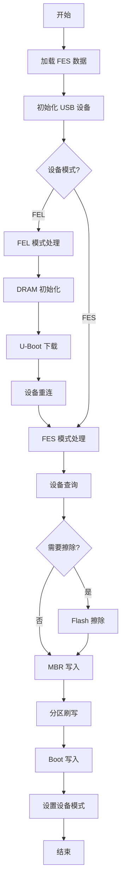
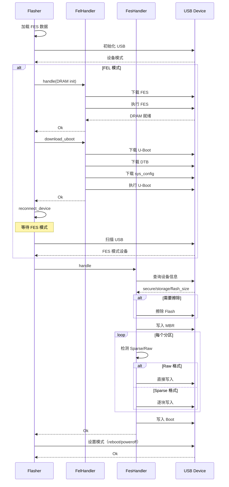

## 概述

Flash 模块是 OpenixCLI 的核心刷写引擎，负责协调 FEL（USB Boot）和 FES（U-Boot）两种模式的固件刷写流程。它处理设备检测、DRAM 初始化、U-Boot 下载、设备重连、分区刷写、Boot 写入等完整流程，是嵌入式固件刷写的典型实现。

### 模块结构

```
src/flash/
├── mod.rs                  # Flasher 主控制器
├── fel_handler/            # FEL 模式处理
│   ├── mod.rs              # FelHandler 入口
│   ├── dram_init.rs        # DRAM 初始化
│   └── uboot_download.rs   # U-Boot 下载
└── fes_handler/            # FES 模式处理
    ├── mod.rs              # FesHandler 入口
    ├── constants.rs        # 常量定义
    ├── erase_flag.rs       # Flash 擦除
    ├── mbr_download.rs     # MBR 写入
    ├── ubifs_config.rs     # UBIFS 配置
    ├── boot_download.rs    # Boot 写入
    ├── types.rs            # PartitionDownloadInfo
    └── partition/          # 分区刷写
        ├── mod.rs
        ├── mod_impl.rs
        ├── raw_download.rs
        └── sparse_parser.rs
```

---

## 核心数据结构

### FlashMode 枚举

```rust
/// 刷写模式
#[derive(Debug, Clone, Copy, PartialEq)]
pub enum FlashMode {
    /// 仅刷写指定分区
    Partition,

    /// 保留现有数据（跳过 udisk/private 等分区）
    KeepData,

    /// 刷写前擦除分区
    PartitionErase,

    /// 刷写前完全擦除
    FullErase,
}

impl FlashMode {
    /// 获取擦除标志
    pub fn erase_flag(&self) -> u32 {
        match self {
            FlashMode::Partition => 0x0,
            FlashMode::KeepData => 0x0,
            FlashMode::PartitionErase => 0x1,
            FlashMode::FullErase => 0x12,
        }
    }
}
```

### FlashOptions 结构

```rust
/// 刷写选项配置
#[derive(Debug, Clone)]
pub struct FlashOptions {
    /// USB 总线号（可选）
    pub bus: Option<u8>,

    /// USB 端口号（可选）
    pub port: Option<u8>,

    /// 是否验证写入
    pub verify: bool,

    /// 刷写模式
    pub mode: FlashMode,

    /// 要刷写的分区列表（可选）
    pub partitions: Option<Vec<String>>,

    /// 刷写后的操作
    pub post_action: String,
}
```

### Flasher 主控制器

```rust
/// Flash 主控制器
///
/// 协调 FEL 初始化、FES 处理、分区刷写
pub struct Flasher {
    /// 固件解析器
    packer: OpenixPacker,

    /// 刷写选项
    options: FlashOptions,

    /// 日志器
    logger: Logger,
}
```

### PartitionDownloadInfo 结构

```rust
/// 分区下载信息
pub struct PartitionDownloadInfo {
    /// 分区名称
    pub partition_name: String,

    /// 分区起始地址
    pub partition_address: u64,

    /// 下载文件名
    pub download_filename: String,

    /// 下载 SubType
    pub download_subtype: String,

    /// 数据偏移（固件内）
    pub data_offset: u64,

    /// 数据长度
    pub data_length: u64,
}
```

---

## FEL vs FES 模式对比

### 设备模式识别

```rust
// 获取设备模式
let mode = ctx.get_device_mode();
let has_fel = mode == libefex::DeviceMode::Fel;
```

### 流程差异

| 阶段        | FEL 模式 | FES 模式                 |
| ----------- | -------- | ------------------------ |
| DRAM 初始化 | 需要     | 不需要（已在 U-Boot 中） |
| U-Boot 下载 | 需要     | 不需要（已运行）         |
| 设备重连    | 需要     | 不需要                   |
| 设备查询    | 需要     | 需要                     |
| Flash 擦除  | 可选     | 可选                     |
| MBR 写入    | 需要     | 需要                     |
| 分区刷写    | 需要     | 需要                     |
| Boot 写入   | 需要     | 需要                     |
| 设备重启    | 需要     | 需要                     |

---

## Flasher::execute 主流程

### 完整刷写流程

```rust
/// 执行刷写流程
pub async fn execute(&mut self) -> FlashResult<()> {
    // 1. 加载 FES 数据（DRAM 初始化脚本）
    let fes_data = self.packer.get_fes()?;

    // 2. 初始化 USB 设备
    let mut ctx = self.init_device()?;

    // 3. 获取设备模式
    let mode = ctx.get_device_mode();
    let has_fel = mode == libefex::DeviceMode::Fel;

    // 4. 根据模式定义进度阶段
    if has_fel {
        let stages = FlashStages::for_fel_mode();  // 10 个阶段
        self.logger.define_stages(stages.stages());
    } else {
        let stages = FlashStages::for_fes_mode();  // 7 个阶段
        self.logger.define_stages(stages.stages());
    }

    self.logger.start_global_progress();

    // 5. 初始化阶段
    self.logger.begin_stage(StageType::Init);
    self.logger.info(&format!("FES data loaded ({} bytes)", fes_data.len()));
    self.logger.complete_stage();

    // 6. FEL 模式处理（如果需要）
    if has_fel {
        // DRAM 初始化
        self.logger.begin_stage(StageType::FelDram);
        let fel_handler = FelHandler::new(&self.logger);
        fel_handler.handle(&mut ctx, &fes_data).await?;
        self.logger.complete_stage();

        // U-Boot 下载
        self.logger.begin_stage(StageType::FelUboot);
        let uboot_data = self.packer.get_uboot()?;
        let dtb_data = self.packer.get_dtb().ok();
        let sysconfig_data = self.packer.get_sys_config_bin()?;
        let board_config_data = self.packer.get_board_config().ok();

        fel_handler.download_uboot(
            &ctx,
            &uboot_data,
            dtb_data.as_deref(),
            &sysconfig_data,
            board_config_data.as_deref(),
        ).await?;
        self.logger.complete_stage();

        // 设备重连（等待 FES 模式）
        self.logger.begin_stage(StageType::FelReconnect);
        ctx = self.reconnect_device().await?;
        self.logger.complete_stage();
    }

    // 7. FES 模式处理
    let mut fes_handler = FesHandler::new(&mut self.logger);
    fes_handler.handle(&ctx, &mut self.packer, &self.options).await?;

    // 8. 结束进度追踪
    self.logger.finish_progress();

    // 9. 设置设备模式（重启/关机）
    self.set_device_mode(&ctx).await?;

    Ok(())
}
```

### 流程图



---

## FEL Handler 详解

### FelHandler 结构

```rust
/// FEL 处理器（处理 USB Boot 模式设备）
pub struct FelHandler<'a> {
    logger: &'a Logger,
}

impl<'a> FelHandler<'a> {
    pub fn new(logger: &'a Logger) -> Self {
        Self { logger }
    }

    /// 处理 FEL 模式操作
    pub async fn handle(
        &self,
        ctx: &mut libefex::Context,
        fes_data: &[u8],
    ) -> FlashResult<()> {
        let dram_init = DramInit::new(self.logger);
        dram_init.execute(ctx, fes_data).await
    }

    /// 下载 U-Boot
    pub async fn download_uboot(
        &self,
        ctx: &libefex::Context,
        uboot_data: &[u8],
        dtb_data: Option<&[u8]>,
        sysconfig_data: &[u8],
        board_config_data: Option<&[u8]>,
    ) -> FlashResult<()> {
        let uboot_download = UbootDownload::new(self.logger);
        uboot_download.execute(ctx, uboot_data, dtb_data, sysconfig_data, board_config_data).await
    }
}
```

### DRAM 初始化流程

DRAM 初始化使用 FES 数据（Flash Eraser Script）通过 USB 下载到设备内存：

```rust
/// DRAM 初始化器
pub struct DramInit<'a> {
    logger: &'a Logger,
}

impl<'a> DramInit<'a> {
    pub async fn execute(
        &self,
        ctx: &mut libefex::Context,
        fes_data: &[u8],
    ) -> FlashResult<()> {
        // 1. 解析 Boot0 头
        let boot0_header = Boot0Header::parse(fes_data)?;

        // 2. 验证魔数
        if boot0_header.magic_str() != BOOT0_MAGIC {
            return Err(FlashError::DramInitFailed);
        }

        // 3. 获取运行地址
        let run_addr = boot0_header.run_addr;

        // 4. 下载 FES 到指定地址
        ctx.fel_download(fes_data, run_addr)?;

        // 5. 执行 FES（初始化 DRAM）
        ctx.fel_run(run_addr)?;

        // 6. 等待 DRAM 初始化完成
        self.wait_for_dram_init(ctx).await?;

        Ok(())
    }
}
```

### U-Boot 下载流程

```rust
/// U-Boot 下载器
pub struct UbootDownload<'a> {
    logger: &'a Logger,
}

impl<'a> UbootDownload<'a> {
    pub async fn execute(
        &self,
        ctx: &libefex::Context,
        uboot_data: &[u8],
        dtb_data: Option<&[u8]>,
        sysconfig_data: &[u8],
        board_config_data: Option<&[u8]>,
    ) -> FlashResult<()> {
        // 1. 解析 U-Boot 头
        let uboot_header = UBootHeader::parse(uboot_data)?;

        // 2. 设置工作模式为 USB 产品模式
        UBootHeader::set_work_mode(uboot_data, WORK_MODE_USB_PRODUCT);

        // 3. 计算下载地址
        let run_addr = uboot_header.uboot_head.run_addr;
        let uboot_length = uboot_header.uboot_head.uboot_length;

        // 4. 下载 U-Boot
        ctx.fel_download(uboot_data, run_addr)?;

        // 5. 下载 DTB（如果有）
        if let Some(dtb) = dtb_data {
            let dtb_addr = run_addr + uboot_length;
            ctx.fel_download(dtb, dtb_addr)?;
        }

        // 6. 下载 sys_config
        let sysconfig_addr = run_addr + uboot_length + dtb_data.len();
        ctx.fel_download(sysconfig_data, sysconfig_addr)?;

        // 7. 下载 board_config（如果有）
        if let Some(board_config) = board_config_data {
            let board_addr = sysconfig_addr + sysconfig_data.len();
            ctx.fel_download(board_config, board_addr)?;
        }

        // 8. 执行 U-Boot
        ctx.fel_run(run_addr)?;

        Ok(())
    }
}
```

### 内存布局

```
┌─────────────────────────────────────────────────────────────┐
│                    设备内存布局                               │
├─────────────────────────────────────────────────────────────┤
│ run_addr                                                    │
│ ┌─────────────────────────────────────────────────────────┐ │
│ │              U-Boot (uboot_length bytes)                │ │
│ └─────────────────────────────────────────────────────────┘ │
│ run_addr + uboot_length                                     │
│ ┌─────────────────────────────────────────────────────────┐ │
│ │              DTB (variable size)                        │ │
│ └─────────────────────────────────────────────────────────┘ │
│ run_addr + uboot_length + dtb_len                           │
│ ┌─────────────────────────────────────────────────────────┐ │
│ │              sys_config_bin (variable size)              │ │
│ └─────────────────────────────────────────────────────────┘ │
│ run_addr + uboot_length + dtb_len + sysconfig_len            │
│ ┌─────────────────────────────────────────────────────────┐ │
│ │              board_config (optional)                     │ │
│ └─────────────────────────────────────────────────────────┘ │
└─────────────────────────────────────────────────────────────┘
```

### 设备重连机制

```rust
/// 重连设备（等待 FES 模式）
async fn reconnect_device(&self) -> FlashResult<libefex::Context> {
    // 等待 2 秒让设备启动
    tokio::time::sleep(Duration::from_secs(2)).await;

    let max_retries = 25;  // 最多尝试 25 次
    let mut retries = 0;

    while retries < max_retries {
        tokio::time::sleep(Duration::from_secs(1)).await;

        // 扫描 USB 设备
        let devices = libefex::Context::scan_usb_devices()?;

        for dev in devices {
            let mut new_ctx = libefex::Context::new();
            if new_ctx.scan_usb_device_at(dev.bus, dev.port).is_err() {
                continue;
            }
            if new_ctx.usb_init().is_err() {
                continue;
            }
            if new_ctx.efex_init().is_err() {
                continue;
            }

            // 检查是否为 FES/Srv 模式
            if new_ctx.get_device_mode() == libefex::DeviceMode::Srv {
                self.logger.debug(&format!(
                    "Device found at bus {}, port {}",
                    dev.bus, dev.port
                ));
                return Ok(new_ctx);
            }
        }

        retries += 1;
        self.logger.debug(&format!("Reconnect attempt {}/{}", retries, max_retries));
    }

    Err(FlashError::ReconnectFailed)
}
```

---

## FES Handler 详解

### FesHandler 结构

```rust
/// FES 处理器（处理 U-Boot 模式设备）
pub struct FesHandler<'a> {
    logger: &'a mut Logger,
}

impl<'a> FesHandler<'a> {
    pub fn new(logger: &'a mut Logger) -> Self {
        Self { logger }
    }

    /// 处理 FES 模式操作
    pub async fn handle(
        &mut self,
        ctx: &libefex::Context,
        packer: &mut OpenixPacker,
        options: &FlashOptions,
    ) -> FlashResult<()> {
        // 1. 设备查询
        self.logger.begin_stage(StageType::FesQuery);
        let secure = ctx.fes_query_secure()?;
        let storage_type = ctx.fes_query_storage()?;
        let flash_size = ctx.fes_probe_flash_size()?;
        self.logger.complete_stage();

        // 2. Flash 擦除（如果需要）
        if options.mode != FlashMode::Partition {
            self.logger.begin_stage(StageType::FesErase);
            let erase_flag = EraseFlag::new(&*self.logger);
            erase_flag.execute(ctx, options.mode).await?;
            self.logger.complete_stage();
        }

        // 3. MBR 写入
        self.logger.begin_stage(StageType::FesMbr);
        let mbr_data = packer.get_mbr()?;
        let mbr = SunxiMbr::parse(&mbr_data)?;
        let download_list = self.prepare_partition_download_list(packer, &mbr_info, options)?;

        // UBIFS 配置
        let ubifs_config = UbifsConfig::new(&*self.logger);
        ubifs_config.execute(ctx, packer, &download_list, storage_type)?;

        // MBR 下载
        let mbr_download = MbrDownload::new(&*self.logger);
        mbr_download.execute(ctx, &mbr_data).await?;
        self.logger.complete_stage();

        // 4. 分区刷写
        if !download_list.is_empty() {
            self.logger.begin_stage(StageType::FesPartitions);
            let total_bytes: u64 = download_list.iter().map(|p| p.data_length).sum();
            self.logger.set_partition_stage_weight(total_bytes);

            let mut partition_download = PartitionDownload::new(&mut *self.logger);
            partition_download.execute(ctx, packer, &download_list, options.verify).await?;
            self.logger.complete_stage();

            // 5. Boot 写入
            self.logger.begin_stage(StageType::FesBoot);
            let boot_download = BootDownload::new(&*self.logger);
            boot_download.execute(ctx, packer, secure, storage_type).await?;
            self.logger.complete_stage();
        }

        Ok(())
    }
}
```

### 分区下载列表准备

```rust
/// 准备分区下载列表
fn prepare_partition_download_list(
    &self,
    packer: &mut OpenixPacker,
    mbr_info: &MbrInfo,
    options: &FlashOptions,
) -> FlashResult<Vec<PartitionDownloadInfo>> {
    // 解析 sys_partition 配置
    let mut partition_parser = OpenixPartition::new();
    if let Ok(data) = packer.get_sys_partition() {
        partition_parser.parse_from_data(&data);
    }

    let mut download_list = Vec::new();

    for mbr_partition in &mbr_info.partitions {
        let partition_name = &mbr_partition.name;

        // KeepData 模式：跳过用户数据分区
        if options.mode == FlashMode::KeepData {
            let name_lower = partition_name.to_lowercase();
            if name_lower == "udisk" || name_lower == "private" || name_lower == "reserve" {
                self.logger.info(&format!("Skipping user data partition: {}", partition_name));
                continue;
            }
        }

        // Partition 模式：仅刷写指定分区
        if options.mode == FlashMode::Partition {
            if let Some(ref partitions) = options.partitions {
                if !partitions.iter().any(|p| p == partition_name) {
                    continue;
                }
            }
        }

        // 查找下载文件
        let config_partition = config_partitions.iter().find(|p| p.name == *partition_name);
        let download_filename = config_partition?.downloadfile.clone();

        // 构建 SubType
        let download_subtype = packer.build_subtype_by_filename(&download_filename);

        // 查找固件中的数据位置
        let data_info = packer
            .get_file_info_by_maintype_subtype("ITEM_ROOTFSFAT16", &download_subtype)
            .or_else(|| packer.get_file_info_by_maintype_subtype("12345678", &download_subtype))
            .or_else(|| packer.get_file_info_by_filename(&download_filename));

        if let Some((offset, length)) = data_info {
            download_list.push(PartitionDownloadInfo {
                partition_name: partition_name.clone(),
                partition_address: mbr_partition.address(),
                download_filename,
                download_subtype,
                data_offset: offset,
                data_length: length,
            });
        }
    }

    Ok(download_list)
}
```

---

## 分区刷写流程

### Raw vs Sparse 格式检测

```rust
/// 分区下载器
pub struct PartitionDownload<'a> {
    logger: &'a mut Logger,
}

impl<'a> PartitionDownload<'a> {
    pub async fn execute(
        &mut self,
        ctx: &libefex::Context,
        packer: &mut OpenixPacker,
        download_list: &[PartitionDownloadInfo],
        verify: bool,
    ) -> FlashResult<()> {
        for partition_info in download_list {
            self.logger.set_current_partition(&partition_info.partition_name);

            // 获取分区数据
            let partition_data = packer.read_data_at_offset(
                partition_info.data_offset as u32,
                partition_info.data_length as u32,
            )?;

            // 检测格式
            if is_sparse_format(&partition_data) {
                // Sparse 格式：解析后逐块下载
                self.download_sparse(ctx, &partition_info, &partition_data, verify).await?;
            } else {
                // Raw 格式：直接下载
                self.download_raw(ctx, &partition_info, &partition_data, verify).await?;
            }
        }

        Ok(())
    }
}
```

### Raw 格式下载

```rust
/// 下载 Raw 格式分区
async fn download_raw(
    &self,
    ctx: &libefex::Context,
    partition_info: &PartitionDownloadInfo,
    data: &[u8],
    verify: bool,
) -> FlashResult<()> {
    let address = partition_info.partition_address;
    let length = data.len();

    // 分块下载（每次 8KB 或更大）
    let chunk_size = 8 * 1024;
    let mut offset = 0;

    while offset < length {
        let chunk_end = (offset + chunk_size).min(length);
        let chunk = &data[offset..chunk_end];

        // 写入数据
        ctx.fes_write(address + offset as u64, chunk)?;

        // 更新进度
        self.logger.update_progress_with_speed(chunk_end as u64);

        offset = chunk_end;
    }

    // 验证（如果启用）
    if verify {
        self.verify_partition(ctx, partition_info, data)?;
    }

    Ok(())
}
```

### Sparse 格式下载

```rust
/// 下载 Sparse 格式分区
async fn download_sparse(
    &self,
    ctx: &libefex::Context,
    partition_info: &PartitionDownloadInfo,
    data: &[u8],
    verify: bool,
) -> FlashResult<()> {
    let header = SparseHeader::parse(data)?;
    let base_address = partition_info.partition_address;

    let mut chunk_offset = SPARSE_HEADER_SIZE;
    let mut output_offset = 0u64;

    for _ in 0..header.total_chunks {
        let chunk_header = ChunkHeader::parse(&data[chunk_offset..])?;

        match chunk_header.chunk_type {
            CHUNK_TYPE_RAW => {
                // 原始数据块：直接写入
                let chunk_data = &data[chunk_offset + CHUNK_HEADER_SIZE..];
                let write_address = base_address + output_offset * SECTOR_SIZE;

                ctx.fes_write(write_address, chunk_data)?;
                self.logger.update_progress_with_speed(output_offset);
            }

            CHUNK_TYPE_FILL => {
                // 填充块：写入重复值
                let fill_value = u32::from_le_bytes([
                    data[chunk_offset + CHUNK_HEADER_SIZE],
                    data[chunk_offset + CHUNK_HEADER_SIZE + 1],
                    data[chunk_offset + CHUNK_HEADER_SIZE + 2],
                    data[chunk_offset + CHUNK_HEADER_SIZE + 3],
                ]);

                ctx.fes_write_fill(base_address + output_offset * SECTOR_SIZE, fill_value, chunk_header.chunk_sz)?;
            }

            CHUNK_TYPE_DONT_CARE => {
                // 空块：跳过
            }

            CHUNK_TYPE_CRC32 => {
                // CRC32 块：验证
            }
        }

        output_offset += chunk_header.chunk_sz as u64;
        chunk_offset += chunk_header.total_sz as usize;
    }

    Ok(())
}
```

---

## Boot 写入流程

```rust
/// Boot 镜像下载器
pub struct BootDownload<'a> {
    logger: &'a Logger,
}

impl<'a> BootDownload<'a> {
    pub async fn execute(
        &self,
        ctx: &libefex::Context,
        packer: &mut OpenixPacker,
        secure: u32,
        storage_type: u32,
    ) -> FlashResult<()> {
        // 根据启动模式和存储类型选择 Boot 镜像
        let boot_data = match secure {
            BOOT_FILE_MODE_PKG => {
                packer.get_image_data_by_name("bootpkg")?
            }
            BOOT_FILE_MODE_NORMAL => {
                match StorageType::from(storage_type) {
                    StorageType::Spinor => packer.get_image_data_by_name("boot0_nor")?,
                    _ => packer.get_image_data_by_name("boot0_card")?,
                }
            }
            _ => return Ok(()),
        };

        // 写入 Boot 镜像
        ctx.fes_write_boot(boot_data)?;

        self.logger.info(&format!("Boot written ({} bytes)", boot_data.len()));

        Ok(())
    }
}
```

---

## 设备模式设置

```rust
/// 设置设备模式（重启/关机）
async fn set_device_mode(&self, ctx: &libefex::Context) -> FlashResult<()> {
    let tool_mode = match self.options.post_action.as_str() {
        "reboot" => libefex::FesToolMode::Reboot,
        "poweroff" => libefex::FesToolMode::PowerOff,
        "shutdown" => libefex::FesToolMode::PowerOff,
        _ => libefex::FesToolMode::Reboot,
    };

    ctx.fes_tool_mode(libefex::FesToolMode::Normal, tool_mode)?;

    Ok(())
}
```

---

## 代码亮点

### 1. 异步重连机制

```rust
async fn reconnect_device(&self) -> FlashResult<libefex::Context> {
    tokio::time::sleep(Duration::from_secs(2)).await;  // 等待设备启动

    let max_retries = 25;
    while retries < max_retries {
        tokio::time::sleep(Duration::from_secs(1)).await;  // 每秒尝试一次
        // ... 扫描和初始化 ...
    }
}
```

### 2. 模式动态选择

```rust
if has_fel {
    let stages = FlashStages::for_fel_mode();  // 10 个阶段
} else {
    let stages = FlashStages::for_fes_mode();  // 7 个阶段
}
```

### 3. 分区过滤逻辑

```rust
// KeepData 模式保护用户数据
if options.mode == FlashMode::KeepData {
    if name_lower == "udisk" || name_lower == "private" {
        continue;  // 跳过
    }
}

// Partition 模式仅刷写指定分区
if options.mode == FlashMode::Partition {
    if !partitions.iter().any(|p| p == partition_name) {
        continue;  // 跳过
    }
}
```

### 4. Sparse 格式块处理

```rust
match chunk_header.chunk_type {
    CHUNK_TYPE_RAW => ctx.fes_write(address, chunk_data)?,
    CHUNK_TYPE_FILL => ctx.fes_write_fill(address, fill_value, size)?,
    CHUNK_TYPE_DONT_CARE => { /* 跳过 */ },
    CHUNK_TYPE_CRC32 => { /* 验证 */ },
}
```

---

## 完整刷写流程图


