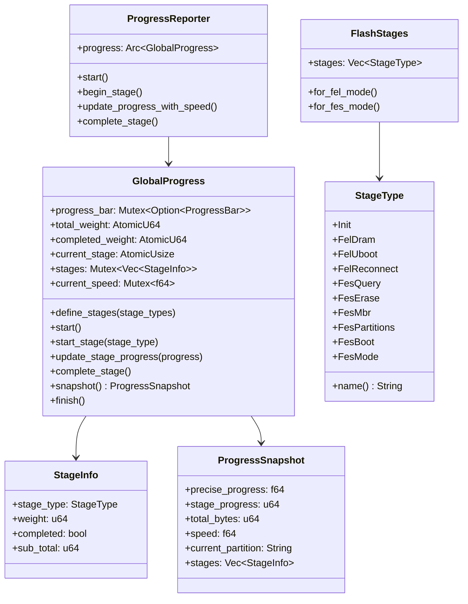

## 概述

固件刷写是一个多阶段的复杂过程，涉及设备检测、DRAM 初始化、U-Boot 下载、分区刷写等步骤。OpenixCLI 的 Process 模块提供全局进度追踪系统，使用原子操作实现线程安全的状态管理，同时支持 CLI 进度条和 TUI 实时轮询两种模式。

### 模块结构

```
src/process/
├── mod.rs           # 模块导出
├── global_progress.rs # GlobalProgress 核心实现
├── stages.rs        # FlashStages 阶段定义
└── reporter.rs      # ProgressReporter 简化封装
```

### 核心导出

```rust
pub use global_progress::{multi_progress, StageType};
pub use reporter::ProgressReporter;
pub use stages::FlashStages;
```

---

## 架构与依赖

### 双模式进度显示

| 模式 | 进度显示              | 状态同步 | 适用场景   |
| ---- | --------------------- | -------- | ---------- |
| CLI  | indicatif ProgressBar | 实时更新 | 命令行刷写 |
| TUI  | ProgressSnapshot 轮询 | 定时获取 | 交互界面   |

### 模块依赖关系

```
Process Module
├── indicatif (外部 crate) - 进度条
├── once_cell (外部 crate) - 全局状态延迟初始化
├── std::sync::atomic - AtomicU64/AtomicBool 线程安全计数器
├── std::sync::Mutex - 复合类型互斥保护
└── std::time::Instant - 速度计算时间戳
```

---

## 核心数据结构

### StageType 阶段枚举

定义刷写过程中的所有阶段：

```rust
/// 刷写操作阶段类型
#[derive(Debug, Clone, Copy, PartialEq, Eq)]
pub enum StageType {
    /// 初始化阶段
    Init,

    /// FEL 模式 DRAM 初始化
    FelDram,

    /// FEL 模式 U-Boot 下载
    FelUboot,

    /// FEL 后设备重连
    FelReconnect,

    /// FES 模式设备查询
    FesQuery,

    /// Flash 擦除
    FesErase,

    /// MBR 写入
    FesMbr,

    /// 分区刷写
    FesPartitions,

    /// Boot 镜像写入
    FesBoot,

    /// 设置设备模式（重启/关机）
    FesMode,
}

impl StageType {
    /// 获取阶段名称
    pub fn name(&self) -> &'static str {
        match self {
            StageType::Init => "Initializing",
            StageType::FelDram => "DRAM Init",
            StageType::FelUboot => "U-Boot Download",
            StageType::FelReconnect => "Reconnecting",
            StageType::FesQuery => "Query Device",
            StageType::FesErase => "Erasing",
            StageType::FesMbr => "Writing MBR",
            StageType::FesPartitions => "Flashing Partitions",
            StageType::FesBoot => "Writing Boot",
            StageType::FesMode => "Setting Mode",
        }
    }
}
```

### GlobalProgress 结构

全局进度追踪器，使用原子类型实现线程安全：

```rust
/// 全局进度追踪器
pub struct GlobalProgress {
    /// indicatif 进度条（CLI 模式）
    progress_bar: Mutex<Option<ProgressBar>>,

    /// 总权重（百分比基准）
    total_weight: AtomicU64,

    /// 已完成权重
    completed_weight: AtomicU64,

    /// 当前阶段索引
    current_stage: AtomicUsize,

    /// 阶段内进度（字节）
    stage_progress: AtomicU64,

    /// 分区总字节数
    total_bytes: AtomicU64,

    /// 全局已写入字节数
    global_written_bytes: AtomicU64,

    /// 阶段信息列表
    stages: Mutex<Vec<StageInfo>>,

    /// 是否已启动（0=未启动，1=已启动）
    started: AtomicUsize,

    /// 当前分区名称
    current_partition: Mutex<String>,

    /// 上次更新时间（速度计算）
    last_update_time: Mutex<Option<Instant>>,

    /// 上次更新的字节数
    last_update_bytes: AtomicU64,

    /// 当前传输速度
    current_speed: Mutex<f64>,

    /// 精确进度百分比
    precise_progress: Mutex<f64>,
}
```

### StageInfo 结构

```rust
/// 阶段信息
#[derive(Debug, Clone)]
pub struct StageInfo {
    /// 阶段类型
    pub stage_type: StageType,

    /// 阶段权重（百分比）
    pub weight: u64,

    /// 是否已完成
    pub completed: bool,

    /// 子任务总量（字节）
    pub sub_total: u64,
}
```

### ProgressSnapshot 结构

用于 TUI 模式定时轮询进度状态：

```rust
/// 进度状态快照（供 TUI 轮询）
pub struct ProgressSnapshot {
    /// 精确进度百分比
    pub precise_progress: f64,

    /// 阶段内进度
    pub stage_progress: u64,

    /// 总字节数
    pub total_bytes: u64,

    /// 当前速度
    pub speed: f64,

    /// 当前分区名称
    pub current_partition: String,

    /// 当前阶段索引
    pub current_stage_index: usize,

    /// 阶段信息列表
    pub stages: Vec<StageInfo>,
}
```

---

## 全局状态管理

### 全局实例

```rust
use once_cell::sync::Lazy;
use std::sync::Arc;

/// 全局 MultiProgress 实例（indicatif）
static MULTI_PROGRESS: Lazy<Arc<MultiProgress>> =
    Lazy::new(|| Arc::new(MultiProgress::new()));

/// 获取 MultiProgress 实例
pub fn multi_progress() -> Arc<MultiProgress> {
    Arc::clone(&MULTI_PROGRESS)
}

/// 全局进度追踪器实例
static GLOBAL_PROGRESS: Lazy<Arc<GlobalProgress>> =
    Lazy::new(|| Arc::new(GlobalProgress::new()));

/// 获取全局进度追踪器
pub fn global_progress() -> Arc<GlobalProgress> {
    Arc::clone(&GLOBAL_PROGRESS)
}
```

### TUI 模式控制

```rust
/// TUI 模式标志
static TUI_MODE: AtomicBool = AtomicBool::new(false);

/// 设置 TUI 模式
pub fn set_tui_mode(enabled: bool) {
    TUI_MODE.store(enabled, Ordering::SeqCst);
}

/// 检查是否为 TUI 模式
pub fn is_tui_mode() -> bool {
    TUI_MODE.load(Ordering::SeqCst)
}
```

---

## FlashStages 阶段序列

### FEL 模式阶段序列

```rust
/// FEL 模式阶段（USB 启动）
pub fn for_fel_mode() -> Self {
    let mut instance = Self::new();
    instance.stages = vec![
        StageType::Init,           // 初始化
        StageType::FelDram,        // DRAM 初始化
        StageType::FelUboot,       // U-Boot 下载
        StageType::FelReconnect,   // 设备重连
        StageType::FesQuery,       // 设备查询
        StageType::FesErase,       // Flash 擦除
        StageType::FesMbr,         // MBR 写入
        StageType::FesPartitions,  // 分区刷写
        StageType::FesBoot,        // Boot 写入
        StageType::FesMode,        // 设置模式
    ];
    instance
}
```

### FES 模式阶段序列

```rust
/// FES 模式阶段（U-Boot）
pub fn for_fes_mode() -> Self {
    let mut instance = Self::new();
    instance.stages = vec![
        StageType::Init,           // 初始化
        StageType::FesQuery,       // 设备查询
        StageType::FesErase,       // Flash 擦除
        StageType::FesMbr,         // MBR 写入
        StageType::FesPartitions,  // 分区刷写
        StageType::FesBoot,        // Boot 写入
        StageType::FesMode,        // 设置模式
    ];
    instance
}
```

---

## 阶段进度计算

### 预定义权重分配

```rust
/// 定义阶段（设置权重百分比）
pub fn define_stages(&self, stage_types: &[StageType]) {
    let mut stages = self.stages.lock().unwrap();
    stages.clear();

    let mut cumulative_percent = 0u64;
    for stage_type in stage_types {
        // 每个阶段占用的百分比
        let end_percent = match stage_type {
            StageType::Init => 3,            // 0-3%
            StageType::FelDram => 5,         // 3-5%
            StageType::FelUboot => 8,        // 5-8%
            StageType::FelReconnect => 10,   // 8-10%
            StageType::FesQuery => 12,       // 10-12%
            StageType::FesErase => 14,       // 12-14%
            StageType::FesMbr => 20,         // 14-20%
            StageType::FesPartitions => 100, // 20-100% (主要阶段)
            StageType::FesBoot => 100,       // 同上
            StageType::FesMode => 100,       // 同上
        };

        stages.push(StageInfo {
            stage_type: *stage_type,
            weight: end_percent - cumulative_percent,
            completed: false,
            sub_total: 0,
        });
        cumulative_percent = end_percent;
    }

    self.total_weight.store(100, Ordering::SeqCst);
    self.completed_weight.store(0, Ordering::SeqCst);
    self.current_stage.store(0, Ordering::SeqCst);
}
```

### 分区阶段权重动态设置

```rust
/// 设置分区刷写阶段的权重（基于总字节数）
pub fn set_partition_stage_weight(&self, total_bytes: u64) {
    let current = self.current_stage.load(Ordering::SeqCst);
    let mut stages = self.stages.lock().unwrap();

    if current < stages.len() && stages[current].stage_type == StageType::FesPartitions {
        // 计算已完成的权重
        let completed_weight: u64 = stages
            .iter()
            .filter(|s| s.completed)
            .map(|s| s.weight)
            .sum();

        // 设置分区阶段权重为 80%（从 20% 到 100%）
        stages[current].weight = 80;
        stages[current].sub_total = total_bytes;

        self.completed_weight.store(completed_weight, Ordering::SeqCst);
        self.total_bytes.store(total_bytes, Ordering::SeqCst);
        self.stage_progress.store(0, Ordering::SeqCst);
        self.global_written_bytes.store(0, Ordering::SeqCst);
    }
}
```

### 进度计算公式

```
总进度 = completed_weight + (stage_progress / sub_total) * stage_weight

其中：
- completed_weight: 已完成阶段的权重总和
- stage_progress: 当前阶段内进度（字节）
- sub_total: 当前阶段总字节数
- stage_weight: 当前阶段权重
```

---

## 速度计算机制

```rust
/// 更新进度并计算速度
pub fn update_stage_progress_with_speed(&self, progress: u64) {
    let now = Instant::now();
    let mut last_time = self.last_update_time.lock().unwrap();
    let last_bytes = self.last_update_bytes.load(Ordering::SeqCst);

    if let Some(last) = *last_time {
        let elapsed = now.duration_since(last).as_secs_f64();
        if elapsed > 0.0 {
            // 计算速度 = 字节差 / 时间差
            let bytes_diff = progress.saturating_sub(last_bytes);
            let speed = bytes_diff as f64 / elapsed;
            *self.current_speed.lock().unwrap() = speed;
        }
    }

    // 更新时间戳和字节计数
    *last_time = Some(now);
    self.last_update_bytes.store(progress, Ordering::SeqCst);

    // 更新进度
    self.update_stage_progress(progress);

    // 更新显示消息
    self.update_progress_message();
}
```

### 速度显示格式化

```rust
/// 更新进度消息
pub fn update_progress_message(&self) {
    let partition = self.current_partition.lock().unwrap();
    let speed = *self.current_speed.lock().unwrap();
    let progress = self.stage_progress.load(Ordering::SeqCst);
    let total = self.total_bytes.load(Ordering::SeqCst);

    // 格式化速度
    let speed_str = if speed > 1024.0 * 1024.0 {
        format!("{:.2} MB/s", speed / (1024.0 * 1024.0))
    } else if speed > 1024.0 {
        format!("{:.2} KB/s", speed / 1024.0)
    } else {
        format!("{:.0} B/s", speed)
    };

    // 格式化进度
    let progress_str = if total > 0 {
        let progress_mb = progress as f64 / (1024.0 * 1024.0);
        let total_mb = total as f64 / (1024.0 * 1024.0);
        format!("{:.1}/{:.1} MB", progress_mb, total_mb)
    } else {
        String::new()
    };

    // 组合消息
    let message = if partition.is_empty() {
        format!("{} {}", speed_str, progress_str)
    } else {
        format!("[{}] {} {}", partition, speed_str, progress_str)
    };

    if let Some(pb) = self.progress_bar.lock().unwrap().as_ref() {
        pb.set_message(message);
    }
}
```

---

## TUI 模式快照机制

```rust
/// 获取进度状态快照（供 TUI 轮询）
pub fn snapshot(&self) -> ProgressSnapshot {
    let stages = self.stages.lock().unwrap().clone();
    let partition = self.current_partition.lock().unwrap().clone();
    let speed = *self.current_speed.lock().unwrap();
    let precise = *self.precise_progress.lock().unwrap();

    ProgressSnapshot {
        precise_progress: precise,
        stage_progress: self.stage_progress.load(Ordering::SeqCst),
        total_bytes: self.total_bytes.load(Ordering::SeqCst),
        speed,
        current_partition: partition,
        current_stage_index: self.current_stage.load(Ordering::SeqCst),
        stages,
    }
}
```

**TUI 中的使用方式：**

```rust
// TUI 每帧轮询进度
let snapshot = global_progress().snapshot();

// 使用快照数据渲染界面
app.progress = snapshot.precise_progress;
app.current_partition = snapshot.current_partition;
app.speed = format_speed(snapshot.speed);
app.stages = snapshot.stages;
```

---

## ProgressReporter 封装

```rust
/// ProgressReporter - GlobalProgress 的简化封装
pub struct ProgressReporter {
    progress: Arc<GlobalProgress>,
}

impl ProgressReporter {
    pub fn new() -> Self {
        Self {
            progress: global_progress(),
        }
    }

    /// 启动进度追踪
    pub fn start(&self) {
        self.progress.start();
    }

    /// 定义阶段
    pub fn define_stages(&self, stages: &[StageType]) {
        self.progress.define_stages(stages);
    }

    /// 开始阶段
    pub fn begin_stage(&self, stage_type: StageType) {
        self.progress.start_stage(stage_type);
    }

    /// 设置分区权重
    pub fn set_partition_stage_weight(&self, total_bytes: u64) {
        self.progress.set_partition_stage_weight(total_bytes);
    }

    /// 设置当前分区名称
    pub fn set_current_partition(&self, partition_name: &str) {
        self.progress.set_current_partition(partition_name);
    }

    /// 更新进度（带速度计算）
    pub fn update_progress_with_speed(&self, current: u64) {
        self.progress.update_stage_progress_with_speed(current);
    }

    /// 完成当前阶段
    pub fn complete_stage(&self) {
        self.progress.complete_stage();
    }

    /// 结束进度追踪
    pub fn finish(&self) {
        self.progress.finish();
    }
}
```

---

## 调用流程分析

### 刷写流程中的进度更新

```rust
impl Flasher {
    pub async fn execute(&self) -> FlashResult<()> {
        let logger = Logger::new();

        // 1. 根据设备模式选择阶段序列
        let stages = if is_fel_mode {
            FlashStages::for_fel_mode()
        } else {
            FlashStages::for_fes_mode()
        };

        // 2. 定义阶段并启动进度
        logger.define_stages(stages.stages());
        logger.start_global_progress();

        // 3. 初始化阶段
        logger.begin_stage(StageType::Init);
        // ... 初始化操作 ...
        logger.complete_stage();

        // 4. FEL DRAM 初始化（如果需要）
        if is_fel_mode {
            logger.begin_stage(StageType::FelDram);
            // ... DRAM 初始化 ...
            logger.complete_stage();

            logger.begin_stage(StageType::FelUboot);
            // ... U-Boot 下载 ...
            logger.complete_stage();

            logger.begin_stage(StageType::FelReconnect);
            // ... 等待重连 ...
            logger.complete_stage();
        }

        // 5. FES 设备查询
        logger.begin_stage(StageType::FesQuery);
        // ... 查询设备 ...
        logger.complete_stage();

        // 6. Flash 擦除（如果需要）
        if need_erase {
            logger.begin_stage(StageType::FesErase);
            // ... 擦除操作 ...
            logger.complete_stage();
        }

        // 7. MBR 写入
        logger.begin_stage(StageType::FesMbr);
        // ... MBR 写入 ...
        logger.complete_stage();

        // 8. 分区刷写（主要阶段）
        logger.begin_stage(StageType::FesPartitions);
        logger.set_partition_stage_weight(total_partition_bytes);

        for partition in partitions {
            logger.set_current_partition(&partition.name);

            // 刷写过程中更新进度
            for chunk in download_chunks {
                logger.update_progress_with_speed(bytes_written);
            }
        }
        logger.complete_stage();

        // 9. Boot 写入
        logger.begin_stage(StageType::FesBoot);
        // ... Boot 写入 ...
        logger.complete_stage();

        // 10. 设置设备模式
        logger.begin_stage(StageType::FesMode);
        // ... 重启/关机 ...
        logger.complete_stage();

        // 11. 结束进度追踪
        logger.finish_progress();

        Ok(())
    }
}
```

### CLI 进度条显示效果

```
⠋ [00:00:05] [██████████░░░░░░░░░░░░░░░░░░░░░░] 42% [rootfs] 2.5 MB/s 45.2/128.0 MB
```

---

## 代码亮点

### 1. AtomicU64 线程安全计数

```rust
total_weight: AtomicU64,
completed_weight: AtomicU64,
stage_progress: AtomicU64,

// 使用 SeqCst 内存序保证严格顺序
self.total_weight.store(100, Ordering::SeqCst);
let weight = self.completed_weight.fetch_add(weight, Ordering::SeqCst);
```

**原子操作类型：**

| 类型        | 作用                   |
| ----------- | ---------------------- |
| AtomicU64   | 64 位整数原子操作      |
| AtomicUsize | usize 原子操作（索引） |
| AtomicBool  | 布尔值原子操作         |

### 2. Ordering::SeqCst 内存序

```rust
// SeqCst = Sequentially Consistent
// 保证所有线程看到相同的操作顺序
TUI_MODE.store(enabled, Ordering::SeqCst);
```

### 3. Mutex 保护复合类型

```rust
// 对于 Vec、Option 等复合类型，使用 Mutex
stages: Mutex<Vec<StageInfo>>,
progress_bar: Mutex<Option<ProgressBar>>,
current_partition: Mutex<String>,
```

### 4. 原子操作的 swap 方法

```rust
/// 启动进度追踪（防止重复启动）
pub fn start(&self) {
    // swap 返回旧值，如果旧值为 1 则表示已启动
    if self.started.swap(1, Ordering::SeqCst) == 1 {
        return;  // 已启动，直接返回
    }

    // ... 创建进度条 ...
}
```

### 5. once_cell::Lazy 全局单例

```rust
// 延迟初始化，首次访问时创建
static GLOBAL_PROGRESS: Lazy<Arc<GlobalProgress>> =
    Lazy::new(|| Arc::new(GlobalProgress::new()));
```

### 6. indicatif 进度条样式

```rust
pb.set_style(
    ProgressStyle::default_bar()
        .template(
            "{spinner:.green} [{elapsed_precise}] [{bar:40.cyan/blue}] {pos:>3}% {msg}",
        )
        .unwrap()
        .progress_chars("#>-"),
);
pb.enable_steady_tick(Duration::from_millis(100));  // 自动刷新
```

---

## 阶段进度时线图

```mermaid
gantt
    title FEL 模式刷写阶段进度
    dateFormat X
    axisFormat %s

    section FEL 阶段
    Init           :0, 3
    DRAM Init      :3, 5
    U-Boot Download :5, 8
    Reconnecting   :8, 10

    section FES 阶段
    Query Device   :10, 12
    Erasing        :12, 14
    Writing MBR    :14, 20
    Flashing Partitions :20, 100
    Writing Boot   :crit, 95, 98
    Setting Mode   :crit, 98, 100
```



---

## 实践示例

### CLI 模式使用

```rust
use openixcli::process::{FlashStages, global_progress, StageType};
use openixcli::utils::Logger;

fn main() {
    let logger = Logger::new();

    // 定义阶段
    let stages = FlashStages::for_fel_mode();
    logger.define_stages(stages.stages());

    // 启动进度
    logger.start_global_progress();

    // 模拟刷写过程
    for stage in stages.stages() {
        logger.begin_stage(*stage);
        println!("阶段: {}", stage.name());

        // 模拟进度更新
        for i in 0..100 {
            logger.update_progress_with_speed(i);
            std::thread::sleep(std::time::Duration::from_millis(10));
        }

        logger.complete_stage();
    }

    logger.finish_progress();
}
```

### TUI 模式使用

```rust
use openixcli::process::{set_tui_mode, global_progress};

fn run_tui() {
    // 启用 TUI 模式（禁用 indicatif）
    set_tui_mode(true);

    // 启动后台刷写任务
    spawn_flash_task();

    // 主循环轮询进度
    loop {
        let snapshot = global_progress().snapshot();

        // 渲染 TUI 界面
        draw_progress_bar(snapshot.precise_progress);
        draw_speed(snapshot.speed);
        draw_partition(snapshot.current_partition);
        draw_stages(snapshot.stages);

        // 检查是否完成
        if snapshot.precise_progress >= 100.0 {
            break;
        }

        std::thread::sleep(std::time::Duration::from_millis(100));
    }
}
```

### 获取当前进度

```rust
let progress = global_progress();

// 获取百分比
let percent = progress.get_progress();
println!("当前进度: {}%", percent);

// 获取快照
let snapshot = progress.snapshot();
println!("当前分区: {}", snapshot.current_partition);
println!("传输速度: {:.2} MB/s", snapshot.speed / (1024.0 * 1024.0));
println!("已完成阶段: {}", snapshot.stages.iter().filter(|s| s.completed).count());
```

---

## 数据结构关系图


