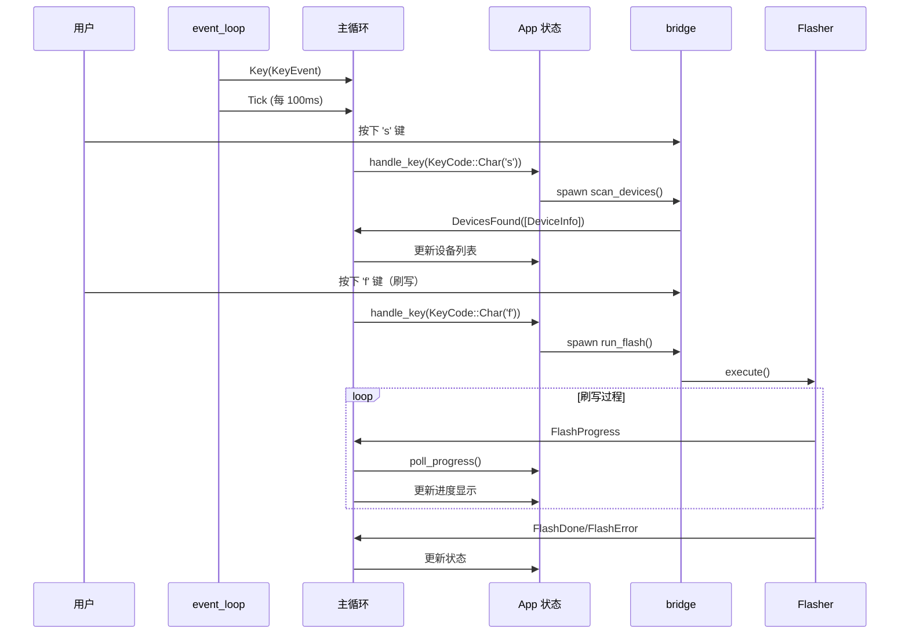
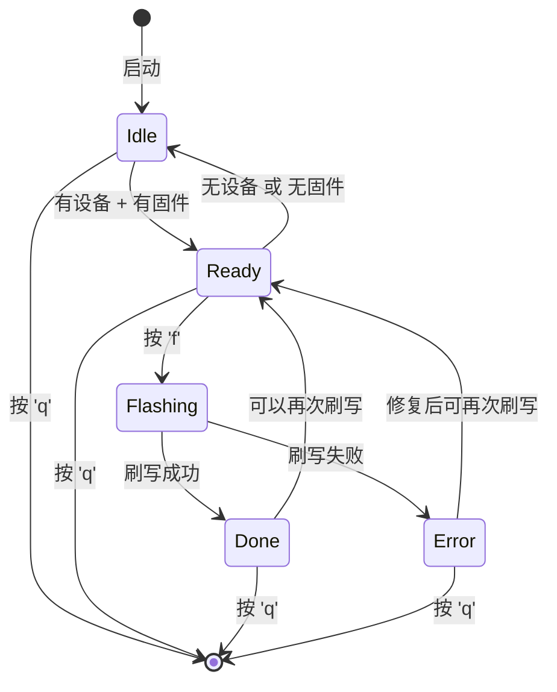

## 概述

终端用户界面（TUI）为固件刷写工具提供了直观的交互体验。OpenixCLI 使用 `ratatui` 框架构建事件驱动的 TUI 应用，通过 `mpsc` 通道实现异步事件通信，支持设备扫描、固件加载、选项配置和进度追踪的完整流程。

### 模块结构

```
src/tui/
├── mod.rs          # 模块导出，run() 入口
├── app.rs          # App 状态、事件循环、键盘处理
├── event.rs        # AppEvent 事件类型定义
├── bridge.rs       # scan_devices、run_flash 后台任务
├── ui.rs           # UI 渲染函数
└── widgets/        # Widget 组件
    ├── device_list.rs      # 设备列表渲染
    ├── firmware_info.rs    # 固件信息和选项
    ├── progress.rs         # 进度条显示
    └── log_view.rs         # 日志显示
```

### 核心导出

```rust
pub use app::run;  // TUI 入口函数
```

---

## 核心数据结构

### AppState 状态枚举

```rust
/// 应用状态
#[derive(Debug, Clone, Copy, PartialEq, Eq)]
pub enum AppState {
    /// 初始状态（无设备或无固件）
    Idle,

    /// 准备状态（有设备和固件，可刷写）
    Ready,

    /// 正在刷写
    Flashing,

    /// 刷写完成
    Done,

    /// 刷写错误
    Error,
}
```

### FocusPanel 焭点枚举

```rust
/// 当前焦点的面板
#[derive(Debug, Clone, Copy, PartialEq, Eq)]
pub enum FocusPanel {
    /// 设备列表
    Devices,

    /// 选项面板
    Options,
}

impl FocusPanel {
    pub fn toggle(&self) -> Self {
        match self {
            FocusPanel::Devices => FocusPanel::Options,
            FocusPanel::Options => FocusPanel::Devices,
        }
    }
}
```

### AppEvent 事件类型

```rust
/// 应用事件
#[derive(Debug)]
pub enum AppEvent {
    /// 键盘输入
    Key(KeyEvent),

    /// 定时 Tick（UI 刷新）
    Tick,

    /// 刷写阶段开始
    FlashStageStart(StageType),

    /// 刷写进度更新
    FlashProgress {
        stage_progress: u64,
        total: u64,
        speed: f64,
    },

    /// 分区开始刷写
    FlashPartitionStart(String),

    /// 阶段完成
    FlashStageComplete,

    /// 刷写完成
    FlashDone,

    /// 刷写错误
    FlashError(String),

    /// 发现设备
    DevicesFound(Vec<DeviceInfo>),

    /// 日志消息
    LogMessage(LogLevel, String),
}
```

### DeviceInfo 设备信息

```rust
/// 设备信息
#[derive(Debug, Clone)]
pub struct DeviceInfo {
    /// USB 总线号
    pub bus: u8,

    /// USB 端口号
    pub port: u8,

    /// 设备模式（FEL/FES）
    pub mode: String,

    /// 芯片名称
    pub chip: String,

    /// 芯片 ID
    pub chip_id: u32,

    /// 是否为 FEL 模式
    pub is_fel: bool,
}
```

### App 主结构

```rust
/// 主应用结构
pub struct App {
    /// 应用状态
    pub state: AppState,

    /// 设备列表
    pub devices: Vec<DeviceInfo>,

    /// 选中的设备索引
    pub selected_device: usize,

    /// 设备列表滚动偏移
    pub device_scroll_offset: usize,

    /// 固件状态
    pub firmware: FirmwareState,

    /// 进度状态
    pub progress: ProgressState,

    /// 日志状态
    pub log: LogState,

    /// 当前焦点
    pub focus: FocusPanel,

    /// 是否显示帮助
    pub show_help: bool,

    /// 是否在输入模式
    pub input_mode: bool,

    /// 输入缓冲区
    pub input_buffer: String,

    /// 刷写开始时间
    flash_start_time: Option<Instant>,

    /// 固件解析器
    packer: Option<OpenixPacker>,

    /// 是否应退出
    should_quit: bool,
}
```

---

## 事件驱动架构

### 事件循环

```rust
/// 事件循环：轮询键盘事件和生成 Tick
pub async fn event_loop(tx: mpsc::UnboundedSender<AppEvent>) {
    let tick_rate = Duration::from_millis(100);

    loop {
        // 使用 block_in_place 在异步上下文中阻塞轮询
        let has_event = tokio::task::block_in_place(|| {
            event::poll(tick_rate).unwrap_or(false)
        });

        if has_event {
            if let Ok(evt) = tokio::task::block_in_place(event::read) {
                match evt {
                    Event::Key(key) => {
                        if tx.send(AppEvent::Key(key)).is_err() {
                            return;  // 接收者关闭，退出循环
                        }
                    }
                    Event::Resize(_, _) => {
                        // ratatui 自动处理终端大小变化
                    }
                    _ => {}
                }
            }
        } else {
            // 超时无事件，发送 Tick
            if tx.send(AppEvent::Tick).is_err() {
                return;
            }
        }
    }
}
```

### 主应用循环

```rust
/// 运行 TUI 应用
pub async fn run() -> anyhow::Result<()> {
    // 1. 启用 TUI 模式（禁用 indicatif 进度条）
    set_tui_mode(true);

    // 2. 设置终端
    enable_raw_mode()?;
    io::stdout().execute(EnterAlternateScreen)?;

    // 3. 创建 Terminal
    let mut terminal = Terminal::new(CrosstermBackend::new(io::stdout()))?;

    // 4. 创建事件通道
    let (event_tx, event_rx) = mpsc::unbounded_channel();
    let (log_tx, log_rx) = mpsc::unbounded_channel();

    // 5. 设置 TUI 日志通道
    terminal::set_tui_log_sender(Some(log_tx.clone()));

    // 6. 启动事件循环（后台任务）
    tokio::spawn(event_loop(event_tx.clone()));

    // 7. 自动扫描设备
    tokio::spawn(bridge::scan_devices(event_tx.clone()));

    // 8. 创建 App
    let mut app = App::new();

    // 9. 主循环
    while !app.should_quit {
        // 接收日志消息
        while let Ok(msg) = log_rx.try_recv() {
            app.log.push(msg.level, &msg.message);
        }

        // 刷写时轮询进度
        if app.is_flashing() {
            app.poll_progress();
        }

        // 绘制 UI
        terminal.draw(|frame| ui::render(frame, &mut app))?;

        // 接收事件
        if let Some(event) = event_rx.recv().await {
            match event {
                AppEvent::Key(key) => app.handle_key(key),
                AppEvent::Tick => { /* UI 刷新 */ }
                AppEvent::DevicesFound(devices) => {
                    app.devices = devices;
                    app.update_state();
                }
                AppEvent::LogMessage(level, msg) => {
                    app.log.push(level, &msg);
                }
                AppEvent::FlashDone => {
                    app.state = AppState::Done;
                    app.reload_firmware();
                }
                AppEvent::FlashError(msg) => {
                    app.state = AppState::Error;
                    app.log.push(LogLevel::Error, &msg);
                }
                // ... 其他事件处理
            }
        }
    }

    // 10. 清理
    terminal::set_tui_log_sender(None);
    disable_raw_mode()?;
    io::stdout().execute(LeaveAlternateScreen)?;

    Ok(())
}
```

### 事件流程图



---

## Bridge 函数详解

### scan_devices 设备扫描

```rust
/// 扫描 USB 设备并发送结果
pub async fn scan_devices(tx: mpsc::UnboundedSender<AppEvent>) {
    // 发送扫描开始消息
    let _ = tx.send(AppEvent::LogMessage(
        LogLevel::Info,
        "Scanning for devices...".into(),
    ));

    match libefex::Context::scan_usb_devices() {
        Ok(devices) => {
            if devices.is_empty() {
                let _ = tx.send(AppEvent::LogMessage(LogLevel::Warn, "No devices found".into()));
                let _ = tx.send(AppEvent::DevicesFound(vec![]));
                return;
            }

            let mut infos = Vec::new();
            for dev in &devices {
                let mut ctx = libefex::Context::new();
                if ctx.scan_usb_device_at(dev.bus, dev.port).is_err() {
                    continue;
                }
                if ctx.usb_init().is_err() {
                    continue;
                }
                if ctx.efex_init().is_err() {
                    continue;
                }

                // 获取设备信息
                let mode = ctx.get_device_mode();
                let is_fel = mode == libefex::DeviceMode::Fel;
                let mode_str = match mode {
                    libefex::DeviceMode::Fel => "FEL",
                    libefex::DeviceMode::Srv => "FES",
                    // ...
                };

                let chip = ctx.get_device_mode_str().to_string();
                let chip_id = unsafe { (*ctx.as_ptr()).resp.id };

                infos.push(DeviceInfo {
                    bus: dev.bus,
                    port: dev.port,
                    mode: mode_str.into(),
                    chip,
                    chip_id,
                    is_fel,
                });
            }

            let _ = tx.send(AppEvent::DevicesFound(infos));
        }
        Err(e) => {
            let _ = tx.send(AppEvent::LogMessage(LogLevel::Error, format!("Scan failed: {}", e)));
        }
    }
}
```

### run_flash 后台刷写

```rust
/// 在后台线程运行刷写任务
///
/// 使用 spawn_blocking 因为 libefex::Context 包含 raw pointer 且不是 Send
pub async fn run_flash(
    tx: mpsc::UnboundedSender<AppEvent>,
    packer: OpenixPacker,
    bus: Option<u8>,
    port: Option<u8>,
    mode: CmdFlashMode,
    verify: bool,
    partitions: Option<Vec<String>>,
    post_action: String,
) {
    // 构建刷写选项
    let flash_mode = match mode {
        CmdFlashMode::Partition => FlashMode::Partition,
        CmdFlashMode::KeepData => FlashMode::KeepData,
        CmdFlashMode::PartitionErase => FlashMode::PartitionErase,
        CmdFlashMode::FullErase => FlashMode::FullErase,
    };

    let options = FlashOptions {
        bus,
        port,
        verify,
        mode: flash_mode,
        partitions,
        post_action: post_action.clone(),
    };

    // 使用 spawn_blocking 运行刷写（libefex::Context 不是 Send）
    let result = tokio::task::spawn_blocking(move || {
        let rt = tokio::runtime::Handle::current();
        rt.block_on(async {
            let mut flasher = Flasher::new(packer, options, cli_logger);
            flasher.execute().await
        })
    }).await;

    match result {
        Ok(Ok(())) => {
            let _ = tx.send(AppEvent::FlashDone);
        }
        Ok(Err(e)) => {
            let _ = tx.send(AppEvent::FlashError(format!("{}", e)));
        }
        Err(e) => {
            let _ = tx.send(AppEvent::FlashError(format!("Flash task panicked: {}", e)));
        }
    }
}
```

---

## 键盘处理

### handle_key 实现

```rust
/// 处理键盘输入
fn handle_key(&mut self, key: KeyEvent) {
    // 仅处理 Press 事件
    if key.kind != KeyEventKind::Press {
        return;
    }

    // 帮助界面
    if self.show_help {
        if key.code == KeyCode::Esc || key.code == KeyCode::Char('h') {
            self.show_help = false;
        }
        return;
    }

    // 输入模式（路径输入）
    if self.input_mode {
        self.handle_input_key(key);
        return;
    }

    // 刷写过程中仅允许 Ctrl+C 和 Esc
    if self.is_flashing() {
        if key.code == KeyCode::Esc || key.modifiers.contains(KeyModifiers::CONTROL) && key.code == KeyCode::Char('c') {
            self.should_quit = true;
        }
        return;
    }

    match key.code {
        KeyCode::Char('q') | KeyCode::Esc => self.should_quit = true,
        KeyCode::Char('h') => self.show_help = true,
        KeyCode::Tab => self.focus = self.focus.toggle(),
        KeyCode::Char('s') => self.start_scan(),
        KeyCode::Char('r') => self.reload_firmware(),
        KeyCode::Char('f') => self.start_flash(),
        KeyCode::Char('p') => self.firmware.toggle_partition_selection(),
        KeyCode::Up => self.handle_up(),
        KeyCode::Down => self.handle_down(),
        KeyCode::Enter => self.handle_enter(),
        _ => {}
    }
}
```

### 快捷键列表

| 键 | 功能 |
|----|------|
| `q` / `Esc` | 退出 |
| `h` | 显示帮助 |
| `s` | 扫描设备 |
| `r` | 重新加载固件 |
| `f` | 开始刷写 |
| `p` | 切换分区选择 |
| `Tab` | 切换焦点面板 |
| `↑` / `↓` | 滚动选择 |
| `Enter` | 确认选择 |
| `Ctrl+C` | 强制退出 |

---

## 进度轮询机制

### poll_progress 实现

```rust
/// 轮询 GlobalProgress 并更新 UI 状态
fn poll_progress(&mut self) {
    let gp = global_progress();
    let snap = gp.snapshot();

    // 更新进度百分比
    self.progress.overall_percent = snap.precise_progress;
    self.progress.stage_progress = snap.stage_progress;
    self.progress.stage_total = snap.total_bytes;
    self.progress.speed = snap.speed;

    // 更新当前分区
    if !snap.current_partition.is_empty() {
        self.progress.current_partition = snap.current_partition;
    }

    // 更新当前阶段
    if snap.current_stage_index < snap.stages.len() {
        let current = snap.stages[snap.current_stage_index].stage_type;
        self.progress.current_stage = Some(current);
        self.progress.stage_index = snap.current_stage_index;
    }

    // 更新已完成阶段
    self.progress.completed_stages.clear();
    for stage_info in &snap.stages {
        if stage_info.completed {
            self.progress.completed_stages.push(stage_info.stage_type);
        }
    }
}
```

---

## UI 渲染

### 布局结构

```rust
/// 渲染 UI
pub fn render(frame: &mut Frame, app: &mut App) {
    // 创建主布局
    let layout = if frame.area().width >= 100 {
        // 宽屏布局：左侧面板 + 右侧日志
        Layout::default()
            .direction(Direction::Horizontal)
            .constraints([Constraint::Percentage(50), Constraint::Percentage(50)])
            .split(frame.area())
    } else {
        // 窄屏布局：上下布局
        Layout::default()
            .direction(Direction::Vertical)
            .constraints([Constraint::Percentage(50), Constraint::Percentage(50)])
            .split(frame.area())
    };

    // 左侧布局（设备 + 选项）
    let left_layout = Layout::default()
        .direction(Direction::Vertical)
        .constraints([Constraint::Percentage(50), Constraint::Percentage(50)])
        .split(layout[0]);

    // 渲染设备列表
    render_device_list(frame, left_layout[0], app);

    // 渲染固件信息和选项
    render_firmware_info(frame, left_layout[1], app);

    // 渲染进度条
    render_progress(frame, layout[1], app);

    // 渲染日志
    render_log_view(frame, layout[2], app);

    // 渲染标题栏
    render_title_bar(frame, frame.area());

    // 渲染帮助界面（如果显示）
    if app.show_help {
        render_help_overlay(frame, frame.area());
    }
}
```

### 布局图

```
┌──────────────────────────────────────────────────────────────────────────┐
│                          OpenixCLI - Firmware Flasher                     │
├─────────────────────────────────────────┬────────────────────────────────┤
│                                         │                                │
│  ┌─────────────────────────────────┐    │  ┌────────────────────────────┐│
│  │       Device List               │    │  │        Progress            ││
│  │  [1] Bus 001, Port 002          │    │  │  ████████████░░░░░░ 75%    ││
│  │      Chip: sun50iw10            │    │  │  [rootfs] 3.2 MB/s         ││
│  │      Mode: FEL                  │    │  │                            ││
│  │  [2] Bus 002, Port 001          │    │  │  Stages:                   ││
│  │      Mode: FES                  │    │  │  ✓ Init                    ││
│  │                                 │    │  │  ✓ DRAM Init               ││
│  │  Press 's' to scan              │    │  │  ✓ U-Boot                  ││
│  └─────────────────────────────────┘    │  │  → Flashing Partitions     ││
│                                         │  │                            ││
│  ┌─────────────────────────────────┐    │  └────────────────────────────┘│
│  │       Firmware Options          │    │                                │
│  │  Path: firmware.fex             │    │  ┌────────────────────────────┐│
│  │  Size: 128 MB                   │    │  │        Log View            ││
│  │  Files: 12                      │    │  │  [INFO] Loading firmware   ││
│  │  Mode: Full Erase               │    │  │  [INFO] Device connected   ││
│  │  Partitions: boot, rootfs       │    │  │  [OKAY] DRAM initialized   ││
│  │                                 │    │  │  [WARN] Partition skipped  ││
│  │  [Flash] Press 'f'              │    │  │  [ERRO] Transfer failed   ││
│  └─────────────────────────────────┘    │  └────────────────────────────┘│
│                                         │                                │
├─────────────────────────────────────────┴────────────────────────────────┤
│  Status: Ready | Help: 'h' | Scan: 's' | Flash: 'f' | Quit: 'q'          │
└──────────────────────────────────────────────────────────────────────────┘
```

---

## 代码亮点

### 1. spawn_blocking 处理 !Send 类型

```rust
// libefex::Context 包含 raw pointer，不是 Send
// 使用 spawn_blocking 在专用线程中运行
let result = tokio::task::spawn_blocking(move || {
    let rt = tokio::runtime::Handle::current();
    rt.block_on(async {
        let mut flasher = Flasher::new(packer, options, cli_logger);
        flasher.execute().await
    })
}).await;
```

### 2. block_in_place 在异步中阻塞

```rust
// 在异步上下文中阻塞调用 crossterm 的 event::poll
let has_event = tokio::task::block_in_place(|| {
    event::poll(tick_rate).unwrap_or(false)
});
```

### 3. mpsc::unbounded_channel 无界通道

```rust
// 创建无界通道（适合事件流）
let (event_tx, event_rx) = mpsc::unbounded_channel();

// 发送事件（无阻塞）
event_tx.send(AppEvent::Key(key))?;

// 接收事件（异步）
if let Some(event) = event_rx.recv().await {
    // 处理事件
}
```

### 4. ratatui 状态驱动渲染

```rust
// 每帧重新渲染整个 UI
terminal.draw(|frame| {
    ui::render(frame, &mut app);
})?;
```

### 5. GlobalProgress 快照轮询

```rust
// TUI 不直接更新进度条，而是轮询快照
let snap = global_progress().snapshot();
self.progress.overall_percent = snap.precise_progress;
```

---

## 实践示例

### 启动 TUI

```bash
$ openixcli
# 或
$ openixcli tui
```

### 交互流程

1. **扫描设备**：按 `s` 扫描 USB 设备
2. **选择设备**：使用 `↑`/`↓` 选择，`Enter` 确认
3. **加载固件**：输入固件路径或拖拽文件
4. **配置选项**：`Tab` 切换到选项面板，设置刷写模式
5. **开始刷写**：按 `f` 开始刷写
6. **查看进度**：实时显示刷写进度和日志
7. **完成**：按 `q` 或 `Esc` 退出

### 状态转换图



---

## Widget 组件

### ProgressState

```rust
/// 进度状态
pub struct ProgressState {
    /// 总进度百分比
    pub overall_percent: f64,

    /// 阶段内进度
    pub stage_progress: u64,

    /// 阶段总字节数
    pub stage_total: u64,

    /// 传输速度
    pub speed: f64,

    /// 当前分区名称
    pub current_partition: String,

    /// 当前阶段
    pub current_stage: Option<StageType>,

    /// 已完成阶段列表
    pub completed_stages: Vec<StageType>,
}
```

### LogState

```rust
/// 日志状态
pub struct LogState {
    /// 日志条目列表
    pub entries: Vec<LogEntry>,

    /// 滚动偏移
    pub scroll_offset: usize,
}

/// 日志条目
pub struct LogEntry {
    /// 时间戳
    pub timestamp: Instant,

    /// 级别
    pub level: LogLevel,

    /// 消息内容
    pub message: String,
}
```

---

---