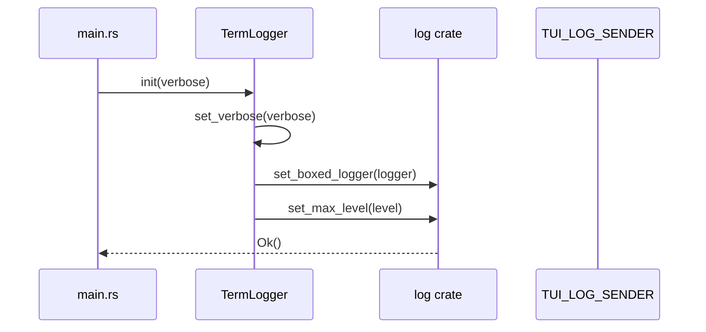

## 概述

在嵌入式开发中，一个稳固的固件刷写工具必须具备完善的错误处理和日志系统。OpenixCLI 的 Utils 模块（`src/utils/`）正是为此而生，它提供了统一的错误类型定义和双模式日志架构，支持 CLI 和 TUI 两种交互模式。

### 模块结构

```
src/utils/
├── mod.rs       # 模块导出
├── error.rs     # FlashError 错误枚举
├── logger.rs    # Logger 进度报告封装
└── terminal.rs  # TermLogger 终端输出实现
```

### 核心导出

```rust
pub use error::{FlashError, FlashResult};
pub use logger::Logger;
pub use terminal::TermLogger;
```

---

## 架构与依赖

### 模块依赖关系

```
utils 模块
├── thiserror (外部 crate) - 错误类型 derive
├── colored (外部 crate) - 终端彩色输出
├── indicatif (外部 crate) - 进度条
├── log (外部 crate) - 日志 facade
├── once_cell (外部 crate) - 全局状态
├── tokio::sync::mpsc (外部 crate) - TUI 日志通道
└── process 模块 - ProgressReporter 依赖
```

### 双模式日志架构

OpenixCLI 支持两种运行模式：

| 模式 | 输出目标 | 进度显示 | 适用场景 |
|------|----------|----------|----------|
| CLI | stdout/stderr | indicatif 进度条 | 命令行批量刷写 |
| TUI | mpsc channel | ratatui 界面 | 交互式操作 |

---

## 核心数据结构

### FlashError 错误枚举

FlashError 使用 `thiserror` crate 的 derive 宏定义，涵盖了固件刷写过程中可能出现的所有错误场景：

```rust
/// Flash 操作错误类型
///
/// 使用 thiserror derive 自动实现 Error trait 和 Display trait
#[derive(Debug, Error)]
pub enum FlashError {
    // 固件相关错误
    #[error("Firmware file not found: {0}")]
    FirmwareNotFound(String),

    #[error("Invalid firmware format: {0}")]
    InvalidFirmwareFormat(String),

    #[error("Encrypted firmware not supported")]
    EncryptedNotSupported,

    // 设备相关错误
    #[error("Device not found")]
    DeviceNotFound,

    #[error("Failed to open device: {0}")]
    DeviceOpenFailed(String),

    // 刷写过程错误
    #[error("DRAM initialization failed")]
    DramInitFailed,

    #[error("U-Boot download failed")]
    UbootDownloadFailed,

    #[error("MBR download failed")]
    MbrDownloadFailed,

    #[error("Partition download failed: {0}")]
    PartitionDownloadFailed(String),

    #[error("Device reconnect failed")]
    ReconnectFailed,

    #[error("Storage type mismatch: device={device}, firmware={firmware}")]
    StorageTypeMismatch { device: String, firmware: String },

    // 固件组件缺失错误
    #[error("FES not found in firmware")]
    FesNotFound,

    #[error("U-Boot not found in firmware")]
    UbootNotFound,

    #[error("SysConfig not found in firmware")]
    SysConfigNotFound,

    #[error("MBR not found in firmware")]
    MbrNotFound,

    #[error("Boot0 not found in firmware")]
    Boot0NotFound,

    #[error("Boot1 not found in firmware")]
    Boot1NotFound,

    // USB 和操作错误
    #[error("USB transfer error: {0}")]
    UsbTransferError(String),

    #[error("Operation cancelled")]
    Cancelled,

    #[error("Timeout: {0}")]
    Timeout(String),

    // 外部错误转换
    #[error("IO error: {0}")]
    Io(#[from] std::io::Error),

    #[error("Packer error: {0}")]
    Packer(#[from] crate::firmware::PackerError),

    #[error("Libefex error: {0}")]
    Libefex(#[from] libefex::EfexError),

    #[error("Unknown error: {0}")]
    Unknown(String),
}
```

**关键特性分析：**

1. **`#[derive(Debug, Error)]`** - 自动实现 `std::error::Error` trait 和 `Debug` trait
2. **`#[error("...")]`** - 自定义错误消息格式，支持字段插值
3. **`#[from]`** - 自动实现 `From` trait，实现错误类型转换

### FlashResult 类型别名

```rust
/// Flash 操作的 Result 类型别名
pub type FlashResult<T> = Result<T, FlashError>;
```

使用类型别名简化函数签名，避免重复书写完整的 Result 类型。

### Logger 结构

Logger 是进度报告器的封装，提供统一的日志和进度接口：

```rust
/// Logger - 统一的日志和进度报告接口
#[derive(Clone)]
pub struct Logger {
    verbose: bool,
    reporter: Arc<ProgressReporter>,
}

impl Logger {
    /// 创建默认配置的 Logger
    pub fn new() -> Self {
        Self {
            verbose: false,
            reporter: Arc::new(ProgressReporter::new()),
        }
    }

    /// 创建带 verbose 模式的 Logger
    pub fn with_verbose(verbose: bool) -> Self {
        Self {
            verbose,
            reporter: Arc::new(ProgressReporter::new()),
        }
    }
}
```

**设计要点：**
- 使用 `Arc` 包装 `ProgressReporter`，支持跨线程共享
- `Clone` trait 实现，允许多个组件持有同一个 Logger 实例

### TuiLogMessage 与日志级别

```rust
/// TUI 日志消息结构
pub struct TuiLogMessage {
    pub level: TuiLogLevel,
    pub message: String,
}

/// TUI 日志级别枚举
#[derive(Debug, Clone, PartialEq, Eq)]
pub enum TuiLogLevel {
    Info,
    Success,
    Warn,
    Error,
    Debug,
}
```

### TermLogger 结构

TermLogger 实现 `log::Log` trait，是全局日志 facade 的后端：

```rust
/// Terminal Logger - 实现 log crate 的 Log trait
pub struct TermLogger {
    verbose: bool,
}

impl TermLogger {
    /// 初始化终端日志器
    pub fn init(verbose: bool) -> Result<(), log::SetLoggerError> {
        set_verbose(verbose);
        let logger = Box::new(Self::new(verbose));
        let level = if verbose {
            LevelFilter::Debug
        } else {
            LevelFilter::Info
        };
        log::set_boxed_logger(logger)?;
        log::set_max_level(level);
        Ok(())
    }
}
```

---

## 调用流程分析

### 全局日志初始化流程



**代码实现：**

```rust
// 在 main.rs 中初始化
fn main() -> Result<()> {
    // 初始化日志系统
    TermLogger::init(cli.verbose)?;

    // 后续所有 log::info!/log::error! 调用都会通过 TermLogger 处理
    log::info!("OpenixCLI starting...");
}
```

### Logger 使用流程

```rust
// 在 flash 模块中的使用示例
impl Flasher {
    pub async fn execute(&self) -> FlashResult<()> {
        let logger = Logger::with_verbose(self.options.verbose);

        // 定义刷写阶段
        let stages = FlashStages::for_fel_mode();
        logger.define_stages(&stages);
        logger.start_global_progress();

        // DRAM 初始化阶段
        logger.begin_stage(StageType::FelDram);
        logger.info("Initializing DRAM...");

        // ... 执行 DRAM 初始化 ...

        logger.stage_complete("DRAM initialized");

        // 完成当前阶段
        logger.complete_stage();

        // U-Boot 下载阶段
        logger.begin_stage(StageType::FelUboot);
        logger.set_current_partition("uboot");

        // 更新进度
        logger.update_progress_with_speed(bytes_written);

        logger.complete_stage();

        // 最终完成
        logger.finish_progress();
        Ok(())
    }
}
```

### 双模式日志切换

关键机制是 `TUI_LOG_SENDER` 全局状态：

```rust
/// 全局 TUI 日志发送器 - 使用 once_cell::Lazy 实现延迟初始化
static TUI_LOG_SENDER: Lazy<Mutex<Option<mpsc::UnboundedSender<TuiLogMessage>>>> =
    Lazy::new(|| Mutex::new(None));

/// 设置 TUI 日志通道
pub fn set_tui_log_sender(tx: Option<mpsc::UnboundedSender<TuiLogMessage>>) {
    let mut sender = TUI_LOG_SENDER.lock().unwrap();
    *sender = tx;
}
```

**日志输出流程：**

```rust
fn log_info(message: &str) {
    // 优先尝试发送到 TUI channel
    if send_to_tui(TuiLogLevel::Info, message) {
        return;  // TUI 模式，已发送，直接返回
    }

    // CLI 模式，输出到 stdout
    MULTI_PROGRESS.suspend(|| {
        println!("[{}] {}", "INFO".cyan().bold(), message);
    });
}

fn send_to_tui(level: TuiLogLevel, message: &str) -> bool {
    let sender = TUI_LOG_SENDER.lock().unwrap();
    if let Some(ref tx) = *sender {
        let _ = tx.send(TuiLogMessage {
            level,
            message: message.to_string(),
        });
        true  // 发送成功，返回 true
    } else {
        false  // 无 TUI channel，返回 false
    }
}
```

---

## 代码亮点

### 1. thiserror 的错误类型定义

使用 `thiserror` crate 大幅简化错误类型定义：

```rust
// 传统方式需要手动实现 Error 和 Display
// 使用 thiserror 只需：
#[derive(Debug, Error)]
pub enum FlashError {
    #[error("Firmware file not found: {0}")]
    FirmwareNotFound(String),
}

// thiserror 自动生成：
impl std::fmt::Display for FlashError {
    fn fmt(&self, f: &mut std::fmt::Formatter) -> std::fmt::Result {
        match self {
            FlashError::FirmwareNotFound(s) => write!(f, "Firmware file not found: {}", s),
        }
    }
}

impl std::error::Error for FlashError {}
```

### 2. `#[from]` 属性实现错误转换

```rust
#[error("IO error: {0}")]
Io(#[from] std::io::Error),
```

这会自动生成 `From<std::io::Error> for FlashError` 实现，允许使用 `?` 操作符自动转换：

```rust
fn load_firmware(path: &Path) -> FlashResult<Vec<u8>> {
    let data = std::fs::read(path)?;  // io::Error 自动转换为 FlashError::Io
    Ok(data)
}
```

### 3. 结构化错误字段

```rust
#[error("Storage type mismatch: device={device}, firmware={firmware}")]
StorageTypeMismatch { device: String, firmware: String },
```

支持命名字段，错误消息更清晰：

```rust
return Err(FlashError::StorageTypeMismatch {
    device: "eMMC".to_string(),
    firmware: "NAND".to_string(),
});
// 输出: Storage type mismatch: device=eMMC, firmware=NAND
```

### 4. once_cell::Lazy 全局状态

```rust
static TUI_LOG_SENDER: Lazy<Mutex<Option<mpsc::UnboundedSender<TuiLogMessage>>>> =
    Lazy::new(|| Mutex::new(None));
```

**优势：**
- 延迟初始化，首次访问时才创建
- 线程安全，无需手动同步
- 比 `lazy_static!` 宏更现代化

### 5. indicatif MultiProgress 悬挂机制

```rust
MULTI_PROGRESS.suspend(|| {
    println!("[{}] {}", "INFO".cyan().bold(), message);
});
```

`suspend` 方法临时隐藏进度条，避免日志输出与进度条重叠。

### 6. log crate facade 模式

TermLogger 实现 `log::Log` trait：

```rust
impl Log for TermLogger {
    fn enabled(&self, metadata: &Metadata) -> bool {
        // 只处理 openixcli 和 libefex 的日志
        let target = metadata.target();
        if target.starts_with("openixcli") || target.starts_with("libefex") {
            return true;
        }
        metadata.level() <= Level::Info
    }

    fn log(&self, record: &Record) {
        if !self.enabled(record.metadata()) {
            return;
        }

        // verbose 模式下过滤 Debug 级别
        if record.level() == Level::Debug && !self.verbose {
            return;
        }

        // 处理日志输出...
    }

    fn flush(&self) {}
}
```

---

## 实践示例

### CLI 模式下的日志使用

```rust
use openixcli::utils::{FlashError, FlashResult, Logger, TermLogger};

fn main() -> FlashResult<()> {
    // 初始化日志系统
    TermLogger::init(true)?;  // verbose 模式

    let logger = Logger::new();

    // 使用 log crate 宏
    log::info!("Starting firmware flash process");

    // 使用 Logger 方法
    logger.info("Loading firmware...");
    logger.warn("Firmware size exceeds recommended limit");

    // 错误处理
    match load_firmware(&path) {
        Ok(data) => logger.success("Firmware loaded"),
        Err(e) => {
            log::error!("Failed: {}", e);
            return Err(e);
        }
    }

    Ok(())
}
```

### TUI 模式下的日志集成

```rust
// TUI 启动时设置日志通道
use tokio::sync::mpsc;

let (log_tx, log_rx) = mpsc::unbounded_channel();
set_tui_log_sender(Some(log_tx));

// 所有日志消息会发送到 log_rx
// TUI 从 log_rx 接收并渲染到界面

// TUI 退出时清理
set_tui_log_sender(None);
```

### 错误处理的最佳实践

```rust
fn flash_device(args: FlashArgs) -> FlashResult<()> {
    // 1. 使用具体的错误类型
    let firmware = std::fs::read(&args.firmware_path)
        .map_err(|e| {
            if e.kind() == std::io::ErrorKind::NotFound {
                FlashError::FirmwareNotFound(args.firmware_path.display().to_string())
            } else {
                FlashError::Io(e)  // 自动转换
            }
        })?;

    // 2. 验证固件格式
    if !validate_firmware(&firmware) {
        return Err(FlashError::InvalidFirmwareFormat(
            "Missing IMAGEWTY magic".to_string()
        ));
    }

    // 3. 检查加密固件
    if is_encrypted(&firmware) {
        return Err(FlashError::EncryptedNotSupported);
    }

    // 4. 查找设备
    let device = find_device(args.bus, args.port)
        .ok_or(FlashError::DeviceNotFound)?;

    // 5. 执行刷写
    execute_flash(device, firmware)?;

    Ok(())
}
```

---

## 错误类型分类

```mermaid
graph TD
    A[FlashError] --> B[固件错误]
    A --> C[设备错误]
    A --> D[刷写过程错误]
    A --> E[组件缺失错误]
    A --> F[外部错误]

    B --> B1[FirmwareNotFound]
    B --> B2[InvalidFirmwareFormat]
    B --> B3[EncryptedNotSupported]

    C --> C1[DeviceNotFound]
    C --> C2[DeviceOpenFailed]
    C --> C3[StorageTypeMismatch]

    D --> D1[DramInitFailed]
    D --> D2[UbootDownloadFailed]
    D --> D3[MbrDownloadFailed]
    D --> D4[PartitionDownloadFailed]
    D --> D5[ReconnectFailed]
    D --> D6[UsbTransferError]
    D --> D7[Timeout]

    E --> E1[FesNotFound]
    E --> E2[UbootNotFound]
    E --> E3[SysConfigNotFound]
    E --> E4[MbrNotFound]
    E --> E5[Boot0NotFound]
    E --> E6[Boot1NotFound]

    F --> F1[Io]
    F --> F2[Packer]
    F --> F3[Libefex]
    F --> F4[Unknown]
```



---

---