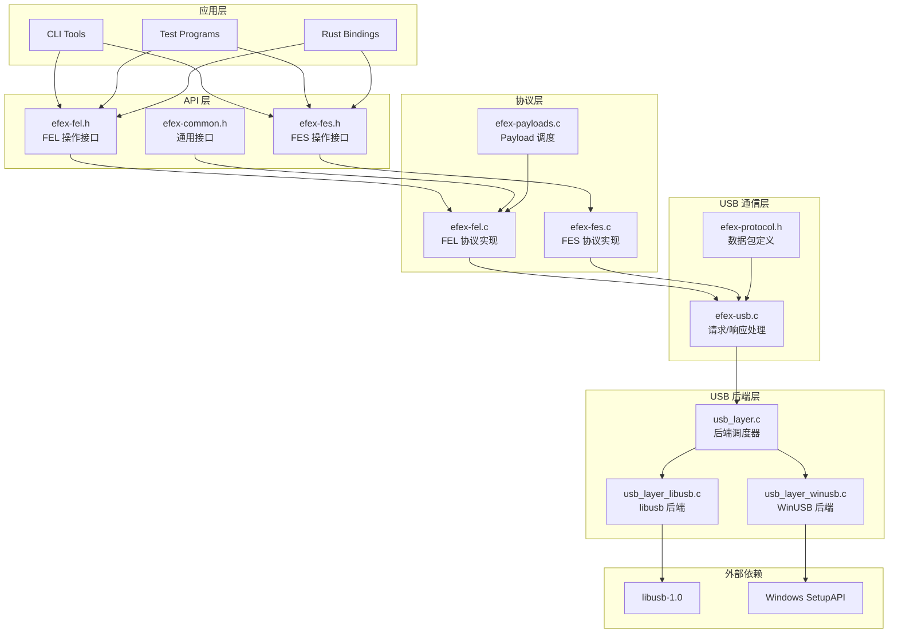
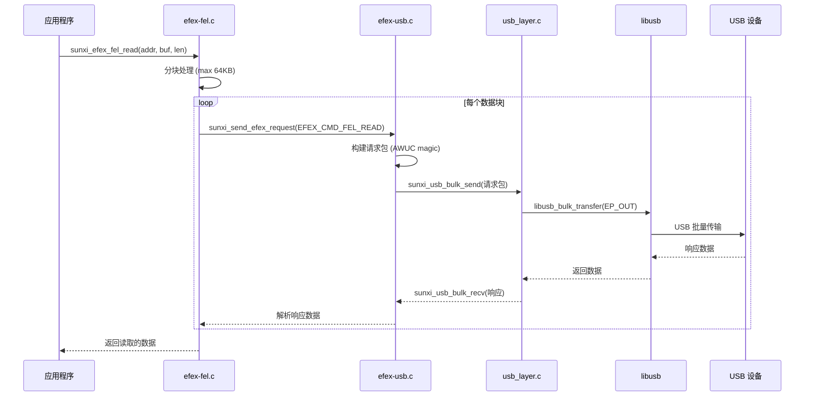

# libefex 模块架构

## 层级架构

libefex 采用清晰的分层架构设计，从底层 USB 驱动到高层 API 逐层抽象：



## 核心数据结构

### 上下文结构 (`sunxi_efex_ctx_t`)

源码位置: `includes/efex-protocol.h:240-247`

```c
struct sunxi_efex_ctx_t {
    void *hdl;                       // USB 设备句柄
    void *usb_context;               // libusb 上下文
    char *dev_name;                  // 设备路径/名称
    int epout;                       // OUT 端点地址
    int epin;                        // IN 端点地址
    struct sunxi_efex_device_resp_t resp;  // 设备响应信息
};
```

该结构体是所有 API 操作的核心上下文，保存了：
- USB 设备句柄和上下文
- 设备端点配置
- 设备返回的响应信息

### 设备响应结构 (`sunxi_efex_device_resp_t`)

源码位置: `includes/efex-protocol.h:229-238`

```c
struct sunxi_efex_device_resp_t {
    char magic[8];                   // "AWUSBEFEX"
    uint32_t id;                     // 芯片 ID
    uint32_t firmware;               // 固件版本
    uint16_t mode;                   // 设备模式 (FEL/FES)
    uint8_t data_flag;               // 数据标志
    uint8_t data_length;             // 数据长度
    uint32_t data_start_address;     // 数据起始地址
    uint8_t reserved[8];             // 保留字段
};
```

设备初始化时返回此结构，包含芯片 ID、固件版本、当前模式等重要信息。

### 设备模式枚举

源码位置: `includes/efex-protocol.h:97-103`

```c
enum sunxi_verify_device_mode_t {
    DEVICE_MODE_NULL = 0x0,          // 无效模式
    DEVICE_MODE_FEL = 0x1,           // FEL 模式
    DEVICE_MODE_SRV = 0x2,           // FES/SRV 模式
    DEVICE_MODE_UPDATE_COOL = 0x3,   // 冷更新模式
    DEVICE_MODE_UPDATE_HOT = 0x4,    // 热更新模式
};
```

## 模块交互流程

当用户调用 FEL 内存读取操作时，数据流经以下模块：



## 模块职责详解

### 1. Core Common (`efex-common.c/h`)

**核心职责**: 设备初始化与错误处理

源码位置: `includes/efex-common.h:31-96`

```c
/**
 * @brief Send an EFEX request to the device
 */
int sunxi_send_efex_request(const struct sunxi_efex_ctx_t *ctx, 
                            enum sunxi_efex_cmd_t type, 
                            uint32_t addr, uint32_t length);

/**
 * @brief Read the EFEX status from the device
 */
int sunxi_read_efex_status(const struct sunxi_efex_ctx_t *ctx);

/**
 * @brief Scan for a USB device matching the specified vendor and product IDs
 */
int sunxi_scan_usb_device(struct sunxi_efex_ctx_t *ctx);

/**
 * @brief Get the device mode from the EFEX context
 */
enum sunxi_verify_device_mode_t sunxi_efex_get_device_mode(
    const struct sunxi_efex_ctx_t *ctx);

/**
 * @brief Initialize the EFEX context
 */
int sunxi_efex_init(struct sunxi_efex_ctx_t *ctx);

/**
 * @brief Get error message string for a given error code
 */
const char *sunxi_efex_strerror(int error_code);
```

### 错误码定义

源码位置: `includes/efex-protocol.h:17-59`

```c
enum sunxi_efex_error_t {
    /* Generic Errors */
    EFEX_ERR_SUCCESS = 0,        /**< Success */
    EFEX_ERR_INVALID_PARAM = -1, /**< Invalid parameter */
    EFEX_ERR_NULL_PTR = -2,      /**< Null pointer error */
    EFEX_ERR_MEMORY = -3,        /**< Memory allocation error */
    EFEX_ERR_NOT_SUPPORT = -4,   /**< Operation not supported */

    /* USB Communication Errors */
    EFEX_ERR_USB_INIT = -10,             /**< USB initialization failed */
    EFEX_ERR_USB_DEVICE_NOT_FOUND = -11, /**< Device not found */
    EFEX_ERR_USB_OPEN = -12,             /**< Failed to open device */
    EFEX_ERR_USB_TRANSFER = -13,         /**< USB transfer failed */
    EFEX_ERR_USB_TIMEOUT = -14,          /**< USB transfer timeout */
    EFEX_ERR_USB_WRONG_DRIVER = -15,     /**< Wrong USB driver installed */

    /* Protocol Errors */
    EFEX_ERR_PROTOCOL = -20,            /**< Protocol error */
    EFEX_ERR_INVALID_RESPONSE = -21,    /**< Invalid response from device */
    EFEX_ERR_UNEXPECTED_STATUS = -22,   /**< Unexpected status code */
    EFEX_ERR_INVALID_DEVICE_MODE = -24, /**< Invalid device mode */

    /* Flash Related Errors */
    EFEX_ERR_FLASH_ACCESS = -40,     /**< Flash access error */
    EFEX_ERR_FLASH_SIZE_PROBE = -41, /**< Flash size probing failed */
    EFEX_ERR_FLASH_SET_ONOFF = -42,  /**< Failed to set flash on/off */

    /* Verification Errors */
    EFEX_ERR_VERIFICATION = -50, /**< Verification failed */
    EFEX_ERR_CRC_MISMATCH = -51, /**< CRC mismatch error */

    /* File Operation Errors */
    EFEX_ERR_FILE_OPEN = -60,  /**< Failed to open file */
    EFEX_ERR_FILE_READ = -61,  /**< Failed to read file */
    EFEX_ERR_FILE_WRITE = -62, /**< Failed to write file */
};
```

### 2. USB Protocol (`efex-usb.c/h`)

**核心职责**: USB 协议数据包处理

源码位置: `includes/efex-usb.h`

```c
int sunxi_usb_write(const struct sunxi_efex_ctx_t *ctx,
                    const void *buf, size_t len);
                    
int sunxi_usb_read(const struct sunxi_efex_ctx_t *ctx,
                   void *buf, size_t len);

int sunxi_usb_fes_xfer(const struct sunxi_efex_ctx_t *ctx,
                       enum sunxi_usb_fes_xfer_type_t type,
                       uint32_t cmd, const char *request_buf,
                       ssize_t request_len, const char *buf,
                       ssize_t len);
```

### 3. FEL Operations (`efex-fel.c/h`)

**核心职责**: FEL 模式内存操作

源码位置: `includes/efex-fel.h`

```c
int sunxi_efex_fel_read(const struct sunxi_efex_ctx_t *ctx,
                        uint32_t addr, char *buf, ssize_t len);

int sunxi_efex_fel_write(const struct sunxi_efex_ctx_t *ctx,
                         uint32_t addr, const char *buf, ssize_t len);

int sunxi_efex_fel_exec(const struct sunxi_efex_ctx_t *ctx,
                        uint32_t addr);
```

### 4. FES Operations (`efex-fes.c/h`)

**核心职责**: FES 模式闪存操作

源码位置: `includes/efex-fes.h`

```c
int sunxi_efex_fes_query_storage(const struct sunxi_efex_ctx_t *ctx,
                                 uint32_t *storage_type);

int sunxi_efex_fes_down(const struct sunxi_efex_ctx_t *ctx,
                        const char *buf, ssize_t len,
                        uint32_t addr, enum sunxi_fes_data_type_t type);

int sunxi_efex_fes_up(const struct sunxi_efex_ctx_t *ctx,
                      const char *buf, ssize_t len,
                      uint32_t addr, enum sunxi_fes_data_type_t type);
```

### 5. Payloads (`efex-payloads.c/h`)

**核心职责**: 架构特定的机器码 Payload

源码位置: `includes/efex-payloads.h`

```c
int sunxi_efex_fel_payloads_init(enum sunxi_efex_fel_payloads_arch arch);

int sunxi_efex_fel_payloads_readl(const struct sunxi_efex_ctx_t *ctx,
                                  uint32_t addr, uint32_t *val);

int sunxi_efex_fel_payloads_writel(const struct sunxi_efex_ctx_t *ctx,
                                   uint32_t value, uint32_t addr);

struct payloads_ops *sunxi_efex_fel_get_current_payload(void);
```

**支持的架构**:
| 架构 | 文件 | 状态 |
|------|------|------|
| ARM32 (ARMv7) | `src/arch/arm.c` | 完整实现 |
| AARCH64 (ARMv8) | `src/arch/aarch64.c` | 待实现 |
| RISC-V (E907) | `src/arch/riscv.c` | 完整实现 |

### 6. USB Backend (`src/usb/*.c`)

**核心职责**: 跨平台 USB 驱动抽象

源码位置: `includes/usb_layer.h`

```c
int sunxi_usb_bulk_send(void *handle, int ep, const char *buf, ssize_t len);
int sunxi_usb_bulk_recv(void *handle, int ep, char *buf, ssize_t len);
int sunxi_scan_usb_device(struct sunxi_efex_ctx_t *ctx);
int sunxi_usb_init(struct sunxi_efex_ctx_t *ctx);
int sunxi_usb_exit(struct sunxi_efex_ctx_t *ctx);
int sunxi_efex_set_usb_backend(enum usb_backend_type backend);
```

## API 表面概览

### 初始化与设备管理

```c
// 设备扫描与初始化
int sunxi_scan_usb_device(struct sunxi_efex_ctx_t *ctx);
int sunxi_usb_init(struct sunxi_efex_ctx_t *ctx);
int sunxi_efex_init(struct sunxi_efex_ctx_t *ctx);
void sunxi_efex_close(struct sunxi_efex_ctx_t *ctx);

// 错误处理
const char *sunxi_efex_strerror(int error_code);
```

### FEL 模式 API

```c
int sunxi_efex_fel_read(const struct sunxi_efex_ctx_t *ctx,
                        uint32_t addr, char *buf, ssize_t len);
int sunxi_efex_fel_write(const struct sunxi_efex_ctx_t *ctx,
                         uint32_t addr, const char *buf, ssize_t len);
int sunxi_efex_fel_exec(const struct sunxi_efex_ctx_t *ctx, uint32_t addr);
```

### FES 模式 API

```c
int sunxi_efex_fes_query_storage(const struct sunxi_efex_ctx_t *ctx,
                                 uint32_t *storage_type);
int sunxi_efex_fes_down(const struct sunxi_efex_ctx_t *ctx,
                        const char *buf, ssize_t len, uint32_t addr,
                        enum sunxi_fes_data_type_t type);
int sunxi_efex_fes_up(const struct sunxi_efex_ctx_t *ctx,
                      const char *buf, ssize_t len, uint32_t addr,
                      enum sunxi_fes_data_type_t type);
```

### Payload API

```c
int sunxi_efex_fel_payloads_init(enum sunxi_efex_fel_payloads_arch arch);
int sunxi_efex_fel_payloads_readl(const struct sunxi_efex_ctx_t *ctx,
                                  uint32_t addr, uint32_t *val);
int sunxi_efex_fel_payloads_writel(const struct sunxi_efex_ctx_t *ctx,
                                   uint32_t value, uint32_t addr);
```

