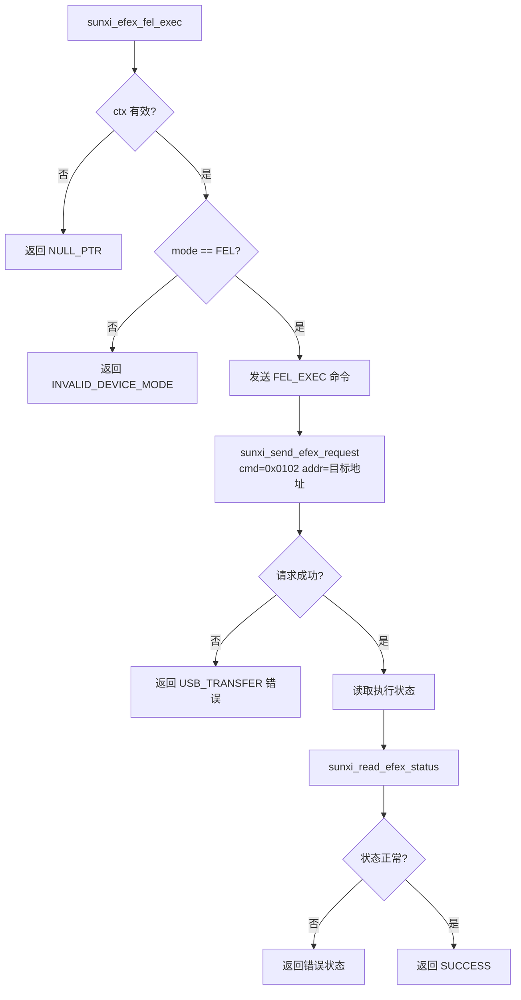
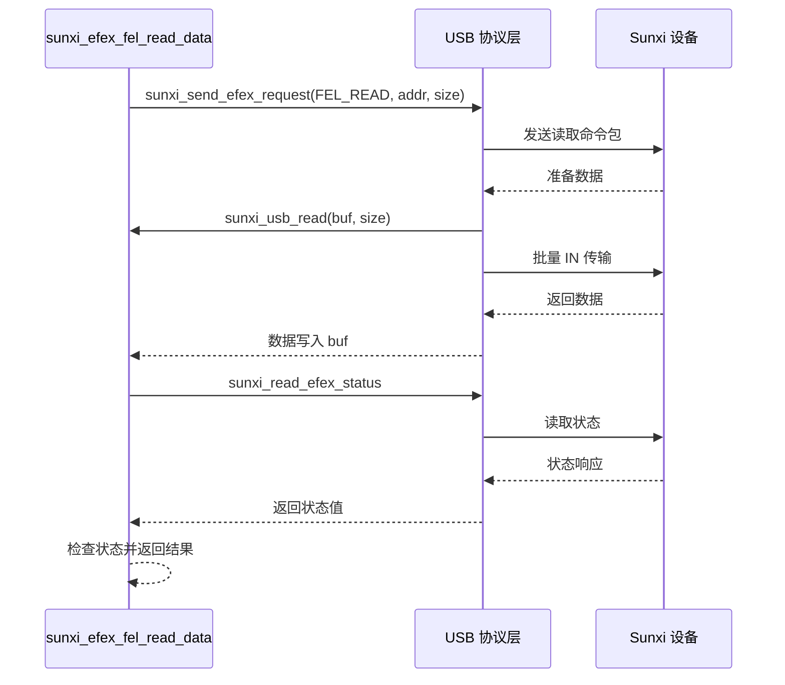
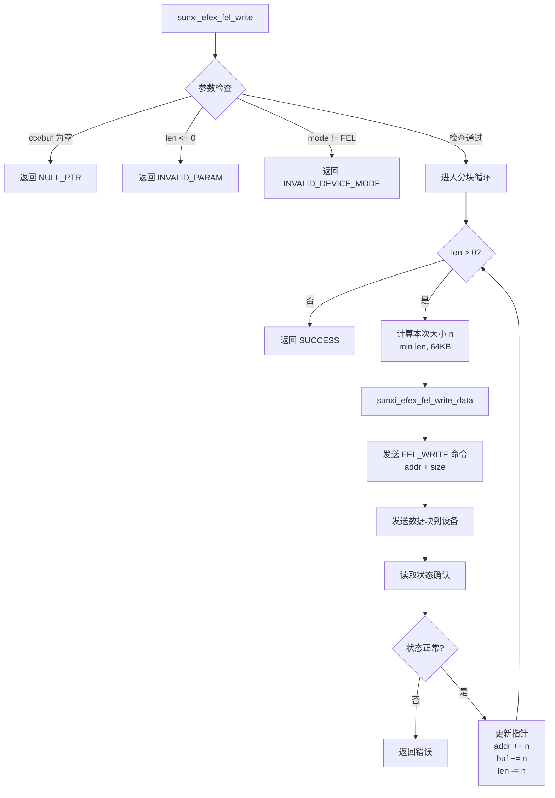
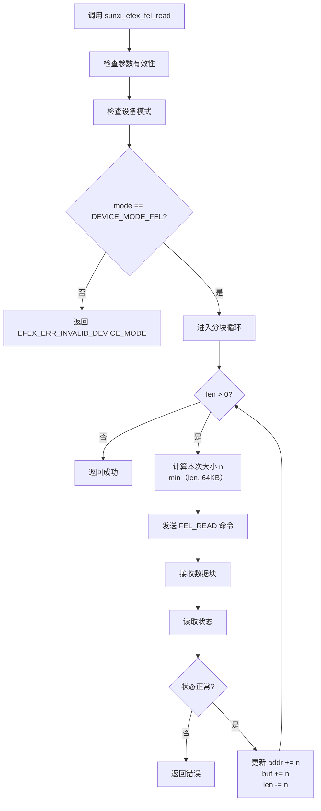
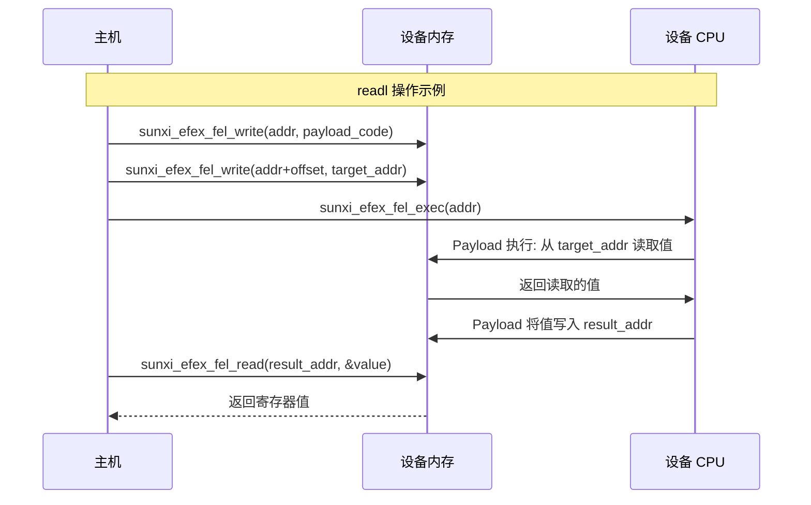

# libefex FEL 模式操作

## FEL 模式简介

FEL (Firmware Extraction Level) 是全志芯片 BootROM 中内置的低级子程序模式。在 FEL 模式下，主机可以通过 USB 直接访问设备内存，实现：

- 内存读取 (`sunxi_efex_fel_read`)
- 内存写入 (`sunxi_efex_fel_write`)
- 代码执行 (`sunxi_efex_fel_exec`)

## FEL 代码执行实现

源码位置: `src/efex-fel.c:12-32`

```c
int sunxi_efex_fel_exec(const struct sunxi_efex_ctx_t *ctx, 
                        const uint32_t addr) {
    if (!ctx) {
        return EFEX_ERR_NULL_PTR;
    }

    // 检查设备必须在 FEL 模式
    if (ctx->resp.mode != DEVICE_MODE_FEL) {
        return EFEX_ERR_INVALID_DEVICE_MODE;
    }

    // 发送执行命令
    int ret = sunxi_send_efex_request(ctx, EFEX_CMD_FEL_EXEC, addr, 0);
    if (ret != EFEX_ERR_SUCCESS) {
        return ret;
    }

    // 读取执行状态
    ret = sunxi_read_efex_status(ctx);
    if (ret < 0) {
        return ret;
    }

    return EFEX_ERR_SUCCESS;
}
```

该函数让设备 CPU 跳转到指定地址执行已写入内存的代码。

### FEL exec 执行流程



## FEL 内存读取实现

### 单次读取函数

源码位置: `src/efex-fel.c:34-52`

```c
static inline int sunxi_efex_fel_read_data(
        const struct sunxi_efex_ctx_t *ctx, 
        const uint32_t addr, 
        const char *buf, 
        const ssize_t size) {
    int ret = 0;
    
    // 1. 发送读取请求
    ret = sunxi_send_efex_request(ctx, EFEX_CMD_FEL_READ, addr, size);
    if (ret != EFEX_ERR_SUCCESS) {
        return ret;
    }

    // 2. 接收读取的数据
    ret = sunxi_usb_read(ctx, (void *) buf, size);
    if (ret != EFEX_ERR_SUCCESS) {
        return ret;
    }

    // 3. 读取状态确认
    ret = sunxi_read_efex_status(ctx);
    if (ret < 0) {
        return ret;
    }
    
    return EFEX_ERR_SUCCESS;
}
```

### 单次读取流程图



### 分块读取函数

源码位置: `src/efex-fel.c:74-100`

```c
int sunxi_efex_fel_read(const struct sunxi_efex_ctx_t *ctx, 
                        uint32_t addr, char *buf, ssize_t len) {
    if (!ctx || !buf) {
        return EFEX_ERR_NULL_PTR;
    }

    // 检查设备模式
    if (ctx->resp.mode != DEVICE_MODE_FEL) {
        return EFEX_ERR_INVALID_DEVICE_MODE;
    }

    if (len <= 0) {
        return EFEX_ERR_INVALID_PARAM;
    }

    int ret = EFEX_ERR_SUCCESS;
    
    // 分块读取循环
    while (len > 0) {
        // 计算本次传输大小 (最大 64KB)
        const uint32_t n = len > EFEX_CODE_MAX_SIZE 
                          ? EFEX_CODE_MAX_SIZE 
                          : (uint32_t) len;

        // 执行单次读取
        ret = sunxi_efex_fel_read_data(ctx, addr, buf, n);
        if (ret < 0)
            return ret;

        // 更新地址和缓冲区指针
        addr += n;
        buf += n;
        len -= n;
    }
    
    return ret;
}
```

## FEL 内存写入实现

### 单次写入函数

源码位置: `src/efex-fel.c:54-72`

```c
static inline int sunxi_efex_fel_write_data(
        const struct sunxi_efex_ctx_t *ctx, 
        const uint32_t addr, 
        const char *buf, 
        const ssize_t size) {
    int ret = 0;
    
    // 1. 发送写入请求
    ret = sunxi_send_efex_request(ctx, EFEX_CMD_FEL_WRITE, addr, size);
    if (ret != EFEX_ERR_SUCCESS) {
        return ret;
    }

    // 2. 发送要写入的数据
    ret = sunxi_usb_write(ctx, buf, size);
    if (ret != EFEX_ERR_SUCCESS) {
        return ret;
    }

    // 3. 读取状态确认
    ret = sunxi_read_efex_status(ctx);
    if (ret < 0) {
        return ret;
    }
    
    return EFEX_ERR_SUCCESS;
}
```

### 分块写入函数

源码位置: `src/efex-fel.c:102-128`

```c
int sunxi_efex_fel_write(const struct sunxi_efex_ctx_t *ctx, 
                         uint32_t addr, const char *buf, ssize_t len) {
    if (!ctx || !buf) {
        return EFEX_ERR_NULL_PTR;
    }

    // 检查设备模式
    if (ctx->resp.mode != DEVICE_MODE_FEL) {
        return EFEX_ERR_INVALID_DEVICE_MODE;
    }

    if (len <= 0) {
        return EFEX_ERR_INVALID_PARAM;
    }

    int ret = EFEX_ERR_SUCCESS;
    
    // 分块写入循环
    while (len > 0) {
        // 计算本次传输大小 (最大 64KB)
        const uint32_t n = len > EFEX_CODE_MAX_SIZE 
                          ? EFEX_CODE_MAX_SIZE 
                          : (uint32_t) len;

        // 执行单次写入
        ret = sunxi_efex_fel_write_data(ctx, addr, buf, n);
        if (ret < 0)
            return ret;

        // 更新地址和缓冲区指针
        addr += n;
        buf += n;
        len -= n;
    }
    
    return ret;
}
```

### 分块写入流程图



## 带回调的读写函数

源码位置: `src/efex-fel.c:130-192`

```c
// 带进度回调的读取
int sunxi_efex_fel_read_cb(const struct sunxi_efex_ctx_t *ctx, 
                           uint32_t addr, const char *buf, ssize_t len,
                           void (*callback)(ssize_t done)) {
    // ... 初始化检查 ...

    int ret = EFEX_ERR_SUCCESS;
    while (len > 0) {
        const uint32_t n = len > EFEX_CODE_MAX_SIZE 
                          ? EFEX_CODE_MAX_SIZE 
                          : (uint32_t) len;

        ret = sunxi_efex_fel_read_data(ctx, addr, buf, n);
        if (ret < 0)
            return ret;

        // 调用进度回调
        if (callback)
            callback((ssize_t) n);

        addr += n;
        buf += n;
        len -= n;
    }
    return ret;
}

// 带进度回调的写入
int sunxi_efex_fel_write_cb(const struct sunxi_efex_ctx_t *ctx, 
                            uint32_t addr, const char *buf, ssize_t len,
                            void (*callback)(ssize_t done)) {
    // ... 初始化检查 ...

    int ret = EFEX_ERR_SUCCESS;
    while (len > 0) {
        const uint32_t n = len > EFEX_CODE_MAX_SIZE 
                          ? EFEX_CODE_MAX_SIZE 
                          : (uint32_t) len;

        ret = sunxi_efex_fel_write_data(ctx, addr, buf, n);
        if (ret < 0)
            return ret;

        // 调用进度回调
        if (callback)
            callback((ssize_t) n);

        addr += n;
        buf += n;
        len -= n;
    }
    return ret;
}
```

## 分块传输流程图



## Payload 注入流程



## EFEX 请求发送实现

源码位置: `src/efex-common.c:13-32`

```c
int sunxi_send_efex_request(const struct sunxi_efex_ctx_t *ctx, 
                            const enum sunxi_efex_cmd_t type, 
                            const uint32_t addr,
                            const uint32_t length) {
    if (!ctx) {
        return EFEX_ERR_NULL_PTR;
    }

    // 构建 EFEX 请求结构
    const struct sunxi_efex_request_t req = {
        .cmd = cpu_to_le16(type),      // 命令类型
        .tag = 0x0,                    // 标签
        .address = cpu_to_le32(addr),  // 目标地址
        .len = cpu_to_le32(length),    // 数据长度
    };

    // 发送请求
    const int ret = sunxi_usb_write(ctx, &req, 
                                    sizeof(struct sunxi_efex_request_t));
    if (ret != 0) {
        return EFEX_ERR_USB_TRANSFER;
    }

    return EFEX_ERR_SUCCESS;
}
```

## EFEX 状态读取实现

源码位置: `src/efex-common.c:34-45`

```c
int sunxi_read_efex_status(const struct sunxi_efex_ctx_t *ctx) {
    if (!ctx) {
        return EFEX_ERR_NULL_PTR;
    }

    // 读取响应状态
    const struct sunxi_efex_response_t resp = {0};
    const int ret = sunxi_usb_read(ctx, &resp, sizeof(resp));
    if (ret != 0) {
        return EFEX_ERR_USB_TRANSFER;
    }
    
    return resp.status;
}
```

## FEL API 使用示例

### 基础内存操作

```c
#include <libefex.h>

int main() {
    struct sunxi_efex_ctx_t ctx = {0};
    
    // 1. 扫描并连接设备
    int ret = sunxi_scan_usb_device(&ctx);
    if (ret != EFEX_ERR_SUCCESS) {
        printf("Device not found: %s\n", sunxi_efex_strerror(ret));
        return -1;
    }
    
    // 2. 初始化 USB
    ret = sunxi_usb_init(&ctx);
    if (ret != EFEX_ERR_SUCCESS) {
        printf("USB init failed: %s\n", sunxi_efex_strerror(ret));
        return -1;
    }
    
    // 3. 初始化 EFEX 协议
    ret = sunxi_efex_init(&ctx);
    if (ret != EFEX_ERR_SUCCESS) {
        printf("EFEX init failed: %s\n", sunxi_efex_strerror(ret));
        return -1;
    }
    
    // 4. 检查设备模式
    printf("Device mode: %s\n", sunxi_efex_get_device_mode_str(&ctx));
    printf("Chip ID: 0x%08x\n", ctx.resp.id);
    
    // 5. 读取内存 (示例: 读取 SRAM)
    char buf[1024];
    ret = sunxi_efex_fel_read(&ctx, 0x40000000, buf, sizeof(buf));
    if (ret == EFEX_ERR_SUCCESS) {
        printf("Read 1024 bytes from 0x40000000\n");
    }
    
    // 6. 写入内存
    char data[] = {0x01, 0x02, 0x03, 0x04};
    ret = sunxi_efex_fel_write(&ctx, 0x40010000, data, sizeof(data));
    
    // 7. 执行代码
    ret = sunxi_efex_fel_exec(&ctx, 0x40010000);
    
    // 8. 清理
    sunxi_usb_exit(&ctx);
    
    return 0;
}
```

### 带进度回调的写入

```c
void progress_callback(ssize_t done) {
    printf("Transferred %zd bytes\n", done);
}

int write_with_progress(struct sunxi_efex_ctx_t *ctx) {
    char large_data[1024 * 1024];  // 1MB 数据
    
    int ret = sunxi_efex_fel_write_cb(&ctx, 0x40000000, large_data,
                                       sizeof(large_data), progress_callback);
    
    return ret;
}
```

