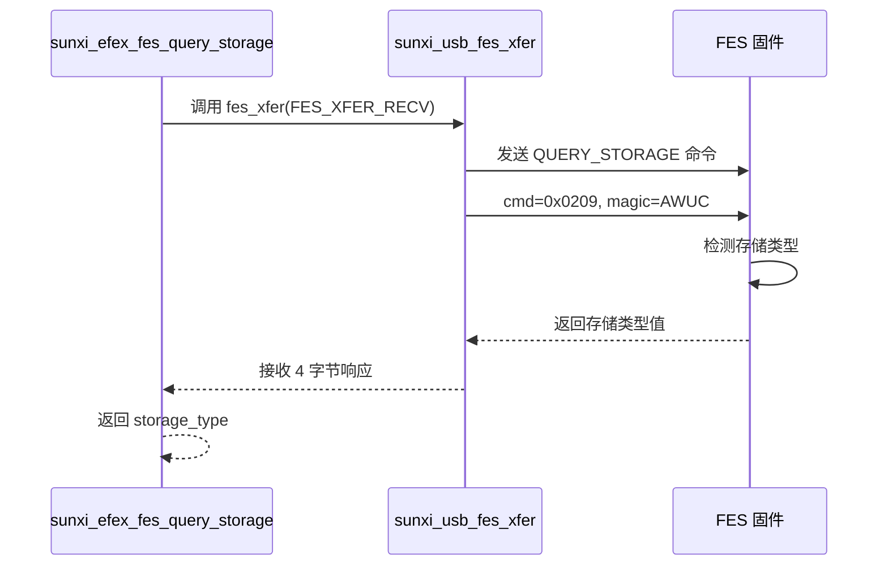
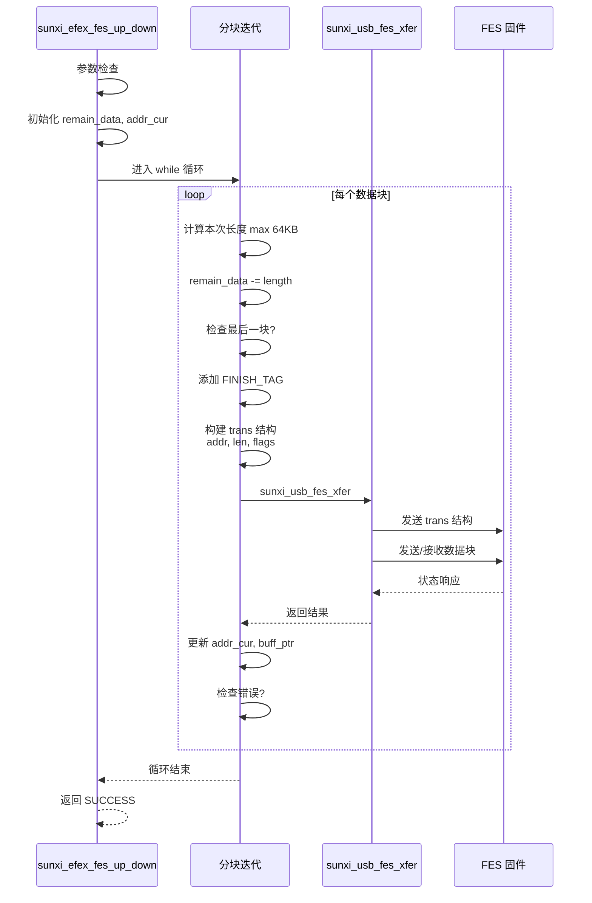
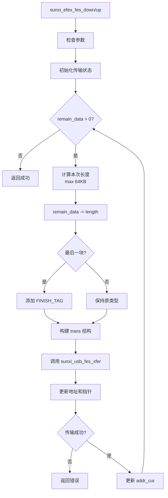

# libefex FES 模式操作

## FES 模式简介

FES (Firmware Extraction Stage) 是 FEL 模式的升级版本，提供更高级的闪存操作能力。FES 模式需要先在 FEL 模式下加载特定固件才能进入。

### FES vs FEL 对比

| 特性 | FEL 模式 | FES 模式 |
|------|----------|----------|
| 内存访问 | 直接读写 | 通过固件代理 |
| 闪存操作 | 不支持 | 完整支持 |
| 代码执行 | 直接执行 | 通过固件 |
| 设备状态 | BootROM | 固件运行 |

## FES 模式检查

FES 操作前需要确认设备处于 `DEVICE_MODE_SRV` 模式：

源码位置: `src/efex-usb.c:106-108`

```c
// FES 传输函数中的模式检查
if (ctx->resp.mode != DEVICE_MODE_SRV) {
    return EFEX_ERR_INVALID_PARAM;
}
```

## 存储查询实现

源码位置: `src/efex-fes.c:13-16`

```c
int sunxi_efex_fes_query_storage(const struct sunxi_efex_ctx_t *ctx, 
                                  uint32_t *storage_type) {
    return sunxi_usb_fes_xfer(ctx, FES_XFER_RECV, 
                              EFEX_CMD_FES_QUERY_STORAGE, 
                              NULL, 0, 
                              (char *) storage_type,
                              sizeof(uint32_t));
}
```

该函数发送 `EFEX_CMD_FES_QUERY_STORAGE` 命令并接收存储类型响应。

### 存储查询流程图



### 其他查询函数

源码位置: `src/efex-fes.c:18-39`

```c
// 查询安全状态
int sunxi_efex_fes_query_secure(const struct sunxi_efex_ctx_t *ctx, 
                                 uint32_t *secure_type) {
    return sunxi_usb_fes_xfer(ctx, FES_XFER_RECV, 
                              EFEX_CMD_FES_QUERY_SECURE, 
                              NULL, 0, 
                              (char *) secure_type,
                              sizeof(uint32_t));
}

// 探测闪存大小
int sunxi_efex_fes_probe_flash_size(const struct sunxi_efex_ctx_t *ctx, 
                                     uint32_t *flash_size) {
    return sunxi_usb_fes_xfer(ctx, FES_XFER_RECV, 
                              EFEX_CMD_FES_FLASH_SIZE_PROBE, 
                              NULL, 0, 
                              (char *) flash_size,
                              sizeof(uint32_t));
}

// 设置闪存开关
int sunxi_efex_fes_flash_set_onoff(const struct sunxi_efex_ctx_t *ctx, 
                                   const uint32_t *storage_type,
                                   const uint32_t on_off) {
    const struct sunxi_fes_flash_t fes_flash = {
        .flash_type = cpu_to_le32(*storage_type),
    };
    
    const enum sunxi_efex_cmd_t cmd = on_off 
        ? EFEX_CMD_FES_FLASH_SET_ON 
        : EFEX_CMD_FES_FLASH_SET_OFF;
        
    return sunxi_usb_fes_xfer(ctx, FES_XFER_NONE, cmd,
                              (const char *) &fes_flash, 
                              sizeof(fes_flash), 
                              NULL, 0);
}

// 获取芯片 ID
int sunxi_efex_fes_get_chipid(const struct sunxi_efex_ctx_t *ctx, 
                               const char *chip_id) {
    return sunxi_usb_fes_xfer(ctx, FES_XFER_RECV, 
                              EFEX_CMD_FES_GET_CHIPID, 
                              NULL, 0, 
                              chip_id, 129);
}
```

## FES 数据传输结构

源码位置: `includes/efex-protocol.h:175-181`

```c
EFEX_PACKED_BEGIN
struct sunxi_fes_trans_t {
    uint32_t addr;     // 目标地址
    uint32_t len;      // 数据长度
    uint32_t flags;    // 传输标志 (数据类型 + 完成标记)
} EFEX_PACKED;
EFEX_PACKED_END
```

## FES 数据上传下载实现

### 核心 up_down 函数

源码位置: `src/efex-fes.c:41-91`

```c
static int sunxi_efex_fes_up_down(const struct sunxi_efex_ctx_t *ctx, 
                                  const char *buf, const ssize_t len,
                                  const uint32_t addr, 
                                  const enum sunxi_fes_data_type_t type,
                                  const enum sunxi_efex_cmd_t cmd) {
    if (!ctx || !buf) {
        return EFEX_ERR_NULL_PTR;
    }

    int ret = EFEX_ERR_SUCCESS;
    if (len <= 0) {
        return EFEX_ERR_INVALID_PARAM;
    }

    uint32_t remain_data = (uint32_t) len;
    const char *buff_ptr = (char *) buf;
    uint32_t addr_cur = addr;
    enum sunxi_fes_data_type_t current_type = type;
    const bool is_data_type = (type & SUNXI_EFEX_DATA_TYPE_MASK) != 0;

    while (remain_data > 0) {
        // 计算本次传输长度 (最大 64KB)
        const uint32_t length = (remain_data > EFEX_CODE_MAX_SIZE) 
                               ? EFEX_CODE_MAX_SIZE 
                               : remain_data;
        remain_data -= length;

        // 如果是最后一块数据，添加完成标记
        if (remain_data == 0) {
            current_type |= SUNXI_EFEX_TRANS_FINISH_TAG;
        }

        // 构建传输结构
        const struct sunxi_fes_trans_t trans = {
            .addr = addr_cur,
            .len = length,
            .flags = current_type,
        };

        // 根据命令类型确定传输方向
        const enum sunxi_usb_fes_xfer_type_t xfer_type = 
            (cmd == EFEX_CMD_FES_DOWN) ? FES_XFER_SEND : FES_XFER_RECV;

        // 执行 USB 传输
        ret = sunxi_usb_fes_xfer(ctx, xfer_type, cmd,
                                 (const char *) &trans, sizeof(trans),
                                 buff_ptr, length);

        // 根据数据类型更新地址
        addr_cur += is_data_type ? length : (length / 512);
        buff_ptr += length;

        // 检查错误
        if (ret != EFEX_ERR_SUCCESS) {
            return ret;
        }
    }

    return EFEX_ERR_SUCCESS;
}
```

### FES up_down 详细流程图



### 数据下载函数

源码位置: `src/efex-fes.c:93-96`

```c
int sunxi_efex_fes_down(const struct sunxi_efex_ctx_t *ctx, 
                        const char *buf, const ssize_t len, 
                        const uint32_t addr,
                        const enum sunxi_fes_data_type_t type) {
    return sunxi_efex_fes_up_down(ctx, buf, len, addr, type, 
                                  EFEX_CMD_FES_DOWN);
}
```

### 数据上传函数

源码位置: `src/efex-fes.c:98-101`

```c
int sunxi_efex_fes_up(const struct sunxi_efex_ctx_t *ctx, 
                      const char *buf, const ssize_t len, 
                      const uint32_t addr,
                      const enum sunxi_fes_data_type_t type) {
    return sunxi_efex_fes_up_down(ctx, buf, len, addr, type, 
                                  EFEX_CMD_FES_UP);
}
```

## 验证相关结构体

源码位置: `includes/efex-protocol.h:184-204`

```c
// 验证值请求
EFEX_PACKED_BEGIN
struct sunxi_fes_verify_value_t {
    uint32_t addr;
    uint64_t size;
} EFEX_PACKED;
EFEX_PACKED_END

// 验证状态请求
EFEX_PACKED_BEGIN
struct sunxi_fes_verify_status_t {
    uint32_t addr;
    uint32_t size;
    uint32_t tag;
} EFEX_PACKED;
EFEX_PACKED_END

// 验证响应
EFEX_PACKED_BEGIN
struct sunxi_fes_verify_resp_t {
    uint32_t flag;
    int32_t fes_crc;
    int32_t media_crc;
} EFEX_PACKED;
EFEX_PACKED_END
```

## 验证函数实现

源码位置: `src/efex-fes.c:103-133`

```c
// 验证数据值
int sunxi_efex_fes_verify_value(const struct sunxi_efex_ctx_t *ctx, 
                                const uint32_t addr, const uint64_t size,
                                const struct sunxi_fes_verify_resp_t *buf) {
    const struct sunxi_fes_verify_value_t verify_value = {
        .addr = cpu_to_le32(addr),
        .size = cpu_to_le64(size),
    };
    
    return sunxi_usb_fes_xfer(ctx, FES_XFER_RECV, 
                              EFEX_CMD_FES_VERIFY_VALUE,
                              (const char *) &verify_value, 
                              sizeof(verify_value),
                              (const char *) buf, 
                              sizeof(struct sunxi_fes_verify_resp_t));
}

// 验证状态
int sunxi_efex_fes_verify_status(const struct sunxi_efex_ctx_t *ctx, 
                                 const uint32_t tag,
                                 const struct sunxi_fes_verify_resp_t *buf) {
    const struct sunxi_fes_verify_status_t verify_status = {
        .addr = 0x0,
        .size = 0x0,
        .tag = cpu_to_le32(tag),
    };
    
    return sunxi_usb_fes_xfer(ctx, FES_XFER_RECV, 
                              EFEX_CMD_FES_VERIFY_STATUS,
                              (const char *) &verify_status, 
                              sizeof(verify_status),
                              (const char *) buf, 
                              sizeof(struct sunxi_fes_verify_resp_t));
}
```

## 工具模式切换

源码位置: `src/efex-fes.c:135-144`

```c
int sunxi_efex_fes_tool_mode(const struct sunxi_efex_ctx_t *ctx, 
                             const enum sunxi_fes_tool_mode_t tool_mode,
                             const enum sunxi_fes_tool_mode_t next_mode) {
    const struct sunxi_fes_set_tool_mode_t fes_tool_mode = {
        .tool_mode = cpu_to_le32(tool_mode),
        .next_mode = cpu_to_le32(next_mode),
        .reserved = 0x0,
    };
    
    return sunxi_usb_fes_xfer(ctx, FES_XFER_NONE, 
                              EFEX_CMD_FES_TOOL_MODE,
                              (const char *) &fes_tool_mode, 
                              sizeof(fes_tool_mode),
                              NULL, 0);
}
```

### 工具模式定义

源码位置: `includes/efex-protocol.h:105-111`

```c
enum sunxi_fes_tool_mode_t {
    TOOL_MODE_NORMAL = 0x1,    // 正常模式
    TOOL_MODE_REBOOT = 0x2,    // 重启
    TOOL_MODE_POWEROFF = 0x3,  // 关机
    TOOL_MODE_REUPDATE = 0x4,  // 重新更新
    TOOL_MODE_BOOT = 0x5,      // 启动系统
};
```

## FES 传输流程图



## FES API 使用示例

### 存储查询示例

```c
#include <libefex.h>

void query_storage_example(struct sunxi_efex_ctx_t *ctx) {
    // 查询存储类型
    uint32_t storage_type;
    int ret = sunxi_efex_fes_query_storage(ctx, &storage_type);
    
    if (ret == EFEX_ERR_SUCCESS) {
        switch (storage_type) {
            case 1:  // NAND
                printf("Storage: NAND Flash\n");
                break;
            case 2:  // SPI
                printf("Storage: SPI Flash\n");
                break;
            case 3:  // SDC
                printf("Storage: SD/MMC Card\n");
                break;
            default:
                printf("Storage: Unknown (%u)\n", storage_type);
                break;
        }
    }
    
    // 探测闪存大小
    uint32_t flash_size;
    ret = sunxi_efex_fes_probe_flash_size(ctx, &flash_size);
    if (ret == EFEX_ERR_SUCCESS) {
        printf("Flash size: %u MB\n", flash_size / (1024 * 1024));
    }
    
    // 获取芯片 ID
    char chip_id[129];
    ret = sunxi_efex_fes_get_chipid(ctx, chip_id);
    if (ret == EFEX_ERR_SUCCESS) {
        printf("Chip ID: %s\n", chip_id);
    }
}
```

### 数据下载示例

```c
void download_firmware_example(struct sunxi_efex_ctx_t *ctx) {
    // 准备固件数据
    char firmware_data[4096];
    // ... 加载固件数据 ...
    
    uint32_t flash_addr = 0x00000000;  // 闪存起始地址
    
    // 下载数据到闪存 (数据类型模式)
    int ret = sunxi_efex_fes_down(ctx, firmware_data, 
                                  sizeof(firmware_data),
                                  flash_addr, 
                                  SUNXI_EFEX_DATA_TYPE_DATA);
    
    if (ret != EFEX_ERR_SUCCESS) {
        printf("Download failed: %s\n", sunxi_efex_strerror(ret));
    } else {
        printf("Download completed successfully\n");
    }
}
```

### 设备重启示例

```c
void reboot_device_example(struct sunxi_efex_ctx_t *ctx) {
    // 设置工具模式为重启
    int ret = sunxi_efex_fes_tool_mode(ctx, 
                                        TOOL_MODE_REBOOT,
                                        TOOL_MODE_NORMAL);
    
    if (ret == EFEX_ERR_SUCCESS) {
        printf("Device will reboot...\n");
    }
}
```

