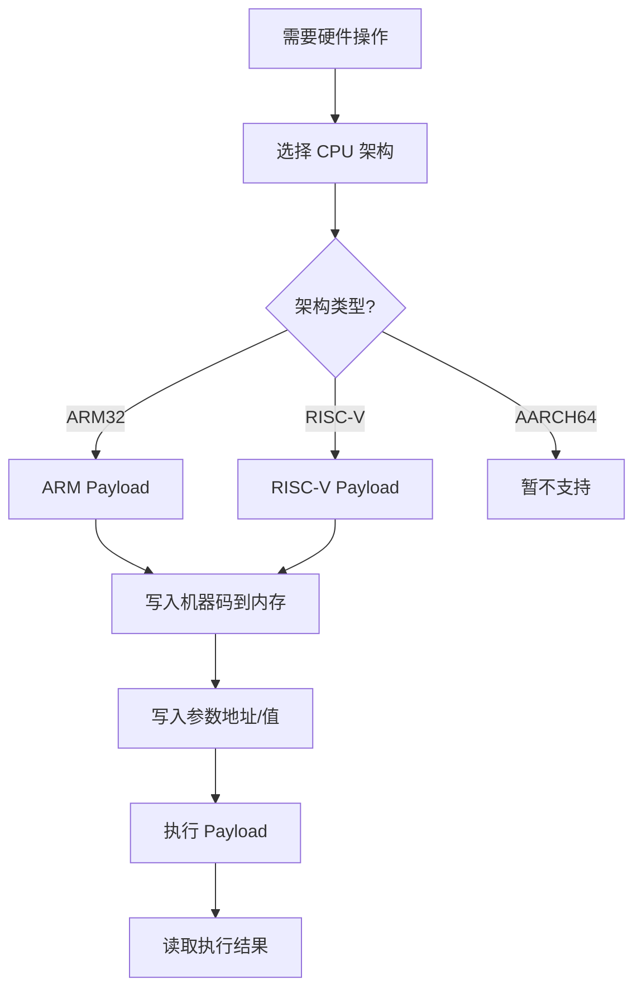
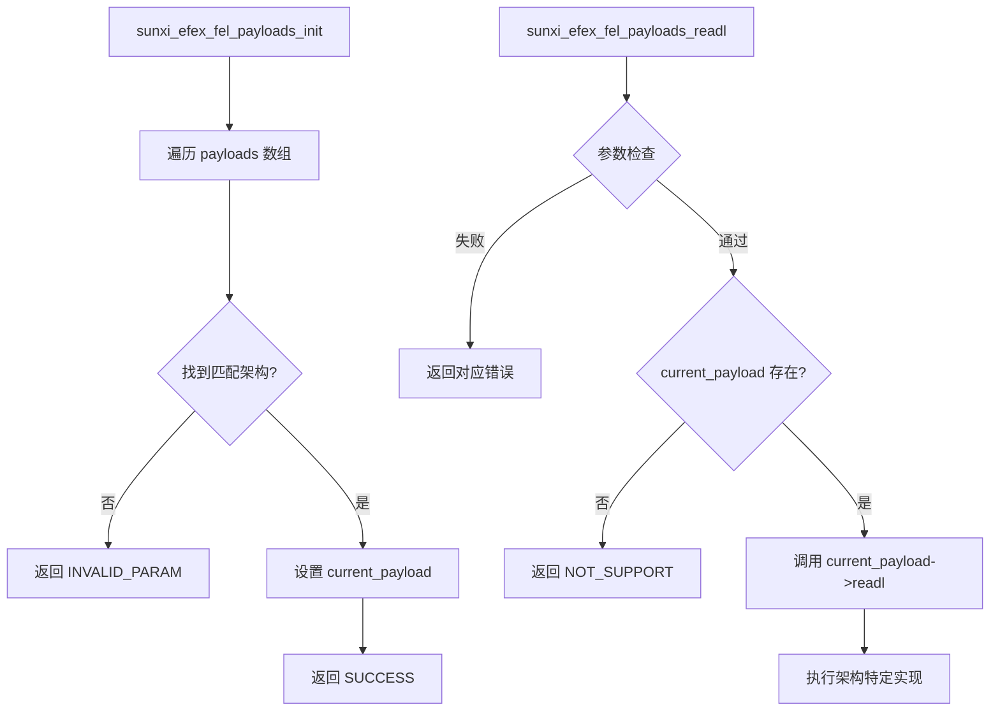
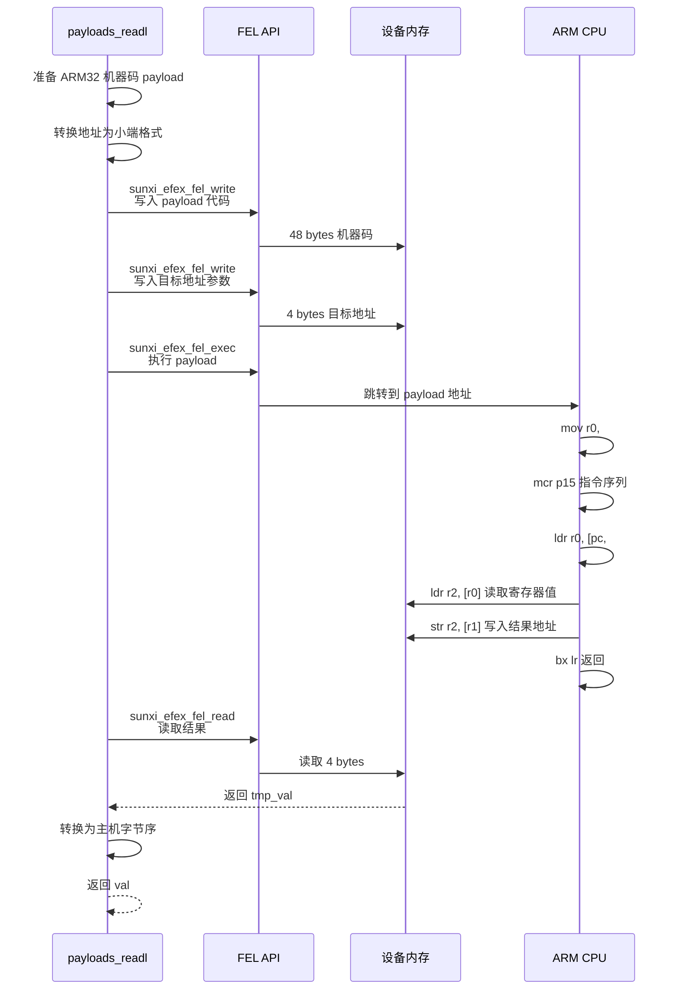
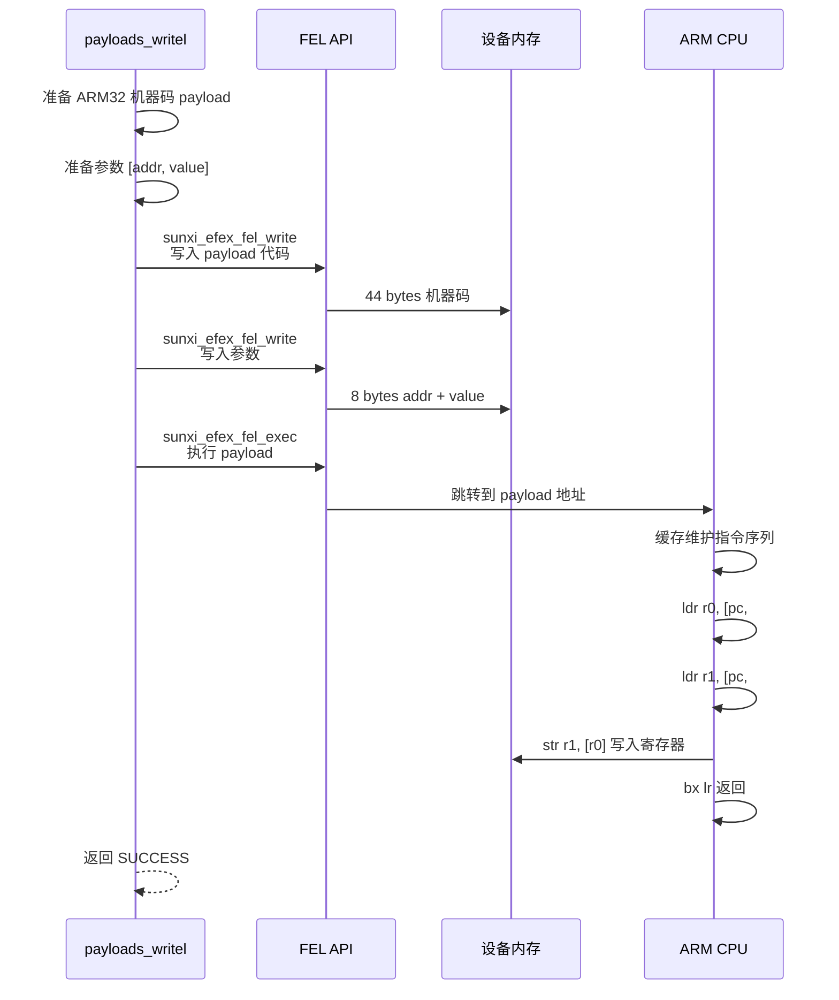
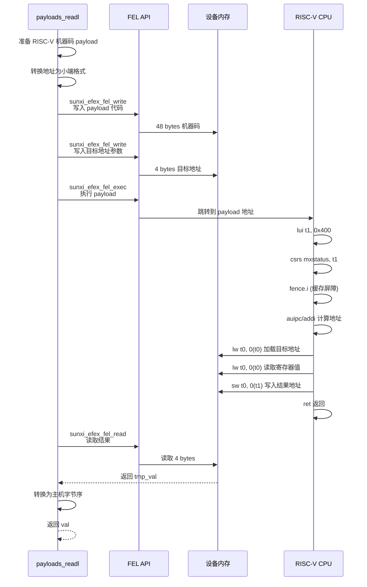
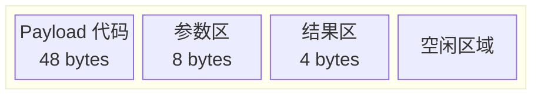

# libefex 架构 Payload

## Payload 技术概述

Payload 是一种机器码注入技术，用于在 FEL 模式下执行复杂的硬件操作。由于 FEL 只提供基础的内存读写和代码执行能力，要实现寄存器读写等高级操作，需要将特定的机器码写入设备内存并执行。



## Payload 调度器结构

源码位置: `includes/efex-payloads.h`

```c
struct payloads_ops {
    const char *name;                          // 架构名称
    enum sunxi_efex_fel_payloads_arch arch;    // 架构类型
    
    // 读取寄存器
    int (*readl)(const struct sunxi_efex_ctx_t *ctx, 
                 uint32_t addr, uint32_t *val);
    
    // 写入寄存器
    int (*writel)(const struct sunxi_efex_ctx_t *ctx, 
                  uint32_t value, uint32_t addr);
};
```

## Payload 调度器实现

源码位置: `src/efex-payloads.c`

```c
#include "efex-common.h"
#include "efex-payloads.h"
#include "efex-protocol.h"

// 外部架构操作结构
extern struct payloads_ops riscv_ops;
extern struct payloads_ops aarch64_ops;
extern struct payloads_ops arm_ops;

// Payload 数组
static struct payloads_ops *payloads[] = {
    &aarch64_ops,
    &arm_ops,
    &riscv_ops,
};

static struct payloads_ops *current_payload;

// 初始化 Payload 系统
int sunxi_efex_fel_payloads_init(const enum sunxi_efex_fel_payloads_arch arch) {
    for (size_t i = 0; i < sizeof(payloads) / sizeof(payloads[0]); ++i) {
        struct payloads_ops *p = payloads[i];
        if (p->arch == arch) {
            current_payload = p;
            return EFEX_ERR_SUCCESS;
        }
    }
    return EFEX_ERR_INVALID_PARAM;
}

// 获取当前 Payload
struct payloads_ops *sunxi_efex_fel_get_current_payload() { 
    return current_payload; 
}

// 通过 Payload 读取寄存器
int sunxi_efex_fel_payloads_readl(const struct sunxi_efex_ctx_t *ctx, 
                                  const uint32_t addr, uint32_t *val) {
    if (!ctx || !val) {
        return EFEX_ERR_NULL_PTR;
    }
    if (ctx->resp.mode != DEVICE_MODE_FEL) {
        return EFEX_ERR_INVALID_DEVICE_MODE;
    }
    if (!current_payload || !current_payload->readl) {
        return EFEX_ERR_NOT_SUPPORT;
    }
    return current_payload->readl(ctx, addr, val);
}

// 通过 Payload 写入寄存器
int sunxi_efex_fel_payloads_writel(const struct sunxi_efex_ctx_t *ctx, 
                                   const uint32_t value, const uint32_t addr) {
    if (!ctx) {
        return EFEX_ERR_NULL_PTR;
    }
    if (ctx->resp.mode != DEVICE_MODE_FEL) {
        return EFEX_ERR_INVALID_DEVICE_MODE;
    }
    if (!current_payload || !current_payload->writel) {
        return EFEX_ERR_NOT_SUPPORT;
    }
    return current_payload->writel(ctx, value, addr);
}
```

### Payload 调度流程图



## 支持的架构

| 架构 | 文件 | 状态 | 适用芯片 |
|------|------|------|----------|
| ARM32 | `src/arch/arm.c` | 完整实现 | A10/A13/A20/A23/A33 等 |
| RISC-V | `src/arch/riscv.c` | 完整实现 | D1/D1s 等 |
| AARCH64 | `src/arch/aarch64.c` | 待实现 | A64/A80/H3/H5 等 |

## ARM32 Payload 实现

### readl 实现

源码位置: `src/arch/arm.c:15-79`

```c
static int payloads_readl(const struct sunxi_efex_ctx_t *ctx, 
                          const uint32_t addr, uint32_t *val) {
    // ARMv7 机器码指令数组
    /* 注意: 不要声明为 'static'，某些 Windows 驱动无法访问
     * static 标记的 Payload 符号 */
    const uint32_t payload[] = {
        WARP_INST(0b11100011101000000000000000000000), /* mov r0, #0 */
        WARP_INST(0b11101110000010000000111100010111), /* mcr 15, 0, r0, cr8, cr7, {0} */
        WARP_INST(0b11101110000001110000111100010101), /* mcr 15, 0, r0, cr7, cr5, {0} */
        WARP_INST(0b11101110000001110000111111010101), /* mcr 15, 0, r0, cr7, cr5, {6} */
        WARP_INST(0b11101110000001110000111110011010), /* mcr 15, 0, r0, cr7, cr10, {4} */
        WARP_INST(0b11101110000001110000111110010101), /* mcr 15, 0, r0, cr7, cr5, {4} */
        WARP_INST(0b11101010111111111111111111111111), /* b 0x4 */
        WARP_INST(0b11100101100111110000000000001100), /* ldr r0, [pc, #12] */
        WARP_INST(0b11100010100011110001000000001100), /* add r1, pc, #12 */
        WARP_INST(0b11100101100100000010000000000000), /* ldr r2, [r0] */
        WARP_INST(0b11100101100000010010000000000000), /* str r2, [r1] */
        WARP_INST(0b11100001001011111111111100011110), /* bx lr */
        /* var_addr: 目标地址 (由 sunxi_fel_write 填充) */
        /* var_value: 结果值 (由 Payload 写入) */
    };

    if (!val) {
        return EFEX_ERR_NULL_PTR;
    }

    // 转换为小端格式
    uint32_t addr_le32 = cpu_to_le32(addr);
    uint32_t tmp_val = 0;
    int ret = EFEX_ERR_SUCCESS;

    // 1. 写入 Payload 到设备内存
    ret = sunxi_efex_fel_write(ctx, ctx->resp.data_start_address,
                               (void *) payload, sizeof(payload));
    if (ret != EFEX_ERR_SUCCESS) {
        return ret;
    }

    // 2. 写入目标地址参数
    ret = sunxi_efex_fel_write(ctx, 
                               ctx->resp.data_start_address + sizeof(payload),
                               (void *) &addr_le32, sizeof(addr_le32));
    if (ret != EFEX_ERR_SUCCESS) {
        return ret;
    }

    // 3. 执行 Payload
    ret = sunxi_efex_fel_exec(ctx, ctx->resp.data_start_address);
    if (ret != EFEX_ERR_SUCCESS) {
        return ret;
    }

    // 4. 读取结果值
    ret = sunxi_efex_fel_read(ctx, 
                              ctx->resp.data_start_address + sizeof(payload) + sizeof(addr_le32),
                              (void *) &tmp_val, sizeof(tmp_val));
    if (ret != EFEX_ERR_SUCCESS) {
        return ret;
    }

    // 转换为主机字节序
    *val = le32_to_cpu(tmp_val);

    return EFEX_ERR_SUCCESS;
}
```

### ARM32 readl 执行流程图



### writel 实现

源码位置: `src/arch/arm.c:82-131`

```c
static int payloads_writel(const struct sunxi_efex_ctx_t *ctx, 
                           const uint32_t value, const uint32_t addr) {
    // ARMv7 机器码指令数组
    const uint32_t payload[] = {
        WARP_INST(0b11100011101000000000000000000000), /* mov r0, #0 */
        WARP_INST(0b11101110000010000000111100010111), /* mcr 15, 0, r0, cr8, cr7, {0} */
        WARP_INST(0b11101110000001110000111100010101), /* mcr 15, 0, r0, cr7, cr5, {0} */
        WARP_INST(0b11101110000001110000111111010101), /* mcr 15, 0, r0, cr7, cr5, {6} */
        WARP_INST(0b11101110000001110000111110011010), /* mcr 15, 0, r0, cr7, cr10, {4} */
        WARP_INST(0b11101110000001110000111110010101), /* mcr 15, 0, r0, cr7, cr5, {4} */
        WARP_INST(0b11101010111111111111111111111111), /* b 0x4 */
        WARP_INST(0b11100101100111110000000000001000), /* ldr r0, [pc, #8] */
        WARP_INST(0b11100101100111110001000000001000), /* ldr r1, [pc, #8] */
        WARP_INST(0b11100101100000000001000000000000), /* str r1, [r0] */
        WARP_INST(0b11100001001011111111111100011110), /* bx lr */
        /* var_addr: 目标地址 */
        /* var_value: 要写入的值 */
    };

    // 准备参数 (地址和值)
    const uint32_t params[2] = {
        cpu_to_le32(addr),
        cpu_to_le32(value),
    };

    int ret = EFEX_ERR_SUCCESS;

    // 1. 写入 Payload
    ret = sunxi_efex_fel_write(ctx, ctx->resp.data_start_address,
                               (void *) payload, sizeof(payload));
    if (ret != EFEX_ERR_SUCCESS) {
        return ret;
    }

    // 2. 写入参数
    ret = sunxi_efex_fel_write(ctx, 
                               ctx->resp.data_start_address + sizeof(payload),
                               (void *) params, sizeof(params));
    if (ret != EFEX_ERR_SUCCESS) {
        return ret;
    }

    // 3. 执行 Payload
    ret = sunxi_efex_fel_exec(ctx, ctx->resp.data_start_address);
    if (ret != EFEX_ERR_SUCCESS) {
        return ret;
    }

    return EFEX_ERR_SUCCESS;
}
```

### ARM32 writel 执行流程图



### ARM Ops 结构

源码位置: `src/arch/arm.c:134-139`

```c
struct payloads_ops arm_ops = {
    .name = "arm32",
    .arch = ARCH_ARM32,
    .readl = payloads_readl,
    .writel = payloads_writel,
};
```

## ARM32 指令详解

| 指令 | 机器码 | 说明 |
|------|--------|------|
| `mov r0, #0` | `0xe3a00000` | 清除 r0 寄存器 |
| `mcr p15, 0, r0, c8, c7, {0}` | `0xee080f17` | TLB 无效化 (缓存维护) |
| `mcr p15, 0, r0, c7, c5, {0}` | `0xee071f15` | 指令缓存无效化 |
| `mcr p15, 0, r0, c7, c5, {6}` | `0xee071f55` | 分支预测器无效化 |
| `mcr p15, 0, r0, c7, c10, {4}` | `0xee071f9a` | 数据同步屏障 |
| `mcr p15, 0, r0, c7, c5, {4}` | `0xee071f15` | 数据缓存无效化 |
| `b 0x4` | `0xeafffffe` | 等待循环 |
| `ldr r0, [pc, #offset]` | `0xe59f0xxx` | 加载目标地址 |
| `ldr r2, [r0]` | `0xe5912000` | 从地址读取值 |
| `str r2, [r1]` | `0xe5812000` | 将值写入结果地址 |
| `bx lr` | `0xe12fff1e` | 返回调用者 |

## RISC-V Payload 实现

### readl 实现

源码位置: `src/arch/riscv.c:15-79`

```c
static int payloads_readl(const struct sunxi_efex_ctx_t *ctx, 
                          const uint32_t addr, uint32_t *val) {
    // RISC-V 机器码指令数组
    const uint32_t payload[] = {
        WARP_INST(0b00000000010000000000001100110111), /* lui t1, 0x400 */
        WARP_INST(0b01111100000000110010000001110011), /* csrs mxstatus, t1 */
        WARP_INST(0b00000000000000000001000000001111), /* fence.i */
        WARP_INST(0b00000000010000000000000001101111), /* j +4 */
        WARP_INST(0b00000000000000000000001010010111), /* auipc t0, 0x0 */
        WARP_INST(0b00000010000000101000001010010011), /* addi t0, t0, 32 */
        WARP_INST(0b00000000000000101010001010000011), /* lw t0, 0(t0) */
        WARP_INST(0b00000000000000101010001010000011), /* lw t0, 0(t0) */
        WARP_INST(0b00000000000000000000001100010111), /* auipc t1, 0x0 */
        WARP_INST(0b00000001010000110000001100010011), /* addi t1, t1, 20 */
        WARP_INST(0b00000000010100110010000000100011), /* sw t0, 0(t1) */
        WARP_INST(0b00000000000000001000000001100111), /* ret */
        /* var_addr: 目标地址 */
        /* var_value: 结果值 */
    };

    if (!val) {
        return EFEX_ERR_NULL_PTR;
    }

    uint32_t addr_le32 = cpu_to_le32(addr);
    uint32_t tmp_val = 0;
    int ret = EFEX_ERR_SUCCESS;

    // 1. 写入 Payload
    ret = sunxi_efex_fel_write(ctx, ctx->resp.data_start_address,
                               (void *) payload, sizeof(payload));
    if (ret != EFEX_ERR_SUCCESS) {
        return ret;
    }

    // 2. 写入目标地址
    ret = sunxi_efex_fel_write(ctx, 
                               ctx->resp.data_start_address + sizeof(payload),
                               (void *) &addr_le32, sizeof(addr_le32));
    if (ret != EFEX_ERR_SUCCESS) {
        return ret;
    }

    // 3. 执行 Payload
    ret = sunxi_efex_fel_exec(ctx, ctx->resp.data_start_address);
    if (ret != EFEX_ERR_SUCCESS) {
        return ret;
    }

    // 4. 读取结果
    ret = sunxi_efex_fel_read(ctx, 
                              ctx->resp.data_start_address + sizeof(payload) + sizeof(addr_le32),
                              (void *) &tmp_val, sizeof(tmp_val));
    if (ret != EFEX_ERR_SUCCESS) {
        return ret;
    }

    *val = le32_to_cpu(tmp_val);

    return EFEX_ERR_SUCCESS;
}
```

### RISC-V readl 执行流程图



### writel 实现

源码位置: `src/arch/riscv.c:82-132`

```c
static int payloads_writel(const struct sunxi_efex_ctx_t *ctx, 
                           const uint32_t value, const uint32_t addr) {
    // RISC-V 机器码指令数组
    const uint32_t payload[] = {
        WARP_INST(0b00000000010000000000001100110111), /* lui t1, 0x400 */
        WARP_INST(0b01111100000000110010000001110011), /* csrs mxstatus, t1 */
        WARP_INST(0b00000000000000000001000000001111), /* fence.i */
        WARP_INST(0b00000000010000000000000001101111), /* j +4 */
        WARP_INST(0b00000000000000000000001010010111), /* auipc t0, 0x0 */
        WARP_INST(0b00000010000000101000001010010011), /* addi t0, t0, 32 */
        WARP_INST(0b00000000000000101010001010000011), /* lw t0, 0(t0) */
        WARP_INST(0b00000000000000000000001100010111), /* auipc t1, 0x0 */
        WARP_INST(0b00000001100000110000001100010011), /* addi t1, t1, 24 */
        WARP_INST(0b00000000000000110010001100000011), /* lw t1, 0(t1) */
        WARP_INST(0b00000000011000101010000000100011), /* sw t1, 0(t0) */
        WARP_INST(0b00000000000000001000000001100111), /* ret */
        /* var_addr: 目标地址 */
        /* var_value: 要写入的值 */
    };

    const uint32_t params[2] = {
        cpu_to_le32(addr),
        cpu_to_le32(value),
    };

    int ret = EFEX_ERR_SUCCESS;

    // 1. 写入 Payload
    ret = sunxi_efex_fel_write(ctx, ctx->resp.data_start_address,
                               (void *) payload, sizeof(payload));
    if (ret != EFEX_ERR_SUCCESS) {
        return ret;
    }

    // 2. 写入参数
    ret = sunxi_efex_fel_write(ctx, 
                               ctx->resp.data_start_address + sizeof(payload),
                               (void *) params, sizeof(params));
    if (ret != EFEX_ERR_SUCCESS) {
        return ret;
    }

    // 3. 执行 Payload
    ret = sunxi_efex_fel_exec(ctx, ctx->resp.data_start_address);
    if (ret != EFEX_ERR_SUCCESS) {
        return ret;
    }

    return EFEX_ERR_SUCCESS;
}
```

### RISC-V Ops 结构

源码位置: `src/arch/riscv.c:135-140`

```c
struct payloads_ops riscv_ops = {
    .name = "riscv",
    .arch = ARCH_RISCV,
    .readl = payloads_readl,
    .writel = payloads_writel,
};
```

## RISC-V 指令详解

| 指令 | 机器码 | 说明 |
|------|--------|------|
| `lui t1, 0x400` | `0x40000337` | 加载立即数高位到 t1 |
| `csrs mxstatus, t1` | `0xfc003110` | 设置扩展状态寄存器 |
| `fence.i` | `0x0000100f` | 指令缓存屏障 |
| `j +4` | `0x0040006f` | 跳转等待 |
| `auipc t0, 0x0` | `0x00001297` | PC 相对地址加载 |
| `addi t0, t0, offset` | `0x02028293` | 计算实际地址 |
| `lw t0, 0(t0)` | `0x0002a283` | 加载目标地址 |
| `lw t0, 0(t0)` | `0x0002a283` | 从地址读取值 |
| `sw t0, 0(t1)` | `0x00531023` | 将值写入结果地址 |
| `ret` | `0x00008067` | 返回调用者 |

## Payload API 使用示例

### 初始化 Payload

```c
#include <libefex.h>

int main() {
    struct sunxi_efex_ctx_t ctx = {0};
    
    // 连接设备
    sunxi_scan_usb_device(&ctx);
    sunxi_usb_init(&ctx);
    sunxi_efex_init(&ctx);
    
    // 根据芯片 ID 判断架构并初始化 Payload
    enum sunxi_efex_fel_payloads_arch arch;
    
    if ((ctx.resp.id & 0xffff) == 0x1623 ||   // A10
        (ctx.resp.id & 0xffff) == 0x1651) {   // A20
        arch = ARCH_ARM32;
    } else if ((ctx.resp.id & 0xffff) == 0x1700) {  // D1/D1s
        arch = ARCH_RISCV;
    } else {
        printf("Unknown chip architecture\n");
        return -1;
    }
    
    int ret = sunxi_efex_fel_payloads_init(arch);
    if (ret != EFEX_ERR_SUCCESS) {
        printf("Payload init failed: %s\n", sunxi_efex_strerror(ret));
        return -1;
    }
    
    printf("Payload initialized: %s\n", 
           sunxi_efex_fel_get_current_payload()->name);
    
    // ... 使用 Payload API ...
    
    sunxi_usb_exit(&ctx);
    return 0;
}
```

### 寄存器读写示例

```c
void read_write_registers(struct sunxi_efex_ctx_t *ctx) {
    // 读取时钟控制寄存器 (CCU)
    uint32_t clk_value;
    int ret = sunxi_efex_fel_payloads_readl(ctx, 0x01c20000, &clk_value);
    
    if (ret == EFEX_ERR_SUCCESS) {
        printf("Clock register at 0x01c20000: 0x%08x\n", clk_value);
    } else {
        printf("Read failed: %s\n", sunxi_efex_strerror(ret));
    }
    
    // 写入 GPIO 配置寄存器
    ret = sunxi_efex_fel_payloads_writel(ctx, 0x12345678, 0x01c20800);
    
    if (ret == EFEX_ERR_SUCCESS) {
        printf("Write to 0x01c20800 successful\n");
    } else {
        printf("Write failed: %s\n", sunxi_efex_strerror(ret));
    }
}
```

## 内存布局



### Payload 内存地址分配

| 区域 | 地址偏移 | 大小 | 说明 |
|------|----------|------|------|
| Payload 代码区 | `data_start_address` | ~48 bytes | 机器码存放 |
| 参数区 | `+ sizeof(payload)` | 4-8 bytes | 目标地址/值 |
| 结果区 | `+ sizeof(payload) + sizeof(params)` | 4 bytes | 执行结果存放 |

