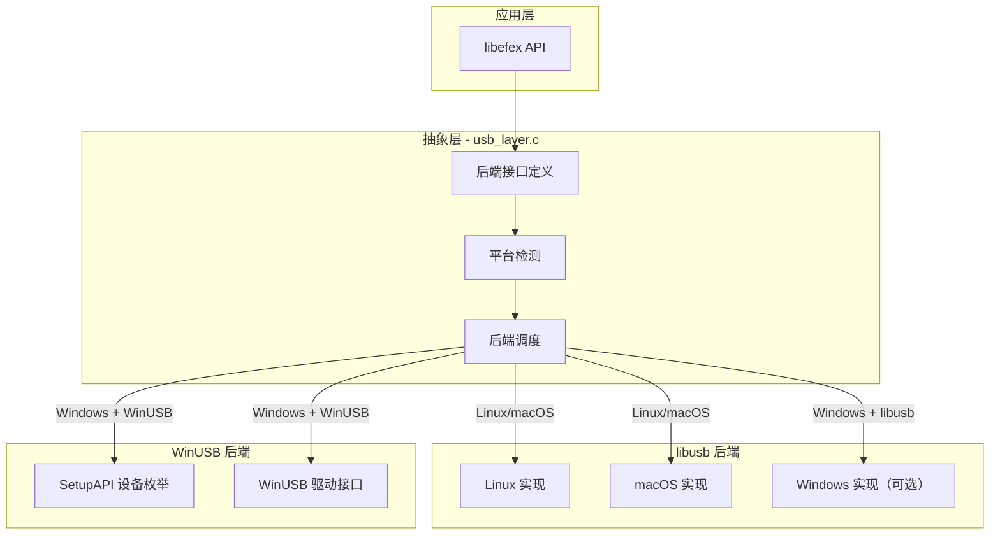
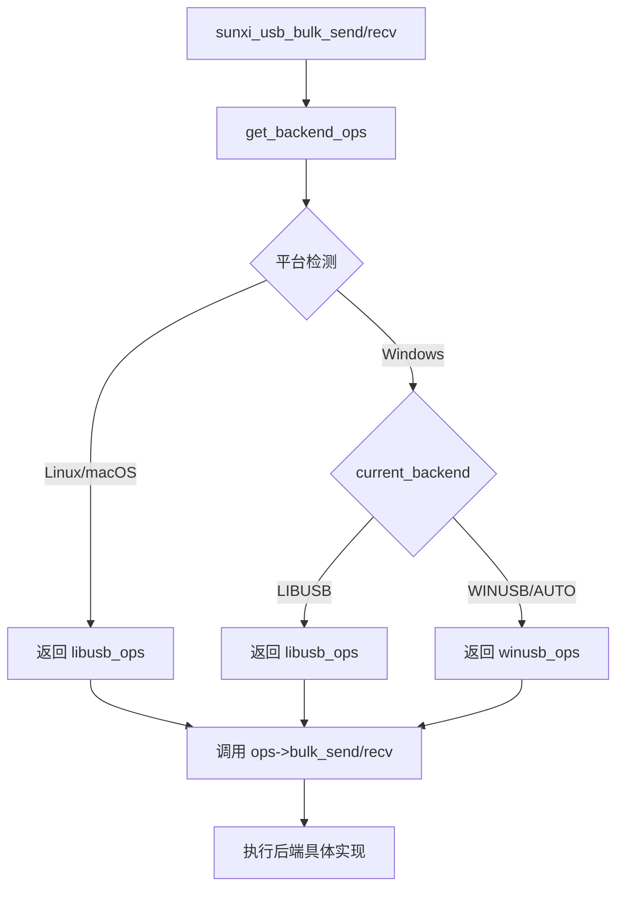
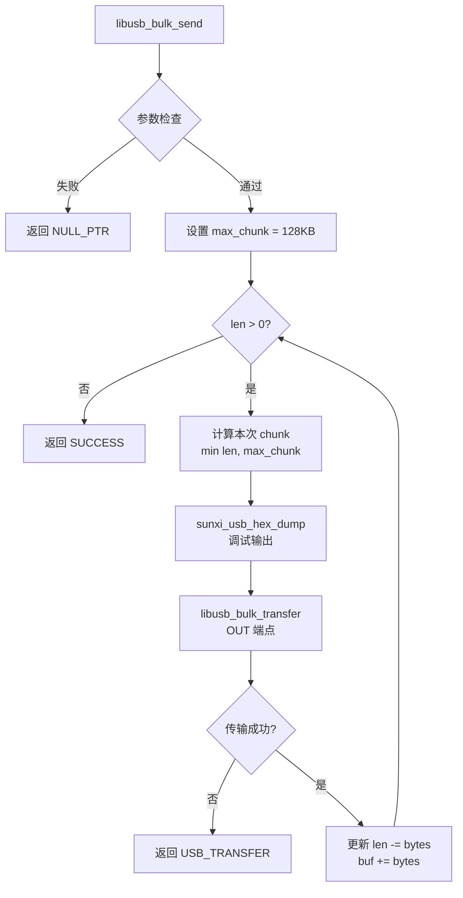
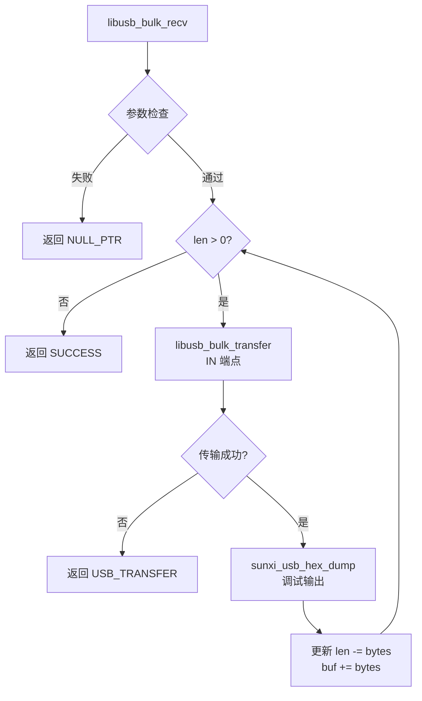
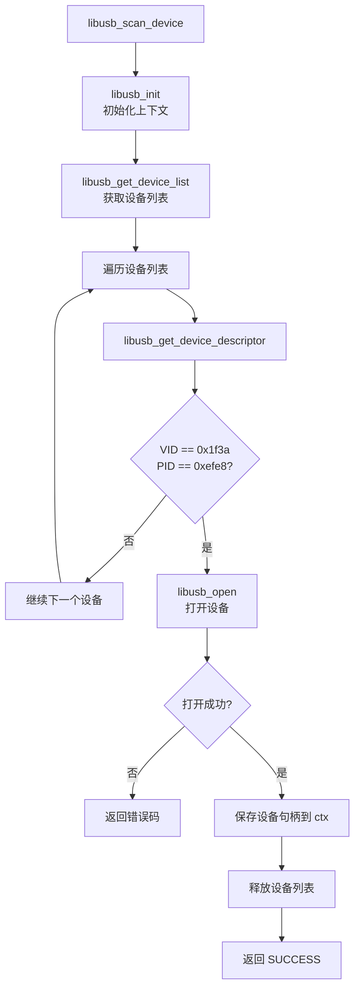
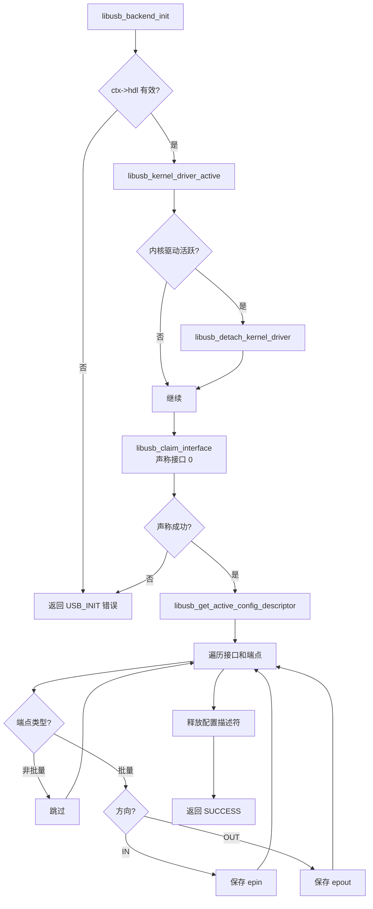
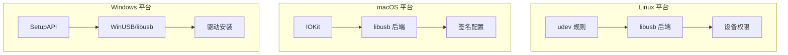

# libefex 跨平台 USB 后端

## USB 后端概述

libefex 需要跨平台支持 Linux、macOS 和 Windows。由于不同平台的 USB 驱动接口不同，项目采用后端抽象层设计：

- **libusb**: 开源跨平台 USB 库（Linux、macOS、可选 Windows）
- **WinUSB**: Windows 专用 USB 驱动框架



## USB 后端接口定义

源码位置: `includes/usb_layer.h`

```c
// USB 后端类型枚举
enum usb_backend_type {
    USB_BACKEND_AUTO = 0,    // 自动选择
    USB_BACKEND_LIBUSB = 1,  // 强制使用 libusb
    USB_BACKEND_WINUSB = 2,  // 强制使用 WinUSB (仅 Windows)
};

// USB 后端操作结构
struct usb_backend_ops {
    // 批量传输
    int (*bulk_send)(void *handle, int ep, const char *buf, ssize_t len);
    int (*bulk_recv)(void *handle, int ep, char *buf, ssize_t len);
    
    // 设备扫描
    int (*scan_device)(struct sunxi_efex_ctx_t *ctx);
    int (*scan_device_at)(struct sunxi_efex_ctx_t *ctx, uint8_t bus, uint8_t port);
    int (*scan_devices)(struct sunxi_scanned_device_t **devices, size_t *count);
    
    // 热插拔支持
    int (*hotplug_snapshot)(struct sunxi_hotplug_device_t **devices, size_t *count);
    
    // 后端生命周期
    int (*init)(struct sunxi_efex_ctx_t *ctx);
    int (*exit)(struct sunxi_efex_ctx_t *ctx);
};
```

## USB 后端调度器实现

源码位置: `src/usb/usb_layer.c`

```c
#include <stdlib.h>
#include <string.h>

#include "usb_layer.h"
#include "efex-common.h"

static enum usb_backend_type current_backend = USB_BACKEND_AUTO;

// 外部后端操作结构
extern const struct usb_backend_ops usb_libusb_ops;
extern const struct usb_backend_ops usb_winusb_ops;

// 根据平台和配置获取后端操作
static const struct usb_backend_ops *get_backend_ops(void) {
#ifdef _WIN32
    if (current_backend == USB_BACKEND_LIBUSB) {
        return &usb_libusb_ops;
    } else {
        return &usb_winusb_ops;  // Windows 默认 WinUSB
    }
#else
    return &usb_libusb_ops;  // Linux/macOS 使用 libusb
#endif
}

// 批量发送
int sunxi_usb_bulk_send(void *handle, int ep, const char *buf, ssize_t len) {
    const struct usb_backend_ops *ops = get_backend_ops();
    if (!ops || !ops->bulk_send) {
        return EFEX_ERR_NOT_SUPPORT;
    }
    return ops->bulk_send(handle, ep, buf, len);
}

// 批量接收
int sunxi_usb_bulk_recv(void *handle, int ep, char *buf, ssize_t len) {
    const struct usb_backend_ops *ops = get_backend_ops();
    if (!ops || !ops->bulk_recv) {
        return EFEX_ERR_NOT_SUPPORT;
    }
    return ops->bulk_recv(handle, ep, buf, len);
}

// 扫描设备
int sunxi_scan_usb_device(struct sunxi_efex_ctx_t *ctx) {
    const struct usb_backend_ops *ops = get_backend_ops();
    if (!ops || !ops->scan_device) {
        return EFEX_ERR_NOT_SUPPORT;
    }
    return ops->scan_device(ctx);
}

// 指定位置扫描设备
int sunxi_scan_usb_device_at(struct sunxi_efex_ctx_t *ctx, 
                              uint8_t bus, uint8_t port) {
    const struct usb_backend_ops *ops = get_backend_ops();
    if (!ops || !ops->scan_device_at) {
        return EFEX_ERR_NOT_SUPPORT;
    }
    return ops->scan_device_at(ctx, bus, port);
}

// 扫描所有设备
int sunxi_scan_usb_devices(struct sunxi_scanned_device_t **devices, 
                            size_t *count) {
    const struct usb_backend_ops *ops = get_backend_ops();
    if (!ops || !ops->scan_devices) {
        return EFEX_ERR_NOT_SUPPORT;
    }
    return ops->scan_devices(devices, count);
}

// 热插拔快照
int sunxi_hotplug_snapshot(struct sunxi_hotplug_device_t **devices, 
                            size_t *count) {
    const struct usb_backend_ops *ops = get_backend_ops();
    if (!ops || !ops->hotplug_snapshot) {
        return EFEX_ERR_NOT_SUPPORT;
    }
    return ops->hotplug_snapshot(devices, count);
}

// 初始化 USB
int sunxi_usb_init(struct sunxi_efex_ctx_t *ctx) {
    const struct usb_backend_ops *ops = get_backend_ops();
    if (!ops || !ops->init) {
        return EFEX_ERR_NOT_SUPPORT;
    }
    return ops->init(ctx);
}

// 退出 USB
int sunxi_usb_exit(struct sunxi_efex_ctx_t *ctx) {
    const struct usb_backend_ops *ops = get_backend_ops();
    if (!ops || !ops->exit) {
        return EFEX_ERR_NOT_SUPPORT;
    }
    return ops->exit(ctx);
}

// 设置后端类型
int sunxi_efex_set_usb_backend(enum usb_backend_type backend) {
#ifdef _WIN32
    if (backend == USB_BACKEND_LIBUSB || 
        backend == USB_BACKEND_WINUSB || 
        backend == USB_BACKEND_AUTO) {
        current_backend = backend;
        return EFEX_ERR_SUCCESS;
    }
#else
    if (backend == USB_BACKEND_LIBUSB || backend == USB_BACKEND_AUTO) {
        current_backend = backend;
        return EFEX_ERR_SUCCESS;
    }
#endif
    return EFEX_ERR_INVALID_PARAM;
}

// 获取当前后端类型
enum usb_backend_type sunxi_efex_get_usb_backend(void) {
    return current_backend;
}
```

### 后端调度流程图



## libusb 后端实现

源码位置: `src/usb/usb_layer_libusb.c`

### 批量发送实现

源码位置: `src/usb/usb_layer_libusb.c:16-38`

```c
#include <libusb.h>

static int libusb_bulk_send(void *handle, int ep, 
                            const char *buf, ssize_t len) {
    if (!handle || !buf || len <= 0) {
        return EFEX_ERR_NULL_PTR;
    }

    libusb_device_handle *hdl = (libusb_device_handle *) handle;
    const size_t max_chunk = 128 * 1024;  // 最大 128KB 分块
    int bytes;

    while (len > 0) {
        const size_t chunk = (size_t)len < max_chunk ? (size_t)len : max_chunk;

        sunxi_usb_hex_dump(buf, chunk, "SEND");

        const int r = libusb_bulk_transfer(hdl, ep, 
                                           (void *) buf, 
                                           (int) chunk, 
                                           &bytes, 
                                           DEFAULT_USB_TIMEOUT);
        if (r != 0) {
            return EFEX_ERR_USB_TRANSFER;
        }
        len -= bytes;
        buf += bytes;
    }
    return EFEX_ERR_SUCCESS;
}
```

### libusb 批量发送流程图



### 批量接收实现

源码位置: `src/usb/usb_layer_libusb.c:40-60`

```c
static int libusb_bulk_recv(void *handle, int ep, 
                            char *buf, ssize_t len) {
    if (!handle || !buf || len <= 0) {
        return EFEX_ERR_NULL_PTR;
    }

    libusb_device_handle *hdl = (libusb_device_handle *) handle;
    int bytes;

    while (len > 0) {
        const int r = libusb_bulk_transfer(hdl, ep, 
                                           (uint8_t *) buf, 
                                           (int) len, 
                                           &bytes, 
                                           DEFAULT_USB_TIMEOUT);
        if (r != 0) {
            return EFEX_ERR_USB_TRANSFER;
        }

        sunxi_usb_hex_dump(buf, (size_t) bytes, "RECV");

        len -= bytes;
        buf += bytes;
    }
    return EFEX_ERR_SUCCESS;
}
```

### libusb 批量接收流程图



### 设备扫描实现

源码位置: `src/usb/usb_layer_libusb.c:72-105`

```c
static int libusb_scan_device(struct sunxi_efex_ctx_t *ctx) {
    if (!ctx) {
        return EFEX_ERR_NULL_PTR;
    }

    libusb_device **list = NULL;
    libusb_context *context = NULL;

    // 初始化 libusb
    libusb_init(&context);
    ctx->usb_context = context;
    
    // 获取设备列表
    const size_t count = libusb_get_device_list(context, &list);
    
    for (size_t i = 0; i < count; i++) {
        libusb_device *device = list[i];
        struct libusb_device_descriptor desc;
        
        if (libusb_get_device_descriptor(device, &desc) != 0) {
            return EFEX_ERR_USB_DEVICE_NOT_FOUND;
        }
        
        // 匹配 VID/PID
        if (desc.idVendor == SUNXI_USB_VENDOR && 
            desc.idProduct == SUNXI_USB_PRODUCT) {
            libusb_device_handle *libusb_hdl = NULL;
            int rc = libusb_open(device, &libusb_hdl);
            
            if (rc != 0) {
                fprintf(stderr, "ERROR: Can't connect to device: %s (rc=%d)\r\n",
                        libusb_strerror(rc), rc);
                libusb_free_device_list(list, 1);
                return libusb_open_error_to_efex(rc);
            }
            
            ctx->hdl = libusb_hdl;
            libusb_free_device_list(list, 1);
            return EFEX_ERR_SUCCESS;
        }
    }
    
    libusb_free_device_list(list, 1);
    return EFEX_ERR_USB_DEVICE_NOT_FOUND;
}
```

### libusb 设备扫描流程图



### 后端初始化实现

源码位置: `src/usb/usb_layer_libusb.c:299-330`

```c
static int libusb_backend_init(struct sunxi_efex_ctx_t *ctx) {
    if (ctx && ctx->hdl) {
        libusb_device_handle *libusb_hdl = 
            (libusb_device_handle *) ctx->hdl;
        struct libusb_config_descriptor *config;

        // 分离内核驱动 (Linux)
        if (libusb_kernel_driver_active(libusb_hdl, 0))
            libusb_detach_kernel_driver(libusb_hdl, 0);

        // 声称接口
        if (libusb_claim_interface(libusb_hdl, 0) == 0) {
            if (libusb_get_active_config_descriptor(
                    libusb_get_device(libusb_hdl), &config) == 0) {
                
                // 查找端点
                for (int if_idx = 0; if_idx < config->bNumInterfaces; if_idx++) {
                    const struct libusb_interface *iface = 
                        config->interface + if_idx;
                    
                    for (int set_idx = 0; 
                         set_idx < iface->num_altsetting; 
                         set_idx++) {
                        const struct libusb_interface_descriptor *setting = 
                            iface->altsetting + set_idx;
                        
                        for (int ep_idx = 0; 
                             ep_idx < setting->bNumEndpoints; 
                             ep_idx++) {
                            const struct libusb_endpoint_descriptor *ep = 
                                setting->endpoint + ep_idx;
                            
                            // 只处理批量端点
                            if ((ep->bmAttributes & LIBUSB_TRANSFER_TYPE_MASK) 
                                != LIBUSB_TRANSFER_TYPE_BULK)
                                continue;
                            
                            // IN 还是 OUT 端点
                            if ((ep->bEndpointAddress & LIBUSB_ENDPOINT_DIR_MASK) 
                                == LIBUSB_ENDPOINT_IN)
                                ctx->epin = ep->bEndpointAddress;
                            else
                                ctx->epout = ep->bEndpointAddress;
                        }
                    }
                }
                libusb_free_config_descriptor(config);
                return EFEX_ERR_SUCCESS;
            }
        }
    }
    return EFEX_ERR_USB_INIT;
}
```

### libusb 后端初始化流程图



### 后端退出实现

源码位置: `src/usb/usb_layer_libusb.c:332-350`

```c
static int libusb_backend_exit(struct sunxi_efex_ctx_t *ctx) {
    if (!ctx) {
        return EFEX_ERR_NULL_PTR;
    }

    if (ctx->hdl) {
        libusb_device_handle *libusb_hdl = 
            (libusb_device_handle *) ctx->hdl;
        libusb_release_interface(libusb_hdl, 0);
        libusb_close(libusb_hdl);
        ctx->hdl = NULL;
    }

    if (ctx->usb_context) {
        libusb_exit((libusb_context *) ctx->usb_context);
        ctx->usb_context = NULL;
    }

    return EFEX_ERR_SUCCESS;
}
```

### libusb Ops 结构

源码位置: `src/usb/usb_layer_libusb.c:352-361`

```c
const struct usb_backend_ops usb_libusb_ops = {
    .bulk_send = libusb_bulk_send,
    .bulk_recv = libusb_bulk_recv,
    .scan_device = libusb_scan_device,
    .scan_device_at = libusb_scan_device_at,
    .scan_devices = libusb_scan_devices,
    .hotplug_snapshot = libusb_hotplug_snapshot,
    .init = libusb_backend_init,
    .exit = libusb_backend_exit,
};
```

## 后端选择流程图


## 平台差异处理

### Linux

- 使用 udev 规则配置设备权限
- libusb 直接访问 USB 设备
- 可能需要 `libusb_detach_kernel_driver` 分离内核驱动

```bash
# udev 规则示例 (/etc/udev/rules.d/99-sunxi.rules)
SUBSYSTEM=="usb", ATTR{idVendor}=="1f3a", ATTR{idProduct}=="efe8", MODE="0666"
```

### macOS

- 使用 IOKit 框架辅助设备枚举
- libusb 需要处理权限问题
- 可能需要签名配置

### Windows

- 使用 SetupAPI 枚举设备
- WinUSB 需要安装驱动
- 处理驱动兼容性问题



## USB 设备路径格式
```

## USB 设备路径格式

不同平台的设备路径格式不同：

| 平台 | 格式 | 示例 |
|------|------|------|
| Linux | bus:port | `1:2` |
| macOS | bus:port | `1:2` |
| Windows | 设备路径 | `\\?\USB#VID_1f3a&PID_efe8#...` |

libusb 后端生成的路径格式:

源码位置: `src/usb/usb_layer_libusb.c:243-247`

```c
// 生成设备路径字符串
char buf[32];
snprintf(buf, sizeof(buf), "libusb:%u:%u",
         (unsigned)result[idx].bus_id, 
         (unsigned)result[idx].port);
result[idx].device_path = strdup(buf);
```

## 热插拔快照实现

源码位置: `src/usb/usb_layer_libusb.c:179-258`

```c
static int libusb_hotplug_snapshot(struct sunxi_hotplug_device_t **devices, 
                                   size_t *count) {
    if (!devices || !count) {
        return EFEX_ERR_NULL_PTR;
    }

    *devices = NULL;
    *count = 0;

    libusb_device **list = NULL;
    libusb_context *context = NULL;

    int r = libusb_init(&context);
    if (r < 0) {
        return EFEX_ERR_USB_INIT;
    }

    const ssize_t device_count = libusb_get_device_list(context, &list);
    // ... 扫描并构建设备列表 ...

    // 为每个设备创建结构
    for (ssize_t i = 0; i < device_count && idx < found_count; i++) {
        libusb_device *device = list[i];
        struct libusb_device_descriptor desc;
        
        if (desc.idVendor == SUNXI_USB_VENDOR && 
            desc.idProduct == SUNXI_USB_PRODUCT) {
            result[idx].vid = desc.idVendor;
            result[idx].pid = desc.idProduct;
            result[idx].bus_id = libusb_get_bus_number(device);
            result[idx].usb_device_id = libusb_get_device_address(device);
            result[idx].port = libusb_get_port_number(device);
            
            // 生成路径
            snprintf(buf, sizeof(buf), "libusb:%u:%u",
                     (unsigned)result[idx].bus_id, 
                     (unsigned)result[idx].port);
            result[idx].device_path = strdup(buf);
            idx++;
        }
    }

    libusb_free_device_list(list, 1);
    libusb_exit(context);

    *devices = result;
    *count = found_count;
    return EFEX_ERR_SUCCESS;
}
```

## API 使用示例

### 选择后端

```c
#include <libefex.h>

int main() {
    // Windows 上可以选择 WinUSB 或 libusb
#ifdef _WIN32
    // 强制使用 WinUSB
    sunxi_efex_set_usb_backend(USB_BACKEND_WINUSB);
    
    // 或者强制使用 libusb
    // sunxi_efex_set_usb_backend(USB_BACKEND_LIBUSB);
#endif

    // Linux/macOS 只支持 libusb
    // 自动选择即可
    
    struct sunxi_efex_ctx_t ctx = {0};
    sunxi_scan_usb_device(&ctx);
    sunxi_usb_init(&ctx);
    sunxi_efex_init(&ctx);
    
    printf("Current backend: %d\n", sunxi_efex_get_usb_backend());
    
    // ... 使用 API ...
    
    sunxi_usb_exit(&ctx);
    return 0;
}
```

### 热插拔检测

```c
void monitor_devices() {
    struct sunxi_hotplug_device_t *devices = NULL;
    size_t count = 0;
    
    int ret = sunxi_hotplug_snapshot(&devices, &count);
    
    if (ret == EFEX_ERR_SUCCESS) {
        printf("Found %zu EFEX devices:\n", count);
        
        for (size_t i = 0; i < count; i++) {
            printf("  Device %zu: VID=%04x PID=%04x path=%s\n",
                   i, devices[i].vid, devices[i].pid, 
                   devices[i].device_path);
        }
        
        // 清理
        sunxi_hotplug_free_snapshot(devices, count);
    }
}
```

