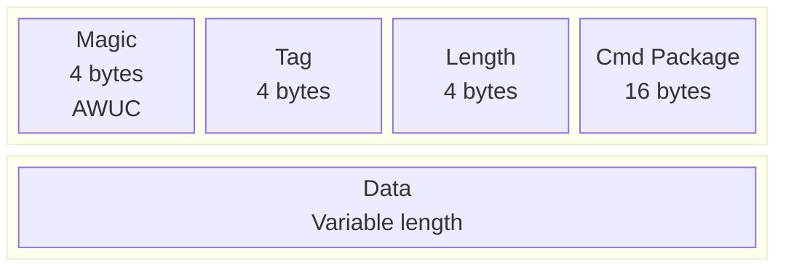
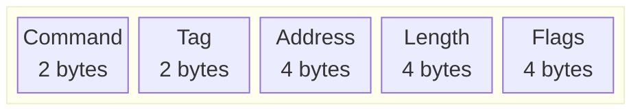
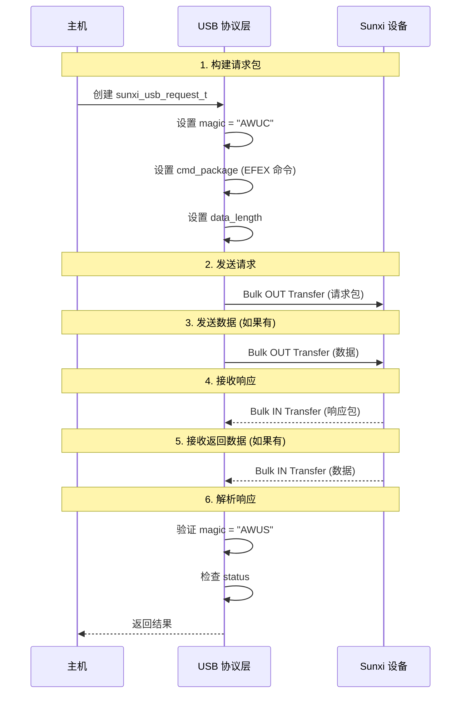
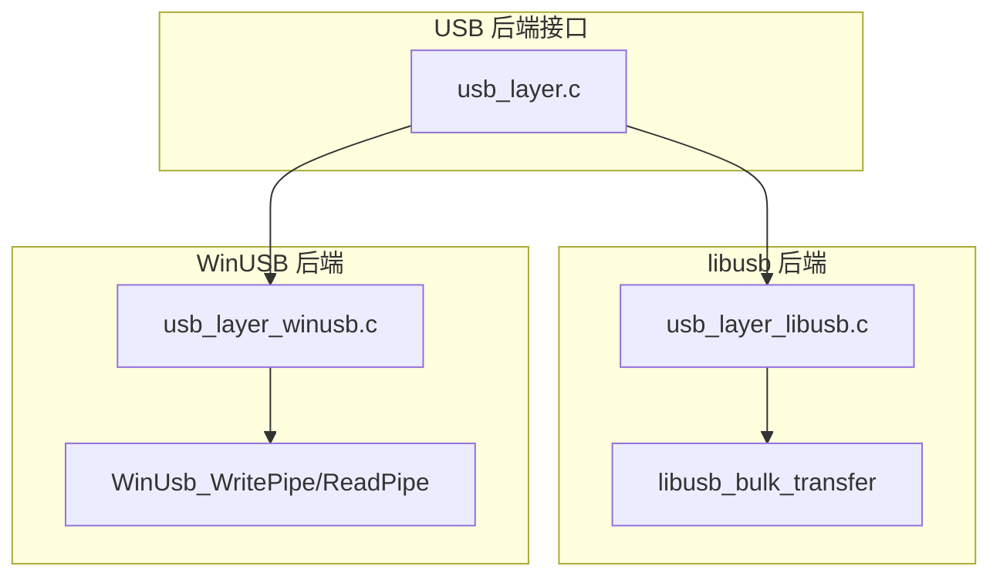

# libefex USB 协议层

## USB 数据包结构

libefex 使用特定的数据包格式与 Sunxi 设备通信。所有通信基于 USB 批量传输。

### 请求包结构 (`sunxi_usb_request_t`)

源码位置: `includes/efex-protocol.h:115-127`

```c
EFEX_PACKED_BEGIN
struct sunxi_usb_request_t {
    union {
        char magic[4];           // "AWUC" (Allwinner USB Command)
        uint32_t magics;
    };
    uint32_t tab;                // 标签/序列号
    uint32_t data_length;        // 数据长度
    uint16_t resvered1;          // 保留字段
    uint8_t resvered2;           // 保留字段
    uint8_t cmd_length;          // 命令长度
    uint8_t cmd_package[16];     // 命令包
} EFEX_PACKED;
EFEX_PACKED_END
```



### 响应包结构 (`sunxi_usb_response_t`)

源码位置: `includes/efex-protocol.h:130-141`

```c
EFEX_PACKED_BEGIN
struct sunxi_usb_response_t {
    union {
        char magic[4];           // "AWUS" (Allwinner USB Status)
        uint32_t magics;
    };
    uint32_t tag;                // 标签 (与请求匹配)
    uint32_t residue;            // 剩余数据
    uint8_t status;              // 操作状态码
} EFEX_PACKED;
EFEX_PACKED_END
```

### EFEX 命令包结构 (`sunxi_efex_request_t`)

源码位置: `includes/efex-protocol.h:143-151`

```c
EFEX_PACKED_BEGIN
struct sunxi_efex_request_t {
    uint16_t cmd;       // 命令类型
    uint16_t tag;       // 标签
    uint32_t address;   // 内存地址
    uint32_t len;       // 数据长度
    uint32_t flags;     // 标志位
} EFEX_PACKED;
EFEX_PACKED_END
```



### FES 传输结构 (`sunxi_fes_xfer_t`)

源码位置: `includes/efex-protocol.h:214-224`

```c
EFEX_PACKED_BEGIN
struct sunxi_fes_xfer_t {
    uint16_t cmd;       // 命令类型
    uint16_t tag;       // 标签
    char buf[12];       // 缓冲区 (用于传输参数)
    union {
        char magic[4];  // 魔数
        uint32_t magics;
    };
} EFEX_PACKED;
EFEX_PACKED_END
```

## USB 命令类型定义

源码位置: `includes/efex-protocol.h:62-95`

```c
enum sunxi_efex_cmd_t {
    /* Common Commands */
    EFEX_CMD_VERIFY_DEVICE = 0x0001,    // 验证设备
    EFEX_CMD_SWITCH_ROLE = 0x0002,      // 切换角色
    EFEX_CMD_IS_READY = 0x0003,         // 检查就绪
    EFEX_CMD_DISCONNECT = 0x0010,       // 断开连接

    /* FEL Commands */
    EFEX_CMD_FEL_WRITE = 0x0101,        // 写入内存
    EFEX_CMD_FEL_EXEC = 0x0102,         // 执行代码
    EFEX_CMD_FEL_READ = 0x0103,         // 读取内存

    /* FES Commands */
    EFEX_CMD_FES_TRANS = 0x0201,        // 传输
    EFEX_CMD_FES_RUN = 0x0202,          // 运行
    EFEX_CMD_FES_INFO = 0x0203,         // 信息查询
    EFEX_CMD_FES_DOWN = 0x0206,         // 下载数据
    EFEX_CMD_FES_UP = 0x0207,           // 上传数据
    EFEX_CMD_FES_VERIFY = 0x0208,       // 验证
    EFEX_CMD_FES_QUERY_STORAGE = 0x0209, // 查询存储
    EFEX_CMD_FES_FLASH_SET_ON = 0x020A,  // 开启闪存
    EFEX_CMD_FES_FLASH_SET_OFF = 0x020B, // 关闭闪存
    EFEX_CMD_FES_FLASH_SIZE_PROBE = 0x020E, // 探测闪存大小
    EFEX_CMD_FES_TOOL_MODE = 0x020F,    // 工具模式
    EFEX_CMD_FES_QUERY_SECURE = 0x0230, // 查询安全状态
    EFEX_CMD_FES_GET_CHIPID = 0x0232    // 获取芯片 ID
};
```

| 命令 | 值 | 模式 | 说明 |
|------|-----|------|------|
| `EFEX_CMD_FEL_WRITE` | 0x0101 | FEL | 写入内存 |
| `EFEX_CMD_FEL_EXEC` | 0x0102 | FEL | 执行代码 |
| `EFEX_CMD_FEL_READ` | 0x0103 | FEL | 读取内存 |
| `EFEX_CMD_FES_DOWN` | 0x0206 | FES | 下载数据 |
| `EFEX_CMD_FES_UP` | 0x0207 | FES | 上传数据 |
| `EFEX_CMD_FES_QUERY_STORAGE` | 0x0209 | FES | 查询存储 |

## USB 请求/响应流程



## USB 写入实现

源码位置: `src/efex-usb.c:55-75`

```c
int sunxi_usb_write(const struct sunxi_efex_ctx_t *ctx, 
                    const void *buf, const size_t len) {
    if (!ctx || !buf) {
        return EFEX_ERR_NULL_PTR;
    }

    // 1. 发送 USB 写入请求
    int ret = sunxi_send_usb_request(ctx, AW_USB_WRITE, len);
    if (ret != EFEX_ERR_SUCCESS) {
        return ret;
    }

    // 2. 发送实际数据
    ret = sunxi_usb_bulk_send(ctx->hdl, ctx->epout, buf, len);
    if (ret != 0) {
        return EFEX_ERR_USB_TRANSFER;
    }

    // 3. 读取响应状态
    ret = sunxi_read_usb_response(ctx);
    if (ret != 0) {
        return EFEX_ERR_PROTOCOL;
    }
    
    return EFEX_ERR_SUCCESS;
}
```

## USB 读取实现

源码位置: `src/efex-usb.c:77-97`

```c
int sunxi_usb_read(const struct sunxi_efex_ctx_t *ctx, 
                   const void *data, const size_t len) {
    if (!ctx || !data) {
        return EFEX_ERR_NULL_PTR;
    }

    // 1. 发送 USB 读取请求
    int ret = sunxi_send_usb_request(ctx, AW_USB_READ, len);
    if (ret != EFEX_ERR_SUCCESS) {
        return ret;
    }

    // 2. 接收数据
    ret = sunxi_usb_bulk_recv(ctx->hdl, ctx->epin, (char *) data, len);
    if (ret != 0) {
        return EFEX_ERR_USB_TRANSFER;
    }

    // 3. 读取响应状态
    ret = sunxi_read_usb_response(ctx);
    if (ret != 0) {
        return EFEX_ERR_PROTOCOL;
    }
    
    return EFEX_ERR_SUCCESS;
}
```

## 发送 USB 请求实现

源码位置: `src/efex-usb.c:14-34`

```c
int sunxi_send_usb_request(const struct sunxi_efex_ctx_t *ctx,
                           const enum sunxi_efex_usb_request_t type,
                           const size_t length) {
    if (!ctx || !ctx->hdl) {
        return EFEX_ERR_NULL_PTR;
    }

    // 构建请求结构
    struct sunxi_usb_request_t req = {
        .magics = SUNXI_USB_REQ_MAGIC_INT,  // "AWUC" 魔数
        .tab = 0x0,
        .data_length = cpu_to_le32(length),
        .cmd_length = SUNXI_EFEX_CMD_LEN,
        .cmd_package[0] = type,
    };
    req.cmd_length = (uint8_t) req.data_length;

    // 发送请求包
    const int ret = sunxi_usb_bulk_send(ctx->hdl, ctx->epout,
                                        (const char *) &req, 
                                        sizeof(struct sunxi_usb_request_t));
    if (ret != 0) {
        return EFEX_ERR_USB_TRANSFER;
    }
    
    return EFEX_ERR_SUCCESS;
}
```

## 读取 USB 响应实现

源码位置: `src/efex-usb.c:36-53`

```c
int sunxi_read_usb_response(const struct sunxi_efex_ctx_t *ctx) {
    if (!ctx || !ctx->hdl) {
        return EFEX_ERR_NULL_PTR;
    }

    struct sunxi_usb_response_t resp = {0};

    // 接收响应包
    const int ret = sunxi_usb_bulk_recv(ctx->hdl, ctx->epin,
                                        (char *) &resp, sizeof(resp));
    if (ret != 0) {
        return EFEX_ERR_USB_TRANSFER;
    }

    // 验证响应魔数
    if (strncmp(resp.magic, SUNXI_USB_RSP_MAGIC, 4) != 0) {
        return EFEX_ERR_INVALID_RESPONSE;
    }

    return resp.status;
}
```

## FES 传输函数实现

源码位置: `src/efex-usb.c:99-149`

```c
int sunxi_usb_fes_xfer(const struct sunxi_efex_ctx_t *ctx,
                       const enum sunxi_usb_fes_xfer_type_t type,
                       const uint32_t cmd, const char *request_buf,
                       const ssize_t request_len, const char *buf,
                       const ssize_t len) {
    if (!ctx) {
        return EFEX_ERR_NULL_PTR;
    }

    // 检查设备模式必须是 FES/SRV
    if (ctx->resp.mode != DEVICE_MODE_SRV) {
        return EFEX_ERR_INVALID_PARAM;
    }

    // 构建 FES 传输结构
    struct sunxi_fes_xfer_t fes_xfer = {
        .cmd = cpu_to_le16((uint16_t) cmd),
        .tag = 0x0,
        .magics = SUNXI_USB_REQ_MAGIC_INT,
    };

    // 复制请求缓冲区数据
    if (request_len > 0 && (size_t)request_len <= sizeof(fes_xfer.buf)) {
        memcpy(fes_xfer.buf, request_buf, request_len);
    }

    // 发送 FES 传输请求
    int ret = sunxi_usb_bulk_send(ctx->hdl, ctx->epout,
                                  (const char *) &fes_xfer, sizeof(fes_xfer));
    if (ret != 0) {
        return EFEX_ERR_USB_TRANSFER;
    }

    // 根据传输类型发送或接收数据
    if (type == FES_XFER_SEND && len > 0) {
        if (!buf) {
            return EFEX_ERR_NULL_PTR;
        }
        ret = sunxi_usb_bulk_send(ctx->hdl, ctx->epout, buf, len);
        if (ret != 0) {
            return EFEX_ERR_USB_TRANSFER;
        }
    } else if (type == FES_XFER_RECV && len > 0) {
        if (!buf) {
            return EFEX_ERR_NULL_PTR;
        }
        ret = sunxi_usb_bulk_recv(ctx->hdl, ctx->epin, (char *) buf, len);
        if (ret != 0) {
            return EFEX_ERR_USB_TRANSFER;
        }
    }

    // 读取响应状态
    ret = sunxi_read_usb_response(ctx);
    if (ret != 0) {
        return EFEX_ERR_PROTOCOL;
    }

    return EFEX_ERR_SUCCESS;
}
```

## 最大传输大小限制

源码位置: `includes/efex-protocol.h:227`

```c
#define EFEX_CODE_MAX_SIZE (64 * 1024)  // 64KB 单次最大传输
```

## USB 后端抽象层



