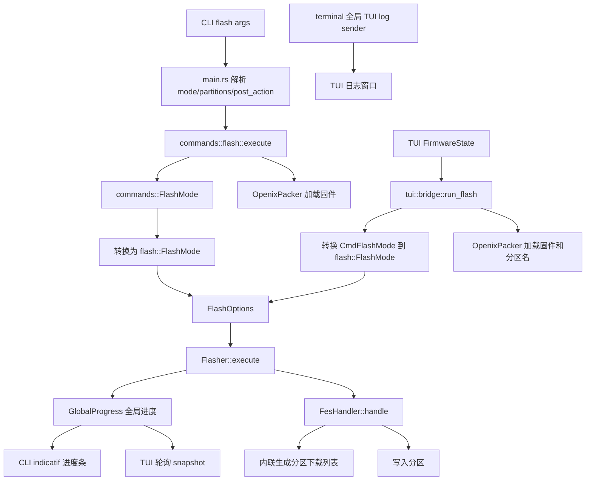
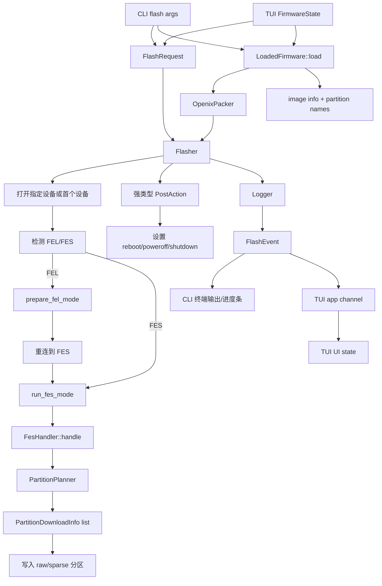

## 从一个 README 错误说起

改这个之前，README 里有个例子一直跑不通：

```bash
openixcli flash firmware.img --verify false
```

`--verify` 在 clap 里是个 flag，`false` 会被当成多余参数报错。问题不大，但修着修着发现类似的"小问题"还有一堆——`FlashMode` 定义了两份、`post_action` 用字符串传来传去、CLI 和 TUI 各自加载固件……

单个看都是修修补补能解决的事，但凑一起就让人想动刀子了。于是有了这个提交：

```
f0ce24a Refactor flash request flow
```

## 改动前长什么样

先看张图：



几个比较烦人的点：

1. **类型转来转去** —— `FlashMode` 在命令层一份、刷机层一份，TUI 还要再转一次
2. **字符串到处跑** —— `post_action` 就是个 `String`，写错了运行时才知道
3. **逻辑重复** —— CLI 和 TUI 都在读 MBR、提取分区信息
4. **全局状态到处飞** —— TUI 日志靠全局 channel，进度靠轮询 `GlobalProgress`
5. **职责边界模糊** —— FES handler 又管协议又管分区计划

改之前也没想太多，就是觉得每次加功能都要在三个地方补转换逻辑，心累。

## 改完之后



主线清晰多了：两个入口都往 `FlashRequest` 填数据，固件加载走统一入口，刷机过程通过事件对外广播。TUI 不用再轮询全局状态，直接消费事件就行。

## 具体改了什么

### 强类型请求模型

新建了 `src/flash/request.rs`，把这几个东西放一起：

- `FlashMode`
- `PostAction`（原来的 `post_action` 字符串）
- `DeviceSelector`
- `FlashRequest`

最爽的是 `PostAction` 终于有类型了：

```rust
let tool_mode = self.request.post_action.fes_tool_mode();
```

非法值在参数解析阶段就会报错，不用等到刷机收尾才发现用户写了 `"rebot"` 而不是 `"reboot"`。

### 固件加载归一

`LoadedFirmware` 把之前散落的逻辑收拢了：

- 打包 `OpenixPacker`
- 读取镜像信息
- 从 MBR 提分区名

CLI 用它打印固件信息，TUI 用它填分区选择界面。不用两边各自写一遍读 MBR 的代码了。

### 刷机流程拆阶段

`Flasher::execute` 之前是一坨，现在拆成了：

```rust
open_device()
prepare_fel_mode()  // 如果设备在 FEL 模式
run_fes_mode()
apply_post_action()
```

读起来像状态机，不像流水账了。

### 分区计划器独立出来

`PartitionPlanner` 负责：

- 读 MBR 分区表
- 读 `sys_partition` 配置
- 根据 `FlashMode` 和用户选择过滤分区
- 生成下载列表

FES handler 现在只管协议步骤，不用再夹带私货。

### 事件驱动

`FlashEvent` 定义了这些事件：

- 日志
- 阶段切换
- 分区下载开始/进度/结束
- 整体完成

`Logger` 两头写：CLI 模式输出到终端和 indicatif，TUI 模式发送到 app channel。

全局状态少了一堆，TUI 也不用轮询了。

### 顺带修的边角料

**`--verify` 参数**：改成显式 `--verify true/false`，README 终于不用骗人了。

**分区配置解析**：`OpenixPartition` 之前遇到新 section 会直接退出，导致最后一个分区丢掉。现在会先把当前分区存好再退出：

```ini
[partition]
name = vendor
downloadfile = vendor.img

[other]  ; 之前这后面的 vendor 会被丢掉
...
```

## 改完的感受

| 改动前 | 改动后 |
| --- | --- |
| `FlashMode` 定义两份 + TUI 转换 | 统一在 `flash::request` |
| `post_action` 字符串传递 | `PostAction` 强类型 |
| CLI/TUI 各自加载固件 | `LoadedFirmware` 统一 |
| 分区计划写在 FES handler 里 | `PartitionPlanner` 独立 |
| TUI 日志靠全局 channel | `FlashEvent` 广播 |
| TUI 进度轮询 | 订阅事件 |
| README 和代码行为不一致 | `--verify true/false` 可用 |

测试也补了一些：请求解析、分区过滤、配置解析边界情况。之前基本是裸奔状态。

## 后续

这次改的核心思路是把"约定"变成"边界"——参数是 `FlashRequest`，固件是 `LoadedFirmware`，分区计划是 `PartitionPlanner`，进度是 `FlashEvent`。

底层 USB/FEL/FES 协议调用顺序没动，用户侧行为也保持兼容。但以后要加 dry-run、取消任务、刷机报告这些功能，现在有清晰的接入点了。

代码地址：[OpenixCLI](https://github.com/YuzukiTsuru/OpenixCLI)