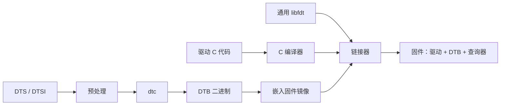
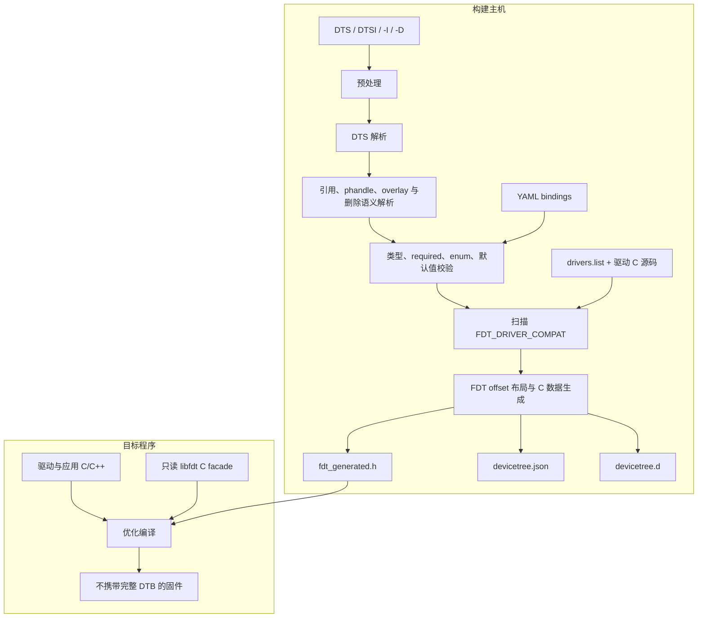
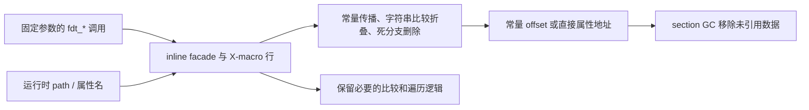
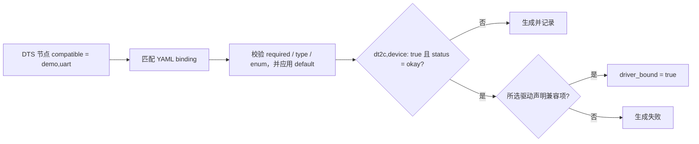

# dt2c：把固定设备树交给 C 编译器

很多嵌入式项目都沿用同一条设备树处理链路：`dtc` 把 DTS 编译成 DTB，固件把 DTB 带到目标板上，驱动再用 libfdt 查询。这样做没有问题，而且允许上一级 bootloader 在交接前修改设备树。

有些固件其实用不到这份灵活性。一块固定型号的 MCU 板、片上 SRAM 中运行的 SPL、按板型分别发布的 bootloader，或者 SoC 里的管理核固件，往往从构建结束起就只认一棵设备树。对这些程序来说，启动时解析 DTB 是在反复读取一份早已确定的配置。

dt2c 把这项工作挪到了构建主机。它提前完成预处理、解析和校验，生成 C 编译器能看见的只读数据。目标端不再携带完整 DTB，也不用链接通用 DTB 解析器，但驱动仍然调用熟悉的只读 `fdt_*` 接口。

下面先拆开这套设计，再看它适合什么固件。后半部分有一个可以从零运行的 UART 示例，以及 CMake 和存量 libfdt 工程的接入方法。

## 先看传统 DTB 模型

传统链路大致如下：



DTB 与程序相互独立，所以运行时可以换树、改属性、应用 overlay，同一个镜像也能接收不同的硬件描述。固件也要为此承担相应成本：

- 镜像需要保存 DTB，以及实际用到的通用 libfdt 代码；
- 路径、属性名和 `compatible` 即使是源码里的常量，运行时仍按通用逻辑查询；
- DTS 引用、属性类型和驱动覆盖之间的问题容易分散到构建与启动两个阶段；
- 编译器看不到 DTB 的语义，无法把固定查询折叠成直接的数据访问。

dt2c 接受这些限制，但前提很严格：一个固件镜像只能对应一棵固定设备树。我更愿意把它看作一个构建期绑定器，而不是另一个 dtc，也不是把 DTS 翻译成寄存器宏的工具。它在主机侧绑定设备树，在目标侧提供只读 libfdt facade。

这个区别会影响接入方式。dt2c 不生成 `DT_*`、`DT_INST_*`、`struct device`，也不接管驱动初始化。项目原来的驱动生命周期照旧，改变的只是配置数据如何到达驱动。

## 工作在哪一侧完成

除了 DTS，dt2c 还会读取 binding 和本次固件选择的驱动源码：



完整生成流程在 [`src/lib.rs`](../src/lib.rs)。它先处理 `#include`、对象式和函数式宏、条件编译及整数表达式，`-I` 与 `-D` 的用法接近常见的 C 预处理参数。随后解析节点树，处理 label、绝对路径引用、phandle、overlay、删除语法、`/omit-if-no-ref/` 和 `/memreserve/`。

树稳定下来后，生成器按 `compatible` 查找 binding，检查 required、类型和 `const`/`enum`，缺失属性可以从 binding 取得默认值。然后它扫描 `drivers.list` 中列出的源码，收集 `FDT_DRIVER_COMPAT("vendor,device")`。如果某个状态为 `okay` 的节点被 binding 标成设备，却没有任何所选驱动负责，生成会直接失败。

最后一步是计算节点、属性、字符串、phandle 和 memory reservation 的 FDT offset，并写出下面三个文件：

| 产物 | 面向对象 | 用途 |
| --- | --- | --- |
| `fdt_generated.h` | C/C++ 编译器 | 只读数据、offset 关系和 X-macro 行 |
| `devicetree.json` | 人、CI、辅助工具 | 审计规范化后的节点、属性、状态和驱动绑定结果 |
| `devicetree.d` | Make/CMake/Ninja | 让 DTSI、binding、驱动列表或驱动源码变化后重新生成 |

驱动源码会出现在 depfile 中，因为 marker 虽然不产生目标代码，它的变化却会影响生成期的驱动覆盖判断。

## 目标端到底生成了什么

### `FDT_COMPILED_TREE` 只是 token

目标代码仍然可以写：

```c
node = fdt_path_offset(FDT_COMPILED_TREE, "/soc/serial@2500000");
reg = fdt_getprop(FDT_COMPILED_TREE, node, "reg", &length);
```

但 [`include/fdt.h`](../include/fdt.h) 中的定义本质上是：

```c
#define FDT_COMPILED_TREE ((const void *)(uintptr_t)1)
```

这个值只用来确认调用者正在访问编译进程序的那棵树。它不会被解引用，也不指向 FDT header。下面几种用法都会出错：

- 把 `FDT_COMPILED_TREE` 当成 DTB 起始地址写入存储或通过网络发送；
- 对 token 做指针运算；
- 把它交给 dt2c facade 之外、会直接解引用 DTB 的第三方代码；
- 期待从该地址复制出 `fdt_totalsize()` 字节后得到一个 DTB。

dt2c 仍提供 `fdt_totalsize()` 等 header 查询，以维持受支持的只读 API 语义。这不表示内存中有一份可以复制出去的完整 blob。

### 两套数据视图和一份关系索引

生成头保留连续的 structure/string block，供 `fdt_offset_ptr()`、`fdt_next_tag()` 和 `fdt_get_string()` 这类低层接口使用。这个视图遵守 FDT 的字节布局和 offset 语义。

每个属性同时有自己的只读 C 对象。普通 `fdt_getprop()` 可以直接返回对象里的 data，不必为了读取一个属性而保留或扫描整个结构块。

节点之间的关系由 X-macro 行记录，其中包括 parent、first child、next sibling、path 和 phandle。属性行则记录所属节点、名称和 next property 等信息。

X-macro 节点行在概念上类似下面这样：

```c
/* index, offset, parent, depth, first_child, next_sibling, ... name, path */
#define __DT2C_FOREACH_NODE(M)                                      \
    M(0, 0, -1, 0, 8,  -1, /* ... */ "",    "/",    0)            \
    M(1, 8,  0, 1, 20, -1, /* ... */ "soc", "/soc", 0)
```

实际行还包含 first property、属性数量、next node 和 phandle 等字段。目标端 facade 用这些行展开查询。比如，`fdt_parent_offset()` 会比较 offset 并返回已经生成的 parent offset；`fdt_get_property_namelen()` 比较节点 offset 与属性名，然后返回对应的属性对象。

两套数据在 C 源级别看起来有重复，但它们服务的 API 不同。启用优化和 section GC 后，只做高层固定查询的程序通常不必在最终镜像中保留低层连续块。调用低层遍历 API 的程序则保留相应视图，以换取兼容行为。

### Rust 生成数据，C 维护 API

Rust 生成器负责解析、验证、布局和数据编码，但不会为每棵树复制一整套 `fdt_*` 函数。目标端函数都在 [`include/dt2c/libfdt_runtime.h`](../include/dt2c/libfdt_runtime.h) 中，用普通的 `static inline` C 实现。

因此目标端不需要 Rust runtime，C 和 C++ 看到的是同一套公开头文件。API 实现也集中在一份可以阅读和做差分测试的 C 代码里。生成头只保存树相关数据，固定调用与数据会进入同一个编译优化上下文。

## 固定查询为什么会变快

以查找 UART 节点为例：

```c
int node = fdt_node_offset_by_compatible(
    FDT_COMPILED_TREE, -1, "demo,uart");
```

`FDT_COMPILED_TREE`、起始 offset 和 `"demo,uart"` 都是常量。函数 inline 后，编译器看到的是一组已知的 compatible 行，多数 `__builtin_strcmp()` 分支可以当场判定。最终代码往往只剩一个常量 offset，后面的固定属性查询还可以继续折叠成属性对象的直接地址。



动态查询仍然可用，只是不会凭空变成常量：

| 调用形式 | 行为 | 常见代价 |
| --- | --- | --- |
| 固定 path、property、compatible | 编译器可沿生成行折叠 | 最容易得到直接访问和最小镜像 |
| 固定 compatible，动态迭代 offset | 比较字符串可折叠，迭代状态保留 | 适合枚举同类设备 |
| 用户输入的动态 path/property | 运行时比较生成元数据 | 功能可用，但会保留更多字符串和分支 |
| `fdt_next_tag()` 等低层遍历 | 使用连续 FDT 视图 | 会保留相应 structure/string storage |

这部分优化由目标工具链完成。编译参数至少应包含：

```text
-O2 -ffunction-sections -fdata-sections
-Wl,--gc-sections
```

工具链支持时可以再评估 LTO。不开优化、不开 data sections，或者把查询参数全都变成运行时字符串，程序仍会得到正确结果，只是镜像和速度优势会小很多。

仓库里的参考 benchmark 使用 Linux v6.15 Pine H64 的 172 节点设备树。在 x86-64/GCC 13.3 Release 环境中，完整镜像的 `text + data + bss` 从 34,564 B 降到 5,105 B；固定复杂查询从 23,018.8 ns 降到 14.4 ns。这组数字只能证明该优化路径在这套环境中有效，不能直接套到另一款 MCU、编译器或链接脚本上。最终还是要看实际固件的 ELF 和测量结果。

## binding 如何找到对应驱动

只有 DTS 时，生成器知道硬件声明了什么，却不知道项目把哪些节点当作设备，也不知道每个属性有哪些约束。dt2c 用一套简化的 YAML binding 补上这些信息。



典型 binding 如下：

```yaml
$schema: http://devicetree.org/meta-schemas/core.yaml#
title: Demo UART

properties:
  compatible:
    const: demo,uart
  reg:
    type: reg
  current-speed:
    type: uint32
  status:
    type: string
    enum: [okay, disabled]

required: [compatible, reg, current-speed]
dt2c,device: true
```

`dt2c,device: true` 是构建期元数据，不会生成驱动对象。它的意思是：这个 binding 对应的 enabled 节点必须由本次固件选择的某个驱动覆盖。驱动用 marker 声明自己负责的 compatible：

```c
#include <libfdt.h>

FDT_DRIVER_COMPAT("demo,uart");
```

这个宏在目标端展开为空，不增加数据。生成器只读取 marker 的字符串参数，再拿它与节点 compatible 匹配。这里有几个容易踩到的边界：

- dt2c 只扫描 `drivers.list` 中列出的源码，而不是整个源码树；这个列表应与构建系统实际选择的驱动保持一致。
- 没有 `status` 的节点按 `okay` 处理；`disabled` 节点不要求当前镜像提供驱动。
- binding 只实现当前项目需要的 schema 子集，包括 required、类型、enum/const 和默认值，不等同于完整 dt-schema composition。
- marker 只证明 compatible 有归属，不会替项目调用 probe/init，也不会验证驱动内部是否读取了所有属性。

生成后的 JSON 报告会显示 `binding_device`、`status`、`driver_bound` 和 `selected_drivers`，CI 可以据此检查板级配置。

## 兼容到哪一层

dt2c 保留的是只读 libfdt 使用方式，范围包括：

- header 字段、endian helper 和错误码；
- path、alias、parent/depth、subnode 和整树遍历；
- 按名称或 offset 读取/遍历属性；
- compatible、任意属性值、phandle 和 string list 查询；
- address/size cells 与 memory reservation 查询；
- `fdt_offset_ptr()`、`fdt_next_tag()` 等低层只读结构访问。

节点和属性 offset 仍遵循生成树的 FDT 布局，所以可以在受支持的 API 之间传递。接口清单和差分测试边界见 [`docs/libfdt-compatibility.md`](libfdt-compatibility.md)。

写操作不在兼容目标内，具体包括：

- `fdt_setprop*()`、append、delete、add node 等写操作；
- `fdt_open_into()`、move、resize、pack 和空树构造；
- writable pointer accessor；
- 启动时应用 overlay；
- 把编译树导出成 DTB。

输入侧目前也不支持 `/incbin/`、plugin overlay、property label、完整 YAML schema 组合以及与 dtc 一致的全部错误诊断。

如果现有驱动只调用只读 `fdt_*`，迁移量通常不大。如果代码保存裸 DTB 地址、直接解析 FDT header、修改树，或者要把 DTB 交给另一个执行环境，就不能直接换成 dt2c。

## 哪些项目适合用

| 场景 | 适合度 | 原因 |
| --- | --- | --- |
| 固定板型的 SPL、bootloader stage | 高 | SRAM/片上空间敏感，板级树随镜像固定 |
| MCU、RTOS 或裸机固件 | 高 | 不需要通用运行时 parser，又能复用 libfdt 风格驱动 |
| SoC 管理核、安全核、协处理器固件 | 高 | 硬件视图小且固定，启动路径要求可预测 |
| 每个 SKU 分别构建和发布的产品 | 高 | 可以为每个 SKU 生成独立头文件与审计报告 |
| 从只读 libfdt 渐进迁移的存量项目 | 中到高 | 查询代码可复用，但需要先审计写 API 和裸 blob 假设 |
| 一个镜像支持多板型，但构建时能确定配置 | 中 | 可为每个板型生成一个镜像；不能在同一 token 上运行时换树 |
| bootloader 接收并修补上一级传入 DTB | 低 | 运行时 DTB 正是系统契约，不能静态绑定 |
| 依赖 runtime overlay、热插拔描述或现场配置 | 不适合 | dt2c 的树不可变 |
| Linux kernel 的标准 DTB 启动交接 | 不适合 | 内核和 boot chain 需要真实、可传递的 DTB |
| 设备树编辑器、dump/转换工具 | 不适合 | 这些工具需要完整 blob 和写操作 |

判断方法其实很直接：如果 DTS 变化本来就要重新构建固件，dt2c 多半符合项目模型。如果 DTS 变化只应该替换一份运行时数据，那就继续用真实 DTB。

## 从零运行一个 UART 示例

这个小程序在主机上打印 UART 配置，目的是把生成、编译和查询整条链路跑通。移到裸机环境时，读取设备树的代码可以保留，只要把 `printf()` 和 `main()` 换成项目自己的初始化入口。

目录结构：

```text
demo/
  app.c
  board.dts
  bindings/
    demo,uart.yaml
  drivers.list
```

### DTS

`board.dts`：

```dts
/dts-v1/;

/ {
    model = "dt2c UART demo";
    #address-cells = <1>;
    #size-cells = <1>;

    soc {
        #address-cells = <1>;
        #size-cells = <1>;
        ranges;

        serial@2500000 {
            compatible = "demo,uart";
            reg = <0x02500000 0x400>;
            current-speed = <115200>;
            status = "okay";
        };
    };
};
```

### binding

`bindings/demo,uart.yaml`：

```yaml
$schema: http://devicetree.org/meta-schemas/core.yaml#
title: Demo UART

properties:
  compatible:
    const: demo,uart
  reg:
    type: reg
  current-speed:
    type: uint32
  status:
    type: string
    enum: [okay, disabled]

required: [compatible, reg, current-speed]
dt2c,device: true
```

删掉 `current-speed` 后，dt2c 会在生成阶段报告 required 属性缺失。把它写成字符串，类型校验也会在 C 编译前失败。

### 所选驱动

`drivers.list` 中的路径相对于列表文件本身：

```text
app.c
```

真实项目通常每行列一个由 Kconfig、CMake 或 Make 最终选中的驱动源码。

### 读取配置

`app.c`：

```c
#include <inttypes.h>
#include <stdint.h>
#include <stdio.h>

#include <libfdt.h>

FDT_DRIVER_COMPAT("demo,uart");

struct uart_config {
    uint32_t base;
    uint32_t size;
    uint32_t baud_rate;
};

static int uart_config_from_fdt(struct uart_config *config)
{
    const fdt32_t *current_speed;
    const fdt32_t *reg;
    int length;
    int node;

    node = fdt_node_offset_by_compatible(
        FDT_COMPILED_TREE, -1, "demo,uart");
    if (node < 0)
        return node;

    reg = fdt_getprop(FDT_COMPILED_TREE, node, "reg", &length);
    if (!reg || length != 2 * (int)sizeof(*reg))
        return -FDT_ERR_BADVALUE;

    current_speed = fdt_getprop(
        FDT_COMPILED_TREE, node, "current-speed", &length);
    if (!current_speed || length != (int)sizeof(*current_speed))
        return -FDT_ERR_BADVALUE;

    config->base = fdt32_to_cpu(reg[0]);
    config->size = fdt32_to_cpu(reg[1]);
    config->baud_rate = fdt32_to_cpu(current_speed[0]);
    return 0;
}

int main(void)
{
    struct uart_config config;
    int error = uart_config_from_fdt(&config);

    if (error < 0) {
        fprintf(stderr, "cannot read UART config: %s\n", fdt_strerror(error));
        return 1;
    }

    printf("UART: base=0x%08" PRIx32 " size=0x%" PRIx32
           " baud=%" PRIu32 "\n",
           config.base, config.size, config.baud_rate);
    return 0;
}
```

属性中的 cell 使用 FDT 大端编码，仍然要通过 `fdt32_to_cpu()` 解码。数据虽然在编译期生成，编码方式并没有变成主机端序。

### 生成、编译和运行

先把 `DT2C_ROOT` 设为 dt2c 源码目录的绝对路径，然后在 `demo/` 中执行：

```sh
DT2C_ROOT=/absolute/path/to/dt2c

cargo build --release --manifest-path "$DT2C_ROOT/Cargo.toml"
mkdir -p build/include/generated

"$DT2C_ROOT/target/release/dt2c" generate \
  --dts board.dts \
  --bindings bindings \
  --drivers drivers.list \
  --header build/include/generated/fdt_generated.h \
  --depfile build/devicetree.d \
  --report build/devicetree.json

cc -std=c11 -O2 -ffunction-sections -fdata-sections \
  -I"$DT2C_ROOT/include" -Ibuild/include \
  app.c -Wl,--gc-sections -o build/demo

./build/demo
```

输出应为：

```text
UART: base=0x02500000 size=0x400 baud=115200
```

可以用 JSON 报告确认设备是否绑定：

```sh
jq '.nodes[] | select(.binding_device)' build/devicetree.json
```

这里的 include 顺序不能错。dt2c 自带的 `include/` 要提供 `<libfdt.h>` 和 `<fdt.h>`，生成目录的上一级则要让 `<generated/fdt_generated.h>` 可见。如果系统安装的 upstream libfdt 排在前面，编译时会拿到错误的公开头文件。

## 接入 CMake

下面的片段假设 host 端 `dt2c` release binary 已经构建，并通过 `-DDT2C_ROOT=/absolute/path/to/dt2c` 指定源码目录：

```cmake
cmake_minimum_required(VERSION 3.20)
project(dt2c_demo LANGUAGES C)

if(NOT DT2C_ROOT)
  message(FATAL_ERROR "configure with -DDT2C_ROOT=/path/to/dt2c")
endif()

set(DT2C_BINARY "${DT2C_ROOT}/target/release/dt2c")
set(DT2C_OUTPUT_DIR "${CMAKE_BINARY_DIR}/dt2c/include")
set(DT2C_HEADER "${DT2C_OUTPUT_DIR}/generated/fdt_generated.h")
set(DT2C_DEPFILE "${CMAKE_BINARY_DIR}/dt2c/devicetree.d")
set(DT2C_REPORT "${CMAKE_BINARY_DIR}/dt2c/devicetree.json")

add_custom_command(
  OUTPUT "${DT2C_HEADER}" "${DT2C_DEPFILE}" "${DT2C_REPORT}"
  COMMAND "${CMAKE_COMMAND}" -E make_directory
          "${DT2C_OUTPUT_DIR}/generated"
  COMMAND "${DT2C_BINARY}" generate
          --dts "${CMAKE_CURRENT_SOURCE_DIR}/board.dts"
          --bindings "${CMAKE_CURRENT_SOURCE_DIR}/bindings"
          --drivers "${CMAKE_CURRENT_SOURCE_DIR}/drivers.list"
          --header "${DT2C_HEADER}"
          --depfile "${DT2C_DEPFILE}"
          --report "${DT2C_REPORT}"
  DEPENDS
          "${CMAKE_CURRENT_SOURCE_DIR}/board.dts"
          "${CMAKE_CURRENT_SOURCE_DIR}/bindings/demo,uart.yaml"
          "${CMAKE_CURRENT_SOURCE_DIR}/drivers.list"
          "${CMAKE_CURRENT_SOURCE_DIR}/app.c"
  DEPFILE "${DT2C_DEPFILE}"
  VERBATIM)

add_executable(dt2c-demo app.c "${DT2C_HEADER}")
target_include_directories(dt2c-demo PRIVATE
  "${DT2C_ROOT}/include"
  "${DT2C_OUTPUT_DIR}")
target_compile_options(dt2c-demo PRIVATE
  -O2 -ffunction-sections -fdata-sections)
target_link_options(dt2c-demo PRIVATE -Wl,--gc-sections)
```

配置和构建：

```sh
cmake -S . -B build -DDT2C_ROOT=/absolute/path/to/dt2c \
  -DCMAKE_BUILD_TYPE=Release
cmake --build build
./build/dt2c-demo
```

在交叉编译工程中，`dt2c` 运行在构建主机上，不能用目标编译器构建后再执行。发布包提供多种主机平台的预编译二进制，也可以在独立的 host-tools 阶段用 Cargo 构建。

## 从现有 libfdt 工程迁移

假设原代码接收 `const void *fdt`，并只做查询：

```c
int uart_config_from_fdt(const void *fdt, struct uart_config *config)
{
    int node = fdt_node_offset_by_compatible(fdt, -1, "demo,uart");
    /* 继续调用 fdt_getprop() 并解码属性。 */
}
```

迁移时不需要重写成另一套设备树宏。通常只需四步：

1. 用 `dt2c generate` 替代 `dtc + DTB embedding`；
2. 提供必要 binding，并把实际选择的驱动写入 `drivers.list`；
3. 在驱动中增加 `FDT_DRIVER_COMPAT()` marker；
4. 程序入口传入 `FDT_COMPILED_TREE`，而不是 DTB 地址。

迁移期间可以暂时保留两种构建，让同一份查询源码分别链接 upstream libfdt 与 dt2c，再比较解码后的输出。仓库中的 [`examples/migration`](../examples/migration/README.md) 就是这样的可执行测试：

```sh
make examples
ctest --test-dir build/examples \
  -R examples.migration --output-on-failure
```

CTest 要求传统 DTB 程序和 dt2c 程序输出完全一致。只检查能否编译看不出长度、端序和错误码上的差异，这个测试可以。

如果需要枚举多个同类节点，原有迭代写法仍然成立：

```c
int offset = -1;

while ((offset = fdt_node_offset_by_compatible(
            FDT_COMPILED_TREE, offset, "demo,uart")) >= 0) {
    /* 读取每个 UART 的 reg、interrupts 等属性。 */
}

if (offset != -FDT_ERR_NOTFOUND)
    handle_fdt_error(offset);
```

这里的 compatible 仍是编译期常量，字符串匹配容易被折叠。offset 会随循环变化，编译器会保留必要的迭代状态。

## 打印和调试设备树

`fdt_print()` 不是 libfdt 或 dt2c 的公开 API。仓库里有一个基于只读接口的 example，可以打印整树、子树或单个属性：

```c
#include <libfdt.h>
#include "fdt_print.h"

fdt_print(FDT_COMPILED_TREE, "/", NULL, FDT_PRINT_MAX_DEPTH);
fdt_print(FDT_COMPILED_TREE, "/soc", NULL, 2);
fdt_print(FDT_COMPILED_TREE,
          "/soc/serial@2500000", "reg", 0);
```

只有显式编译并链接 [`examples/fdt_print/fdt_print.c`](../examples/fdt_print/fdt_print.c) 才会带入格式化和 stdio 代码。普通固件包含 `<libfdt.h>` 不会自动增加打印功能。仓库可以直接运行：

```sh
make example-fdt-print
```

## 动手前再检查一遍

这些问题中只要有一项答案含糊，就值得在切换前再查一次：

- 设备树是否真的随镜像固定；启动阶段是否有人需要修改或转交 DTB；
- 所有待迁移调用是否都在只读兼容范围内，是否存在裸指针解析或序列化；
- `drivers.list` 是否来自实际构建选择，而不是一份长期失真的手写全集；
- 每类需要驱动负责的节点是否有 `dt2c,device: true` binding；
- 高频查询的 path、property 和 compatible 是否保持为源码常量；
- Release 编译是否启用优化、function/data sections 和 section GC；
- 生成 depfile 是否被构建系统消费，DTSI、binding 和驱动变化能否触发重建；
- 是否在目标架构上比较最终 ELF section、map 文件和启动耗时；
- 是否保留一组传统 libfdt 与 dt2c 的差分测试覆盖关键驱动；
- CI 是否归档或检查 JSON 报告，便于审计每个 enabled 设备的驱动归属。

## 这项取舍值不值

我不建议仅仅因为 dt2c 的 benchmark 数字好看就替换 DTB。先确认设备树是否真的是构建配置。如果答案是肯定的，那么把解析、引用处理、binding 校验和驱动覆盖留在主机上，通常比让目标端反复解释一份固定 blob 更合理，原有的只读 libfdt 查询代码也大多能继续使用。

如果设备树需要在启动时替换、修改或传给下一个执行环境，答案也很简单：继续使用 upstream dtc/libfdt。dt2c 的尺寸和速度优势来自静态绑定，绕开这个前提会让工具与系统设计互相打架。
