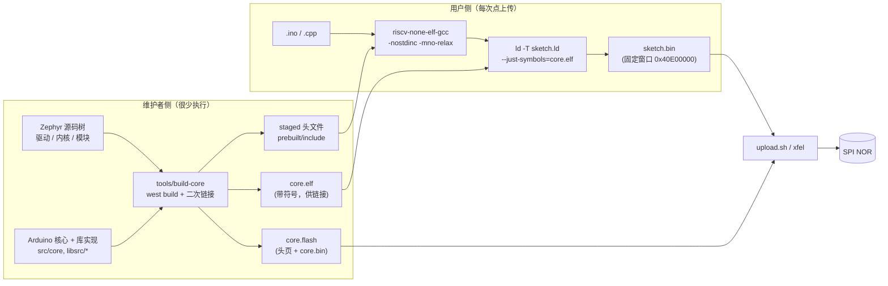
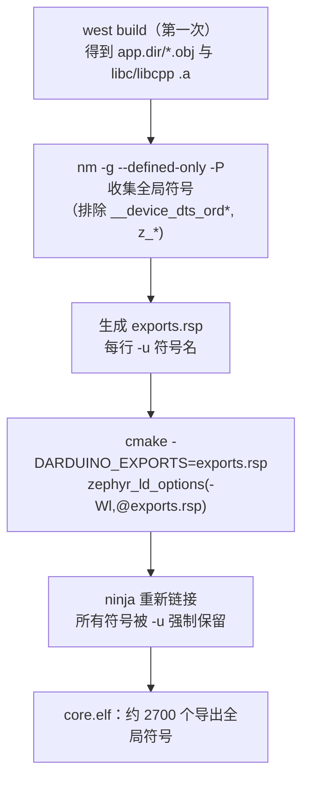
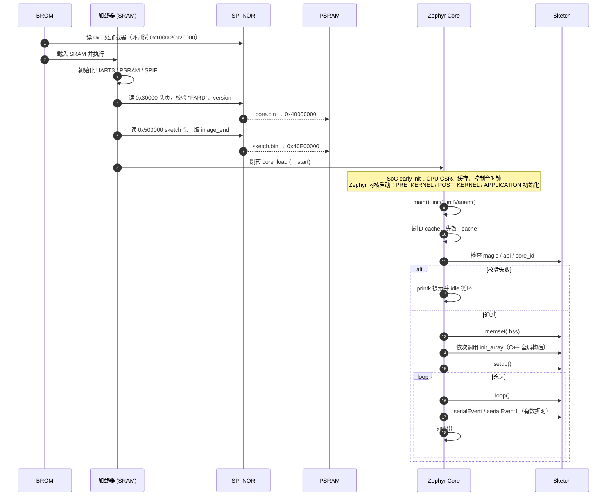

## 起因：Arduino 想要“秒级编译”，Zephyr 给不了

Arduino 的体验是：点一下“上传”，几秒钟后板子就在跑你的 `.ino`。IDE 背后只按 `platform.txt` 里的 recipe 调 gcc 编译、链接，再调上传工具把固件写进去。没有配置系统，没有依赖树，就是几条命令行。

Zephyr 是另一个世界。`west` + CMake + Ninja，几千个 Kconfig 符号，devicetree 先被编译成 C 宏再参与构建，还要拉上一堆 module（CherryUSB、OpenCORE AAC……）。这套东西对内核开发者很顺手，对只想点个 LED 的人就是灾难：改一行 `digitalWrite` 要重新链接整个内核，而且得先装好 Python 虚拟环境、dtc 和整棵源码树。

所以一开始就把硬约束定死了：

> **用户机器上只应该有 Arduino IDE（或 arduino-cli）、一个 RISC-V GCC 和 `xfel`。**

约 85 MB，装完就能用，不需要知道 Zephyr 是什么。剩下的一切——内核、驱动、协议栈、解码器——都必须在维护者侧解决，随平台包发布。

## 先拆问题：Sketch 到底需要 Zephyr 的什么

把问题拆开看，Sketch 对 Zephyr 的需求其实只有三样：

1. **函数地址**——`digitalWrite`、`Serial.print`、`malloc` 在内存里的位置；
2. **头文件**——`Arduino.h` 会一路引用到 Zephyr 的 GPIO 头、`k_sleep`、`autoconf.h` 里的 `CONFIG_*`；
3. **libc**——`memcpy`、`printf` 必须和 Core 里那份是同一份实现。

后面所有的设计都是这三样需求各自的答案，以及答案带来的连锁反应。

| 需求 | 答案 |
|---|---|
| 函数地址 | 链接期把 Core 当符号表：`ld --just-symbols=core.elf` |
| 头文件 | 构建 Core 时探测式导出到 `prebuilt/include`，随包发布 |
| libc | `-nostdinc` / `-nostdlib`，强制与 Core 用同一套 minimal libc |

## 总体形状



Core 只构建一次：Zephyr 内核、所有驱动、Arduino API 实现，以及 Display / Audio / USBHost / MP4Player 这些库的实现，全部编进一个 ELF。Sketch 则被链接到一个固定地址窗口，用 `--just-symbols` 把 Core 当作“外部地址簿”，链接时直接把 `digitalWrite` 解析成 Core 里的绝对地址。

没有动态链接器，没有运行时重定位，也没有 ELF 加载器：地址在链接那一刻就定了。

## 编译：把 Zephyr 的头文件“偷”给用户

Sketch 里 `#include <Arduino.h>`，而 Arduino.h 会引用 Zephyr 的头文件。但我们不想让用户拥有 Zephyr 源码树。

解决办法有点笨但很有效：`tools/build-core` 在构建完 Core 之后，用 `gcc -M -MG` **探测式编译**一个把所有库头文件都 include 进去的 cpp，拿到“实际被引用到的头文件列表”，复制进 `prebuilt/include`（共享部分）和 `prebuilt/<variant>-core/include`（每块板子独有的部分，比如 `autoconf.h`、`devicetree_generated.h`）。用户的 Core 包里就自带了它需要的一切。

`platform.txt` 里的关键参数：

```ini
compiler.common.flags=-mno-relax -msmall-data-limit=0 -Os \
    -ffunction-sections -fdata-sections -fno-common -fno-pic -fno-pie \
    -fno-asynchronous-unwind-tables -nostdinc -D__ZEPHYR__=1 ...

compiler.sys.includes=\
    -imacros{prebuilt.path}/{variant}-core/include/zephyr/autoconf.h \
    -imacros{prebuilt.path}/include/zephyr/toolchain/zephyr_stdint.h \
    -I.../include -isystem .../libc-minimal -isystem .../libc-common -isystem .../cpp-minimal

compiler.cpp.flags=-std=gnu++17 -nostdinc++ -fno-exceptions -fno-rtti -fcheck-new -fpermissive
```

几个不那么显然的点：

- **`-nostdinc` 是硬要求**。不能用工具链自带的 newlib 头文件，Sketch 必须和 Core 用同一套 libc（Zephyr minimal libc）。否则 `struct stat`、`FILE`、`errno` 的布局不一致，调用 Core 里的函数会悄悄出错：编译能过，链接能过，跑起来数据错位。这类 bug 排查成本很高。
- **`-imacros autoconf.h`**。Zephyr 的头文件大量用 `CONFIG_*` 做条件编译，Sketch 看到的配置必须和 Core 构建时一字不差。`-imacros` 相当于给每个源文件隐式 include 一次，但只吸收宏定义，不引入声明。
- **`-fno-exceptions -fno-rtti`**。Core 里没有 C++ 异常运行时，ABI 对不上就干脆不要用。
- **C++ 是有边界的**：能用的部分是类、模板、`new`/`delete`（走 Core 的堆），不能用的部分是异常和 RTTI。这是预编译 ABI 模型的固有代价，不是配置问题。

## 链接：`--just-symbols` 把 Core 变成一张地址簿

Sketch 的链接命令（`recipe.c.combine.pattern`）长这样：

```bash
g++ -mabi=ilp32d -march=rv32imafdc... -nostdlib -static \
    -Wl,--no-relax -Wl,--gc-sections \
    -Wl,-u,f101_sketch_header \
    -Wl,-T,prebuilt/sketch.ld \
    -Wl,--just-symbols=prebuilt/<variant>-core/core.elf \
    -o sketch.elf  sketch.o ... core.a  -lm -lgcc
```

`--just-symbols=core.elf` 是关键：ld 只读取 `core.elf` 的符号表，把这些符号当作**绝对地址符号（absolute symbols）**，完全不把 Core 的代码段合并进来。输出的 `sketch.elf` 只含 Sketch 自己的段，但对 `digitalWrite` 的调用已经填好了真实地址。

配 `-nostdlib`：libc 是 Core 的，Sketch 里的 `memcpy`/`printf` 都解析到 Core 的实现；只有 libm 和 libgcc（软浮点辅助、`__muldi3` 之类）才取自工具链。

`-u f101_sketch_header` 是个小陷阱：Sketch 头部只被链接脚本引用，没有任何符号引用它，不加 `-u` 强制拉进来的话，`--gc-sections` 会直接把它丢掉，板子上读到的就是一个空窗口。

### 一个容易忽略的细节：14 MiB 超出了 `jal` 的范围

Sketch 在 `0x40E00000`，Core 在 `0x40000000`，相距 14 MiB。`jal` 的立即数是 20 位、最低位隐含为 0，偏移范围 ±2^20 字节，也就是 ±1 MiB。单条指令到不了，跨窗口调用只能拆成 `auipc` + `jalr` 两步：

```
# 重定位之前（目标文件里）：两个立即数都是 0，等链接器填
auipc  ra, 0        # R_RISCV_CALL
jalr   ra, 0(ra)    # R_RISCV_CALL

# 链接之后（假设调用点在 0x40E00010，digitalWrite 在 0x40000000）
40e00010:  auipc  ra, 0xff200    # ra = 0x40E00010 - 0xE00000 = 0x40000010
40e00014:  jalr   ra, -16(ra)    # 0x40000010 - 16           = 0x40000000
```

`auipc` 的 20 位立即数左移 12 位，覆盖 ±2 GiB，`jalr` 再补一个 12 位有符号偏移，14 MiB 的负向距离就这样被拆成“高位补偿 + 低位修正”。hi20 计算时要先加 `0x800` 再算术右移，所以高 20 位总是差一点，靠 `jalr` 那个负偏移补回来。

`-mno-relax` 和 `-msmall-data-limit=0` 就是为这两条指令服务的。距离已经超出 `jal` 范围，松弛帮不上忙，关掉它反而省事：`auipc`/`jalr` 序列原样保留，段大小也不因松弛而变动。`-msmall-data-limit=0` 则关掉 small data——Sketch 运行时 `gp` 没有按 Zephyr 的约定初始化，任何 gp 相对寻址都是错的。

这样 Sketch 镜像的布局（`.header` 在最前、`image_end` 决定拷贝长度）就完全可预测了。

## 坑一：`--gc-sections` 把 Core 自己的符号裁掉了

Sketch 链接时会得到一堆 undefined reference。`--gc-sections` 有个副作用：Core 镜像自己用不到的函数不会出现在 `core.elf` 里。libc 里的 `strtok`、某个驱动的公共 API、Zephyr 的 `k_mutex_lock`——Core 没调用，就被回收了，Sketch 想用的时候它们已经不存在。

`build-core` 的处理是**链接两次**：



先正常构建一遍，用 `nm` 把所有目标文件和静态库里的全局符号收集出来（排除掉设备树内部符号和 Zephyr 内部符号），生成一份 `-u` 列表，再重新链接一次。于是 `core.elf` 对 Sketch 来说是一份**稳定的 ABI**：Arduino API、libc、C++ 支持、Zephyr 的公开 API 全都在里面。

## 坑二：Sketch 和 Core 版本对不上怎么办

Sketch 链接时把 Core 的地址烧进了自己的指令里。如果板子上跑的是另一份 Core，函数地址全错，执行的是垃圾——而且不会有任何报错，只会跑飞。

防护是一个叫 `core_id` 的绝对符号：

- Core 链接时 `--defsym=f101_core_id_value=<id>` 定义一个绝对符号，值就是本次构建的 id；
- Sketch 头里把这个符号的值写进 `core_id` 字段（`sketch_entry.cpp` 干的——它同样是被 `--just-symbols` 解析的，拿到的就是链接时那份 `core.elf` 的 id）；
- Core 启动时比对，不一致就打印 `the sketch was built for another core (id ..., core ...)` 然后停住。

ABI 是静态绑定的，版本检查只能自己做：宁可在这里明确报错，也不要让板子去执行垃圾代码。

## 契约：一个头结构体 + 一个链接脚本

Sketch 没有 `main()`，也没有自己的启动代码，它由 Core 里的 `main()` 驱动。两者之间的契约写在一个头结构体里（`sketch_abi.h`）：

```c
#define F101_SKETCH_BASE  0x40E00000u
#define F101_SKETCH_SIZE  0x00200000u
#define F101_SKETCH_MAGIC 0x31303146u   /* "F101" */

struct f101_sketch_header {
    uint32_t magic, abi, core_id;
    void (*setup)(void);
    void (*loop)(void);
    void (*serial_event)(void);
    void (*serial_event1)(void);
    void (**init_array_start)(void);   /* C++ 全局构造函数表 */
    void (**init_array_end)(void);
    uint32_t bss_start, bss_end;       /* Core 负责清零 */
    uint32_t image_end;                /* 加载器据此知道拷贝多大 */
};
```

这个头由 `sketch_entry.cpp`（每个 Sketch 都会编译它）填充，放进 `.f101_header` 段，`sketch.ld` 把它排在窗口最前面。

这样做的好处是：`setup`/`loop` 的地址不靠符号约定，而是 Core 去读内存里的结构体。Core 因此完全不需要知道 Sketch 的任何符号——它只认识一个固定地址和一个结构体布局，两者之间只剩内存布局这一层耦合。

`sketch.ld` 的段排布：

```
0x40E00000  .header       f101_sketch_header
            .text         代码
            .rodata       只读数据
            .init_array   C++ 构造函数表（__init_array_start/end）
            .data         已初始化数据   ← __sketch_image_end
            .bss (NOLOAD) 不占镜像，Core 在启动 Sketch 前 memset 清零
0x41000000  窗口结束（2 MiB）
```

`.eh_frame`、`.comment`、`.note` 全部 `/DISCARD/`；`.bss` 标 `NOLOAD`，`sketch.bin` 里不含 bss，但窗口内为它预留了空间。不用 `-fpic`：SoC 上的 MMU 没有启用，所有地址都是物理地址，固定地址静态链接最简单也最可靠。

## 内存怎么分

F101 的 MMU 虽然存在，但 Core 没有启用它：不做地址转换，没有页表，没有进程隔离。Core、Sketch、堆、栈全都直接使用物理地址，处在同一块平坦的地址空间里。

### PSRAM（16 MiB）

```
0x41000000 ┬──────────────────────────────  PSRAM 结束
           │
           │   Sketch 窗口  2 MiB
           │   .header / .text / .rodata / .init_array / .data / .bss
0x40E00000 ┼──────────────────────────────  F101_SKETCH_BASE
           │
           │   libc 堆（CONFIG_COMMON_LIBC_MALLOC_ARENA_SIZE=-1）
           │   —— 占用 Core 镜像之上到窗口之下的全部空间
           │      String、new、malloc、SD 缓冲、帧缓冲都从这里来
           │
0x400E7xxx ┼──────────────────────────────  Core 镜像结束（约 925 KB）
           │   datas / sw_isr_table
0x4008C2C0 ┤   noinit   ~358 KiB（栈、DMA 缓冲等）
0x40071000 ┤   bss      ~109 KiB
           │   rodata   ~76 KiB
           │   驱动 API 区、device_area、init_array 等
           │   text     ~370 KiB   （Zephyr 内核 + 驱动 + Arduino API + 库）
0x40000640 ┤
0x40000000 ┴──────────────────────────────  Core 入口 __start（rom_start）
```

> 数字取自 `size -A core.elf`，具体值随每次构建变化，仅作量级参考。

有两点值得单独说。

**一是 `prebuilt.overlay` 把 Zephyr 的 `&sram0` 缩成 `0x40000000 .. 0x40E00000`（14 MiB）**。libc 的 arena 定义是“链接地址之上所有可用 RAM”，把 SRAM 上限压到 Sketch 窗口边界，堆就自动在窗口之下结束，不可能踩到 Sketch。不用改任何 libc 代码，只改一个设备树节点。

**二是 bss/noinit 排在 `datas` 之前**。这个布局下 `core.bin` 是平铺镜像，bss/noinit 会被补零写进文件，所以 `core.bin` 有约 925 KB，远大于 text + rodata 之和。这是下载速度和 RAM 使用之间的取舍——Core 只烧一次，可以接受。

### SPI NOR（16 MiB）

```
0x000000  ┬ 一阶段加载器（SyterKit app）   副本 1
0x010000  ┤                                副本 2
0x020000  ┤                                副本 3     ← 任一副本坏了仍能启动
0x030000  ┼ Core 头页（4 KiB, "FARD"）
0x031000  ┤ core.bin（最大 0x4CF000）
0x500000  ┼ sketch.bin（最大 2 MiB，首字节即 f101_sketch_header）
0x700000+ │ 空闲
```

Core 的头页是一个 8 个 u32 的小端结构 `struct arduino_boot_header`：

```
+0x00  magic        0x44524146 "FARD"
+0x04  version      1
+0x08  core_load    0x40000000    PSRAM 地址，同时是入口
+0x0C  core_size    core.bin 字节数
+0x10  core_id      本次构建的 id
+0x14  sketch_load  0x40E00000
+0x18  sketch_max   0x00200000
+0x1C  reserved
（其余补 0xFF 到 4 KiB）
```

## 上电之后发生了什么



**① 为什么要刷缓存。** 加载器用 CPU/DMA 把 Sketch 写进 PSRAM，此时 Core 的 I-cache 和 D-cache 里可能还留着旧内容。`main()` 里先 `sys_cache_data_flush_and_invd_all()` 再 `sys_cache_instr_invd_all()`，确保 CPU 取到的是刚写进去的代码。漏掉这步的表现是“偶尔跑飞”，很难查。

**② 为什么 `.bss` 要由 Core 清零。** Sketch 没有 crt0，`.bss` 是 NOLOAD，加载器不会为它拷贝任何东西，镜像里也没有那些零。所以 Core 按头里的 `bss_start/bss_end` 做一次 `memset`。

**③ C++ 全局对象。** Core 遍历 `init_array_start..init_array_end` 依次调用，等价于标准 crt 的 `__libc_init_array`，所以 Sketch 里写 `String s = "x";` 这样的全局对象也能正常构造。

**④ `setup`/`loop` 跑在 Zephyr 的主线程里。** `main()` 就是 Zephyr 的 main 线程，栈给到 16 KiB（`CONFIG_MAIN_STACK_SIZE=16384`）——Sketch 经常在栈上放大数组，默认的 1 KiB 会悄无声息地崩溃。`yield()` 则把 CPU 让给 Zephyr 的其他线程（USB、音频、显示刷新……），这是 Arduino 单线程模型与 RTOS 共存的方式。

**⑤ 延迟初始化设备。** 显示、背光 PWM、MIPI DBI、USB PHY 在设备树里都标了 `zephyr,deferred-init`，Zephyr 启动时不碰它们——它们共用同一批引脚和电源（比如显示和 DBI 共用 PD0..PD5，只能二选一）。只有库的 `begin()` 被调用时才 `device_init()`，用不到的外设不会占用你的引脚。

**⑥ `Serial` 独占控制台。** Core 的 `prj.conf` 关掉了 Shell 和 UART 日志后端，避免 Zephyr 的日志插进 `Serial` 的输出里。

## 上传：从 IDE 到板子

```bash
xfel version                                # 确认在 FEL 模式
xfel spinor write 0x0       boot.img
xfel spinor write 0x30000   core.flash
xfel spinor write 0x500000  sketch.bin
xfel write 0x20000 arduino_boot_fel.bin && xfel exec 0x20000
```

最后一步是把加载器写进 SRAM 的 `0x20000` 并直接执行，所以**不用断电重启**。烧录本身需要先按住 FEL 键上电，而 FEL 在 `exec` 之后就消失了，因此一次上传就是一次完整流程。之后板子每次上电都从 SPI NOR 自启动，不再依赖 PC。

## 代价

- **Sketch 只能是 Core 的“客户”**。想要的功能必须已经编进 Core。库是预先编进去的，即使 Sketch 不用也占 Flash/RAM——所以不用的驱动得在 Core 的 Kconfig 里按需关掉。
- **ABI 脆弱**。Core 一重编，符号地址全变，所有 Sketch 都得重新链接。这正是 `core_id` 存在的原因。
- **头文件必须与 Core 精确同步**。`autoconf.h`、结构体布局、libc 版本，任何一处不一致都会在运行时以奇怪的方式爆出来，而不是在编译期。
- **固定窗口**。Sketch 最大 2 MiB，堆的上限是 14 MiB 减去 Core 镜像大小。
- **C++ 受限**：无异常、无 RTTI。

换来的是：用户侧工具链约 85 MB，编译只涉及 Sketch 自己，没有运行时重定位，没有 GOT/PLT，没有页表和虚拟地址。

## 小结

把 Zephyr 的复杂构建封进一个预编译的 `core.elf`，让 Sketch 只做一次普通的 gcc 编译与链接，中间靠三样东西粘合：

1. **`--just-symbols=core.elf`**——符号即地址，免去动态加载；
2. **固定窗口 + 头结构体**（`0x40E00000` + `f101_sketch_header`）——让 Core 在不知道任何 Sketch 符号的情况下找到 `setup`/`loop`、构造函数表和 `.bss`；
3. **`core_id` 绝对符号 + 二次链接导出（`-u`）**——保证符号既齐全，版本又一致。

再配上 SyterKit 的两阶段启动（BROM → SRAM 加载器 → PSRAM 中的 Core → Sketch），就得到了“Arduino 的体验，Zephyr 的内核”。
