板子:YuzukiNeko (平头哥 C907,rv32imafdcv),16 MB PSRAM,没有 SBI,内核跑在 M 态。

想做的事:让 mGBA 模拟器直接把一个 16 MiB 的 GBA 游戏 ROM 当作"一块 16 MiB 的内存"来读,而这块板子一共只有 16 MB 内存。

做法:在 Zephyr 里给 RISC-V 补上 Sv32 MMU 和请求调页(demand paging),拿 SD 卡上的文件当"后备存储"。mGBA 本身一行没改。

## MMU 到底在干什么

如果你已经熟悉 MMU,这一段可以直接跳过,后面只讲用得到的东西。

### 虚拟地址和物理地址

CPU 执行 `lw a0, 0(a1)` 时,`a1` 里放的是**虚拟地址**。开了 MMU 之后,硬件在真正访问内存之前,先把虚拟地址翻译成**物理地址**(内存条上的真实位置)。翻译的规则放在内存里一张叫**页表**的表中,由操作系统填写。

为什么要多这一步?因为翻译表可以**不是一一对应**的:

- 两个不同的虚拟地址可以指向同一块物理内存(共享);
- 一个虚拟地址可以**暂时没有**对应的物理内存(这一页还在磁盘/SD 卡上);
- 虚拟地址空间可以比物理内存大得多。

我们的 ROM 窗口用的是第二和第三条:虚拟地址空间里有 16 MiB 连续的一段,物理内存里只有其中一小部分。

### 页

内存不是一个字节一个字节地翻译,而是按**页**翻译。RISC-V 的 Sv32 方案里一页是 **4 KiB(4096 字节)**。一个 32 位虚拟地址分成两段:高 20 位是**虚拟页号**(翻译查表用),低 12 位是**页内偏移**(翻译前后不变)。

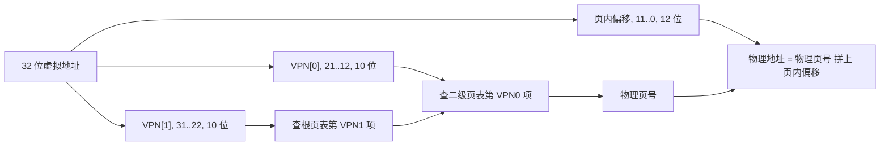

### Sv32:两级页表

Sv32 是 RISC-V 32 位的分页方案("Sv32" = Supervisor-mode virtual addressing, 32 位)。它用**两级**页表:

- **根页表**:1024 项,每项 4 字节,正好占一页(4 KiB)。用虚拟地址的 `VPN[1]`(第 31 到 22 位)当下标。
- **二级页表**:每张也是 1024 项、4 KiB。根页表项如果指向一张二级页表,就用 `VPN[0]`(第 21 到 12 位)当下标。

一张二级页表覆盖 1024 页 × 4 KiB = **4 MiB** 虚拟地址。根页表项也可以直接是一个**叶子**——这时它直接映射一整块 **4 MiB 的"超页"**,不再查第二级。后面我们对外设和程序镜像大量使用超页。

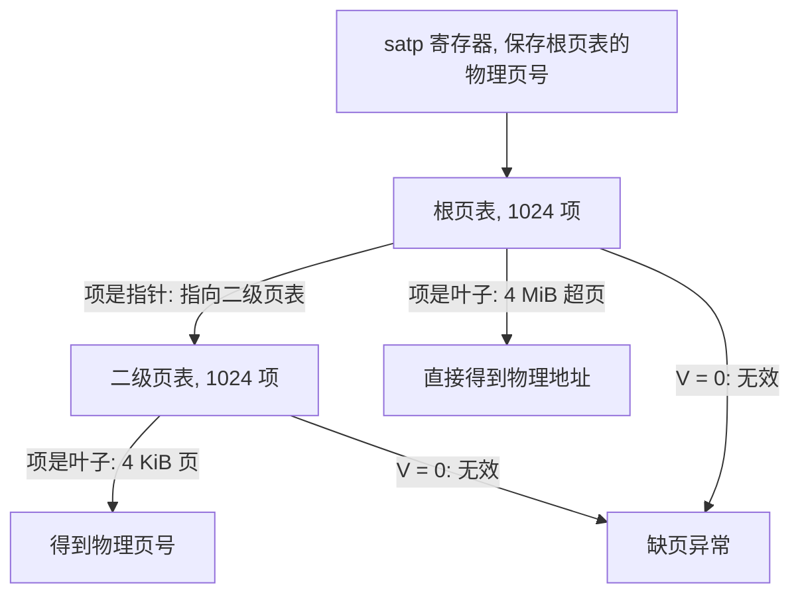

**页表项(PTE)**是 32 位:

| 位 | 名字 | 含义 |
|---|---|---|
| 31..10 | PPN | 物理页号。物理地址 = PPN × 4096。 |
| 9..8 | RSW | 留给软件自己用的两位,硬件不看。**我们用第 8 位标记"已换出"。** |
| 7 | D | Dirty,脏位:这一页被写过 |
| 6 | A | Accessed,访问位:这一页被访问过 |
| 5 | G | Global |
| 4 | U | User:用户态可以访问 |
| 3 | X | 可执行 |
| 2 | W | 可写 |
| 1 | R | 可读 |
| 0 | V | Valid,有效。**V=0 时,访问这一项一定缺页。** |

R、W、X 同时为 0 表示"这一项指向下一级页表";其中任何一位为 1 表示"这一项是叶子"。

`satp` 寄存器告诉硬件"页表在哪、开不开":最高位 MODE=1 表示 Sv32,低 22 位是根页表所在物理页的页号。例如板子上跑起来时 `satp = 0x80040126`:MODE=1,根页表在 `0x40126000`。

### TLB

每次访问都去内存里查两次页表,太慢。硬件有一小块缓存,叫 **TLB**(翻译后备缓冲),存着最近翻译过的"虚拟页号 → 物理页号"。查表只在 TLB 没命中时发生。这对后面有两处影响:

- **改了页表之后要让 TLB 作废**:用 `sfence.vma` 指令。我的实现每改一项就全部刷新,简单,但不是最快的做法。
- **TLB 容量有限**(这颗 CPU 大约 256 项)。程序访问的页分散得越广,TLB 越容易不命中。用 4 MiB 超页能让一项顶 1024 项,后面讲镜像映射时会量出两者的差别。

### 缺页异常

页表项 V=0(或权限不够、或 A/D 位的要求没满足)时,访问不会进行,CPU 转去执行异常处理程序,并告诉它:

- `mcause`:原因。13 表示"读(load)缺页",15 表示"写(store)缺页";
- `mtval`:引发异常的**虚拟地址**;
- `mepc`:出错那条指令的地址。处理完成后用 `mret` 返回,CPU **重新执行**那条指令。

这就是请求调页能成立的原因:缺页处理程序可以做任何事——比如从 SD 卡读 4 KiB——只要在返回前把页表项改成有效的。出错的指令重新执行时,就成功了,而程序完全不知道发生过什么。

### 请求调页(demand paging)

请求调页是把上面几件事组合起来:

1. 一块虚拟内存先登记好,但**页表项全部是无效的**("还没读进来");
2. 程序访问其中一页 → 缺页;
3. 内核找一个空闲的**页帧**(一页物理内存),把数据读进去,把页表项改成指向它,返回重试;
4. 如果没有空闲页帧,先**淘汰**一个已经在用的页(**置换**),把它的页帧腾出来;如果被淘汰的页被改过(**脏页**),要先写回;
5. **后备存储**是页的"老家"——数据平时放的地方,换入时从这里读,脏页换出时写到这里。

Zephyr 内核本来就有请求调页的通用实现(`kernel/mmu.c`,以及置换算法 `subsys/demand_paging/eviction/`)。它缺的是**每种 CPU 架构自己的那一半**:怎么改页表项、怎么在缺页异常里调用通用代码。RISC-V 这一半 Zephyr 4.2 里没有,所以要自己写。

### 术语速查

| 词 | 意思 |
|---|---|
| 页 | 4 KiB 的一块虚拟内存 |
| 页帧(page frame) | 4 KiB 的一块物理内存,用来放页 |
| 缺页 | 访问了页表里无效的页,硬件触发异常 |
| 换入 / 换出 | 把页从后备存储读进页帧 / 把页帧里的内容写回去并回收页帧 |
| 后备存储 | 页的原本存放处。本文里是 SD 卡上的一个文件 |
| 1:1 映射(恒等映射) | 虚拟地址等于物理地址 |
| 超页 | 根页表项直接映射的 4 MiB 大页 |
| 脏页 | 内存里的内容比后备存储里的新 |

---

## 问题与约束

背景说完了,回来说我到底卡在什么地方。

### 为什么需要这个

mGBA 是个很好的模拟器核心。它加载 ROM 的方式是:拿到一个 `VFile`(文件抽象),调用它的 `map()` 要一个"指向整个 ROM 的指针",之后模拟器用这个指针随便读。32 位 ARM 的 GBA 地址空间里,卡带 ROM 最大 32 MiB,常见的大游戏是 16 MiB。

问题是内存只有这么多:

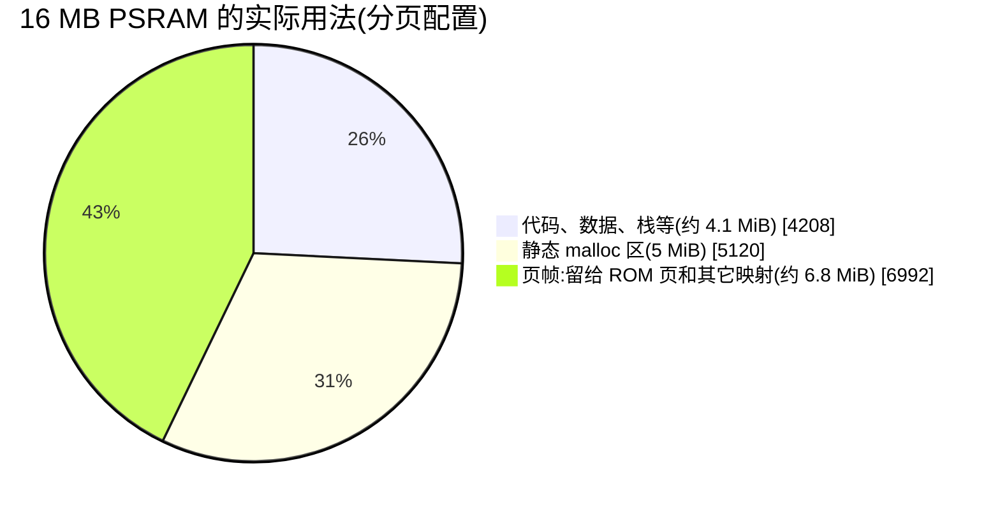

(单位 KiB。三项相加是 16320 KiB,等于 Zephyr 看到的 SRAM 大小。板子上 0x40000000 开始的前 64 KiB 不在 Zephyr 的 SRAM 里。)

16 MiB 的 ROM 比"页帧"那一块还大。传统做法有三种:

1. **整个读进内存**:放不下。
2. **改模拟器**:让它自己管理缓存,每次读 ROM 先查缓存、不命中再读文件。要改 mGBA 里几百处访问 ROM 的地方,而且会拖慢每一次取指。
3. **让操作系统做**:这就是本文的做法。ROM 变成一块"虚拟内存",硬件在访问到不在内存的页时产生一个异常(**缺页**),内核在异常里把那一页从 SD 卡读进来,然后让指令重新执行。对 mGBA 来说,什么都没发生过。

### 约束

板子本身有几条硬约束,这些约束决定了后面所有的设计:

| 约束 | 后果 |
|---|---|
| **没有 SBI。** 用 xfel 把程序送进 RAM 然后 `exec`,CPU 此时在 **M 态**(机器态)。 | 内核只能跑在 M 态,不能用常见的"S 态内核 + SBI"方案。"最难的一关"那一节专门讲这个。 |
| M 态下,**指令取指**永远不经过页表翻译。 | 代码不能换页,整个程序镜像要常驻内存。 |
| 核内外设 **CLINT、PLIC** 只接受 M 态访问。 | 经过页表翻译的访问会被它们拒绝,要给它们专门的"不翻译"读写函数。 |
| 驱动里大量把**缓冲区指针直接当总线地址**(SD 卡、DMA、显示)。 | 凡是给硬件用的内存必须是虚拟地址等于物理地址(1:1)。 |
| 单核 CPU。 | 请求调页的"互斥"可以简化,但必须允许缺页处理程序**睡眠**(等 SD 卡),这要改一处内核代码。 |

### 设计目标

1. 内核 + 驱动**零修改**地继续工作(它们看到的地址不变)。
2. 只有"用 `k_mem_map` 映射出来的页"才是非 1:1 的。
3. ROM 以**只读文件映射**的形式出现:页从文件读入,不会被写回(ROM 本来就不会变)。
4. 不依赖模拟器的任何改动。

---

## 全景

先把整件事的形状看一下,后面每一节讲其中一块。

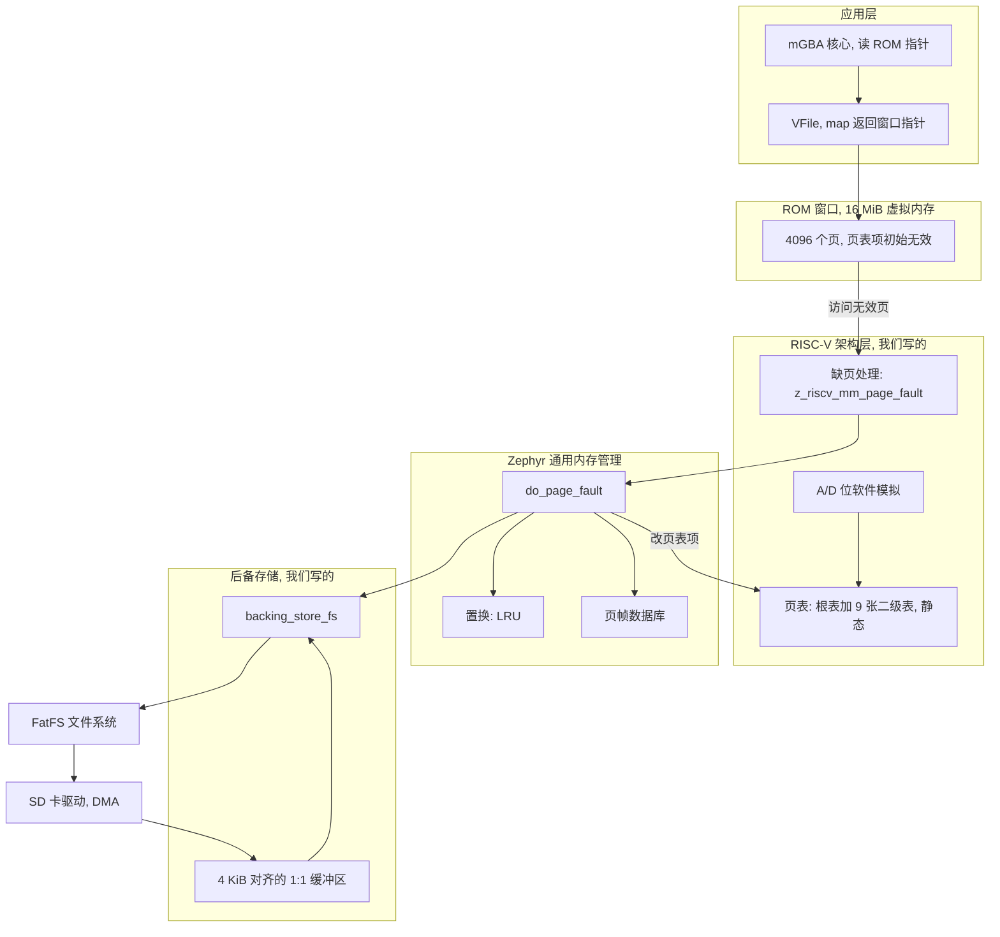

各部分的分工:

| 部分 | 谁写的 | 位置 |
|---|---|---|
| 页表、`arch_mem_map` 等架构接口、缺页入口、A/D 位 | 本文新增 | `zephyr/arch/riscv/core/mmu.c`、`include/zephyr/arch/riscv/mm.h` |
| 缺页发生时的 CPU 状态切换 | 本文新增 | `arch/riscv/core/switch.S`、`thread.c`、`fatal.c` |
| CLINT/PLIC 的不翻译读写 | 本文新增 | `include/zephyr/arch/riscv/mm.h` 里的 `z_riscv_mmode_read32/write32`,`drivers/timer/riscv_machine_timer.c`,`drivers/interrupt_controller/intc_plic.c` |
| 外设的 1:1 映射表 | 本文新增 | `soc/allwinner/sun252i_f101/mmu_regions.c` |
| 通用调页逻辑、LRU 置换 | Zephyr 原有 | `kernel/mmu.c`、`subsys/demand_paging/eviction/lru.c` |
| 允许缺页时睡眠的小改动 | 本文新增 | `kernel/mmu.c`、`kernel/Kconfig.vm` |
| 文件后备存储 | 本文新增 | `subsys/demand_paging/backing_store/backing_store_fs.c` |
| mGBA 的接入 | 本文新增 | `zephyr-components/mgba/src/gba_player.c`、`src/gba_memory.c` |

---

## 最难的一关:没有 SBI,M 态内核怎么用 MMU

### 问题

RISC-V 有三种特权级:

| 特权级 | 名字 | 典型用途 |
|---|---|---|
| M | 机器态 | 最高权限,固件(SBI)跑在这里 |
| S | 监督态 | 操作系统内核跑在这里 |
| U | 用户态 | 应用程序 |

Linux 等系统的标准布局是:SBI 在 M 态,内核在 S 态,应用在 U 态。MMU(`satp`、页表)是**给 S 态和 U 态用的**。

但这块板子没有 SBI:xfel 把代码送进 RAM 然后跳过去,CPU 就停在 M 态。而 RISC-V 规范里有一条很关键的规定:

> **M 态的取指和普通访存不经过页表翻译。**

也就是说,如果内核一直跑在 M 态,`satp` 开了也没用。

有两条路:

1. **自己降到 S 态**:用 `mret` 把自己"返回"到 S 态,自己写 SBI 垫片(时钟、核间中断、外设访问),自己处理中断/异常委托。Zephyr 主线没有 S 态内核,所有 CSR 访问(`mstatus`、`mepc`、`mtvec`...)和异常入口都要改成 S 态版本,CLINT/PLIC 还只认 M 态,要在 M 态写垫片。工作量很大。
2. **留在 M 态,借用"访存特权级"这个机制**。下面讲的就是这条路。

### 技巧:MPRV 和 MPP

`mstatus` 里有两个位域:

- **MPP**(第 12..11 位):"进入 M 态异常之前的特权级"。`mret` 返回时,CPU 切换到 MPP 指定的特权级。
- **MPRV**(第 17 位):"修改特权级"。当 `MPRV = 1` 时,**load 和 store**(只有数据访问,不包括取指)会**按 MPP 指定的特权级**去做地址翻译和权限检查,尽管 CPU 本身仍在 M 态。

所以,只要设置 `MPRV = 1`、`MPP = U(0)`,M 态里的每一次 load/store 都会被当作"用户态访问"来走页表。**页表项里要把 U 位置 1**(这就是为什么我们的叶子都是"用户页")。取指不受影响,一直是物理地址。

结论:

- **数据**可以非 1:1:用页表任意映射;
- **代码**必须 1:1,所以整个程序镜像都要常驻内存,不能换页(代码不是问题:程序本身只有 4 MB 左右)。

ROM 窗口是数据,所以可以用这个办法。

### 陷入时发生了什么

这个设计里最容易让人糊涂的是:**什么时候翻译开着,什么时候关着。** 答案是:翻译是否生效由 `MPP` 的值决定,而 `MPP` 会被硬件在陷入(异常/中断)和 `mret` 时自动改写。

规范规定:

- **陷入 M 态时**:硬件把 `MPP` 设成"陷入前的特权级",我们本来就在 M 态,所以 `MPP = M(3)`。此时 `MPRV = 1` 且 `MPP = M`,等价于"用 M 的特权访存",**不翻译**。
- **`mret` 时**:CPU 回到 `MPP` 指定的特权级(M),然后硬件把 `MPP` 设成"支持的最低特权级"(U)。因为返回的是 M 态,`MPRV` 不会被清掉,于是 `MPRV = 1, MPP = U`,**翻译重新生效**。

也就是说:**线程代码在翻译开启下运行,中断和异常的入口代码、中断处理函数在翻译关闭下运行,全部由硬件自动切换,不用写一行代码。**

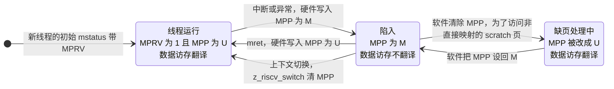

这有三个重要后果,**后面几乎所有的坑都来自这里**:

1. **中断处理函数运行时,翻译是关的。** 所以它们碰到的所有地址必须是物理地址。凡是中断里会访问的东西(驱动的寄存器基地址、全局数据、栈),都必须 **虚拟地址 = 物理地址(1:1)**。这是为什么外设用 1:1 映射,以及为什么 `device_map()` 要直接返回物理地址(见"什么必须是 1:1"那一节)。
2. **缺页处理要自己把翻译打开。** 缺页处理程序是在"陷入"状态下运行的,翻译是关的,但它要通过一个**非 1:1** 的特殊页(scratch 页,后面讲缺页流程时会说)往新页帧里写数据,所以要手动清 `MPP`,处理完再设回 M。设回去不是返回正确性所必需的:Zephyr 的异常出口汇编会从栈上的异常帧恢复 `mstatus`(那里的 `MPP` 是陷入时硬件写的 M),然后才 `mret`。设回去是为了让没有解决的缺页继续走致命错误路径时,仍处在和普通陷入一样的"不翻译"状态。另外要记住一条规矩:`mret` 是按 `MPP` 决定返回哪个特权级的,**绝不能在 `MPP = U` 时执行 `mret`**,否则 CPU 会降到用户态,内核立刻崩溃。
3. **线程切换时也要保证翻译开着。** 假设线程 A 在线程态被打断,线程 B 在陷入态(翻译关着)里被调度走,现在要切回 A:A 本来是翻译开着的,但此刻 `MPP` 还是陷入留下的 M,A 会在**翻译关闭**下继续跑到下一次 `mret`。解决办法是在 `z_riscv_switch` 的末尾清一次 `MPP`。

### 对应的代码

**① 打开翻译**(`arch/riscv/core/mmu.c` 的 `z_riscv_mm_init` 末尾):

```c
csr_write(satp, SATP_SV32 | ((uintptr_t)root_table >> 12));
tlb_flush();

/* from here on the loads and stores of this code are translated */
csr_clear(mstatus, MSTATUS_MPP);   /* MPP = U */
csr_set(mstatus, MSTATUS_MPRV);    /* MPRV = 1 */
```

**② 新线程从第一条指令起就带翻译**(`arch/riscv/core/thread.c` 的 `arch_new_thread`):

```c
#if defined(CONFIG_RISCV_MMU)
	/* the thread's loads and stores are translated from the first instruction */
	stack_init->mstatus |= MSTATUS_MPRV;
#endif
```

线程第一次运行是通过"异常返回路径"的,初始的 `mstatus` 里 `MPP = M`,`mret` 之后 `MPP` 变 U,`MPRV` 保持为 1。

**③ 线程切换后恢复翻译**(`arch/riscv/core/switch.S` 的 `z_riscv_switch` 末尾,`ret` 之前):

```asm
#if defined(CONFIG_RISCV_MMU)
	li t0, 0x1800 /* MSTATUS_MPP */
	csrc mstatus, t0
#endif
	ret
```

**④ 一条放行所有访问的 PMP**:这是一个容易漏的点。PMP(物理内存保护)平时不检查 M 态的访问。但开了 `MPRV` 之后,load/store 的**有效特权级**是 U,PMP 就要检查,**而且没有任何 PMP 项匹配时,U 态访问默认被拒绝**,结果是 load/store 访问异常(`mcause` 5 或 7)。解决:设一条覆盖全部地址空间、可读写执行的 NAPOT 项:

```c
#define PMP_ALL_ADDR	0x3fffffffUL	/* NAPOT, the whole 34 bit address space */
#define PMP_ALL_CFG	0x1fUL		/* NAPOT, R, W, X */
csr_write(pmpaddr0, PMP_ALL_ADDR);
csr_write(pmpcfg0, PMP_ALL_CFG);
```

因此 Zephyr 自己的 PMP 功能(`CONFIG_RISCV_PMP`)不能同时开,`RISCV_MMU` 的 Kconfig 里写了 `depends on !RISCV_PMP`。

### 为什么不选"降到 S 态"

| | 留在 M 态(本文) | 降到 S 态 + SBI 垫片 |
|---|---|---|
| 代码能否换页 | 不能(取指不翻译) | 能 |
| 需要改的内核代码 | 页表、缺页入口、几处汇编 | 所有 CSR 访问、异常入口、定时器、中断控制器、核间中断 |
| CLINT / PLIC | 加不翻译的读写函数 | 要在 M 态写垫片,或用 S 态的 PLIC 上下文 |
| 已有驱动 | 基本不用改 | 基本不用改 |
| 将来能不能做用户态/多进程 | 受限 | 可以 |

对"让一个 16 MiB 的数据文件当内存用"这个目标,M 态方案足够,而且改动小得多。如果以后要做用户态、给代码也换页,S 态才是对的方向,但那是另一个项目。

### 先在裸机上验证一遍

在写完整实现之前,**先写一个裸机小程序**验证这些假设(这是本项目实际做过的第一步):

1. 在 M 态建一张只映射几块区域的页表,写 `satp`,置 `MPRV=1`、`MPP=U`;
2. 访问一块非 1:1 映射的页,看数据对不对;
3. 故意访问一个 V=0 的页,看 `mcause` 是 13/15、`mtval` 是否等于出错地址、`mepc` 是否指向出错指令;
4. 去掉 PMP 放行项,看是不是出现 `mcause` 5/7;
5. 清掉页表项的 A 位,看是不是触发缺页(也就是硬件**不会**自己把 A 位置 1)。

这些现象都出现了,才有后面的设计。

---

## 地址空间和页表怎么摆

### 物理内存

板子的 16 MB PSRAM 从 `0x40000000` 开始。Zephyr 看到的 SRAM 从 `0x40010000` 起(前 64 KiB 不在设备树的 SRAM 节点里,但物理上也是内存)。

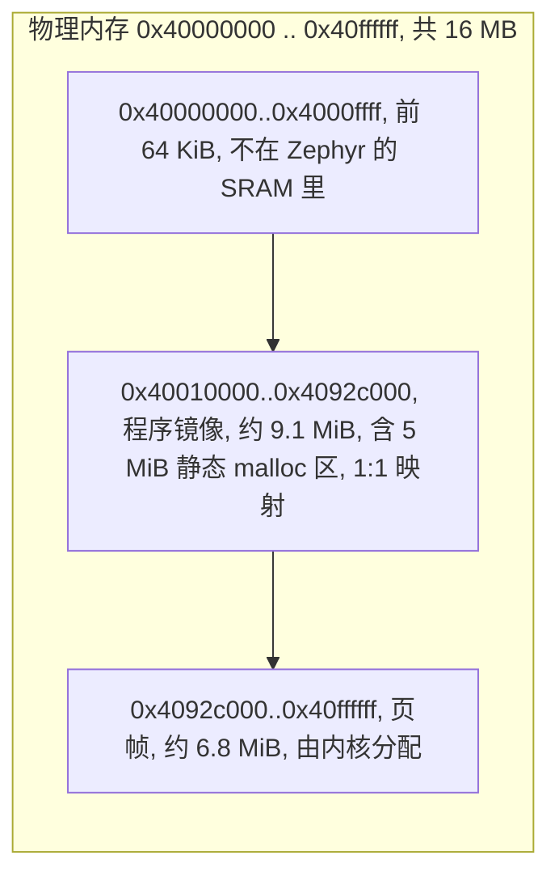

镜像里"静态 malloc 区"这一点很重要:驱动给 DMA 用的缓冲区都来自这里,**它必须是 1:1 的**。如果让 libc 的 malloc 去用"所有剩余内存"(`CONFIG_COMMON_LIBC_MALLOC_ARENA_SIZE=-1`),它会拿走页帧,而且那些页是 `k_mem_map` 出来的(非 1:1),DMA 就会读写错地址。所以开 MMU 时一定要把 malloc 区设成**有限的静态大小**(我设成 5 MiB)。

### 虚拟地址空间

Zephyr 的 MMU 抽象里有一个"内核虚拟地址空间"(`CONFIG_KERNEL_VM_BASE` 起,大小 `CONFIG_KERNEL_VM_SIZE`)。我设成从 `0x40010000` 开始 32 MiB,也就是 `0x40010000 .. 0x4200ffff`。这个范围比物理内存大(物理内存到 `0x40ffffff` 就没了),这是**故意**的:`k_mem_map` 需要在虚拟空间里找一块连续的地址,物理页帧可以是任意的。

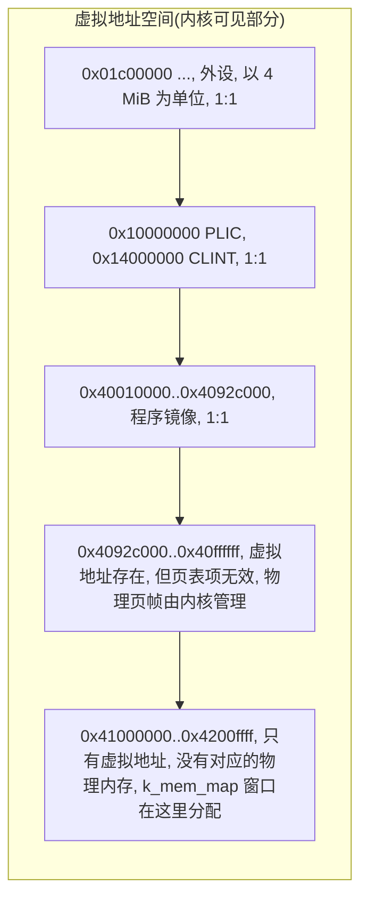

例如在板子上看到 FireRed 的 ROM 窗口被映射到 `0x4100e000`,而物理内存根本没有 `0x4100e000` 这个地址——它是一个纯粹的虚拟地址,每一页由页表指向某个页帧(或者当前不在内存里)。

### 页表本身:静态,预先分配

Zephyr 的 `arch_mem_map()` 接口有一个重要约束:**它不能失败,也不能分配内存**(它是 `void` 函数)。所以页表要**事先**把整个内核虚拟空间的二级页表全部备好:

```c
#define VM_START	ROUND_DOWN(CONFIG_KERNEL_VM_BASE, RISCV_SV32_MEGAPAGE)
#define VM_END		ROUND_UP(CONFIG_KERNEL_VM_BASE + CONFIG_KERNEL_VM_SIZE, RISCV_SV32_MEGAPAGE)
#define L2_TABLES	((VM_END - VM_START) / RISCV_SV32_MEGAPAGE)

static uint32_t root_table[PTES] __aligned(4096);
static uint32_t l2_tables[L2_TABLES][PTES] __aligned(4096);
```

按我们的参数:`VM_START = 0x40000000`,`VM_END = 0x42400000`,所以 `L2_TABLES = 9`,共 9 张二级表,占 36 KiB,加根页表 4 KiB。**它们是静态数组,放在镜像里**(所以页表自己也是 1:1 的,硬件的页表遍历器和我们读写它们用的是同一个地址)。

启动时(`z_riscv_mm_init`)把这 9 张表挂到根页表上:

```c
for (unsigned int i = 0; i < L2_TABLES; i++) {
    root_table[(VM_START >> ROOT_SHIFT) + i] = pte_ppn((uintptr_t)l2_tables[i]) | RISCV_PTE_V;
}
```

`ROOT_SHIFT = 22`:虚拟地址右移 22 位就是根页表下标(`0x40000000 >> 22 = 256`,所以用的是根页表的第 256 到 264 项)。

查"某个虚拟地址对应的二级页表项"的函数 `leaf_pte()`:

```c
static uint32_t *leaf_pte(uintptr_t va)
{
	uint32_t root;

	if (va < VM_START || va >= VM_END) {
		return NULL;
	}
	root = root_table[va >> ROOT_SHIFT];
	if (!pte_is_table(root)) {
		return NULL;
	}

	return &((uint32_t *)pte_phys(root))[(va >> 12) & (PTES - 1U)];
}
```

(`pte_is_table` 的意思:V=1 且 R、W、X 全为 0,即这项指向下一级。)

### 1:1 映射:镜像、外设,还有超页

**外设**:所有外设寄存器按 **4 MiB 一块**映射成根页表里的超页叶子,虚拟地址等于物理地址。映射表由 SoC 提供(`soc/allwinner/sun252i_f101/mmu_regions.c`):

```c
const struct riscv_mmu_region riscv_mmu_regions[] = {
	RISCV_MMU_REGION("ve",    0x01c00000, 0x00400000),  /* video engine */
	RISCV_MMU_REGION("apb0",  0x02000000, 0x00400000),  /* GPIO, PWM, CCU, ADC, audio, I2S */
	RISCV_MMU_REGION("uart",  0x02400000, 0x00400000),
	RISCV_MMU_REGION("sys",   0x03000000, 0x00400000),  /* system control, DMA, SID, MBUS */
	RISCV_MMU_REGION("ahb",   0x04000000, 0x00400000),  /* SD host, SPI, USB */
	RISCV_MMU_REGION("de",    0x05000000, 0x00400000),  /* display engine */
	RISCV_MMU_REGION("disp",  0x05400000, 0x00400000),  /* G2D, MIPI DSI, TCON */
	RISCV_MMU_REGION("wdt",   0x06000000, 0x00400000),
	RISCV_MMU_REGION("plic",  0x10000000, 0x00400000),
	RISCV_MMU_REGION("clint", 0x14000000, 0x00400000),
};
```

一个 4 MiB 的超页就是根页表的一项:

```c
root_table[(r->base + off) >> ROOT_SHIFT] =
    pte_ppn(r->base + off) | RISCV_PTE_V | RISCV_PTE_R | RISCV_PTE_W |
    RISCV_PTE_U | RISCV_PTE_A | RISCV_PTE_D;
```

注意 **A 和 D 位一开始就置 1**——后面讲 A/D 位时会说为什么:硬件不会自己置这两位,不预先置好的话第一次访问就缺页。

**程序镜像**:镜像里的每一页都 1:1。先用 4 KiB 页映射是最直接的(`make_leaf(va, K_MEM_PERM_RW)`),但这有性能问题:镜像有 9 MB,里面是模拟器的堆、全局表等分散访问的数据,TLB 只有 256 项,覆盖不到 1 MiB,TLB 不命中很多。实测开 MMU 之后模拟器每帧慢了 4.5%。

**解决办法:镜像里被完整占满的 4 MiB 块,用一个超页项代替 1024 个 4 KiB 项。** 镜像是 `0x40010000..0x4092c000`,所以 `0x40000000..0x40400000` 和 `0x40400000..0x40800000` 两块可以做成超页(第一块的开头那 64 KiB 也是内存,可以一起映射),剩下 `0x40800000..0x4092c000`(1.2 MiB,300 页)仍然用 4 KiB 页:

```c
mega_start = ROUND_DOWN((uintptr_t)z_mapped_start, RISCV_SV32_MEGAPAGE);
mega_end = mega_start;
while (mega_end + RISCV_SV32_MEGAPAGE <= (uintptr_t)z_mapped_end) {
    root_table[mega_end >> ROOT_SHIFT] = pte_ppn(mega_end) | RISCV_PTE_V |
        RISCV_PTE_R | RISCV_PTE_W | RISCV_PTE_U | RISCV_PTE_A | RISCV_PTE_D;
    mega_end += RISCV_SV32_MEGAPAGE;
}
for (va = (uintptr_t)z_mapped_start; va < (uintptr_t)z_mapped_end; va += PAGE_SIZE) {
    if (va < mega_start || va >= mega_end) {
        *leaf_pte(va) = make_leaf(va, K_MEM_PERM_RW);
    }
}
```

为什么不把最后那块也做成超页?因为镜像之后紧跟着的是页帧区域,它们**不能**同时有 1:1 的别名映射(同一块物理内存两个虚拟地址访问,容易造成缓存别名问题)。

启动信息会打印这个划分:

```
mmu: 1:1 image     0x40010000-0x4092c000, 9328 KiB, 8 MiB in 4 MiB pages, the rest 4 KiB pages
mmu: 300 pages mapped, 0 paged out, 6992 KiB of page frames free
```

300 页就是 `(0x4092c000 - 0x40800000) / 4096 = 300`,可以拿来对账。

**超页带来的变化**:塞尔达基准每帧耗时:没开 MMU 12.98 ms;开 MMU 用 4 KiB 页 13.56 ms(慢 4.5%);用超页 13.32 ms(慢 2.6%)。模拟器画面的校验和(CRC)三者完全一样,只是更快。

要让超页被正确识别,`arch_page_phys_get()`(虚拟地址转物理地址)要先检查根页表项是不是叶子:

```c
uint32_t root = root_table[va >> ROOT_SHIFT], *pte;

/* a 4 MiB entry: a block of the image or the registers of peripherals */
if ((root & RISCV_PTE_V) != 0U && !pte_is_table(root)) {
    if (phys != NULL) {
        *phys = pte_phys(root) | (va & (RISCV_SV32_MEGAPAGE - 1U));
    }
    return 0;
}
```

### 启动顺序

页表在 `z_prep_c`(C 语言运行环境刚准备好、内核还没起来)里建好并打开:

```c
#if CONFIG_ARCH_CACHE
	arch_cache_init();
#endif
#if defined(CONFIG_RISCV_MMU)
	z_riscv_mm_init();
#endif
	z_cstart();
```

之后 Zephyr 通用代码 `z_mem_manage_init()` 会初始化页帧数据库(登记哪些物理页是空闲页帧,哪些被镜像占了)。

为了让通用代码知道镜像从哪里开始,链接脚本里加了一行(`include/zephyr/arch/riscv/common/linker.ld`):

```ld
#ifdef CONFIG_MMU
    z_mapped_start = __rom_region_start;
#endif
...
#ifdef CONFIG_MMU
/* the end of the image is the end of the last mapped page */
#define LAST_RAM_ALIGN . = ALIGN(CONFIG_MMU_PAGE_SIZE);
#endif
```

后一段让镜像末尾按页对齐,这样镜像的最后一页不会和页帧共用。

### 动手验证

1. 启动日志里应该有 `mmu:` 开头的几行,说明页表建好了;
2. 先把镜像映射、外设映射都做好、**不开请求调页**,跑一个已有的完整例子(这里用的是 mGBA 播放器),确认画面 CRC 和没开 MMU 时一样——这一步验证"开 MMU 不改变任何已有行为";
3. 看启动信息里"pages mapped"这个数字能不能用上面的公式对上。

---

## 页表项的三种状态

请求调页的核心就是一个页表项(PTE)在三种状态间切换。

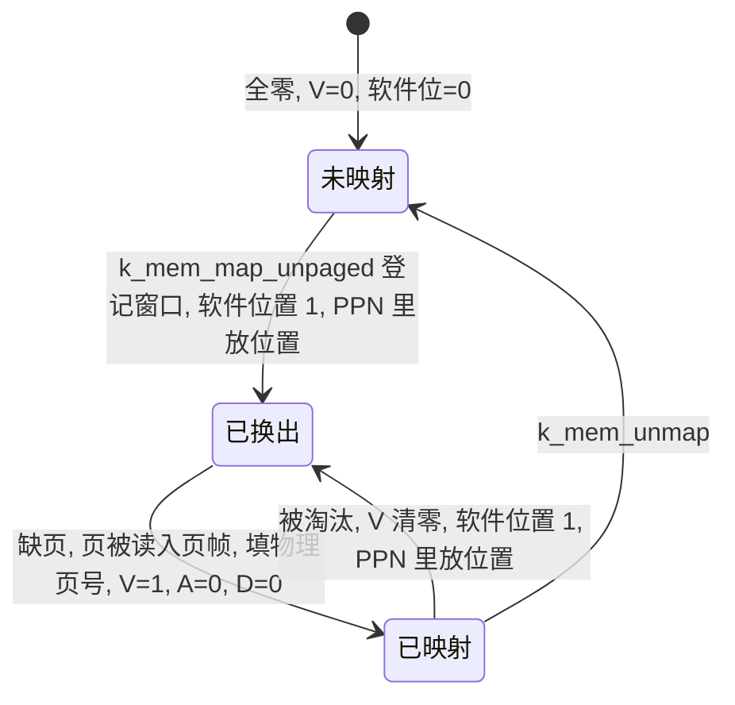

### 三种状态

| 状态 | V | 软件位(bit 8) | PPN 字段里是什么 | 访问会发生什么 |
|---|---|---|---|---|
| **未映射** | 0 | 0 | 无意义(全零) | 缺页,但不是调页引起的,算真错误 |
| **已换出**(paged out) | 0 | 1 | **这一页在后备存储里的位置**(不是物理页号) | 缺页,调页处理 |
| **已映射**(paged in) | 1 | 0 | 真实的物理页号 | 正常访问(A/D 位没置好时会缺页,见"A 位、D 位和 LRU"那一节) |

关键点:**V=0 的项,硬件根本不看其它位**,所以软件可以随意利用这些位。我把"位置"放在 PPN 字段里,配合软件位标记。对文件后备存储来说,"位置"就是**页在文件里的偏移**(以 4 KiB 为单位),所以 FireRed 的窗口页表项里 PPN 依次是 0、1、2……4095。

```c
#define RISCV_PTE_PAGED_OUT	BIT(8)   /* 软件位, RSW 的低位 */
#define RISCV_PTE_PPN_SHIFT	10
```

读写 PPN 字段的两个小函数:

```c
static inline uint32_t pte_ppn(uintptr_t phys)  { return (uint32_t)(phys >> 12) << RISCV_PTE_PPN_SHIFT; }
static inline uintptr_t pte_phys(uint32_t pte)  { return (uintptr_t)(pte >> RISCV_PTE_PPN_SHIFT) << 12; }
```

### "换出"和"换入"时 PTE 怎么改

换出(`arch_mem_page_out`):页帧要被回收了,把"位置"记下来,清掉 V,**保留权限位**(R/W/X/U),这样下次换入时不用重新算权限:

```c
*pte = pte_ppn(location) | RISCV_PTE_PAGED_OUT | (*pte & RISCV_PTE_PERM_MASK);
pte_sync(pte);
tlb_flush();
```

换入(`arch_mem_page_in`):数据已经读进页帧,把物理页号填进去,V=1,**A=0、D=0**:

```c
/* clean and not accessed: the first access faults, which is how both are tracked */
*pte = pte_ppn(phys) | RISCV_PTE_V | (*pte & RISCV_PTE_PERM_MASK);
pte_sync(pte);
tlb_flush();
```

"登记窗口"(`arch_mem_map` + `K_MEM_MAP_UNPAGED` 标志)通过 `make_leaf` 做成"已换出"状态:

```c
if ((flags & K_MEM_MAP_UNPAGED) != 0U) {
    /* not present: the location of the page is kept where the frame would be */
    return pte_ppn(phys) | RISCV_PTE_PAGED_OUT | pte;
}
```

这里的 `phys` 参数其实传的是"位置"(文件偏移),每页加 4096。

### 一个必须注意的细节:`pte_sync`

RISC-V 硬件的页表遍历器直接**读内存**,而 CPU 写页表是经过数据缓存的,如果不把缓存写回,遍历器可能读到旧的页表项。所以每次改页表项之后要把那个字节所在的缓存行写回:

```c
static inline void pte_sync(uint32_t *pte)
{
	sys_cache_data_flush_range(pte, sizeof(*pte));
	__asm__ volatile("fence" ::: "memory");
}
```

漏掉这一步的症状很诡异:页表"看起来"改对了,但偶尔访问的还是旧映射。

### 页帧自己的状态

页表项描述的是"虚拟页 → 物理页"。Zephyr 通用代码还给每个**物理页帧**维护一份状态(页帧数据库):

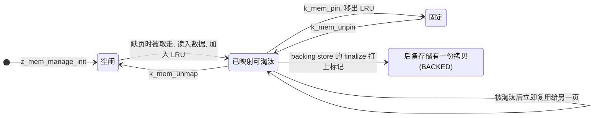

其中 **BACKED** 标志是文件后备存储的关键:它告诉内核"这一页的内容在后备存储里有一份一模一样的",于是淘汰时视为**干净页**,直接丢弃,不写回(见"拿 SD 卡上的文件当后备存储")。镜像占用的页帧被标记为"保留/固定",不参与调页。

---

## A 位、D 位和 LRU

### 硬件的行为:A=0 就缺页

RISC-V 规范允许两种实现:一种是硬件在访问时自动把 A、D 位置 1;另一种是**硬件什么都不做,发现 A=0(或写时 D=0)就报缺页,让软件来置位**。这颗 C907 是后一种,这是在裸机探针里验证过的。

这既是麻烦也是机会:

- 麻烦:一个"已映射"的页,如果 A=0,第一次访问会缺页,必须有人处理。
- 机会:**A 位正好是置换算法需要的信息**。内核想知道"这页最近用过没有",只要把 A 清零,然后看它会不会又缺页(缺页意味着被访问了,处理程序顺手记录下来)。

所以我不是"为了兼容而模拟",而是**利用缺页来追踪访问**。

### 缺页处理函数

所有 load/store 缺页(`mcause` 13 和 15)先到 `z_riscv_fault`(`arch/riscv/core/fatal.c`),在 Zephyr 原有的 PMP/用户态错误处理之后,加了一段:

```c
#ifdef CONFIG_RISCV_MMU
	{
		unsigned long mcause = csr_read(mcause) & CONFIG_RISCV_MCAUSE_EXCEPTION_MASK;

		if ((mcause == RISCV_EXC_LOAD_PAGE_FAULT || mcause == RISCV_EXC_STORE_PAGE_FAULT) &&
		    z_riscv_mm_page_fault(esf, mcause, csr_read(mtval))) {
			return;
		}
	}
#endif /* CONFIG_RISCV_MMU */
```

返回 `true` 表示"已经处理好,重新执行出错的指令";返回 `false` 才落到原来的致命错误处理。`z_riscv_mm_page_fault` 的完整逻辑(`arch/riscv/core/mmu.c`):

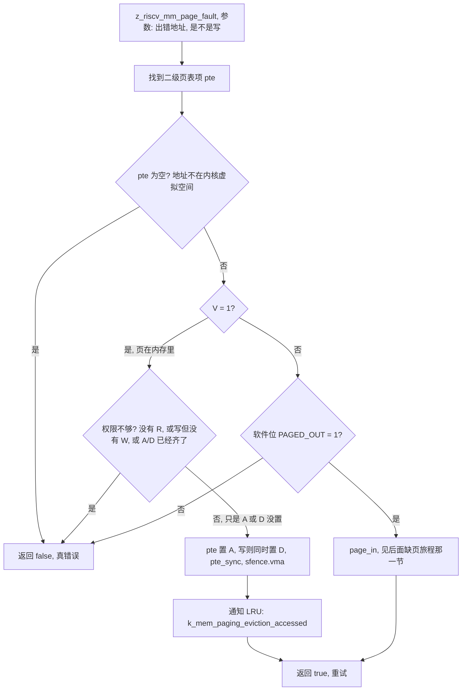

对应的代码:

```c
bool z_riscv_mm_page_fault(struct arch_esf *esf, unsigned long mcause, unsigned long addr)
{
	uintptr_t va = ROUND_DOWN(addr, PAGE_SIZE);
	bool store = (mcause == RISCV_EXC_STORE_PAGE_FAULT);
	uint32_t *pte = leaf_pte(va);
	uint32_t entry;

	if (pte == NULL) {
		return false;
	}
	entry = *pte;

	if ((entry & RISCV_PTE_V) != 0U) {
		/* the page is there: the hardware wants the accessed bit (and the
		 * dirty bit for a store) set, which is what is being tracked. */
		uint32_t want = RISCV_PTE_A | (store ? RISCV_PTE_D : 0U);

		if ((entry & RISCV_PTE_R) == 0U || (store && (entry & RISCV_PTE_W) == 0U) ||
		    (entry & want) == want) {
			return false;
		}
		*pte = entry | want;
		pte_sync(pte);
		tlb_flush();
#ifdef CONFIG_EVICTION_TRACKING
		k_mem_paging_eviction_accessed(pte_phys(entry));
#endif
		return true;
	}
	...
```

### 两次缺页:第一次访问一个页会进异常两次

这里有个细节值得单独说:`arch_mem_page_in` 把 PTE 设成"V=1, A=0, D=0"。所以**一个页被换入之后,出错的那条指令重新执行时会再缺页一次**(这次是 V=1 但 A=0),处理程序把 A 置上,指令第三次执行才成功。也就是说,首次访问一个页要进 **两次** 异常:第一次换入,第二次置 A。第二次不涉及 SD 卡,只是几十个指令的事,代价可以忽略。内核统计的"page faults"只数第一种。

为什么不直接让换入的页 A=1? 因为 LRU 置换算法需要"刚换入的页处于未访问状态,下一次访问时才变成最近使用",见下一节。

### LRU:怎么用 A 位选出被淘汰的页

LRU(最近最少使用)的数据结构在 `subsys/demand_paging/eviction/lru.c`,是一个按**页帧编号**索引的双向链表(用数组表示,省内存):

```c
/* For each page frame, track the previous and next page frame in the queue. */
struct lru_pf_idx {
	uint32_t next : PF_IDX_BITS;
	uint32_t prev : PF_IDX_BITS;
};
```

规则:

- **加入**(`k_mem_paging_eviction_add`):页被换入后,把它的页帧放到队尾。
- **访问**(`k_mem_paging_eviction_accessed`):当某页因为 A=0 缺页、我们把 A 置 1 时,通知 LRU,把它的页帧挪到队尾。
- **选择**(`k_mem_paging_eviction_select`):取队首的页帧(最久没用),并读它的 D 位判断脏不脏。
- **取出时清 A**:每当一个页帧从队列里被取走(它被淘汰,或者因为被访问而挪到队尾),如果它原来是**队首**,新的队首页的 A 位就被清零(`lru_pf_remove` 里的 `arch_page_info_get(..., clear_accessed=true)`)。如果这个新队首页其实在被使用,它马上会缺页(A=0),被我们挪到队尾,从而避免被淘汰。


这样没有被频繁访问的页自然聚集到队首,常用的页留在队尾。算法是 O(1) 的,稳态下页集合不变时没有任何额外缺页。

### 动手验证

写一个小样例(本项目的 `samples/subsys/demand_paging_anon`):

1. 用 `k_mem_map` 映射 64 页匿名内存,而留给调页的页帧只有 24 个;
2. 往每一页写一个由页号决定的图案,再全部读回来校验;
3. 预期:`0 wrong words`,并且统计里 `eviction.dirty` 不为零(这些页是脏的,换出时要写到后备存储——此时的后备存储是 RAM 里一块区域)。

这一步跑通,说明页表项的三种状态、A/D 模拟、LRU、换入换出都对了,**还没有涉及 SD 卡**。出问题时,范围小得多。

---

## 一次缺页从头到尾

前面那些零件,到这一节串成一条线:程序读一个 ROM 窗口里的字节,而那一页不在内存里。

### 时序

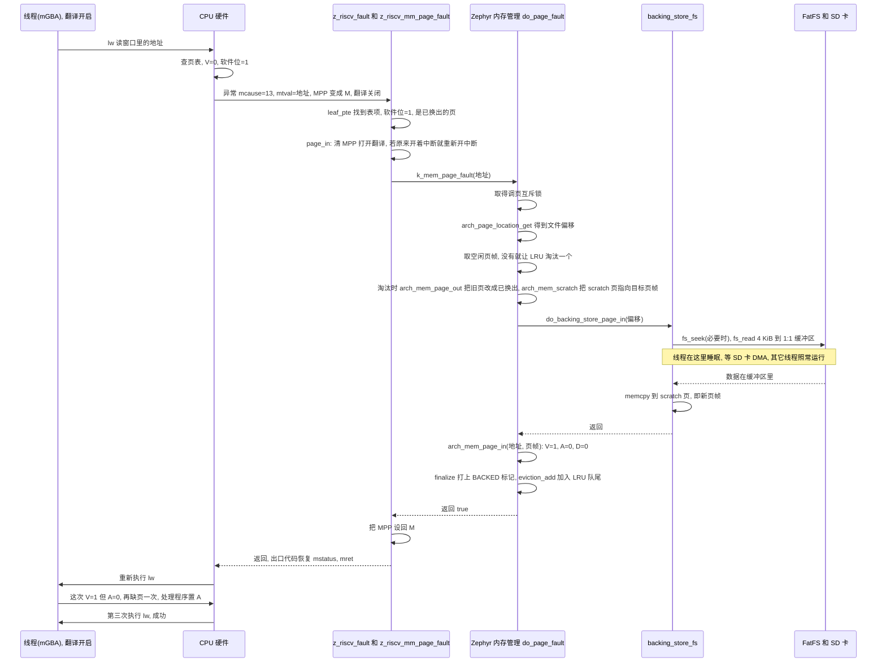

### 逐步解释

1. **访问**:线程用虚拟地址读窗口里的数据。翻译开启,硬件查页表,发现 V=0,触发 load 缺页异常。

2. **陷入**:硬件做几件事:`mepc` 记下出错指令,`mcause=13`,`mtval=出错地址`,`MPP←M`(翻译关闭),`MIE←0`(关中断,`MPIE` 保存原来的状态)。然后跳到 Zephyr 的异常入口 `_isr_wrapper`(`arch/riscv/core/isr.S`),保存全部寄存器到栈上,再调用 C 语言的 `z_riscv_fault(esf)`。

3. **识别**:`z_riscv_fault` → `z_riscv_mm_page_fault` → 查页表项,发现 V=0 且软件位=1,说明这是一个"已换出"的页,调用 `page_in`:

```c
static bool page_in(uintptr_t va, const struct arch_esf *esf)
{
	bool irq_on = (esf->mstatus & MSTATUS_MPIE_EN) != 0U;
	bool ok;

	/* The handler runs untranslated, the backing store fills the frame
	 * through the scratch page: translate its accesses from here on. */
	csr_clear(mstatus, MSTATUS_MPP);

	/* k_mem_page_fault() wants interrupts on if they were when the fault happened */
	if (irq_on) {
		arch_irq_unlock(MSTATUS_IEN);
	}
	ok = k_mem_page_fault((void *)va);
	(void)arch_irq_lock();

	/* the way out of a trap that did not resolve the fault is untranslated again */
	csr_set(mstatus, MSTATUS_MPP);

	return ok;
}
```

   这里有两处要点:**清 `MPP` 打开翻译**(因为后面要用 scratch 页),**仅当异常发生时中断是开着的才重新开中断**(这样出错时关着中断的代码,比如持有自旋锁的代码,不会被意外打断;Zephyr 通用代码要求如此)。

4. **通用调页**:`k_mem_page_fault` 调用 `kernel/mmu.c` 里的 `do_page_fault`,它是整个调页的主流程:

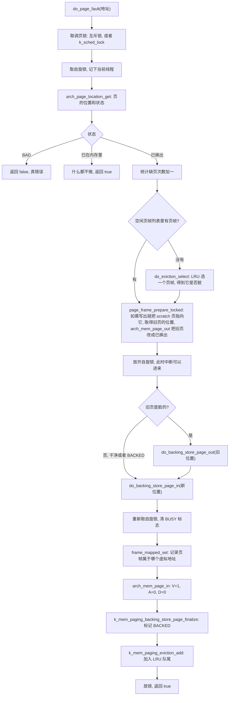

5. **后备存储读页**:见"拿 SD 卡上的文件当后备存储"。简单说就是 `fs_read` 把 4 KiB 读进一个 1:1 的对齐缓冲区,再 `memcpy` 到 scratch 页。

   **scratch 页是什么?** 内核在虚拟地址空间里预留了一页专用地址(`K_MEM_SCRATCH_PAGE`),需要"往某个物理页帧里写数据"时,先让架构层把它映射到那个物理页帧(`arch_mem_scratch(phys)`),然后通过这个固定的虚拟地址读写。这样后备存储的代码不需要知道页帧的物理地址对应哪个虚拟地址(它还没有被映射呢)。

6. **返回**:`page_in` 把 `MPP` 设回 M,函数一路返回,出口代码按栈上保存的 `mstatus`(此时 `MPP=M`)恢复,然后 `mret`,CPU 回到出错指令重新执行。

### 为什么缺页处理程序可以睡眠

这是一个值得单独讲的问题。缺页处理要读 SD 卡,SD 卡驱动用的是 DMA 加中断:它发起读,然后线程**睡眠**,等 DMA 完成中断来唤醒。而 Zephyr 通用代码在**单核**上的做法是用 `k_sched_lock()`(锁住调度器)来保证调页操作不被其它线程打断。**调度器被锁住时,线程不能睡眠**,否则没有任何线程能运行,也就没人处理中断后续的唤醒——死锁。

多核(SMP)上 Zephyr 用互斥锁(`z_mm_paging_lock`),没有这个问题。所以我加了一个配置项 `CONFIG_DEMAND_PAGING_BACKING_STORE_SLEEPS`(`kernel/Kconfig.vm`),让单核也用互斥锁:

```c
/*
 * The paging operations are serialized with a mutex on SMP, where the
 * scheduler cannot be locked, and on UP when the backing store may sleep.
 * Otherwise the scheduler is locked for the duration of the operation.
 */
#if defined(CONFIG_SMP) || defined(CONFIG_DEMAND_PAGING_BACKING_STORE_SLEEPS)
#define Z_MM_PAGING_LOCK_IS_MUTEX 1
#endif
```

把 `kernel/mmu.c` 里 `#ifdef CONFIG_SMP` 的几处(`do_page_fault`、`do_mem_evict`、`k_mem_page_frame_evict`)改成 `#ifdef Z_MM_PAGING_LOCK_IS_MUTEX`。

代价:睡眠期间**别的线程会运行**,它们如果碰巧也访问了同一个"还没读进来的页",也会缺页,然后在这把互斥锁上排队。这个选项适合"只有一个线程使用分页内存"的系统(mGBA 的模拟线程)。播放器的视频线程、音频线程在这期间照常运行,所以缺页读 SD 卡时画面和声音不会被卡住。

另一条硬规矩:**不要在持有文件系统锁时访问窗口内存。** 缺页要调 FatFS 读文件,FatFS 有自己的互斥锁,如果访问窗口的代码此刻正持有它,就会死锁。mGBA 只是读窗口,没有这个问题,但在自己的应用里要注意。

### 中断和缺页

通用代码里有一条规则:开了 `CONFIG_DEMAND_PAGING_ALLOW_IRQ`(我开了)时,**中断处理函数里禁止缺页**(`__ASSERT(!k_is_in_isr(), "ISR page faults are forbidden")`)。我们的架构层正好满足它:中断处理函数运行时翻译是关闭的,看到的全是物理地址,它们访问的东西都是 1:1 的,不会缺页(这也正是"什么必须是 1:1"那一节的由来)。

### 动手验证

写一个**检查校验和**的样例(本项目的 `samples/subsys/demand_paging_fs`):

1. 挂载 SD 卡,用 `k_mem_paging_map_file` 把一个 16 MiB 文件映射成窗口;
2. 用 CRC32 通过**窗口指针**把整个文件读一遍,再用 `fs_read` 普通读一遍,两个 CRC 必须相等;
3. 再随机读 512 个页,看延迟。

本项目的结果(数字在"实测数据"那一节):两个 CRC 都是 `84ee4776`,输出 `PASS`。

---

## 拿 SD 卡上的文件当后备存储

通用调页代码要求后备存储实现一组函数(`include/zephyr/kernel/mm/demand_paging.h` 里声明)。Zephyr 自带的实现只有 RAM 和半主机(semihost)两种。我加了第三种:**以文件系统里的一个文件作为后备存储**(`subsys/demand_paging/backing_store/backing_store_fs.c`)。

### 设计

- **位置(location)就是文件内偏移。** 窗口第 N 页对应文件的第 N×4096 字节。这样不需要任何额外的映射表。
- **只读,干净页直接丢弃。** 文件里的页在内存里永远不会比文件新(ROM 不会变),所以内核淘汰一页时,只要这个页帧带着 **BACKED** 标志,就按"干净页"处理——不写回,直接把页帧给别人用。
- **一次一个文件,一个缓冲区。** 调页操作被内核串行化,所以一个静态缓冲区就够。

### 数据结构

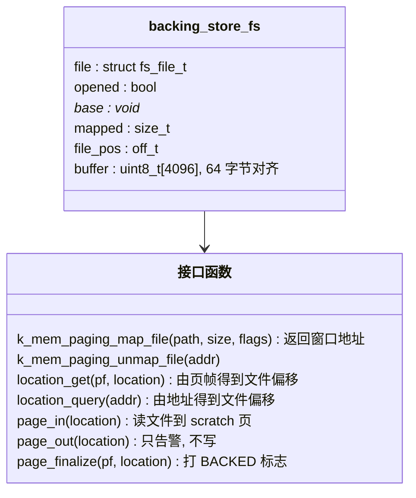

```c
static struct fs_file_t file;
static bool opened;
static void *base;               /* 窗口的起始虚拟地址 */
static size_t mapped;            /* 窗口大小, 向上取整到页 */
/* where the next read of the file starts, to skip the seek of a sequential read */
static off_t file_pos = -1;
static uint8_t buffer[PAGE] __aligned(64);
```

### 把文件映射成窗口

```c
void *k_mem_paging_map_file(const char *path, size_t *size, uint32_t flags)
{
	...
	if (fs_open(&file, path, FS_O_READ) != 0) { return NULL; }
	mapped = ROUND_UP(st.size, PAGE);
	opened = true;
	file_pos = 0;

	/* the location of the first page is 0 and goes up by a page for each page; the
	 * content comes from the file, so the pages must not be cleared */
	addr = k_mem_map_unpaged(0, mapped, K_MEM_MAP_UNINIT | flags);
	...
	base = addr;
	*size = st.size;
	return addr;
}
```

`k_mem_map_unpaged(location, size, flags)`(Zephyr 通用代码里已有)做的事:在虚拟空间里找一块 `size` 大小的连续地址,**前后各留一个不映射的保护页**(越界访问立刻缺页),然后对窗口每一页调用 `arch_mem_map`,flags 里带 `K_MEM_MAP_UNPAGED`,于是前面讲的 `make_leaf` 把每个页表项做成"已换出",PPN 字段是 `location + 页序号×4096`。

**`K_MEM_MAP_UNINIT` 这个标志非常关键。** 通用的 `k_mem_map_phys_guard` 默认会在映射完成后把整块内存 `memset` 成 0(因为匿名内存应该清零)。对我们的窗口,这会让它**把 16 MiB 全部写一遍**:这会逐页触发缺页,而且读进来的内容马上被清成零——文件内容全毁。这是实际踩过的坑:第一次在板子上运行时,崩在 `memset(0x4100e000, 0, 16 MiB)` 上(窗口地址 `0x4100e000`,大小 `0x01000000`,`mcause=15`)。加上 `K_MEM_MAP_UNINIT` 之后消失。

### 位置的两个查询

内核在淘汰一个页帧时,需要知道"这页要写回到后备存储的哪里"(`location_get`);在缺页时,页表项里已经记着位置。对文件后备存储,二者都是地址减去窗口基址:

```c
int k_mem_paging_backing_store_location_query(void *addr, uintptr_t *location)
{
	if (!opened || (uintptr_t)addr < (uintptr_t)base ||
	    (uintptr_t)addr >= (uintptr_t)base + mapped) {
		return -EFAULT;
	}
	*location = (uintptr_t)addr - (uintptr_t)base;
	return 0;
}

int k_mem_paging_backing_store_location_get(struct k_mem_page_frame *pf, uintptr_t *location,
					    bool page_fault)
{
	if (k_mem_page_frame_is_backed(pf)) {
		return k_mem_paging_backing_store_location_query(k_mem_page_frame_to_virt(pf), location);
	}
	/* a read-only store: nothing else can be paged out */
	return -ENOMEM;
}
```

第二个函数的含义:**只有 BACKED 的页帧才有后备存储里的位置**;不是 BACKED 的页帧(比如别处 `k_mem_map` 出来的匿名页,它们在文件里没有位置)没有地方可以换出去,函数返回 `-ENOMEM`。内核淘汰到这样的页帧时会报 "out of backing store memory"(调试版本里断言失败)。所以**使用文件后备存储时,其它 `k_mem_map` 出来的匿名内存要加 `K_MEM_MAP_LOCK` 固定住**,不让它们进入置换。

### 换入:读文件

```c
void k_mem_paging_backing_store_page_in(uintptr_t location)
{
	ssize_t n;

	if ((off_t)location != file_pos) {
		if (fs_seek(&file, (off_t)location, FS_SEEK_SET) != 0) { ... k_panic(); }
	}
	n = fs_read(&file, buffer, PAGE);
	if (n < 0) { ... k_panic(); }
	file_pos = (off_t)location + n;
	/* the last page of the file */
	if ((size_t)n < PAGE) {
		memset(buffer + n, 0, PAGE - n);
	}
	memcpy(K_MEM_SCRATCH_PAGE, buffer, PAGE);
}
```

三个设计点:

1. **为什么先读进 `buffer` 再 `memcpy` 到 scratch 页,而不是直接读到 scratch 页?** SD 卡驱动用 DMA,**DMA 需要的是 1:1 的、64 字节对齐的缓冲区**(它把指针直接当总线地址用,也要避开缓存行共享问题)。scratch 页是非 1:1 的(它的虚拟地址和目标页帧的物理地址完全不同),直接给 DMA 会写到错的物理位置。所以必须经过一个镜像里的静态缓冲区。多一次 4 KiB 拷贝,在这里可以忽略(相比 SD 卡约 0.7 到 1 ms 的读取)。
2. **`file_pos` 优化。** 顺序读窗口时,下一页的位置正好是上一次读完的位置,不需要 `fs_seek`。FatFS 的 `fs_seek` 要沿着簇链往前走,文件越靠后越慢;顺序读省掉它是一个明显的收益。
3. **最后一页不满。** 文件大小不是 4096 的整倍数时,最后一页读到的字节少,剩下的补零。

### 换出:不会发生

```c
void k_mem_paging_backing_store_page_out(uintptr_t location)
{
	/* the file is never written: a page that was changed through a writable mapping and
	 * is not pinned loses its changes */
	LOG_WRN("modified page at %#lx dropped", location);
}
```

文件是只读的,所以"换出"只是告警。什么情况下会被调用?内核在选出一个**脏**页帧(D 位为 1)时。只读映射(不带 `K_MEM_PERM_RW`)的页永远不会被写,D 位永远是 0,所以不会进到这里。如果映射成**可写**(mGBA 要求可写,后面接 mGBA 时会说),被写过的页在被淘汰时会丢失修改——这就是为什么 mGBA 把可能被写的第一页用 `k_mem_pin` 固定住。

### 标记 BACKED

```c
void k_mem_paging_backing_store_page_finalize(struct k_mem_page_frame *pf, uintptr_t location)
{
	k_mem_page_frame_set(pf, K_MEM_PAGE_FRAME_BACKED);
}
```

每次换入完成后调用,打上 BACKED。从此这个页帧对内核来说是"在后备存储里有一份一模一样的拷贝",淘汰它不用写,直接复用。这就是"干净页直接丢弃"的实现。

### 预读还没做

目前每次缺页只读 4 KiB。实测 SD 卡随机读 4 KiB 约 1.0 ms,16 KiB 约 1.44 ms,64 KiB 约 3.8 ms——一次读 16 KiB 只比读 4 KiB 多 40%,而顺序访问时能一次换进 4 页。所以**预读**(缺页时顺带把后面几页也读进来)是明显的优化方向,后面"还没搞定的和以后想做的"再提。

### 动手验证

- `demand_paging_fs` 样例里的 CRC 一致(见前文缺页那一节的验证);
- 页帧数对账:样例里空闲页帧 15552 KiB = 3888 页,窗口 4096 页,顺序读一遍之后统计应该是 **4096 次缺页、208 次干净淘汰**(4096 − 3888 = 208)。板子上读出的正是 `4096 page faults, 208 clean pages dropped`。

---

## 什么必须是 1:1

这一节是**整个项目里最容易踩坑**的地方。前面讲过,线程在翻译开启下运行,中断和异常的处理在翻译关闭下运行。把这个事实翻译成实现规则:

### 规则总表

| 谁会访问 | 用的是哪种地址 | 因此要求 |
|---|---|---|
| 线程代码 | 虚拟地址(翻译) | 随意 |
| 中断处理函数 | **物理地址**(翻译关闭) | 它碰到的所有内存、寄存器地址必须 1:1 |
| 陷入入口/出口汇编(保存、恢复寄存器) | 物理地址 | 栈、异常帧必须 1:1(镜像里的栈天然满足) |
| DMA 引擎、SD 卡控制器 | 物理地址(总线地址) | 给它们的缓冲区必须 1:1 |
| 缓存维护指令(`th.dcache.*`) | 物理地址 | 作用的内存必须 1:1 |
| 窗口内存(非 1:1 的页) | 虚拟地址 | **绝不能**交给驱动、DMA、缓存维护,也不能在中断里访问 |

"1:1"的东西有哪些:程序镜像(含静态 malloc 区、栈)、外设寄存器(4 MiB 块)。**非 1:1 的只有 `k_mem_map` 出来的页**:我们的 ROM 窗口、scratch 页等。

### CLINT 和 PLIC:只认 M 态

CLINT(核心本地中断控制器,里面有 `mtime`/`mtimecmp` 计时器)和 PLIC(平台级中断控制器)在这颗 SoC 里**只接受 M 态的总线访问**。经过页表翻译的访问,总线上带的是"用户态"身份,它们拒绝,读出来永远是全 1。

这是实际遇到的:翻译开启后,系统时间不走,读 `mtime` 得到 `0xffffffff`。

解决办法是给这两个设备写专门的"不翻译的读写函数":把 `MPRV` 在**这一条** load/store 期间临时清零,然后恢复(`include/zephyr/arch/riscv/mm.h`):

```c
static inline uint32_t z_riscv_mmode_read32(mem_addr_t addr)
{
	unsigned long mprv = 0x00020000UL; /* MSTATUS_MPRV */
	unsigned long saved;
	uint32_t val;

	__asm__ volatile("csrrc %[s], mstatus, %[m]\n"   /* 读出 mstatus 并清 MPRV */
			 "lw %[v], 0(%[a])\n"            /* 这一次读, 不翻译 */
			 "and %[s], %[s], %[m]\n"        /* 只留下原来 MPRV 的值 */
			 "csrs mstatus, %[s]"            /* 把 MPRV 恢复 */
			 : [s] "=&r"(saved), [v] "=&r"(val)
			 : [m] "r"(mprv), [a] "r"(addr)
			 : "memory");

	return val;
}
```

几点说明:

- `csrrc` 一条指令同时"读旧值并清位",原子地完成;
- 如果这三四条指令之间来了中断:中断入口保存的 `mstatus` 里 `MPRV` 是 0,处理完 `mret` 回来时 `MPRV` 仍是 0,序列继续执行,最后一条 `csrs` 把 `MPRV` 恢复。不会丢状态;
- 不开 MMU 时,同名宏直接退化成 `sys_read32`/`sys_write32`,没有任何开销。

用法:`drivers/timer/riscv_machine_timer.c` 里读写 `mtime`、`mtimecmp` 全部换成这两个函数(包括防止 64 位寄存器读到一半翻转的"高字、低字、再读高字"循环),`drivers/interrupt_controller/intc_plic.c` 里读写 PLIC 寄存器同理。

### `device_map` 的坑:一个中断风暴的完整排查

Zephyr 里,驱动初始化时调用 `device_map()` 把设备寄存器映射到虚拟地址,之后驱动用这个地址访问寄存器。**开了 MMU 之后,`device_map()` 默认会在内核虚拟空间里分配一个新的虚拟地址**(用 `k_mem_map_phys_bare`),这个地址和寄存器的物理地址不同。线程里访问没问题(翻译开着,会翻译回去),**但中断处理函数里翻译关着,同一个虚拟地址被当成物理地址使用,访问到完全错误的地方。**

这个问题在我这里表现成一次非常迷惑的"挂死":

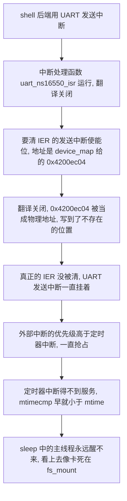

**怎么查出来的**(这是一个标准的无调试器之外的 JTAG 排查流程,值得记下):

1. 接上 CKLink 调试器(它的 JTAG 和 SD 卡槽共用 PF0/1/3/5 引脚,要为调试专门构建一个把 SD 关掉、引脚切到 JTAG 的固件);
2. 连上之后停下来,看 CPU 在哪:每次停下都在 `uart_tx_handle` / `plic_irq_handler` 这类中断函数里;
3. 看 `mip`(中断挂起寄存器)= `0x880`:第 7 位(定时器)和第 11 位(外部)同时挂着;读 `mtime` = `0x883296cd`,`mtimecmp` = `0x0af53fc0`:定时器早就该响了;
4. 看主线程(`z_main_thread`):状态是 `SLEEPING`,没有挂在任何等待队列上——它在等定时器;
5. 看 UART 的 `IER`(`0x02500c04`)停在 3(发送中断开着);在 `uart_ns16550_irq_tx_disable` 之后再看还是 3:**写没生效**;再看汇编里驱动用的寄存器地址:`0x4200ec04`,不是 `0x02500c04`。

**修复**:新增一个只在 RISC-V MMU 配置下为真的隐藏选项,让 `device_map()` 直接返回物理地址(外设已经 1:1 映射了):

```c
config RISCV_MMU_MMIO_IDENTITY
	bool
	default y if RISCV_MMU
```

```c
static inline void device_map(mm_reg_t *virt_addr, uintptr_t phys_addr,
			      size_t size, uint32_t flags)
{
#if defined(CONFIG_RISCV_MMU_MMIO_IDENTITY)
	/* The registers are mapped 1:1 and are also used untranslated */
	ARG_UNUSED(size);
	ARG_UNUSED(flags);
	*virt_addr = phys_addr;
#elif defined(CONFIG_MMU)
	...
```

这一个改动修好了所有驱动在中断里读写寄存器的情况。

**教训**:任何"线程里能用、中断里不能用"的东西,在这套设计里都应该怀疑是不是地址的问题。

### DMA 和缓存

- **静态 malloc 区**:驱动给 DMA 用的缓冲区(显示、音频、SD)全来自 libc 的 malloc 区,它在镜像里,是 1:1。**`CONFIG_COMMON_LIBC_MALLOC_ARENA_SIZE` 必须设成有限的值**(我设 5 MiB)。默认的"-1"表示"拿走所有空闲内存",那样它会占用页帧,并且那些页是非 1:1 的,DMA 立刻错。
- **bounce buffer**:后备存储读 SD 卡时,用镜像里 64 字节对齐的静态缓冲区做 DMA 目标,再拷贝到 scratch 页(见前面后备存储那一节)。
- **缓存维护**:`th.dcache.*` 指令(平头哥的缓存维护扩展)接受**物理地址**。今天的实现没有在缓存维护里做虚拟到物理的转换,所以规则是:**不要对窗口内存做缓存维护**。需要的话,在 SoC 的缓存函数里加一步 `arch_page_phys_get`。
- **页表本身**:页表遍历器读内存、不读缓存,所以每次改页表项都要写回缓存行(`pte_sync`,见"页表项的三种状态");启动时建完整套页表之后用 `sys_cache_data_flush_all()` 写回一次。

### 动手验证

- 打开 MMU 之后依次验证:**系统计时**(`k_uptime_get` 在走)、**串口 shell**(中断驱动的 UART)、**SD 卡读写**、**显示、音频**。这些任何一个出问题,先怀疑"某个地方的地址在中断里是非 1:1 的"。
- 在中断里**绝不能**访问窗口内存。如果不放心,可以在调试版里在中断入口加断言。

---

## 接到 mGBA 上

到这里,内核和架构层都有了:一个 API `k_mem_paging_map_file(path, &size, flags)` 把文件变成一个窗口指针。接下来把它接到 mGBA 上。

### mGBA 怎么拿到 ROM

mGBA 的 `GBALoadROM(gba, vf)` 收到一个 `VFile`,对它做这几件事:

1. `vf->size(vf)` 得到 ROM 大小;
2. 读 `0xAC` 处的字节判断类型;
3. **`vf->map(vf, size, MAP_READ)` 拿到一个指向整个 ROM 的指针**,保存到 `gba->memory.rom`;
4. 对整个 ROM 算一遍 CRC32(`doCrc32`,用于识别游戏);
5. 之后的取指、读数据全部通过这个指针。

mGBA 自带一种基于内存的 `VFile`:`VFileFromConstMemory(mem, size)`,它的 `map()` 就是返回那个 `mem` 指针。**把窗口指针传给它,就完事了。** 模拟器分不出这是真内存还是窗口。

### `gba_open`

(`zephyr-components/mgba/src/gba_player.c`):

```c
#ifdef CONFIG_MGBA_ROM_DEMAND_PAGED
	g.rom = k_mem_paging_map_file(rom_path, &rom_len, K_MEM_PERM_RW);
	if (g.rom != NULL) {
		g.rom_mapped = true;
		/* a cartridge with a clock or sensor gets its port in the first page of the ROM:
		 * the writes to it must stay
		 */
		k_mem_pin(g.rom, CONFIG_MMU_PAGE_SIZE);
		ret = 0;
	} else
#endif
	{
		ret = read_file(rom_path, &g.rom, &rom_len);     /* 回退: 整个读进内存 */
	}
	...
	if (!g.core->loadROM(g.core, VFileFromConstMemory(g.rom, rom_len))) {
```

两处值得说:

- **为什么映射成可写(`K_MEM_PERM_RW`)?** 带实时时钟、太阳能传感器的游戏卡带(比如宝可梦红宝石/绿宝石)把 GPIO 端口放在 ROM 地址空间的 `0xC4` 处,模拟器会往 ROM 缓冲区里的这个位置写。窗口是只读的话,写就会真的缺页错误。所以映射成可写。
- **为什么 `k_mem_pin` 第一页?** 可写的页被写过就是脏页,而文件后备存储不会写回,被淘汰时修改会**丢失**。GPIO 端口在第一页(偏移 `0xC4`),把这一页**固定**在内存里,永远不会被淘汰,写入就一直在。

### 写 ROM 区的另一个坑:写时复制

FireRed 运行后不久,在板子上直接崩溃:`_pristineCow` 里 `memcpy` 的目的地址是 0。原因是这样的:游戏会往"AGB 调试打印端口"(也在 ROM 地址空间的高处)写一串魔术数据,mGBA 为了模拟"这是个可写的烧录卡",会调用 `_pristineCow`:**为整个 32 MiB 的卡带地址空间分配一个匿名的私有拷贝,把 ROM 复制进去,以后写操作写在拷贝里**。32 MiB 的分配当然失败,返回 NULL,然后 `memcpy` 往地址 0 写,缺页错误。

我的处理:这些写操作其实只是调试端口的写入,让它们直接写到窗口里就好(页丢了也不影响游戏)。所以对 mGBA 的 `gba/memory.c` 做一份**带一处修改的拷贝**(`mgba/src/gba_memory.c`),让 `_pristineCow` 在分页模式下什么都不做:

```c
void _pristineCow(struct GBA* gba) {
#ifdef MGBA_ROM_DEMAND_PAGED
	/* The ROM is a demand paged window: a private copy would be the 32 MiB of the
	 * cartridge space. The debug print port and the cartridge port write into the
	 * window instead, a page that was written and is not pinned loses the change. */
	return;
#endif
	if (!gba->isPristine) {
		return;
	}
	...
```

(为什么是"拷贝一份文件"而不是用补丁?mGBA 是以 git 子模块引入的,保持不动。这个拷贝只在 `CONFIG_MGBA_ROM_DEMAND_PAGED` 开着时才有效果,不开时和上游行为完全一致。)

### 加载时间线

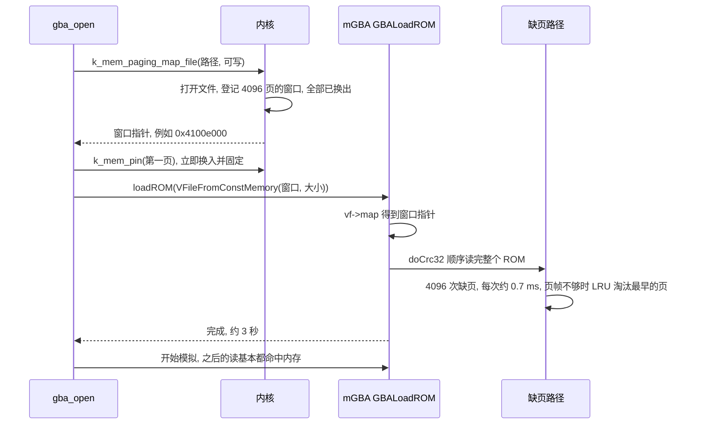

加载时间约 3 秒,主要是上面那一遍 CRC 把 16 MiB 都读了一遍;之后游戏运行时 ROM 访问有很强的局部性,每 5 秒只有几次到几十次缺页。

### 配置

本项目里一个叫 `paged.conf` 的配置片段打开所有需要的东西(`zephyr-components/mgba/samples/gba_player/paged.conf`):

```
CONFIG_SUN252I_F101_MMU=y
CONFIG_DEMAND_PAGING=y
CONFIG_DEMAND_PAGING_ALLOW_IRQ=y
CONFIG_EVICTION_LRU=y
CONFIG_BACKING_STORE_FS=y
CONFIG_MGBA_ROM_DEMAND_PAGED=y
CONFIG_MGBA_MAX_ROM_SIZE_MB=32
# a finite arena: the rest of the memory is for the page frames of the ROM
CONFIG_COMMON_LIBC_MALLOC_ARENA_SIZE=5242880
```

构建时 `-DEXTRA_CONF_FILE=.../paged.conf` 叠加到示例自己的 `prj.conf` 上。

### 内存预算,算一笔账

| 项目 | 大小 | 说明 |
|---|---|---|
| 镜像:代码、数据、栈 | 约 4.1 MiB | 含 LVGL、显示、音频、SD 等 |
| 静态 malloc 区 | 5 MiB | mGBA 的模拟状态、帧缓冲、音频缓冲都在这里 |
| 页帧 | 约 6.8 MiB(1748 个) | 留给 ROM 页 |
| ROM 窗口 | 16 MiB(4096 页) | 虚拟的,不占物理内存 |

窗口是页帧的 2.3 倍。用 LRU 的好处:ROM 访问有局部性(游戏当前在用的代码和数据只是一小部分),工作集通常小于 6.8 MiB,所以换页很少。

### 动手验证

- 启动日志里有 `ROM /SD:/xxx.gba, 16777216 bytes`;
- `demand_paging_fs` 里加载 CRC 一致;
- 游戏能起来、有声音;
- 如果开了统计,稳态每周期缺页是个位数到几十次。

---

## 从头做一遍的清单

这一节假设你从零开始,面对的是一个**支持 Sv32 的 RISC-V 板子、一个能跑的 Zephyr**。按下面的顺序一步步做,**每做完一个阶段都有一个明确的检查点**——强烈建议不要跳,否则出了问题范围太大。


### 裸机探针

做法见前面"先在裸机上验证一遍"。必须先确认这几件事,因为整个设计都建立在它们之上:

- `MPRV=1, MPP=U` 时数据访存按页表翻译,取指不翻译;
- 陷入时 `MPP` 变成 M(翻译关闭),`mret` 之后变回 U;
- 没有 PMP 放行项时会有访问异常;
- 缺页的 `mcause`/`mtval`/`mepc` 如预期;
- A 位为 0 会缺页(硬件不自动置位);
- CLINT/PLIC 在翻译开启时读出全 1。

如果你的 CPU 的行为和这些不同(比如硬件自动置 A/D),设计里相应的部分要调整。

### Kconfig

`arch/riscv/Kconfig`:

```
config RISCV_MMU
	bool "Sv32 MMU for a machine mode kernel"
	depends on !64BIT && !SMP && !RISCV_PMP
	select CPU_HAS_MMU
	select MMU
	select ARCH_HAS_DEMAND_PAGING
	select ARCH_HAS_DEMAND_MAPPING
	select ARCH_SUPPORTS_EVICTION_TRACKING

config RISCV_MMU_MMIO_IDENTITY
	bool
	default y if RISCV_MMU

config RISCV_MMU_BOOT_INFO
	bool "Print the memory map at boot"
	depends on RISCV_MMU
	default y
```

SoC 的 Kconfig 里一个总开关(`SUN252I_F101_MMU`,`select RISCV_MMU`),并在 `Kconfig.defconfig` 里给 `KERNEL_VM_SIZE` 一个默认值(这里是 `0x2000000`,32 MiB)。**`KERNEL_VM_SIZE` 决定了要预备多少张二级页表**(每 4 MiB 一张)。

### 链接脚本

在 `include/zephyr/arch/riscv/common/linker.ld` 里:定义 `z_mapped_start`(镜像起点),并让镜像末尾按页对齐(见"启动顺序"那一段)。通用内存管理代码靠 `z_mapped_start`/`z_mapped_end` 知道镜像占了哪些物理页。

### 头文件 `include/zephyr/arch/riscv/mm.h`

放进去:PTE 位定义(包括你自己的软件位)、`struct riscv_mmu_region`、`ARCH_DATA_PAGE_*` 和 `ARCH_UNPAGED_ANON_*` 常量(通用代码要用)、CLINT/PLIC 的不翻译读写函数。内容都在前面几节里。别忘了在 `arch.h` 里 `#include` 它(`#ifdef CONFIG_MMU`),并在 `irq.h` 里加两个异常号:

```c
#define RISCV_EXC_LOAD_PAGE_FAULT 13
#define RISCV_EXC_STORE_PAGE_FAULT 15
```

### `arch/riscv/core/mmu.c` 的主体

按顺序放进去:

1. 页表:`root_table`、`l2_tables`,4096 对齐;
2. 辅助函数:`pte_ppn`、`pte_phys`、`pte_is_table`、`tlb_flush`、`pte_sync`、`leaf_pte`、`make_leaf`;
3. `z_riscv_mm_init()`:挂二级表、映射镜像(超页加 4 KiB 页)、映射外设、`sys_cache_data_flush_all()`、PMP 放行、写 `satp`、`sfence.vma`、`MPP←U`、`MPRV←1`。

SoC 提供 `riscv_mmu_regions[]`:列出所有外设的 4 MiB 块,并在 SoC 的 `CMakeLists.txt` 里 `zephyr_sources_ifdef(CONFIG_SUN252I_F101_MMU mmu_regions.c)`。

### 启动时调用

在 `z_prep_c()` 里,`arch_cache_init()` 之后、`z_cstart()` 之前调用 `z_riscv_mm_init()`。

**检查点 A**:此时只实现了 1:1 映射。先不要写调页相关的函数,让其余部分编译通过(要实现的 `arch_mem_map` 等函数先写成简单版本,见下一步)。能启动、能打印、串口、定时器都正常。

### 通用内存管理需要的架构接口

`arch_mem_map`、`arch_mem_unmap`、`arch_page_phys_get`。如果这一步只开 `CONFIG_MMU` 不开 `CONFIG_DEMAND_PAGING`,Zephyr 会用它们给 `k_mem_map` 分配匿名页。

### 缺页入口

在 `arch/riscv/core/fatal.c` 的 `z_riscv_fault` 里加钩子,在 `mmu.c` 里实现 `z_riscv_mm_page_fault` 的 A/D 位部分(先不管换页)。

### CPU 状态切换

- `thread.c`:`arch_new_thread` 里 `stack_init->mstatus |= MSTATUS_MPRV`;
- `switch.S`:`z_riscv_switch` 末尾 `csrc mstatus, MPP`。

### CLINT、PLIC、`device_map`

- 定时器驱动和 PLIC 驱动里,所有对 CLINT/PLIC 寄存器的读写换成 `z_riscv_mmode_read32/write32`;
- `device_map()` 在 `RISCV_MMU_MMIO_IDENTITY` 下直接返回物理地址。

**检查点 B(阶段二)**:打开 `CONFIG_DEMAND_PAGING`、`CONFIG_EVICTION_LRU`,在 `mmu.c` 里补上 `arch_mem_page_out`、`arch_mem_page_in`、`arch_page_location_get`、`arch_page_info_get`、`arch_mem_scratch` 和 `page_in()`,运行 `demand_paging_anon` 样例,应该 0 个错误字,并且有脏页淘汰。

### 内核里的小改动

加 `CONFIG_DEMAND_PAGING_BACKING_STORE_SLEEPS`(`kernel/Kconfig.vm`)和 `Z_MM_PAGING_LOCK_IS_MUTEX`(`kernel/mmu.c`),把 `#ifdef CONFIG_SMP` 的三处换成它。

### 文件后备存储

`subsys/demand_paging/backing_store/backing_store_fs.c` 加上 `Kconfig`(`CONFIG_BACKING_STORE_FS`)和 `CMakeLists.txt`,头文件 `include/zephyr/kernel/mm/backing_store_fs.h` 放 `k_mem_paging_map_file`/`k_mem_paging_unmap_file`。

**检查点 C(阶段三)**:`demand_paging_fs` 样例:CRC 一致、`PASS`。要点:SD 卡里放一个足够大的文件(这里是 16 MiB),应用的 `prj.conf` 要有 `CONFIG_SDHC`、`CONFIG_FILE_SYSTEM`、FatFS、`CONFIG_MAIN_STACK_SIZE=8192`(缺页读文件时栈会深)。

### 应用接入

按"接到 mGBA 上"那一节来:`k_mem_paging_map_file` 得到窗口指针,交给应用;**把 malloc 区设成有限大小**;不要把窗口交给驱动。

**检查点 D(阶段四)**:应用的行为和以前完全一样(这里是帧画面 CRC 不变),启动时间多出加载那一遍。

### 在这块板子上怎么跑

(用 xfel 经 USB 下载,不走 boot0/u-boot)

1. 板子断电再上电(**每次下载都要重新上电**,`exec` 之后 FEL 就没了);
2. `xfel ddr f101-s3`(初始化 PSRAM 并打开 UART3 时钟/引脚),`xfel write 0x40010000 zephyr.bin`,`xfel exec 0x40010000`;
3. 串口(UART3,PE08/PE09,115200)看输出。

构建命令:

```
west build -b f101_evb -d build/dp-fs zephyr/samples/subsys/demand_paging_fs
west build -b f101_evb -d build/gba-kirby zephyr-components/mgba/samples/gba_player \
    -- -DEXTRA_CONF_FILE=$PWD/zephyr-components/mgba/samples/gba_player/paged.conf \
       -DCONFIG_SAMPLE_GBA_ROM=\"/SD:/Kirby.gba\"
```

---

## 怎么调试,踩过哪些坑

### 踩过的坑

| 现象 | 原因 | 解决 | 实际遇到? |
|---|---|---|---|
| 开 MMU 后第一次访存就异常,`mcause` 5 或 7 | M 态+`MPRV`=U 特权级的访问要受 PMP 检查,没有匹配项默认拒绝 | 加一条覆盖全部地址、可读写执行的 NAPOT PMP(见"最难的一关") | 是,裸机探针里 |
| 系统时间不走,读 `mtime` 得到 `0xffffffff` | CLINT 不接受翻译后的(用户态身份的)总线访问 | 用 `z_riscv_mmode_read32/write32` | 是 |
| 显示初始化之后挂死 | **不是 MMU**:`main` 线程的默认栈只有 1 KiB,溢出;错误地怀疑了 MMU | `CONFIG_MAIN_STACK_SIZE=8192`;教训:遇到"挂死"先排除栈溢出 | 是 |
| 卡死在 `fs_mount`,PC 在 UART 中断里 | `device_map()` 给的虚拟地址在中断(翻译关闭)里被当成物理地址,UART 发送中断关不掉,饿死了定时器 | `RISCV_MMU_MMIO_IDENTITY`(见 `device_map` 那个坑) | 是 |
| 映射 16 MiB 窗口时崩在 `memset`,`mcause=15` | `k_mem_map` 默认把映射清零,对文件窗口既慢又会毁掉内容 | `K_MEM_MAP_UNINIT` | 是 |
| 页表"看起来改对了",偶尔仍然访问旧映射 | 页表遍历器读内存而不读数据缓存 | 每次改页表项后写回缓存行(`pte_sync`) | 否,设计时的预防 |
| 手动改 `mstatus.MPP` 的代码有掉进用户态的风险 | `mret` 按 `MPP` 返回,`MPP=U` 时执行 `mret` 会降到用户态 | 清了 `MPP` 的地方走出之前设回 M(`page_in` 这样做),或确认后面的出口会从异常帧恢复 `mstatus`(Zephyr 的出口就是这样) | 否,设计时的防御性规则 |
| 线程恢复后在"翻译关闭"状态跑了一阵,访问窗口内存时得到错数据 | 上下文切换发生在陷入态,`MPP` 是 M,被恢复的线程本来应该是翻译开启 | `z_riscv_switch` 末尾清 `MPP` | 否,设计时的防御性规则 |
| 启动时 DMA 数据错乱 | 缓冲区来自 `k_mem_map` 的页(非 1:1),或 malloc 区被设成了"全部空闲内存" | malloc 区设成有限静态大小 | 否,设计时就避免了 |
| 窗口里被写过的数据"消失" | 可写映射的脏页被淘汰时,后备存储是只读的,修改丢失 | 需要保持修改的页用 `k_mem_pin`(mGBA 里把第一页固定了) | 否 |
| 想用 JTAG 调试时 SD 卡不能用 | 板子的 SD 卡槽和 JTAG 共用 PF0/1/3/5 引脚 | 调试用单独构建:关掉 SD,把这几个引脚切到 JTAG 复用(复用号 4) | 是 |

### 调试手段

1. **启动信息**(`CONFIG_RISCV_MMU_BOOT_INFO`):页表划分、页帧数一目了然,用前面超页那一节的公式对账;
2. **缺页统计**(`CONFIG_DEMAND_PAGING_STATS`,`k_mem_paging_stats_get`):缺页次数、干净/脏淘汰次数,用来对账(前面那个 `4096 − 3888 = 208`);
3. **未处理的异常**:Zephyr 的致命错误输出里有 `mcause`、`mtval`、`mepc`、`mstatus`,把 `mepc` 和调用栈用 `addr2line` 转成源码行,第一步先看 `mtval` 是哪个地址、`mcause` 是读还是写;
4. **JTAG 加 GDB**(CKLink 加平头哥的 DebugServer):停下来后 `info registers pc mstatus mcause mepc mtval satp mip`,读 `mtime`/`mtimecmp`,看 `z_main_thread` 的状态和 `callee_saved.ra`。对"系统不动了"这类问题,比到处加打印有效得多,那次 UART 中断风暴的排查就是靠它;
5. **PC 采样**:一个线程定时读被测线程栈上保存的 `mepc`,按 64 字节的块统计热点,再用 `addr2line` 汇总到函数。用来区分"卡在哪里"和"哪里慢"。
6. **缩小范围的分阶段样例**:先用匿名内存的样例(没有 SD 卡、没有文件系统)验证调页,再用文件样例验证后备存储,最后才接应用。

### 还没有解释清楚的问题

这里也诚实地写一下:同一份固件(FireRed,分页配置)在几十次运行后偶发出现过两次卡死:一次在启动阶段,一次在游戏运行 7 秒后,重跑就消失,没有找到原因。可能性包括:CPU 提到 960 MHz(之后的版本是 1008 MHz)但没调电压,时钟边缘的稳定性;SD 卡的偶发读超时;或者分页代码里一个很少触发的竞争。没有复现手段。如果你的系统出现类似现象,首先把 CPU 降频排除时钟因素。

---

## 实测数据

所有数字都来自板子上的实测(F101 EVB,SD 卡,串口日志),不是估计。CPU 频率:`demand_paging_fs` 样例没有调频,运行在 FEL 启动后的 600 MHz;mGBA 播放器的数据是在 960 MHz 下量的(后来提到 1008 MHz,声音与帧率略有改善,不影响本文的结论)。

### 匿名内存调页(`demand_paging_anon`)

`k_mem_map` 映射 64 页,可用页帧只留 24 个,每页写图案再读回校验:**0 个错误字**,统计里有脏页淘汰(换出到 RAM 后备存储再换入)。

### 文件后备存储(`demand_paging_fs`)

16 MiB 文件(FireRed ROM),空闲页帧 15552 KiB(3888 页):

| 项目 | 结果 |
|---|---|
| 通过窗口顺序读完整个文件 | 2850 到 2879 ms,**4096 次缺页,208 次干净淘汰** |
| 用 `fs_read` 顺序读同一个文件 | 1504 到 1508 ms |
| 两种读法的 CRC32 | 都是 `84ee4776`(相等) |
| 结果 | `PASS` |

解读:窗口读法比直接 `fs_read` 慢约一倍,因为每次只读 4 KiB(而 `fs_read` 以 64 KiB 为单位),并且每次缺页都有陷入、换入、两次异常的开销。平均每次缺页 `2.9 s / 4096 ≈ 0.7 ms`。

关于"随机读 512 页平均 25 到 29 µs":这个数字**不能代表缺页延迟**——测量时页多半已经在内存里(前面刚把整个文件顺序读过,3888 页还留在页帧里)。真实的随机缺页延迟看 SD 卡读 4 KiB 的时间,约 1.0 ms。

### SD 卡读取速度(用于估算缺页延迟)

随机读,每个文件取平均:

| 读取大小 | 每次耗时 |
|---|---|
| 4 KiB | 约 1.0 ms(FireRed 1063 µs,Kirby 1001 µs) |
| 16 KiB | 约 1.44 到 1.5 ms |
| 64 KiB | 约 3.8 ms |
| 256 KiB | 约 13.6 ms |

结论:读 16 KiB 只比读 4 KiB 多 40% 的时间,可读 4 倍的数据——预读有明显的潜力。

### mGBA 播放器

| 项目 | 结果 |
|---|---|
| FireRed、Kirby 从窗口加载 | 都能启动运行,声音画面正常(演示动画里偶有重场景超预算,见下) |
| 加载时 CRC 遍历 | 约 4166(FireRed)到 4246(Kirby)次缺页,约 2418 到 2505 次干净淘汰(页帧数 1748 少于 ROM 的 4096 页) |
| 稳态 | 每 5 秒几次到几十次缺页(游戏进入新场景时会短暂升到 80 多次),几乎不占时间 |
| 塞尔达基准每帧耗时 | 没开 MMU 12.98 ms;开 MMU 用 4 KiB 页 13.56 ms(+4.5%);用 4 MiB 超页 13.32 ms(+2.6%) |
| 塞尔达基准的画面 CRC(第 400、600、800、1000、1200 帧) | 三种配置完全相同 |
| 重场景(Kirby 演示中约 105 秒处、FireRed 演示里的几段) | 每帧 18 ms 左右,**这段时间每 5 秒的缺页只有 0 到 30 次**,瓶颈是模拟器解释器本身,不是调页 |

最后一行很重要:出现卡顿时,第一反应常常是"是不是换页太慢",这里的数据直接排除了它。

### 怎么复现这些测试

- 缺页统计:`CONFIG_DEMAND_PAGING_STATS=y`,调用 `k_mem_paging_stats_get(&s)`,看 `s.pagefaults.cnt`、`s.eviction.clean`、`s.eviction.dirty`;
- 塞尔达基准:`CONFIG_SAMPLE_GBA_BENCH=y`,每 200 帧打印一次画面 CRC,不限速跑 1200 帧,对比不同配置的 CRC 和耗时;
- SD 卡速度:`CONFIG_SAMPLE_GBA_ROM_DIAG=y`,对卡上每个 ROM 文件做随机读测试。

---

## 结果

在这块只有 16 MB 内存的板子上:

| 游戏 | ROM 大小 | 结果 |
|---|---|---|
| 宝可梦 火红(FireRed) | 16 MiB,数据到 15.4 MB 才结束 | 能启动,画面和声音正常 |
| 星之卡比 | 16 MiB,数据到 15.9 MB 才结束 | 能启动,画面和声音正常 |

没有这套机制之前,ROM 要整个读进内存,而内存里扣掉程序和堆之后只剩约 10 MB,16 MiB 的 ROM 根本放不下。现在 ROM 在程序看来是一块连续的 16 MiB 内存(一个指针),实际上物理内存里只放着它**最近用到的那几个 4 KiB 页**,其余在 SD 卡上,用到的时候自动读进来。

几个关键数字(怎么量出来的写在后面"实测数据"那一节):

| 项目 | 数值 |
|---|---|
| 可用于放 ROM 页的内存(页帧) | 约 7 MB(1748 个 4 KiB 页) |
| ROM 的页数 | 4096 个 4 KiB 页(16 MiB) |
| 把 16 MiB 顺序读一遍 | 约 2.9 秒,4096 次缺页,每次约 0.7 ms |
| 游戏运行稳态 | 每 5 秒几次到几十次缺页,几乎不占时间 |
| 开 MMU 的代价(4 KiB 页) | 模拟器每帧慢 4.5% |
| 改用 4 MiB 超页后的代价 | 每帧慢 2.6%(比 4 KiB 页快 1.8%) |

整件事里最要紧的一句话大概是这句:**MMU 把"这块内存在哪"和"这块内存里有什么"分开了。** 程序只管用一个地址去读;地址背后的页在不在内存、在内存的哪里,是内核在你不知道的时候悄悄处理的。

---

## 还没搞定的,和以后想做的

### 目前的局限

| 局限 | 原因 / 影响 |
|---|---|
| **代码不能换页** | M 态取指不翻译。程序镜像常驻内存。对"数据窗口"的需求没有影响 |
| **只支持单核** | `RISCV_MMU` 的 Kconfig 里 `depends on !SMP`,缺页同步用的是单核简化版 |
| **一次只能映射一个文件** | `backing_store_fs.c` 里是静态变量,没有多文件表 |
| **可写映射的脏页会丢** | 后备存储是只读的;需要持久修改的页必须固定 |
| **缓存维护不转换地址** | `th.dcache.*` 吃物理地址,没有做虚拟到物理转换,所以不能对窗口内存做缓存维护 |
| **中断里不能访问窗口内存** | 中断运行时翻译是关闭的,而且通用代码也禁止在中断里缺页 |
| **每次缺页只读 4 KiB** | 没有预读,顺序读比直接读文件慢约一倍 |
| **每次改页表就整体刷新 TLB** | `sfence.vma` 不带参数,实现简单,不是最快 |
| **偶发的两次卡死没找到原因** | 见前面"还没有解释清楚的问题" |

### 可以继续做的

1. **预读**:缺页时一次读 16 KiB(4 页),并一次换入;顺序访问时缺页次数降到四分之一。读 16 KiB 只比读 4 KiB 多 40% 的时间,估计顺序读速度能提高 2 到 3 倍(只是按这组数字估算,没有实测)。
2. **更快的 `fs_seek`**:FatFS 的 `FF_USE_FASTSEEK` 默认是关的,随机读文件靠后的位置时 `f_lseek` 沿簇链走,打开它能让随机缺页更稳定。
3. **缓存维护做地址转换**:在 SoC 的缓存函数里,用 `arch_page_phys_get` 把虚拟地址转成物理地址,这样就可以安全地对窗口内存做维护(给 DMA 用也就可以做到,虽然意义不大)。
4. **`sfence.vma` 带地址参数**:只刷新被改的那一页的 TLB 项。
5. **S 态方案**:把内核降到 S 态,取指也翻译,代码也能换页,也有机会做用户态。开销见前面"为什么不选降到 S 态"那张表:要写 SBI 垫片,所有 CSR 访问和异常入口都要改。这是一个独立的大项目。

---

## 附录

### Kconfig 一览

| 选项 | 位置 | 作用 |
|---|---|---|
| `RISCV_MMU` | `arch/riscv/Kconfig` | 总开关:M 态内核 + Sv32 |
| `RISCV_MMU_MMIO_IDENTITY` | `arch/riscv/Kconfig` | `device_map()` 返回物理地址 |
| `RISCV_MMU_BOOT_INFO` | `arch/riscv/Kconfig` | 启动时打印内存映射 |
| `SUN252I_F101_MMU` | SoC `Kconfig` | SoC 级开关,选中 `RISCV_MMU` |
| `KERNEL_VM_SIZE` | SoC `Kconfig.defconfig` | 内核虚拟空间大小,默认 `0x2000000` |
| `DEMAND_PAGING`、`DEMAND_PAGING_ALLOW_IRQ`、`EVICTION_LRU` | Zephyr 原有 | 请求调页、缺页时允许中断、LRU 置换 |
| `DEMAND_PAGING_BACKING_STORE_SLEEPS` | `kernel/Kconfig.vm` | 后备存储可以睡眠(单核用互斥锁) |
| `BACKING_STORE_FS` | `subsys/demand_paging/backing_store/Kconfig` | 文件后备存储 |
| `COMMON_LIBC_MALLOC_ARENA_SIZE` | Zephyr 原有 | 必须设为有限值 |
| `MGBA_ROM_DEMAND_PAGED` | `zephyr-components/mgba/Kconfig` | 把 ROM 当成分页文件窗口 |

### 涉及的文件

| 文件 | 内容 |
|---|---|
| `zephyr/arch/riscv/core/mmu.c` | 页表、`z_riscv_mm_init`、`arch_*` 接口、缺页与 A/D 处理 |
| `zephyr/include/zephyr/arch/riscv/mm.h` | PTE 位、`struct riscv_mmu_region`、不翻译读写函数 |
| `zephyr/arch/riscv/core/{fatal.c,switch.S,thread.c,prep_c.c}` | 缺页入口、状态切换、启动调用 |
| `zephyr/include/zephyr/arch/riscv/{arch.h,irq.h,common/linker.ld}` | 头文件包含、异常号、链接脚本 |
| `zephyr/drivers/timer/riscv_machine_timer.c`、`drivers/interrupt_controller/intc_plic.c` | CLINT、PLIC 的不翻译访问 |
| `zephyr/include/zephyr/sys/device_mmio.h` | `device_map` 的恒等映射分支 |
| `zephyr/kernel/mmu.c`、`kernel/Kconfig.vm` | 单核可睡眠的调页互斥锁 |
| `zephyr/soc/allwinner/sun252i_f101/{mmu_regions.c,Kconfig,Kconfig.defconfig,CMakeLists.txt}` | 外设映射表与 SoC 配置 |
| `zephyr/subsys/demand_paging/backing_store/backing_store_fs.c` | 文件后备存储 |
| `zephyr/include/zephyr/kernel/mm/backing_store_fs.h` | `k_mem_paging_map_file` 等接口 |
| `zephyr/samples/subsys/{demand_paging_anon,demand_paging_fs}` | 阶段性验证样例 |
| `zephyr-components/mgba/src/{gba_player.c,gba_memory.c}` | mGBA 的接入与写时复制修改 |
| `zephyr-components/mgba/samples/gba_player/paged.conf` | 分页 ROM 的配置片段 |

提交:Zephyr 里是 `f32e2d1bea4`(MMU 与调页)和 `e3b07483152`(文件后备存储)两个提交,mGBA 部分在 `zephyr-components` 仓库里。

### 术语表

| 术语 | 解释 |
|---|---|
| M / S / U 态 | RISC-V 的三个特权级:机器态、监督态、用户态 |
| Sv32 | RISC-V 32 位的两级页表方案,页大小 4 KiB,超页 4 MiB |
| `satp` | 控制翻译的寄存器:模式位加根页表的物理页号 |
| `mstatus.MPRV` | 置 1 时,load/store 按 `MPP` 指定的特权级翻译(取指不受影响) |
| `mstatus.MPP` | 进入 M 态异常前的特权级,`mret` 按它返回 |
| PTE | 页表项,32 位 |
| 超页 | 根页表项直接映射的 4 MiB 大页 |
| TLB | 翻译缓存;改页表后要 `sfence.vma` |
| PMP | 物理内存保护;本文里需要一条放行所有访问的项 |
| 页帧 | 一页物理内存 |
| 缺页 | 访问了页表里无效的页,触发异常 |
| 换入 / 换出 | 页从后备存储进入页帧 / 页帧内容写出(或丢弃)并回收 |
| 后备存储 | 页的原本存放处;本文是 SD 卡上的文件 |
| BACKED | 页帧标志:后备存储里有一份一模一样的拷贝,可当干净页直接丢弃 |
| scratch 页 | 内核预留的一页虚拟地址,用来临时指向某个页帧以便往里写数据 |
| LRU | 最近最少使用置换算法 |
| bounce buffer | 给 DMA 用的 1:1 中转缓冲区,读完再拷贝到目的地 |
| 1:1 映射 | 虚拟地址等于物理地址 |
| A / D 位 | 访问位、脏位;本 CPU 硬件不会自己置位,由缺页处理程序模拟 |
