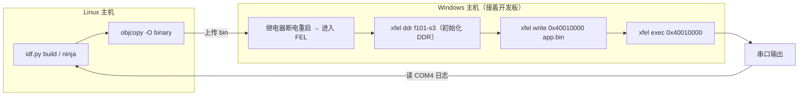
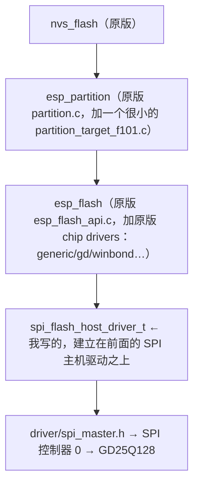

# 把全志 F101 跑进 ESP-IDF：一个新 target 的完整适配记录

> 全志 F101 不是乐鑫的芯片，却能用 `idf.py build`、`ESP_LOGI`、`esp_lcd`、NVS、`i2s_std.h` 这套 ESP 风格接口来开发。
> 这篇文章按时间顺序记录我把 Allwinner F101（T-Head C907，rv32imac）适配到 ESP-IDF v6.1 的过程：
> 每一块是怎么做的、板上看到了什么、卡在哪、怎么定位、最后怎么解。

## 起点：为什么做，要做到什么程度

F101 是一颗单核 RISC-V 的小 SoC：

- 核：T-Head XuanTie C907，rv32imac，**带 FPU**，MMU 存在但不启用
- 内存：16 MB PSRAM，映射在 `0x40000000`
- 中断：CLINT `0x14000000`（定时器），PLIC `0x10000000`（外设中断）
- 板上有：4.3 寸级别的 RGB 屏（1024x600）、SD 卡槽、SPI NOR flash、片上音频 codec、USB、若干 UART/I2C/ADC/PWM
- 调试控制台：UART3，PE08/PE09

开发方式也比较特别：没有 bootloader 也没有烧录流程，板子上电后停在 FEL（USB 下载模式），
靠主机上的 `xfel` 把程序直接写进 PSRAM 然后跳过去运行。

我给自己定的目标是：

1. 用 ESP 风格开发：`idf.py`、`esp_log`、FreeRTOS、`driver/*`、`esp_lcd`、NVS 这些接口原样可用；
2. 不引入"特殊接口"：对外一律是 ESP-IDF 标准头文件和 API，只重写实现；
3. 每一个功能都要在真板子上验证，不是"能编译"就算完。

> 工具链先沿用 Espressif 的 `riscv32-esp-elf`（esp-15.2），后面工具链那节解释为什么没直接用玄铁自家的工具链。

### 整体流程



两个要点：每次下载都要先断电重启（`exec` 之后 FEL 就没了），以及 `xfel ddr` 这一步除了初始化内存，
还会顺手把 UART3 的时钟和引脚复用配好 —— 不执行它，连裸机程序都没有串口输出。

---

## 在 IDF 里注册一个新 target

### 目标与做法

IDF 对"非乐鑫芯片"其实有先例：`linux` target 自己提供了 `soc`、`hal`、`esp_rom`、`esp_hw_support`、
`esp_system` 一整套。所以骨架可以参考 `linux` 和 ESP32-C3 这两类。

我新建的 target 名字是 `sun252i-f101`，用预览模式启用：

```bash
idf.py --preview set-target sun252i-f101
```

需要改的入口有这几处：

| 位置 | 做什么 |
| --- | --- |
| `Kconfig` | 增加 `IDF_TARGET_SUN252I_F101` |
| `tools/idf_py_actions/constants.py` | 把 target 登记到预览列表 |
| `tools/cmake/project.cmake` | target 相关的变量（比如 map 文件里的目标名） |
| `tools/cmake/toolchain-sun252i-f101.cmake` | 工具链文件 |

这里踩的第一个小坑是命名：命令行里是连字符 `sun252i-f101`，但 Kconfig 符号、C 宏里只能用下划线
`SUN252I_F101`。`project.cmake` 里有一处用 target 名拼符号的地方，要加一行
`string(REPLACE "-" "_" idf_target ${idf_target})`，否则链接选项里的符号名是错的。

### 应用形态：RAM 应用

没有 bootloader、没有 flash 镜像，所以用 IDF 的 RAM 应用类型：

```
CONFIG_APP_BUILD_TYPE_RAM=y
CONFIG_FREERTOS_UNICORE=y
CONFIG_ESP_CONSOLE_UART_CUSTOM=y
CONFIG_ESP_CONSOLE_UART_CUSTOM_NUM_3=y
```

链接地址 `0x40010000`（前 64 KiB 留给 FEL 阶段用的东西），产物用
`riscv32-esp-elf-objcopy -O binary` 转成裸 bin。

### 为什么不直接用玄铁工具链

一开始我的想法是"C907 是玄铁核，当然用玄铁自己的 GCC"。实际一试：玄铁的是 newlib 工具链，它自带的
`stdlib.h`、`string.h` 等头文件和 IDF 的 `esp_libc/platform_include` 互相冲突（两边都想定义
`struct timespec`、`_reent` 一类的东西）。而 Espressif 的 `riscv32-esp-elf` 本来就是给 IDF 配套的，
picolibc 的头文件体系和 IDF 吻合。

所以结论：先用 Espressif 工具链把功能跑通，玄铁工具链留作以后的优化项（C907 有自己的扩展指令，
比如 T-Head 的缓存维护指令，后面显示那节会碰到）。

### 一个贯穿全文的约定：每个组件只加 4 行钩子

我很早就确定了一个原则：少改 IDF 原有的文件。每个需要为 F101 做实现的组件，在它的
`CMakeLists.txt` 最前面只加这几行：

```cmake
idf_build_get_property(target IDF_TARGET)
if(${target} STREQUAL "sun252i-f101")
    include(${CMAKE_CURRENT_LIST_DIR}/sun252i-f101/component.cmake)
    return()
endif()
```

然后 F101 自己的源码、头文件、`idf_component_register(...)` 全都放进该组件下的 `sun252i-f101/` 目录。
这样 diff 非常干净，将来 rebase 到新的 IDF 版本也容易。

这里有个很容易搞反的地方：同一个 `component.cmake` 里，两种路径的基准目录不一样，我被它绊了两次。

- `SRCS` 的相对路径，相对于**组件目录**；
- `INCLUDE_DIRS` 的相对路径，相对于**这个 component.cmake 所在目录**。

所以同一个文件里会出现：

```cmake
idf_component_register(SRCS "sun252i-f101/gpio_f101.c"            # 相对组件目录
                       INCLUDE_DIRS "../include" "include"        # 相对 sun252i-f101/
                       ...)
```

写错的症状是 CMake 报 `Cannot find source file` 或者 `Include directory ... is not a directory`，
路径里会出现 `sun252i-f101/sun252i-f101/include` 这种重复，一眼就能看出基准搞反了。

---

## soc / hal / esp_rom：先把"最小骨架"搭起来

### 做法

IDF 的头文件体系大量依赖 `soc/soc_caps.h`：驱动代码里的 `#if SOC_XXX_SUPPORTED` 决定哪些功能存在。
所以第一步要为新 target 提供：

- `components/soc/sun252i-f101/include/soc/soc_caps.h`：能力宏（有几个 UART、几个 I2C……）
- `Kconfig.soc_caps.in`：同样的能力在 Kconfig 里再写一份
- `clk_tree_defs.h`：时钟源枚举（`UART_SCLK_DEFAULT`、`GPTIMER_CLK_SRC_DEFAULT` 这类）
- `sun252i_f101_ll.h`：我自己的"低层寄存器头"，PIO、UART、CLINT、CCU 的寄存器偏移和几个小内联函数
- `esp_rom/sun252i-f101`：这个芯片没有 ESP ROM，所以 `esp_rom_printf`、`esp_rom_delay_us`、crc 之类的要自己提供

### 两份能力描述必须同步

`soc_caps.h` 是 C 宏，`Kconfig.soc_caps.in` 是 Kconfig 符号。IDF 里有的代码用 `#if SOC_XXX`（读 C 宏），
有的 CMake 用 `CONFIG_SOC_XXX`（读 Kconfig）。只写一份，就会出现"这边认为支持、那边认为不支持"。

后面 LVGL 那节就吃了这个亏：`esp_lvgl_port` 判断 RGB 屏支不支持用的是
`SOC_LCDCAM_RGB_LCD_SUPPORTED`，我之前只定义了 `SOC_LCD_RGB_SUPPORTED`，运行时直接报
`This target does not support RGB.`。

### 很多 esp_hal_* 组件假设 `${target}/xxx_periph.c` 一定存在

比如 `esp_hal_gpio` 的 CMake 在 `SOC_GPIO_PORT > 0` 时会把 `gpio_hal.c` 编进来，对 F101 来说
这些 ESP 的 HAL 一点用都没有（寄存器完全不同）。我的处理是：F101 的驱动组件不去 `REQUIRES` 这些 hal
组件，只把它们的 `include` 目录当作头文件源加进来（拿 `hal/gpio_types.h` 这类纯类型头文件）。

---

## 第一声 hello：先别碰 IDF，用裸机探针证明链路

### 目标

在引入 IDF 这个庞然大物之前，先证明三件事：`xfel` 路径通、代码确实在跑、UART3 有输出。
我写了一个很小的裸机程序 `bringup`：自带 `start.S` 和链接脚本，链接在 `0x40010000`，轮询 UART3 的 LSR
等发送空闲，然后写 THR。

```bash
${CROSS_COMPILE}gcc -march=rv32imac -mabi=ilp32 -nostdlib -Ttext=0x40010000 ...
objcopy -O binary
```

### 上板结果

上板一次就通了。顺带测出了一些很有用的事实：

- UART 重新初始化为 24 MHz 时钟、115200 波特率是可以的；
- CLINT 的 `mtime` 是 24 MHz：10 ms 实测 `240025` 个计数；
- GPIO：PA0..PA3 可以正常当 GPIO 用，PA4..PA7 永远读 0（没引出或者被拉低）；
- **驱动 PB2 会让控制台挂死**。PB0..PB3 是背光的 PWM 引脚，EVB 上拿 PB2 当 GPIO 输出会把背光电路拉成奇怪的状态，
  从此串口没输出。这条记在小本本上：测 GPIO 千万别碰 PB0..PB3。

### 一个后面反复用到的调试守则

> 串口没输出时，先写一个裸机探针确认 xfel/UART/接线，再去怀疑 IDF。
> 探针能打印，说明 exec、UART、接线都没问题，故障就在软件里。

---

## 启动与链接：把 IDF 的 C 代码跑起来

### 目标

从 `xfel exec` 的瞬间开始，到 `app_main()` 被调用，中间的这一整条路要自己搭：
入口汇编、CSR 初始化、栈、bss 清零、堆的初始化、链接脚本。

### 入口汇编 `start.S`

关键点有这几个：

```asm
    .section .exception_vectors.text, "ax"   /* 镜像里第一个 */
call_start_cpu0:
    csrci mstatus, 8            /* 关全局中断：FEL 的 exec 可能留着 MIE */
    li    t0, 0x2000
    csrs  mstatus, t0           /* FPU 状态设为 initial（后面 LVGL 那节会解释为什么一定要） */
    csrw  mie, zero
    csrw  mip, zero
    li    t0, 0x70013 ; csrw 0x7c2, t0   /* mcor：C907 扩展 CSR */
    li    t0, 0x11ff  ; csrw 0x7c1, t0   /* mhcr：指令/数据缓存等 */
    li    t0, 0x16e30c; csrw 0x7c5, t0   /* mhint：预取/分支预测 */
    fence ; fence.i
    la t0, f101_early_trap ; csrw mtvec, t0   /* 调度器接管之前的陷阱处理 */
    ...
    la sp, _startup_stack_top
    (清 bss)
    call call_start_cpu0_c
```

三点说明：

1. **入口地址必须是 `0x40010000`**。`xfel exec` 直接跳那里，链接脚本要保证入口在镜像最前。
2. `0x7c1/0x7c2/0x7c5` 是玄铁的扩展 CSR（`mhcr`/`mcor`/`mhint`），控制缓存和预取。FEL 退出时的状态并不保证，
   所以要自己设。
3. `f101_early_trap` 是一个极早期的陷阱处理：在调度器接管 `mtvec` 之前，一旦出异常，直接打印
   `mcause/mepc/mtval/ra`、abort 的字符串和一段栈内容然后停住。这个小东西救了我很多次 ——
   后面所有"莫名其妙的崩溃"几乎都是靠它打出来的寄存器定位的。

### 链接脚本

整个镜像在一个 16 MB 区域里：

```
MEMORY { ram_seg (RWX) : org = 0x40010000, len = 0xFF0000 }
REGION_ALIAS("iram_text_seg", ram_seg);  REGION_ALIAS("dram_seg", ram_seg);
REGION_ALIAS("flash_text_seg", ram_seg); ...（所有 IDF 要的段别名都指向同一段）
```

IDF 的链接脚本模板要求有 iram/dram/flash/rtc 等一堆区域别名，F101 没有这些区分，所以全部别名到同一块 RAM，
代码、数据、堆共用一个区域，`_heap_end` 是 RAM 末尾。

### 入口地址漂移：串口输出 `5555UUUU`

代码稍微长大一点，板子就只输出一串 `5555UUUU` 之类的乱码，甚至完全沉默。原因是我最早的做法是
`xfel exec <ELF 里的入口地址>`，比如 `0x40010660` —— 入口函数在 `.text` 里排在别的函数后面，代码一增长，
入口地址就变了，而下载脚本里写死的是旧地址；链接顺序一变，入口甚至根本不在 `0x40010000`。后来把
`call_start_cpu0` 放进专门的段 `.exception_vectors.text`，让这个段在镜像里排第一，入口就永远固定在
`0x40010000`，下载脚本也永远 `exec 0x40010000`。

### `heap_caps_init` 断言

启动后报 `assert failed: heap_caps_init`。IDF 的启动流程里，`heap_caps_init` 是通过
`ESP_SYSTEM_INIT_FN(init_heap, CORE, 100)` 注册、自动调用的，而我在自己的 `cpu_start.c` 里又手动调了一次。
删掉那次手动调用就好 —— IDF 的 init 函数链会替你做的事，不要重复做。

### 控制台编号是 0

能看到启动信息，但 `ESP_LOGI` 没输出，或者输出到了没接线的串口。IDF 的 `esp_stdio` 只让你选 UART0/1
（或 USB），而 F101 的控制台是 UART3。我在 `components/esp_stdio/Kconfig` 里加了 UART2/UART3 的
"自定义编号"选项，在 `sdkconfig.defaults` 里选 `CONFIG_ESP_CONSOLE_UART_CUSTOM_NUM_3=y`。

### `esp_rom_printf` 静默

IDF 日志系统正常，但早期的 `esp_rom_printf`（启动阶段、panic）一个字都不出。原因是 IDF 里
`esp_rom_print.c`、`esp_rom_sys.c` 对"目标是否有 ROM printf"有硬编码的守卫，F101 不在名单里。
解法是给这两个文件各打一处很小的补丁，并在启动时调用 `esp_rom_install_uart_printf()` 装好 UART 输出。
这是少数几处不得不改 IDF 原文件的地方之一。

---

## FreeRTOS 移植：tick、中断和任务切换

### 目标

IDF 自带的 RISC-V FreeRTOS 端口是围着 ESP 的中断矩阵、systimer 设计的，F101 一个都没有。
所以我新写了一个端口目录 `FreeRTOS-Kernel/portable/sun252i`，并在 `freertos/CMakeLists.txt` 里
把 `port_dir` 指过去。IDF 的 `esp_additions`（`xTaskCreatePinnedToCore` 等）保留不动。

### 几个设计点

（1） tick 来自 CLINT 的 `mtimecmp`，并且和 `esp_timer` 共用同一个比较器。

F101 只有一个定时器比较寄存器，而 FreeRTOS tick 和 `esp_timer` 的 alarm 都要它。做法是：

- `esp_timer_impl_set_alarm_id()` 算出下一次 alarm 的 mtime 值，交给 FreeRTOS 端口；
- 端口每次编程 `mtimecmp` 时取"下一个 tick"和"下一个 alarm"里较早的那个；
- 中断到来时先判断是 tick 还是 alarm，分别处理（alarm 回调是 `esp_timer` 在初始化时注册进来的）。

`esp_timer` 本身用 24 MHz 的 `mtime` 当时间源：`esp_timer_get_time()` = `mtime / 24`。

（2） 外部中断走 PLIC。

`esp_intr_alloc(source, ...)` 的 `source` 直接就是 PLIC 的中断号，比如 UART3 是 5、GPIO 的 PE 组是
67、DMA 是 50。写一个很薄的 `intr_f101.c`：使能、设优先级、在 trap 里 claim → 调回调 → complete。

（3） 陷阱帧兼容 IDF 的 `RvExcFrame`。

IDF 的 panic 处理、`esp_backtrace` 等代码按 `RvExcFrame` 布局读寄存器。所以我让任务切换保存的陷阱帧
**严格按 176 字节、同样的字段顺序**排布（`mepc, ra, sp, gp, tp, t0..., mstatus` ……）。这样 IDF 的
panic 打印直接能用，不用改一个字。创建任务时手工布置的初始帧：

```c
frame[0]  = (uint32_t)pxCode;            /* mepc */
frame[1]  = (uint32_t)prvTaskExitError;  /* ra   */
frame[2]  = (uint32_t)frame + 176;       /* sp   */
frame[4]  = tls;                         /* tp   */
frame[10] = (uint32_t)pvParameters;      /* a0   */
frame[32] = MSTATUS_MPIE | MSTATUS_MPP_M | (1u << 13);  /* 返回后开中断；FPU=initial */
```

（4） yield 用 `ecall`。

主动让出 CPU（`taskYIELD()`）执行 `ecall`，在 trap 里走和中断同样的"保存上下文 → 选下一个任务 →
恢复"的路径。单核所以临界区就是关 MIE。

（5） 每个任务的 TLS 块。

picolibc 用 `tp` 指向线程本地存储（`errno` 等）。创建任务时在栈顶开一块，把 `.tdata` 拷进去、
`.tbss` 清零，`tp` 指过去（上面帧里的 `frame[4]`）。

### mtime / mtimecmp 的 64 位访问

RV32 上 64 位的 `mtime`/`mtimecmp` 要分两次 32 位访问，处理不好就会出"偶发"的时间跳变或 tick 丢失。
我的写法是：

```c
/* 读 mtime：高-低-高，高位变了就重读 */
do { hi = REG(MTIME+4); lo = REG(MTIME); hi2 = REG(MTIME+4); } while (hi != hi2);

/* 写 mtimecmp：先把高位写成 0xFFFFFFFF，避免中途出现一个"很小的"比较值而误触发，再写低、再写高 */
REG(MTIMECMP+4) = 0xffffffff;
REG(MTIMECMP)   = (uint32_t)next;
REG(MTIMECMP+4) = (uint32_t)(next >> 32);
```

另外这颗 SoC 上有个已知的陷阱：24 MHz 下 `mtime` 低 32 位大约 179 秒回绕一次。我在同一块硬件的另一个系统
移植里踩过：tick 比较值的高 32 位漏写成 0，系统在 179 秒后"冻住"。所以这里把 64 位的 tick 计算、
比较值写入全部按 64 位处理，不在任何地方假设"只用低 32 位"。

---

## IDF 的日志和横幅终于出来了

做到这一步，第一次看到熟悉的东西：

```
ESP-ROM:sun252i-f101-fel
Build:Oct  5 2026
rst:0x1 (POWERON),boot:0x0 (FEL_DOWNLOAD)
I (3738) cpu_start: Pro cpu up.
I (3741) cpu_start: Pro cpu start user code
I (3745) cpu_start: cpu freq: 600000000 Hz
I (3749) app_init: Application information:
I (3753) app_init: Project name:     hello_world
I (3774) heap_init: Initializing. RAM available for dynamic allocation:
I (3780) heap_init: At 40034810 len 00FCB7F0 (16173 KiB): RAM
I (3786) main_task: Started on CPU0
I (3786) main_task: Calling app_main()
```

这一屏里每一行都是"某一部分已经工作"的证据：

| 日志 | 证明了什么 |
| --- | --- |
| `ESP-ROM:...` 横幅 | 我自己提供的 `esp_rom` 启动信息输出 OK |
| `cpu_start: Pro cpu up` | IDF 的启动流程已经到了我的 `call_start_cpu0_c` |
| `app_init` | `esp_app_desc` 被正确链接 |
| `heap_init ... 16173 KiB` | 堆初始化好了，PSRAM 的剩余部分都能用 |
| `main_task: Started` / `Calling app_main()` | FreeRTOS 调度器、任务创建、tick 都在工作 |

之后用 `hello_world` 配合延时循环、周期性 `esp_timer` 回调，确认了 tick 和 alarm 共用同一个比较器时两者都按时触发。
到这里，内核层就算完成了，接下来都是在这个基础上一个一个接驱动。


---

## 驱动一批：GPIO / UART / I2C / ADC / SPI / 定时器 / PWM / 看门狗 / SD

### 方法

每个驱动都按同一套路来：

1. 对着寄存器手册和已有的参考实现，把"寄存器操作"写成一个小的 C 文件；
2. 对外实现 IDF 标准头文件里声明的函数（`driver/gpio.h`、`driver/uart.h` ……），头文件一律用 IDF 原版；
3. 写一个 `driver_test` 应用，每个功能都带 `PASS/FAIL` 自检，上板跑；
4. 失败了就用日志 + 寄存器值定位。

下面每一小节说的都是同一件事：寄存器怎么映射到 ESP API、板上怎么验证、以及卡在哪里。

### GPIO（`driver/gpio.h`）

F101 的 PIO 一共 6 个 bank（PA..PF），每个 bank 寄存器间隔 `0x30`：配置寄存器（4 位/脚）在
偏移 0、数据 `0x10`、驱动能力 `0x14`、上下拉 `0x24`。外部中断（EINT）的寄存器块在 `0x200 + 0x20 * bank`。
IDF 的 `gpio_num_t` 是一个整数，我定义 `引脚号 = bank*32 + n`，并提供 `GPIO_NUM_PA(n)`、`GPIO_NUM_PE(n)` 这类宏。

板上验证：PA0..PA3 的上拉/下拉、输出回读都 PASS；`gpio_install_isr_service` + 电平中断、下降沿中断都 PASS。
中间卡了两次。

边沿中断一个都不来：电平中断是好的，边沿中断却永远没有。我把"原始 EINT 状态寄存器"直接打印出来对照
（拉低、拉高各读一次），发现边沿模式下状态位始终不动。翻寄存器说明才知道，EINT 有一个去抖时钟寄存器
（块内偏移 +0x18），默认值下边沿检测是没有时钟的。写 `1`（选 24 MHz 去抖时钟）之后，边沿立刻正常。

另一次出在 `gpio_config()` 上：它的 `pin_bit_mask` 是 64 位，而 F101 有 192 个脚（PE10 = 138），
所以只覆盖前 64 个。64 以上的脚要直接用 `gpio_set_direction()` / `gpio_set_level()`，
后面音频的功放使能脚（PE10）就是这么处理的。

PB2 那个坑前面说过，总之测 GPIO 不要碰 PB0..PB3。

### UART（`driver/uart.h`）

F101 的 UART 是 DW-APB 16550 兼容，寄存器 32 位间隔，时钟 24 MHz，所以波特率除数 =
`24000000 / (16 * baud)`。驱动实现了 `uart_param_config`、`uart_driver_install`、`uart_write_bytes`、
`uart_read_bytes`、`uart_set_baudrate`、回环等；接收用 FIFO 中断 + stream buffer。

设 115200，实测除数换算后是 115384（偏差 0.16%，在 1% 内）；回环写 19 字节读回 19 字节，
256 字节回环全对，改成 57600 波特率也对。

回环测试一开始多收了一个字节，原因是控制台日志（同一个 UART3）的输出漏进了回环，
测试前先 `uart_wait_tx_done()` 等发送空闲再开回环就没事了。另外 F101 有 6 个 UART，
而 IDF 的 `uart_port_t` 枚举只到 `UART_NUM_4`，我给 `hal/uart_types.h` 补了 `UART_NUM_5`
（用 `SOC_UART_HP_NUM > 5` 守卫），再把 `SOC_UART_NUM` 改成 6 —— 这是一处对 IDF 原文件的小改动。

引脚复用上还栽过一次：一开始我对所有串口都写"复用 6"，对 UART3（PE8/PE9）正好对，对别的就错了。
后来做成一张表，每个串口、每个信号允许哪些引脚、对应哪个复用值：

| 串口 | TX | RX | 复用 |
| --- | --- | --- | --- |
| UART0 | PF2 | PF4 | 3 |
| UART1 | PF0 或 PB0 | PF1 或 PB1 | 4 |
| UART2 | PF4 | PF5 | 6 |
| UART3 | PE8 | PE9 | 6 |
| UART4 | PE2 | PE3 | 6 |
| UART5 | PE4 | PE5 | 7 |

`uart_set_pin` 先在表里查，查不到返回 `ESP_ERR_INVALID_ARG`，RTS/CTS 引脚返回 `ESP_ERR_NOT_SUPPORTED`
（这颗芯片没有对应引脚）。测试里用 UART5 的 PE4/PE5 验证了复用寄存器读回是 7，错误引脚被拒绝。
（注意：PF 引脚和 JTAG/SD 共用，PE2 是 USB 的 VBUS 开关，实际使用要避开冲突。）

### I2C（`driver/i2c_master.h`）

TWI 控制器，轮询实现；`i2c_new_master_bus` / `i2c_master_bus_add_device` /
`i2c_master_transmit_receive` 都对上。扫描总线找到一个设备 `0x51`，读寄存器 0 得到 `0x08`；
不存在的地址会 NACK；删除总线后再次创建正常。

一开始整条 I2C 一挂就死：我按"I2C1 = PE6/PE7"去配，结果总线完全没有响应，传输永远等不到完成。
查表才发现这颗芯片上 TWI1 的引脚是 PE0（SCL）/PE1（SDA），复用 4。引脚复用表不能靠猜，
也不能靠"相邻的引脚应该一样"。

### ADC（`esp_adc/adc_oneshot.h`）

GPADC，12 位，对上 `adc_oneshot_new_unit` / `adc_oneshot_config_channel` / `adc_oneshot_read`。实测值：

```
adc ch0: 4091 4093     <- 接了高电平
adc ch1: 3 3           <- 接地
adc ch2: 3 3
adc ch3: 1596 1593     <- 中间电平
PASS adc rejects a channel that is not bonded
```

通道 4..11 能配置成功，但永远等不到转换完成 —— 这颗芯片只引出了 0..3 四个通道，
其余通道在封装里没有引脚。驱动里对 4..11 直接返回 `ESP_ERR_INVALID_ARG`，测试里专门有一条
"拒绝未引出的通道"。

### SPI（`driver/spi_master.h`）

SPI 控制器 0 对应 `SPI2_HOST`（板载 NOR flash 的 PC0..PC5），控制器 1 对应 `SPI3_HOST`。
事务的"命令 + 地址 + 数据"按字节拼进 FIFO，发送和接收各用 64 字节 FIFO 边填边读。

验证是读 JEDEC ID `c8 40 18`（GigaDevice GD25Q128，16 MB），在 `0x30000` 读到 `FARD`
（板上 Arduino core 的魔数），300 字节读取两次一致，换到 24 MHz 读取仍然一致。
这些只读测试不会破坏 flash 内容，所以在测试阶段很安全。后面存储那节里，这个 SPI 驱动会成为 `esp_flash` 的底座。

### 通用定时器（`driver/gptimer.h`）

HSTIMER 的计数时钟是 200 MHz，驱动里按目标分辨率分频成 1 MHz。

两个小插曲：一个是定时器"快了 8 倍"，因为我一开始按 24 MHz 去算分频，翻寄存器说明才确认计数时钟是
200 MHz；另一个是算 `alarm_count` 时想用 128 位乘法防溢出，rv32 没有 `__int128`，改成先除后乘、
拆成两个 64 位操作。

延时里 gptimer 计数和 `esp_timer` 测得的时间只差 1~3 微秒；周期 alarm 在 105 ms 里触发 9 次（10 ms 周期）；
单次 alarm 只触发一次。

### PWM（`driver/ledc.h`）

F101 的 PWM 控制器每个通道对应固定引脚，IDF 的 LEDC "timer + channel" 模型映射成
"通道时钟分频 + 周期寄存器 + 占空寄存器"。引脚和通道不对应时返回错误。

这里的验证方式和别处不一样：一开始想靠"采样引脚电平"来验证占空比，结果发现引脚复用到 PWM 之后，
GPIO 的电平读回寄存器读不出实际的波形电平。所以测试改成"解码寄存器"：

```
pwm ch1 regs: src 24000000 m 0 pre 0 count 24000 active 6000 -> 1000 Hz, duty 25.0%, en 2 gate 2
pwm ch1 regs: ... active 12000 -> 1000 Hz, duty 50.0%
pwm ch1 regs: ... active 18000 -> 1000 Hz, duty 75.0%
pwm ch1 after set_freq(2000): 2000 Hz
```

寄存器解出来的频率和占空比都对得上。

### 任务看门狗（`esp_task_wdt.h`）

用硬件看门狗 + esp_timer 的定时检查实现了 `esp_task_wdt_init/add/reset/delete/status`。
测试里故意放一个"不喂狗的 user"，日志里会按 IDF 标准格式打出：

```
E (8543) task_wdt: Task watchdog got triggered. The following tasks/users did not reset the watchdog in time:
E (8553) task_wdt:  - stuck_user (CPU 0)
```

删除那个 user 之后，看门狗又恢复安静，也 PASS。
> 注意：这些 `E (...)` 开头的 error 是故意触发的负面测试，不是故障。测试里有很多这样的"期望失败"。

### SD 卡（`sdmmc_cmd.h`）

SMHC0 控制器，`f101_sdmmc_host()` 返回一个 `sdmmc_host_t`，之后的卡初始化、读写都走 IDF 原版
`sdmmc` 协议层（`sdmmc_card_init`、`sdmmc_read_sectors`、`sdmmc_write_sectors`）。
我的主机实现是轮询 + 1 位总线 + 40 MHz。

```
sd card: asdfg, 15728640 sectors of 512 bytes (7680 MiB), 40000 kHz, 1 bit bus, rca 0x1
sector 0 signature: 55 aa
PASS sd write and read back one sector      <- 写后读回
PASS sd original sector restored            <- 测完把原内容还原
```

还有几个容易漏的细节：控制器复位必须先打开模块时钟，否则复位不生效；`sdmmc_host_t` 里有几个字段不能漏，
`check_buffer_alignment`、`input_delay_phase = SDMMC_DELAY_PHASE_0`；协议层会调
`sd_pwr_ctrl_set_io_voltage()`，我的主机没有可调电压，提供一个桩函数即可。

---

## 驱动放在哪：跟着 IDF 的组件划分走

### 每个驱动归到对应的组件

驱动不另外打包成一个组件，而是照 IDF 自己的划分拆开，每个组件下开一个 `sun252i-f101/` 目录，
也就是前面"4 行钩子"那个约定。应用侧因此和别的 ESP 板子一样，直接
`REQUIRES esp_driver_gpio esp_driver_uart ...`，不需要任何额外的组件搜索路径。

| 驱动 | 位置 |
| --- | --- |
| gpio | `esp_driver_gpio/sun252i-f101/gpio_f101.c` |
| uart | `esp_driver_uart/sun252i-f101/` |
| i2c | `esp_driver_i2c/sun252i-f101/` |
| adc | `esp_adc/sun252i-f101/` |
| spi | `esp_driver_spi/sun252i-f101/` |
| gptimer | `esp_driver_gptimer/sun252i-f101/` |
| ledc | `esp_driver_ledc/sun252i-f101/` |
| 任务看门狗 | `esp_system/port/soc/sun252i-f101/` |
| sdmmc | `esp_driver_sdmmc/sun252i-f101/` |
| 原版 sdmmc 协议层 | `sdmmc` 组件自己的 f101 分支（只编 5 个协议源文件） |
| `gpio_num.h` / `adc_cali_schemes.h` | 各自组件的 `sun252i-f101/include/` |

路径基准搞反过一次，就是前面"4 行钩子"里说的 `SRCS` 和 `INCLUDE_DIRS` 的差别，症状是路径里出现
`sun252i-f101/sun252i-f101/include`。

### sdmmc 协议层引出的链接错误

`sdmmc` 组件的 Kconfig 一被加载，`CONFIG_SD_ENABLE_SDIO_SUPPORT` 默认就是 `y`，协议层的
`sdmmc_init.c` 会引用 `sdmmc_io_*` 函数，而我只编了 5 个协议源文件，链接期直接缺符号。
解法：`component.cmake` 里按这个配置项条件加入 `sdmmc_io.c`。

`driver_test`、`display_test` 在板上跑下来都是 `RESULT: PASS (0 failures)`。

> 这里没有新功能，但它定下了后面所有驱动的放置方式：新驱动一律先问"IDF 里它应该在哪个组件"。

---

## 显示：从点亮到改成标准的 `esp_lcd`

### 第一版：能显示

F101 的显示通路是：显示引擎 DE（多个图层、混合、缩放）→ TCON（时序）→ RGB 输出 → 面板 → PWM 背光。
显示栈放在 `esp_lcd/sun252i-f101/sunxi/`：DE、TCON、RGB 编码器、简单面板、PWM 背光。
它的整个流水线是和 OS 无关的，只有一层"OS 接口"要自己实现：`dpy_os_idf.c`，提供
内存分配、互斥/信号量、延时、中断注册、时钟/复位（直接操作 CCU 的 PLL_VIDEO0 / DE / TCON 时钟）、
PWM_BL 背光块、缓存维护。板级的"流水线图"（`disp0 → rgb → panel`）写死在 `dpy_board_f101.c`。

第一次点亮的日志：

```
display: core: disp0 -> rgb -> panel: 1024x600@60.794Hz
W display: tcon-clk: pixel clock 49000000 Hz requested, 48000000 Hz possible
I display: tcon-lcd: pixel clock 48000000 Hz (module 288000000 Hz / 6)
```

自检项（`display_test`）：

| 检查 | 结果 |
| --- | --- |
| vblank 速率 | 30 个 vsync 用 498 ms，**60.2 Hz** |
| DE UI0 图层地址寄存器 == 我的 framebuffer 地址 | PASS |
| TCON 控制寄存器 bit31（使能） | `0x80000000` PASS |
| 背光等级、blank 开关 | PASS |

像素时钟请求 49 MHz 实际只能做到 48 MHz（模块时钟 288 MHz 的 6 分频），面板能接受，刷新 60.8 Hz。

### 缓存维护指令的编码

framebuffer 在 PSRAM 里、CPU 有数据缓存，写完像素必须把缓存行"写回"（clean），显示引擎才能读到最新内容。
C907 的缓存维护指令是玄铁自己的扩展：`th.dcache.cpa`（按物理地址 clean）、`th.dcache.ipa`（invalidate）、
`th.dcache.cipa`（clean + invalidate）。Espressif 的 GCC 不认识这些助记符，所以我用 `.word` 写原始编码：

```c
register uintptr_t r asm("a0") = addr;
asm volatile(".word 0x0295000b" :: "r"(r) : "memory");   /* th.dcache.cpa  a0 */
asm volatile(".word 0x02a5000b" :: "r"(r) : "memory");   /* th.dcache.ipa  a0 */
asm volatile(".word 0x02b5000b" :: "r"(r) : "memory");   /* th.dcache.cipa a0 */
```

我最开始写的 `ipa`/`cipa` 编码是凭印象写的，不对。后来用玄铁的汇编器把
`th.dcache.ipa a0` / `th.dcache.cipa a0` 汇编出来，对着机器码核对才改成上面的值。
这类裸编码一定要用"权威汇编器"反汇编一次核对，写错的症状往往很隐蔽（不是崩溃，而是画面里偶尔出现旧内容）。
缓存行是 64 字节，代码里按 64 字节对齐地逐行操作，前后各加 `fence`。

### 显示引擎和 CPU 抢内存带宽

1024x600、16 位色、60 Hz 的扫描本身要 ~74 MB/s，如果 CPU 同时大量访问 PSRAM，显示有欠载的风险。
所以初始化里把 MBUS 配置成：显示引擎走最高优先级，CPU 限速到约 500 MB/s，目的是让扫描不会被 CPU 的访存饿死。

### 第二版：改成标准的 `esp_lcd` RGB 面板

第一版对外是我自己的一套 `f101_display_init() / f101_display_draw_bitmap() / f101_display_set_backlight()`。
但自己回头看的时候意识到：这是个"特殊接口"，和目标（ESP 风格）矛盾。于是重写：对外只暴露标准的

```c
esp_lcd_rgb_panel_config_t cfg = {
    .data_width = 16, .in_color_format = LCD_COLOR_FMT_RGB565,
    .num_fbs = 2,
    .timings = { .h_res = 1024, .v_res = 600 },
};
esp_lcd_new_rgb_panel(&cfg, &panel);
esp_lcd_panel_reset(panel);  esp_lcd_panel_init(panel);
esp_lcd_rgb_panel_get_frame_buffer(panel, 2, &fb0, &fb1);
esp_lcd_panel_draw_bitmap(panel, 0, 0, 1024, 600, fb1);   // 把 framebuffer 本身传进去 = 翻页
esp_lcd_panel_set_brightness(panel, 220);                  // 背光
esp_lcd_rgb_panel_register_event_callbacks(panel, &cbs, ctx);   // on_vsync / on_frame_buf_complete
```

对接时的取舍：

- 时序和引脚由板级描述决定，`esp_lcd_rgb_panel_config_t` 里只校验分辨率，其余不使用。
- 多缓冲：`num_fbs` 最多 3；`draw_bitmap` 收到的指针如果就是驱动自己的某个整屏 framebuffer，
  就**不拷贝，直接切换扫描输出**（和 ESP 行为一致）；否则按区域拷贝到当前扫描输出的缓冲并 clean 缓存。
- vsync 回调：显示栈只提供"等 vsync"，所以起了一个高优先级的小任务循环等待并调用 `on_vsync` /
  `on_frame_buf_complete`（注意：ESP 原版是在中断里，这里是在任务里）。
- 背光：`esp_lcd_panel_set_brightness(0..255)`，由显示栈自己的 PWM 背光块实现，不需要另外配 LEDC。
- 不支持的：`mirror`、`swap_xy`、`esp_lcd_rgb_panel_set_pclk` 返回 `ESP_ERR_NOT_SUPPORTED`；只能有一个面板。

重写后的板上验证：

```
I lcd.rgb: 1024x600 @ 61 Hz, 2 frame buffer(s)
PASS flip to frame buffer 1
30 vsync callbacks in 499 ms (60 Hz)
DE UI0 address 0x40168740, frame buffer 0x40168740    <- 翻页后显示引擎确实在扫描新缓冲
PASS partial bitmap is in the scanned out buffer
```

日志里的这些 `E (...) lcd.rgb: ... invalid area` / `mirror is not supported` / `the display engine drives one panel`
是测试故意触发的负面用例：越界区域、不支持的镜像、创建第二个面板，驱动按设计拒绝。


---

## LVGL 仪表盘：一次"能编过但一跑就崩"的排查

### 目标

"写一个不是测试用例的驱动，就是画一个 UI"。选 LVGL，通过 IDF 官方的 `esp_lvgl_port` 组件接入。
界面做成一个 1024x600 的深色仪表盘：标题栏（含运行时间）、系统信息卡片、剩余堆的环形仪表、背光滑条、
滚动折线图。触摸屏还没接，所以滑条和开关暂时按不动，只有数值和图表在动。

### 先过"组件管理器"这一关

`lvgl` 和 `esp_lvgl_port` 是 IDF component manager 管理的外部组件，写在 `main/idf_component.yml`：

```yaml
dependencies:
  lvgl/lvgl: "^9.3.0"
  espressif/esp_lvgl_port: "^2.6.0"
```

第一关就卡住了：配置完没下载任何组件，直接编译报找不到 `esp_lvgl_port.h`。两个原因叠在一起：我的环境脚本
`env-idf.sh` 里设了 `IDF_COMPONENT_MANAGER=0`（早期为了不联网）；把它打开之后又崩在
`idf_component_manager` 里，`Version.coerce(os.getenv('ESP_IDF_VERSION'))` 抛
`TypeError: expected string or bytes-like object, got 'NoneType'` —— 因为没走 IDF 官方的 `export.sh`，
`ESP_IDF_VERSION` 环境变量是空的。构建这个应用时手动
`export IDF_COMPONENT_MANAGER=1 ESP_IDF_VERSION=6.1` 就能绕过去。

### 编译错误一个一个清

| 现象 | 原因 | 解法 |
| --- | --- | --- |
| `esp_lcd_io_i2c.h: driver/i2c_types.h: No such file` | `esp_lcd_panel_io.h` 会把所有总线的头都包含进来 | f101 的 `esp_lcd` 组件 `REQUIRES esp_driver_i2c esp_driver_spi`，并把 parlio/i2s 的头文件目录当纯头文件源加进来 |
| `LV_COLOR_FORMAT_RGB565_SWAPPED undeclared` | lvgl 9.2 没有这个枚举，`esp_lvgl_port` 2.6 需要更新的 lvgl | 依赖改成 `^9.3.0`（实际解析出 9.6.0） |
| `LV_MEM_SIZE_KILOBYTES is deprecated` 被当成 error | 新版 lvgl 改用字节单位的 `LV_MEM_SIZE` | `sdkconfig.defaults` 里写 `CONFIG_LV_MEM_SIZE=65536` |
| `unknown type name 'soc_periph_lcd_clk_src_t'` | `hal/lcd_types.h` 需要 | 在 `clk_tree_defs.h` 里补一个只有 `LCD_CLK_SRC_DEFAULT` 的枚举 |

### 第一次运行：`This target does not support RGB`

```
I (3966) LVGL: Starting LVGL task
E (3966) LVGL: lvgl_port_add_disp_rgb(222): This target does not support RGB.
```

`esp_lvgl_port` 里用 `#if (SOC_LCDCAM_RGB_LCD_SUPPORTED && ESP_IDF_VERSION >= ...)` 决定要不要编 RGB 支持。
我只定义了 `SOC_LCD_RGB_SUPPORTED`。补上 `SOC_LCDCAM_RGB_LCD_SUPPORTED`（`soc_caps.h` 和
`Kconfig.soc_caps.in` 两处，见前面 soc caps 那节的教训）后，RGB 路径编进来了。

### 第二次运行：`Guru Meditation Error ... Unknown reason`

UI 起来了，打印 `ui running`，然后立刻崩溃：

```
Guru Meditation Error: Core  0 panic'ed (Unknown reason).
MEPC    : 0x40074f30  RA      : 0x40017cb4  SP      : 0x4030e590
...
MSTATUS : 0x00001880  MTVEC   : 0x40016c34  MCAUSE  : 0x00000002  MTVAL   : 0x002024f3
```

#### 定位过程

1. `MCAUSE = 2`：非法指令异常。
2. `MTVAL = 0x002024f3`：对非法指令异常，`mtval` 通常就是出错的那条指令的机器码。拆开这个 32 位字：

   ```
   0x002024f3 = 0000 0000 0010 0000 0010 0100 1111 0011
   opcode[6：0]  = 1110011 = 0x73  → SYSTEM 类指令
   rd[11：7]     = 01001   = x9 （s1）
   funct3[14：12]= 010     = CSRRS
   csr[31：20]   = 0x002   = frm（浮点舍入模式）
   ```
   也就是 `csrrs s1, frm, zero`，汇编别名 `frrm s1`：读浮点舍入模式 CSR。
3. 在 ELF 里看 `MEPC` 对应的函数：

   ```bash
   riscv32-esp-elf-addr2line -pfie lvgl_ui.elf 0x40074f30 0x40017cb4
   # __floatsisf at .../libgcc/soft-fp/floatsisf.c：39
   # update_cb  at .../main/lvgl_ui_main.c：182
   ```
   反汇编同一地址确认：`40074f30:  002024f3   frrm s1`。

   调用链是：我的 UI 定时器回调 `update_cb`（里面用了 `sinf()` 画正弦波）→ libgcc 的软浮点
   `__floatsisf`（int→float）。
4. 为什么会这样？应用是按 rv32imac（无 F 扩展） 编译的，浮点全部走软件实现。可 libgcc 的 soft-fp
   实现里会先 `frrm` 读一下舍入模式。而 `mstatus.FS = 0`（浮点单元关闭）时，任何访问浮点 CSR 的指令都是非法指令。
   之前所有测试从没用过浮点，所以一直没暴露。

#### 打开 FPU

这颗芯片其实有 FPU（所以 CSR 能被访问，只要打开）。两处都要改：

```asm
/* start.S：启动时把 FS 设成 initial(01) */
li   t0, 0x2000
csrs mstatus, t0
```
```c
/* port.c：新建任务的初始陷阱帧的 mstatus 也要带上 FS，否则第一次任务切换 mret 之后
   mstatus 又被帧里的值覆盖，FS 重新变成 0 */
frame[32] = MSTATUS_MPIE | MSTATUS_MPP_M | (1u << 13);
```

应用依然按 rv32imac 软浮点编译，所以任务切换并不需要保存浮点寄存器，只是 FS 位要保持打开，
让 `frm` 可读。这个坑的价值在于：它是"所有用到浮点的第三方库（LVGL、`sinf`、`printf("%f")`……）都会碰到"的共性问题。

修好之后：

```
I (5053) lvgl_ui: ui running
I (5053) main_task: Returned from app_main()
```

连续运行 10 秒以上没有崩溃，定时器每 0.5 秒刷新一次仪表盘数据。


---

## 存储：`esp_flash` → `esp_partition` → NVS

### 目标与方案

想要的效果是"跟 ESP32 上一模一样"：

```c
nvs_flash_init();
nvs_open("test", NVS_READWRITE, &h);
nvs_set_u32(h, "boots", n);  nvs_commit(h);
```

NVS 往下是 `esp_partition`，再往下是 `esp_flash`，再往下才是硬件。我的策略是：**这三层都用 IDF 原版**，
只在最底下提供一个"用 SPI 主机驱动去操作 NOR flash"的 `spi_flash_host_driver_t`（IDF 里 flash 芯片驱动
对主机的抽象接口）。这样：



板上 flash 里已经有东西：`0x30000` 是 Arduino core（魔数 `FARD`），`0x500000` 是一个 sketch，
前面还有 boot 相关内容。所以所有擦写都限制在 `0x800000` 之后——那一块是专门留来做实验的空区域。
分区表放在 `0x800000`（`CONFIG_PARTITION_TABLE_OFFSET=0x800000`），后面是：

```
# Name,   Type, SubType, Offset,   Size
nvs,      data, nvs,     0x801000, 0x6000
storage,  data, 0x40,    0x807000, 0x10000
```

### 搭骨架时遇到的"头文件缺失"

IDF 的 `esp_flash_api.c` 默认建立在 ESP 的 MSPI 硬件上，所以它会 include 一批我没有的头：
`hal/spi_flash_ll.h`、`hal/spi_flash_encrypted_ll.h`、`esp_private/spi_share_hw_ctrl.h`、
`esp_efuse.h`、`bootloader_util.h`……

处理方法：写最小的垫片头文件，放在组件自己的 `sun252i-f101/include/` 下，并且放在
`INCLUDE_DIRS` 的最前面，这样才压得过 `esp_hal_mspi/include` 里的同名头文件。
比如 `hal/spi_flash_hal.h` 的垫片里只定义 esp_flash 层真正用到的几个类型：

```c
typedef struct {
    spi_flash_host_inst_t inst;   /* 必须是第一个成员 */
    void *spi;                    /* 非 NULL 表示"这个 chip 已经可用" */
    uint32_t slicer_flags;
} spi_flash_hal_context_t;
```

原因是 `esp_flash_api.c` 里有这样的检查：`((memspi_host_inst_t*)chip->host)->spi == NULL → 返回 ESP_ERR_INVALID_ARG`，
也就是它假设 `chip->host` 一定是个 "memspi 上下文"。我的 host 结构把这个上下文放在第一个成员，满足这个假设。

另外：

- `spi_flash_mmap()` 没有 MMU 可用，用"读到一块 RAM 里再返回指针"来模拟（分区表就是这么读的）；
- `partition.c` 用到的 `esp_efuse_is_flash_encryption_enabled()`、`bootloader_util_regions_overlap()` 等给桩；
- `CONFIG_PARTITION_TABLE_MD5=n`（没有 `esp_rom_md5`）；
- NVS 的"加密分区"代码引用了 mbedtls 的 XTS，我提供一个 `mbedtls/private/aes.h` 垫片和一组全部返回"不支持"的桩函数，
  这样编译链接都过，但加密 NVS 分区会被拒绝。

### 第一次上板：读 OK，擦除卡死

```
I (4659) storage_test: PASS read at 0x30000
        <- 此后串口再没有任何输出
```

读 ID（`c8 40 18` → 16 MiB）和读 `0x30000`（`FARD`）都对了，但**第一次擦除就卡住**。
这里没有 panic、没有日志，纯粹是死循环。我先在 host 的 `common_command` 里临时加了一行 `TRACE` 打印每条 flash 命令，
结果是：擦除之前一条命令都没发出去——说明卡在 esp_flash 层，没有到 SPI。

翻 `spi_flash_chip_generic_wait_idle()`：

```c
while (!chip->host->driver->host_status(chip->host) && timeout_us > 0) { ... delay ... }
```

`host_status()` 要求"主机空闲时返回非零"，我返回了 0，于是 `wait_idle`（超时设成"无限"）永远在这个循环里。
改成 `return 1;`（我的所有传输都是轮询完成的，主机永远空闲）。擦除立刻通过。

### 第二次：写入崩溃，而且崩得很诡异

```
E (6442) spi_flash: host_common_command(50): 24 bit addresses only
Guru Meditation Error: Core  0 panic'ed (Unknown reason).
MEPC    : 0xb0a66a64   RA : 0xb0a66c3a ...   MCAUSE : 0x00000002  MTVAL : 0x55555557
Stack memory:
400318c0: 0xccc5beb7 0xe8e1dad3 0x04fdf6ef 0x2019120b ...
```

`MEPC` 是个乱码地址，栈里却整齐地躺着 `0xccc5beb7 0xe8e1dad3 ...` ——这些正是我测试里写入的数据模式
（`i*7+3`）。**栈被我的写入数据覆盖了。**

去看 `spi_flash_chip_generic_write()`：

```c
uint8_t temp_buffer[64];                // "spiflash hal max length of write no longer than 64byte"
...
uint32_t page_len = host->driver->write_data_slicer(...);   // 我的 slicer 返回了整页 256 字节
memcpy(temp_buffer + left_off, buffer, write_len);          // ← 往 64 字节的栈数组里拷了 256 字节
```

IDF 的通用芯片驱动默认主机一次最多处理 64 字节（这是 ESP MSPI 硬件的限制），把每一片先拷到栈上的
`temp_buffer[64]` 里。我的 slicer 按页边界返回 256 字节，直接冲坏了栈。

第一步修复是让 write slicer 最多返回 64 字节。

### 第三次：读也一样的问题，这次崩在 `free`

写通过了，"读回来"又崩：

```
assert failed: heap_caps_free heap_caps_base.c:80 (heap != NULL && "free() target pointer is outside heap areas")
```

调用栈（`addr2line`）是 `os_release_temp_buffer → free`，但 `release_temp_buffer` 被传进去的指针是
`0x645d564f`——又是数据模式。同样的问题，这次在读路径：`spi_flash_chip_generic_read()` 里也有一个
`temp_buffer[64]`，而我的 read slicer 一次返回最多 4096 字节。栈溢出把 `esp_flash_read` 自己栈帧里的
`temp_buffer` 局部变量（本来应是 NULL）覆盖成了数据，于是 `free()` 一个野指针。

> 这里我先走了一小段弯路：以为是"`free(NULL)` 触发断言"，于是给 `os_release_temp_buffer` 加了 `if (buf)` 判空
> （IDF 会传 NULL 过来，判空本身是对的，但不是根因）。再加了一条 `TRACE`，打印出 `release_temp 0x645d564f`，
> 才看清这根本不是 NULL，而是被踩坏的值。日志里出现"数据模式的值"出现在不该出现的地方，就要想到栈/缓冲区溢出。

真正的修复有两处：把 read slicer 也限到 64，让原版路径安全；在默认 chip 初始化完成后给检测出的 chip 驱动打补丁 ——
复制一份 `spi_flash_chip_t`，把它的 `read` 换成我的 `chip_read`（直接从 flash 读到调用者缓冲，每次最多 4096 字节），
把 `write` 换成 `chip_write`（按页对齐、每页最多 256 字节，逐页调用原来的 `set_chip_write_protect` + `program_page`）。
这样 IDF 的其他逻辑（擦除、等待空闲、写保护检查）还是原版，只有"数据搬运"这一层绕开了 64 字节限制。

### 第四次：数据对不上（542 字节不同）

不崩了，但读回校验失败：

```
read back: ESP_OK, first 03 0a 11 18 (wrote 03 0a 11 18)
542 bytes differ, first at 56: wrote 8b read ff (next 92 ff / 99 ff)
```

前 56 个字节对，之后全是 `0xff`（擦除后的值，说明后面的页根本没有被写进去）。
测试写的是从页内偏移 200 开始的 600 字节，所以第一段 56 字节（补满当前页）写成功了，
之后每一次 256 字节的整页写入全部"无事发生"。

线索在 IDF 的类型定义里：

```c
typedef struct {
    uint8_t reserved;
    uint8_t mosi_len;     /* Output data length, in bytes */
    uint8_t miso_len;     /* Input data length, in bytes */
    ...
} spi_flash_trans_t;
```

`mosi_len` / `miso_len` 是 8 位（因为 ESP 的硬件一次最多 64 字节）。我的整页写入长度 256，
赋值给 `uint8_t` 就变成了 0 —— 写入 0 字节。

修法是让 `host_program_page` 和 `host_read` 不再通过 `spi_flash_trans_t`，而是直接构造 `spi_transaction_t`
（长度字段是 `size_t`）。其余短命令（读 ID、读状态、写使能……）仍走 `common_command`。

### 全部通过

```
PASS read back
I (354) storage_test: 4 KiB sector: erase 14475 us, program 4584 us, read 4860 us
I (414) storage_test: PASS find nvs partition
nvs at 0x801000 size 0x6000, storage at 0x807000 size 0x10000
PASS partition write / read / mmap content ...
PASS nvs set/get i8 u16 i64 string blob ...
PASS boot counter persisted
PASS 400 rewrites of one key
nvs: used 38 free 718 total 756 namespaces 1
RESULT: PASS (0 failures)
```

掉电保持也验了：我专门又断电重启了一次再跑，`boot counter was 1 (ESP_OK)`——上一次写进去的计数从 flash 里读回来了。

测试里的最后一个"失败"是我自己预期错了：我以为用 `nvs_get_u8` 读一个 `i8` 类型的键会得到
`ESP_ERR_NVS_TYPE_MISMATCH`，实际得到的是 `ESP_ERR_NVS_NOT_FOUND`——NVS 的键哈希里包含了类型，类型不同就找不到。
这是 IDF 的真实行为，把测试预期改成"读不到"。

另外还有一件和 flash 无关但和这一节相关的事：引入 `partition_table` 之后，`esptool_py` 被带进了构建，
默认的 `ninja all` 最后一步（生成 `.bin`）会因为没有 esptool 而失败。所以对这类应用，我直接
`ninja storage_test.elf` 再自己 `objcopy`。

---

## DMA：链表 DMA 驱动 + `esp_async_memcpy`

### 硬件是什么样的

F101 的 DMA 控制器（基地址 `0x03002000`）有 12 个通道，每个通道按一条内存里的描述符链工作。
一个描述符 32 字节：`cfg`（位宽、突发、源/目的的 DRQ 编号、是否"IO 模式=地址不递增"）、`src`、`dst`、`len`、
`para`、`next`。链尾 `next = 0xfffff800`；做成环就把最后一个的 `next` 指回第一个。

接口很简单：往通道的 `LLI_ADDR` 写首个描述符地址、`ENABLE=1`；中断分"一个块完成（PACKAGE）"、
"整条链完成（QUEUE）"、"超时"；总线时钟/复位门在 CCU 的 `0x70c`（bit0 门、bit16 复位），还有 MBUS 门 `0x804`。
PLIC 中断号 50。

### 为什么没有对接 ESP 的 GDMA API

IDF 有一套 `gdma_*` API。但它的模型是 TX 通道 + RX 通道成对，各自一条独立的描述符链
（比如内存到内存拷贝，TX 链描述源缓冲区，RX 链描述目的缓冲区）。F101 的描述符里源和目的在同一个描述符里，
两种模型对不上，硬套会很别扭。

所以我分两层：

1. 私有层 `esp_private/dma_f101.h`：按 F101 的实际硬件设计——`f101_dma_new_channel`、
   `f101_dma_start(chan, cfg, blocks, n)`（cfg 里有方向 M2M/M2P/P2M、DRQ、位宽、突发、是否循环、是否每块事件、回调）、
   `f101_dma_stop`、`f101_dma_get_position`；
2. 公开层只实现 IDF 标准的 `esp_async_memcpy.h`（`esp_async_memcpy_install / esp_async_memcpy / uninstall`），
   应用拿到的是熟悉的 API；音频的 I2S 驱动（后面音频那节）直接用私有层。

### 实现要点

- 缓存：拷贝前把源 clean、把目的 clean+invalidate（防止之前的脏缓存行在 DMA 写完后被写回覆盖掉 DMA 的数据），
  拷贝完成后再 invalidate 目的。描述符自己也要 clean（硬件从内存读）。描述符用 64 字节对齐分配。
- 位宽：地址和长度都是 4 的倍数时用 4 字节位宽，否则退回 1 字节位宽（慢但正确）。
- 队列：`backlog` 个请求排队，依次启动；回调在中断里调用。第 9 个请求（队列满）返回 `ESP_ERR_NO_MEM`。
- 中断里的调度：回调返回 true 表示唤醒了更高优先级任务，ISR 末尾 `portYIELD_FROM_ISR()`。

### 测试

`dma_test` 第一次上板就全部通过：

```
PASS copy 4 KiB aligned / copy 100000 bytes / copy 1000 bytes unaligned / copy one byte / copy 12 bytes
PASS queue accepts the backlog and refuses the rest
PASS queued copies finish in order / queued copies are correct
1 MiB: dma 7118 us (147 MB/s), cpu memcpy 2384 us (439 MB/s)
PASS one event per block and one done        <- 三块链：2 个 BLOCK 事件 + 1 个 DONE
```

注意这个速度：**DMA 反而比 CPU memcpy 慢**（147 vs 439 MB/s）。我没有深挖具体瓶颈，推测是 CPU 对 PSRAM 的大块顺序访问本来就很高效（有缓存和预取），
而 DMA 这条路径的带宽更低。结论是：这颗芯片上 `esp_async_memcpy` 的价值是"不占 CPU"，
不是"更快"。（后面音频那节就是真正用得上 DMA 的地方。）

---

## 音频：`driver/i2s_std.h` 对接片上 codec

### 硬件和接口怎么对

F101 的音频有三块：片上 codec（数字 DAC/ADC + 模拟耳放/麦克风输入级）、I2S0、S/PDIF。
EVB 上 I2S0 的引脚没有可用的引出（它的 PE0..PE4 和 SDC2 复用，PE2 还是 USB 的 VBUS 开关），
所以我把 `I2S_NUM_0` 映射成片上 codec：

| ESP 概念 | F101 的对应 |
| --- | --- |
| TX 通道 | codec 的 DAC FIFO（DRQ 7） |
| RX 通道 | codec 的 ADC FIFO（单声道） |
| `i2s_channel_init_std_mode` | 采样率、位宽（16 位，24/32 位按 32 位字处理）、单/立体声 → 配 FIFO 控制寄存器和时钟 |
| `gpio_cfg` | 忽略（内部 codec 没有引脚） |
| `dma_desc_num × dma_frame_num` | 环形缓冲的周期数 × 每周期帧数 |
| `on_sent / on_recv` | 每个周期完成时的事件 |
| `on_send_q_ovf / on_recv_q_ovf` | TX 欠载 / RX 溢出 |

模拟部分（耳放、功放、音量、输入选择）ESP 没有对应的标准 API（ESP 里这些归外部 codec 芯片 + `esp_codec_dev`），
所以放进一个很小的额外头文件 `driver/i2s_f101_codec.h`：`set_volume / set_mute / set_hp_gain /
set_input_volume / set_mic_gain / select_input`。耳放和板上功放（PE10 使能）随 TX 通道一起上电/下电：
`i2s_channel_enable(tx)` 里上电，`i2s_channel_disable(tx)` 里断电，应用不用管。

### 时钟：两个"采样率族"

音频时钟来自 PLL_AUDIO1，而不同采样率需要两种 PLL 设置：

| 族 | 采样率 | PLL 设置 |
| --- | --- | --- |
| 48 kHz 族 | 8/12/16/24/32/48/96/192 kHz | 3.072 GHz，÷5 = 614.4 MHz → 24.576 MHz |
| 44.1 kHz 族 | 11.025/22.05/44.1/88.2/176.4 kHz | 2.1676 GHz（小数分频，寄存器 `0x180 = 0xc000a234`），÷2 → 22.5792 MHz |

PLL 是共享的，所以 **TX 和 RX 同一时刻必须在同一个族里**，驱动里对 PLL 做了引用计数：
第一个用户启动 PLL，最后一个用户释放；另一个族的用户来请求时返回 `ESP_ERR_INVALID_STATE`。
44.1 kHz 族的采样率换算成 48 kHz 族的"等效码"（例如 44100 → ×48000/44100 → 48000 的码），
FIFO 的采样率选择寄存器用同一套分频码。

### 环形缓冲和 DMA

每个通道分配 `desc_num` 个周期，每个周期 `frame_num × frame_bytes` 字节，周期之间按 64 字节对齐
（缓存行）。DMA 是一条循环链，每块结束触发一次事件。

- TX：`i2s_channel_write` 往"下一个空闲周期"里拷数据；环满了就等信号量（DMA 播完一个周期，ISR 给信号量）。
  关键设计：周期被 DMA 消费之后，ISR **立刻把它清零并写回缓存**。否则当环绕一圈回来、而应用没来得及写新数据时，
  DMA 会把上一圈的旧数据再播一遍（重复的爆音）；清零之后欠载时播的是静音，同时触发 `on_send_q_ovf`。
- RX：DMA 往周期里写，ISR 在周期完成时标记"可读"，`i2s_channel_read` 按顺序取。
  这里要注意：DMA 上报"一个周期完成"的时候，这个周期最后几个字可能还没落到内存。所以 RX 路径延后一个周期，
  处理的是"上一个周期"，那个肯定是完整的。代价是约一个周期（15 ms @ 16 kHz，240 帧）的延迟。
- **周期长度必须正好等于一个 block**。之前在别的实现里试过把周期补长到 64 字节对齐，结果在 882 帧一块的
  44.1 kHz 下，实际播放速度变成了 63/64——采样率偏了。所以这里周期缓冲 `stride` 对齐 64，但 DMA 块长度严格等于周期数据长度。

### 编译时又撞上 soc caps 的老问题

`i2s_std.h` 的默认时钟配置宏里用了 `.ext_clk_freq_hz`，这个字段受 `SOC_I2S_HW_VERSION_2` 控制；
默认时钟源 `I2S_CLK_SRC_DEFAULT` 来自 `soc_periph_i2s_clk_src_t`。所以要在 `soc_caps.h` 里补
`SOC_I2S_SUPPORTED / SOC_I2S_NUM / SOC_I2S_HW_VERSION_2`，在 `clk_tree_defs.h` 里补那个枚举。
这是前面"两份能力描述"那条教训的又一次应验：IDF 的公共头文件里，"能力宏"是类型和宏默认值的开关。

另一个小坑：板上功放的使能脚是 PE10（引脚号 138），`gpio_config()` 的 64 位 mask 覆盖不到，
所以用 `gpio_set_direction(138, GPIO_MODE_OUTPUT)`（见前面 GPIO 那节）。

### 测试结果（`audio_test`）

```
I (9791)  audio_test: PASS 48000 Hz: 3 s of tone written
I (9801)  audio_test: 48000 Hz: 596 periods in 2974996 us -> 48000.1 Hz
I (11831) audio_test: 16000 Hz: 130 periods in 1934999 us -> 16000.0 Hz
I (13891) audio_test: 44100 Hz: 364 periods in 1975509 us -> 44100.0 Hz
PASS an unsupported rate is refused         <- 12345 Hz
I (14281) audio_test: starved: 60 periods, 60 underruns
PASS an unfed stream reports underruns
PASS init RX 16 kHz mono
PASS one second of samples read
read 32000 bytes in 1040 ms (expected 1000 at 16 kHz), recv events 67, overflows 0
microphone: min 203 max 222 mean 213.0 rms 2.3
PASS duplex: 100 blocks out and in
RESULT: PASS (0 failures)
```

这里的"实测采样率"是这样得到的：`on_sent` 回调里记录每个周期完成的时间戳，
用 `(周期数-1) × 240 帧 ÷ 首尾时间差` 反推帧率——它直接反映了 codec 的时钟，而不是软件延时。
48000.1 / 16000.0 / 44100.0 Hz，而且同一个通道可以依次在 48k 族和 44.1k 族之间切换
（`i2s_channel_reconfig_std_clock` 里释放旧 PLL 再按新族启动）。

一个"测试自己错了"的小插曲：第一次跑，"读 1 秒的采样"这一项失败了：

```
read 30720 bytes in 998 ms (expected 1000 at 16 kHz)    <- 要的是 32000 字节
```

我的测试用 1000 ms 超时去读恰好 1 秒的数据，但 RX 路径从 `enable` 到第一个可读周期有约 30 ms 的启动延迟
（加上"延后一个周期"），1 秒的超时耗尽时只读到了 30720 字节（64 个周期）。**驱动没问题，是测试没留余量**，
把超时改成 2000 ms 后读完 32000 字节用了 1040 ms，通过。

麦克风那一项：`min 203 max 222 rms 2.3` 说明 ADC 采到的是"底噪"——没有声源时输出是一个很小的、会动的值，
证明采集链路在工作（不是常数 0）。

这一轮跑下来的结论：采样率精确、数据流连续、欠载/溢出事件正确、模拟路径寄存器已配置。


---

## 零碎但有用的几块

### 芯片信息和 MAC：从 SID（熔丝）读 chip id

`esp_chip_info()`、`esp_read_mac()` 这类 API 很多代码会调。F101 没有 ESP 的 eFuse MAC，所以：

- `esp_chip_info()`：我在 `esp_chip_info.h` 里给 `chip_model_t` 增加了 `CHIP_SUN252I_F101 = 1001`；
- MAC：对 128 位 chip id（SID 熔丝的前 4 个字）做 FNV-1a 哈希，取 6 字节，置位"本地管理"、清除"组播"位，
  保证是合法的单播本地 MAC；STA 用基地址，SoftAP 是它的"本地化变体"，BT=+2，ETH=+3；
  `esp_base_mac_addr_set()` 可以覆盖。

第一版读出来的 chip id 是垃圾：打印出来是 `72c04300 72c04300 72c04300 72c04300`——
四个字完全一样，明显不对。SID 的读时序是：写索引 → 写"读命令 + 密钥" → 等控制寄存器 bit1 清零 →
把控制寄存器清回去 → 再读数据寄存器。我之前没有等 bit1，也没有清控制寄存器，读到的只是上一次的残留。
修好以后读出 `72c04300 7a40490c 8413c010 348a204e`，MAC `96:1d:4e:5f:76:89`，每次重启都一致。

这个 bug 还有个副作用：`esp_random()` 用 chip id 做种子之一，之前种子也是错的。

### `esp_cache_msync`：一个横跨所有驱动的小公共件

显示、DMA、音频都需要"写回/失效缓存"。起初显示栈里有一份自己的缓存函数，后来 DMA 又需要，
我把它整理成 IDF 标准的 `esp_cache_msync(addr, size, flags)`（`ESP_CACHE_MSYNC_FLAG_DIR_C2M` / `DIR_M2C` /
`INVALIDATE` / `UNALIGNED`），放在 `esp_hw_support` 里，显示栈的旧函数改成对它的内联封装。
这次重构后把显示测试又在板子上重跑了一遍，确认仍然通过。

---

## 总结

### 每个 ESP 接口怎么对接（速查）

| ESP 接口 | 在 F101 上的实现 |
| --- | --- |
| `driver/gpio.h` | PIO 寄存器，引脚号 = bank*32+n，EINT 去抖要开 |
| `driver/uart.h` | DW-APB UART ×6，`uart_set_pin` 查引脚表 |
| `driver/i2c_master.h` | TWI 轮询 |
| `esp_adc/adc_oneshot.h` | GPADC，4 个通道 |
| `driver/spi_master.h` | SPI 控制器 ×2，轮询 |
| `driver/gptimer.h` | HSTIMER（200 MHz → 1 MHz） |
| `driver/ledc.h` | PWM 控制器 |
| `esp_task_wdt.h` | 硬件看门狗 + esp_timer |
| `sdmmc_cmd.h` | SMHC0，轮询 1-bit，原版协议层 |
| `esp_lcd` RGB | DE + TCON + 双缓冲 + vsync 回调 |
| LVGL | `esp_lvgl_port` |
| `esp_flash` / `esp_partition` / NVS | 原版三层 + 自己的 SPI host driver |
| `esp_async_memcpy` | 链表 DMA |
| `driver/i2s_std.h` | `I2S_NUM_0` = 片上 codec |
| `esp_cache` / `esp_mac` / `esp_chip_info` | T-Head 缓存指令 / SID / 自定义型号 |

### 问题速查

| 症状 | 原因 | 处理 |
| --- | --- | --- |
| 串口只有 `5555UUUU` 或没输出 | 入口地址随代码漂移 | 入口放 `.exception_vectors.text`，固定 `0x40010000` |
| 没有任何串口输出（连裸机也没有） | 没跑 `xfel ddr`，UART 时钟/引脚没配 | 每次下载先 `xfel ddr f101-s3` |
| `heap_caps_init` 断言 | 重复初始化 | 删掉自己的调用 |
| 日志出到了错的串口 | 控制台编号只有 0/1 | `esp_stdio` 增加 UART2/3 选项 |
| `esp_rom_printf` 无输出 | ROM printf 守卫 | 打补丁 + 安装 UART printf |
| 179 秒后系统冻住 | `mtimecmp` 高 32 位处理错 | 全程 64 位处理，写入按安全顺序 |
| GPIO 边沿中断不来 | EINT 去抖时钟没开 | 去抖寄存器 +0x18 写 1 |
| 驱动 PB2 后控制台挂死 | 背光引脚 | 测 GPIO 不要碰 PB0..PB3 |
| I2C 永远等不到完成 | 引脚用错 | TWI1 = PE0/PE1 复用 4 |
| ADC 通道 4..11 不完成 | 没引出 | 只开放 0..3 |
| gptimer 快 8 倍 | 计数时钟 200 MHz | 按 200 MHz 分频 |
| 画面残留旧内容 | 缓存没写回 / 缓存指令编码错 | 用权威汇编器核对 `th.dcache.*` 编码 |
| 带浮点的代码一跑就 `mcause=2`，`mtval=0x002024f3` | `mstatus.FS=0`，libgcc 读 `frm` | 启动和任务初始帧都把 FS 置 initial |
| `esp_lvgl_port`：This target does not support RGB | 缺 `SOC_LCDCAM_RGB_LCD_SUPPORTED` | C 宏和 Kconfig 两处都补 |
| component manager 崩 `NoneType` | `ESP_IDF_VERSION` 为空 | 手动 export |
| 第一次擦除 flash 就死循环 | `host_status()` 返回 0 | 空闲时返回非零 |
| 写 flash 栈被冲坏（`mepc` 乱码） | 通用驱动栈缓冲 64 字节，slicer 太大 | slicer ≤ 64，并给 chip driver 打 read/write 补丁 |
| 读写超过 255 字节"什么都没发生" | `spi_flash_trans_t` 长度字段 8 位 | 大块绕过它直接组 SPI 事务 |
| NVS 读错类型得到 NOT_FOUND | 键哈希含类型 | 属于 IDF 真实行为 |
| chip id 四个字一样 | SID 读时序缺等待/清除 | 等 bit1 清零、清控制寄存器后再读 |
| `ninja all` 在 `.bin` 一步失败 | 引入 `esptool_py` 但没装 esptool | 直接 `ninja xxx.elf` 再 `objcopy` |

### 还没做的

- I2S0 硬件、S/PDIF（板子上没引出引脚，或者数据路径没调通）；`esp_codec_dev`
- USB、触摸屏（FT5446）；AIC8800 WiFi 和 SPIF 控制器（决定不做）
- UART1/2 的实物引脚验证、PWM 的真实波形
- 换用玄铁工具链（可以用到 T-Head 的缓存指令助记符等扩展）

### 复现

代码在 `esp-idf` 的 `sun252i-f101` 分支，测试应用在 `idf-apps/`：

```bash
. ./env-idf.sh
cd idf-apps/driver_test && idf.py --preview set-target sun252i-f101 && ninja driver_test.elf
riscv32-esp-elf-objcopy -O binary build/driver_test.elf build/driver_test.bin
# 断电重启进入 FEL 后：
xfel ddr f101-s3 && xfel write 0x40010000 driver_test.bin && xfel exec 0x40010000
```

`hello_world`、`bringup`（裸机探针）、`driver_test`、`display_test`、`lvgl_ui`、`storage_test`、`dma_test`、`audio_test`
都是自检程序，最后一行 `RESULT: PASS (0 failures)`。仓库里还有一份更短的速查笔记 `PORTING_SUN252I_F101.md`。

### 写在最后

回头看，这个适配里最花时间的并不是"写驱动"本身，而是三类"边界"问题：

1. IDF 对 ESP 硬件的隐含假设：64 字节缓冲、8 位长度字段、`host_status` 的极性、"memspi 上下文"结构……
   这些在 ESP 上永远成立，换了硬件就是一个个静默的炸弹。
2. 两套"能力描述"（C 宏 / Kconfig）和各种只提供类型的头文件：缺一个枚举、一个宏，编译或运行时才报错。
3. 缓存与 DMA、浮点与 CSR 这类"CPU 内部状态"：错了之后症状通常离根因很远
   （画面残留、数据损坏、偶发崩溃），要靠寄存器、反汇编和日志里的"异常值"一点点倒推。

通用的几条经验：每个驱动都要带自检和负面用例；失败时先看"出现在不该出现的地方的值"；权威工具核对机器码；
对 IDF 原代码的假设保持怀疑，但尽量不改它，改到"它的假设成立"的那一层。
